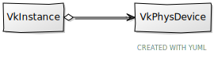
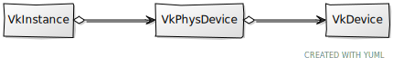
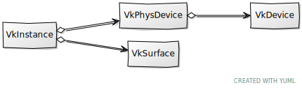
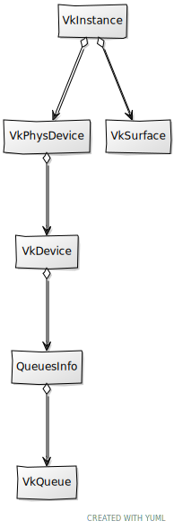

# Chapter 03 - Physical, Logical devices and Surface

In this chapter we will progress in the definition of the Vulkan structures required to render a 3D scene. Specifically, we will set up the
Physical and Logical devices and a Surface.

You can find the complete source code for this chapter [here](../../booksamples/chapter-03).

## Physical device selection

A physical device represents any piece of hardware that provides a complete implementation of the Vulkan interface (usually a physical GPU).
You can have several Vulkan capable physical devices (you may have more than one GPU), but you will usually just use one (we will not be
dealing with multi-GPU rendering here). A side note, as we progress through this book, we will define many concepts. In order to help you in
understanding the relationship between all of them, we will be filling up a diagram. Here you can find the ones that show the elements
described so far.



So let's go back to coding and start by encapsulating all the code for selecting and creating a physical device in a new struct named
`VkPhysDevice` (in the file `src/eng/vk/vkDevice.zig`, remember to update the `mod.zig` file to include it:
`pub const phys = @import("vkPhysDevice.zig");`). It starts like this:

```zig
const std = @import("std");
const vulkan = @import("vulkan");
const com = @import("com");
const vk = @import("mod.zig");

const log = std.log.scoped(.vk);
const reqExtensions = [_][*:0]const u8{vulkan.extensions.khr_swapchain.name};

const QueuesInfo = struct {
    graphics_family: u32,
    present_family: u32,
};

pub const VkPhysDevice = struct {
    features: vulkan.PhysicalDeviceFeatures,
    pdev: vulkan.PhysicalDevice,
    props: vulkan.PhysicalDeviceProperties,
    queuesInfo: QueuesInfo,
    memProps: vulkan.PhysicalDeviceMemoryProperties,
    ...
};
```

The `QueuesInfo` struct will hold the family indices of the queues used to submit graphics or present commands (more on this later). The
`VkPhysDevice` struct stores the features of the physical device (`features`), a reference to the Vulkan physical device (`pdev`), its
properties (`props`), the queues information and the device memory properties (`memProps`). It provides a `create` function which
instantiates this struct and that starts like this:

```zig
pub const VkPhysDevice = struct {
    ...
    pub fn create(allocator: std.mem.Allocator, constants: com.common.Constants, instance: vulkan.InstanceProxy, vkSurface: vk.surf.VkSurface) !VkPhysDevice {
        const pdevs = try instance.enumeratePhysicalDevicesAlloc(allocator);
        defer allocator.free(pdevs);

        var list = try std.ArrayList(VkPhysDevice).initCapacity(allocator, 1);
        defer list.deinit(allocator);
        ...
    }
    ...
};
```

As it has been said before, we may have more than one Vulkan physical device in our host machine. We first need to ask the Vulkan instance
to retrieve the list of supported vulkan devices (by calling the `enumeratePhysicalDevicesAlloc` function). After that we iterate over that
list trying to get the most suitable one:

```zig
pub const VkPhysDevice = struct {
    ...
    pub fn create(allocator: std.mem.Allocator, constants: com.common.Constants, instance: vulkan.InstanceProxy, vkSurface: vk.surf.VkSurface) !VkPhysDevice {
        ...
        for (pdevs) |pdev| {
            const props = instance.getPhysicalDeviceProperties(pdev);
            const memProps = instance.getPhysicalDeviceMemoryProperties(pdev);
            const features = instance.getPhysicalDeviceFeatures(pdev);
            log.debug("Checking [{s}] physical device", .{props.device_name});

            if (!try checkExtensionSupport(instance, pdev, allocator)) {
                continue;
            }
            if (try hasGraphicsQueue(instance, pdev, vkSurface, allocator)) |queuesInfo| {
                const vkPhysDevice = VkPhysDevice{
                    .features = features,
                    .pdev = pdev,
                    .props = props,
                    .queuesInfo = queuesInfo,
                    .memProps = memProps,
                };
                const name_slice = std.mem.sliceTo(&vkPhysDevice.props.device_name, 0);
                if (std.mem.eql(u8, constants.gpu, name_slice)) {
                    try list.insert(allocator, 0, vkPhysDevice);
                    break;
                }
                if (props.device_type == vulkan.PhysicalDeviceType.discrete_gpu) {
                    try list.insert(allocator, 0, vkPhysDevice);
                } else {
                    try list.append(allocator, vkPhysDevice);
                }
            }
        }
        if (list.items.len == 0) {
            return error.NoSuitablePhysicalDevice;
        }
        const result = list.items[0];

        log.debug("Selected [{s}] physical device", .{result.props.device_name});
        return result;
    }
    ...
};
```

For each physical device we will retrieve all the properties and features we need to use it and to support the device selection. We need to
check for two things:

- That the device is capable of presenting images to a screen. This is done by calling the `checkExtensionSupport` function.
- That the device supports the graphics queue family. This is done by calling the `hasGraphicsQueueFamily` function.

You may be surprised that this is not part of the core API, but think that you may have GPUs that are used just for computing or that are
not even attached to any display (they may do off-screen rendering). So being this capability optional, we need to be sure that the selected
device supports it. We will show later on the implementation of those two functions.

If the device fulfills both conditions, we then check if its name matches the preferred device name (if this has been specified). If so, we
already have our candidate and there's no need to continue so we break the loop. If not, we just add that device to the list of potential
candidates and continue with the loop. We tend to select discrete GPU devices, that is, non integrated GPUs, so we add them on top of the
list to have most priority.

Once we have finished with the loop, if we have not selected a device yet we just pick the first one from the list. You can add more
sophistication to this selection process trying to pick the most capable one, but at this moment this approach should be enough. If no
device has been selected we return an error.

The `checkExtensionSupport` function is defined like this:

```zig
pub const VkPhysDevice = struct {
    ...
    fn checkExtensionSupport(
        instance: vulkan.InstanceProxy,
        pdev: vulkan.PhysicalDevice,
        allocator: std.mem.Allocator,
    ) !bool {
        const propsv = try instance.enumerateDeviceExtensionPropertiesAlloc(pdev, null, allocator);
        defer allocator.free(propsv);

        for (reqExtensions) |ext| {
            for (propsv) |props| {
                if (std.mem.eql(u8, std.mem.span(ext), std.mem.sliceTo(&props.extension_name, 0))) {
                    break;
                }
            } else {
                return false;
            }
        }

        return true;
    }
};
```

It just enumerates the available extensions and checks if it supports the extensions stored in the `reqExtensions` constants, which, by now,
stores the name of the KHHR Swapchain extension.


## Queue families

Since the only pending function to present now is the one named `hasGraphicsQueue` it is now the moment to talk a little bit about Vulkan
queues. In Vulkan, any work is performed by submitting commands buffers through specific queues. We do not command the GPU to immediately
draw a specific shape, we submit a command to a queue which contains the instructions to perform a operation like render the vertices that
are part of that shape. Commands in those queues are consumed and executed asynchronously. Devices have different types of queues, which are
 organized in families. Each queue family only accepts a specific set of command types. For example, we may have graphic commands used to
 render and compute commands, each of these command types may require to be submitted to different types of queue. In our case, we want to
 be sure that the selected device is capable of handling graphics commands, which is what we check within the `hasGraphicsQueue` function: 

```zig
pub const VkPhysDevice = struct {
    ...
    fn hasGraphicsQueue(
        instance: vulkan.InstanceProxy,
        pdev: vulkan.PhysicalDevice,
        vkSurface: vk.surf.VkSurface,
        allocator: std.mem.Allocator,
    ) !?QueuesInfo {
        const families = try instance.getPhysicalDeviceQueueFamilyPropertiesAlloc(pdev, allocator);
        defer allocator.free(families);

        var graphics_family: ?u32 = null;
        var present_family: ?u32 = null;

        const surfaceKhr = vkSurface.surface;

        for (families, 0..) |properties, i| {
            const family: u32 = @intCast(i);

            if (graphics_family == null and properties.queue_count > 0 and properties.queue_flags.graphics_bit) {
                graphics_family = family;
            }

            if (present_family == null and properties.queue_count > 0 and
                (try instance.getPhysicalDeviceSurfaceSupportKHR(pdev, family, surfaceKhr)) == vulkan.Bool32.true)
            {
                present_family = family;
            }
        }

        if (graphics_family != null and present_family != null) {
            return QueuesInfo{
                .graphics_family = graphics_family.?,
                .present_family = present_family.?,
            };
        }

        return null;
    }
    ...
};
```

We iterate over the supported queue families, in order to check if they have a flag that shows that this queue family is capable of
supporting graphics commands. We will explain in more detail the concepts related to queues and commands as we progress through the book.

## Logical Device

Now that we have a physical device we can start with the logical device. Vulkan separates these two concepts, while a physical device
directly maps directly to a physical capable hardware, a logical device represents the actual interface to that hardware. The logical device
 will store all the resources that we create alongside with their state.

In case you wonder, you may create more than one logical device, it is another layer of abstraction over our GPU (the physical device) that
allows us to manage the resources. In any case, here we will stick just with one logical device instance. The next picture shows the diagram
updated.



As in our previous samples, we will create a new struct, named `VkDevice` to wrap device creation and some utility functions around it
(Remember to update the `mod.zig` file to include it: `pub const dev = @import("vkDevice.zig");`). It provides a `create` function to
instantiate it which starts starts like this:

```zig
const std = @import("std");
const vulkan = @import("vulkan");
const vk = @import("mod.zig");

const log = std.log.scoped(.vk);
const reqExtensions = [_][*:0]const u8{vulkan.extensions.khr_swapchain.name};

pub const VkDevice = struct {
    deviceProxy: vulkan.DeviceProxy,

    pub fn create(allocator: std.mem.Allocator, vkInstance: vk.inst.VkInstance, vkPhysDevice: vk.phys.VkPhysDevice) !VkDevice {
        const priority = [_]f32{0};
        const qci = [_]vulkan.DeviceQueueCreateInfo{
            .{
                .queue_family_index = vkPhysDevice.queuesInfo.graphics_family,
                .queue_count = 1,
                .p_queue_priorities = &priority,
            },
            .{
                .queue_family_index = vkPhysDevice.queuesInfo.present_family,
                .queue_count = 1,
                .p_queue_priorities = &priority,
            },
        };

        const queueCount: u32 = if (vkPhysDevice.queuesInfo.graphics_family == vkPhysDevice.queuesInfo.present_family)
            1
        else
            2;

        const features3 = vulkan.PhysicalDeviceVulkan13Features{
            .dynamic_rendering = vulkan.Bool32.true,
            .synchronization_2 = vulkan.Bool32.true,
        };
        const features2 = vulkan.PhysicalDeviceVulkan12Features{
            .p_next = @constCast(&features3),
        };
        const features = vulkan.PhysicalDeviceFeatures{
            .sampler_anisotropy = vkPhysDevice.features.sampler_anisotropy,
        };

        const devCreateInfo: vulkan.DeviceCreateInfo = .{
            .queue_create_info_count = queueCount,
            .p_next = @ptrCast(&features2),
            .p_queue_create_infos = &qci,
            .enabled_extension_count = reqExtensions.len,
            .pp_enabled_extension_names = reqExtensions[0..].ptr,
            .p_enabled_features = @ptrCast(&features),
        };
        const device = try vkInstance.instanceProxy.createDevice(vkPhysDevice.pdev, &devCreateInfo, null);

        const vkd = try allocator.create(vulkan.DeviceWrapper);
        vkd.* = vulkan.DeviceWrapper.load(device, vkInstance.instanceProxy.wrapper.dispatch.vkGetDeviceProcAddr.?);
        const deviceProxy = vulkan.DeviceProxy.init(device, vkd);

        return .{ .deviceProxy = deviceProxy };
    }
    ...
};
```

The struct `VkDevice` is the one that will hold or Vulkan logical device. We will use that structure for the creation of the resources we
will need later on. We start by defining the queues families that this logical device will use. Later on, when we create queues, but now we
will need to specify the queue family which it belongs to. If that queue family has been not be enabled for the logical device we will get
an error. In this case we will opt for enabling  the queues families used to present images to the screen and to record graphic commands.

We basically create an array of `DeviceQueueCreateInfo` structs which will hold the index of each queue family and its priority. The
priority is mechanism that allows us to instruct the driver to prioritize the work submitted by using the priorities assigned to each queue
family. However, this is prioritization mechanism is not mandated in the specification. Drivers are free to apply the algorithms they
consider in order to balance the work. Therefore, in our case we will just set priorities to a fixed value of `0` (which is the default
value  for the lowest priority, we simply don't care). Those families can be the same, so if this the case we will just use the first one
by setting the `queueCount` to 1.

We need to enable some features that are present in the `PhysicalDeviceVulkan13Features` struct to enable dynamic render and new
synchronization functions (also called sync2) which we will use in next chapters. We will also enable sampler anisotropy (we will use it
later on for textures) if available by setting the proper flag in the `PhysicalDeviceFeatures` struct.

With all of the above we can fill up the structure required to create a logical device, which is called `DeviceCreateInfo`.

To complete the `VkDevice` struct, here are the rest of the functions:

```zig
pub const VkDevice = struct {
    ...
    pub fn cleanup(self: *VkDevice, allocator: std.mem.Allocator) void {
        log.debug("Destroying Vulkan Device", .{});
        self.deviceProxy.destroyDevice(null);
        allocator.destroy(self.deviceProxy.wrapper);
    }

    pub fn wait(self: *VkDevice) !void {
        try self.deviceProxy.deviceWaitIdle();
    }
};
```

As you can see they are basically a `cleanup` function to free resources plus one additional function named `wait` which will be used later
on. This function just calls the Vulkan `deviceWaitIdle` function which waits that all the pending operations on any queue for that device
complete.

## Surface

Once that we have defined the `VkPhysDevice` it is time to create a surface to display the rendering results. In order to create the surface
we will create a new struct named `VkSurface` (Remember to update the `mod.zig` file to include it:
`pub const surf = @import("vkSurface.zig");`). The following picture updates all the concepts viewed up to now with this new struct.



The `VkSurface` struct starts like this:

```zig
const std = @import("std");
const sdl3 = @import("sdl3");
const vulkan = @import("vulkan");
const vk = @import("mod.zig");

const log = std.log.scoped(.vk);

pub const VkSurface = struct {
    surface: vulkan.SurfaceKHR,

    pub fn cleanup(self: *VkSurface, vkInstance: vk.inst.VkInstance) void {
        vkInstance.instanceProxy.destroySurfaceKHR(self.surface, null);
    }

    pub fn create(window: sdl3.video.Window, vkInstance: vk.inst.VkInstance) !VkSurface {
        const vkHandle = vkInstance.instanceProxy.handle;
        const instancePtr: ?*sdl3.c.struct_VkInstance_T = @ptrFromInt(@intFromEnum(vkHandle));

        const surface = sdl3.vulkan.Surface.init(window, instancePtr, null) catch |err| {
            const sdlError = sdl3.c.SDL_GetError();
            log.err("Failed to create Vulkan surface. SDL Error: {s}, Zig Error: {}", .{ sdlError, err });
            return err;
        };

        return .{ .surface = @enumFromInt(@intFromPtr(surface.surface)) };
    }
    ...
};
```

As you can see we just use the `init` function from `sdl3.vulkan.Surface` to create the surface. The handle obtained in this call will be
used later on to be able to construct the artifacts required to render something in the screen.

We also provide a function to retrieve surface capabilities:

```zig
pub const VkSurface = struct {
    ...
    pub fn getSurfaceCaps(self: *const VkSurface, vkInstance: vk.inst.VkInstance, vkPhysDevice: vk.phys.VkPhysDevice) !vulkan.SurfaceCapabilitiesKHR {
        return try vkInstance.instanceProxy.getPhysicalDeviceSurfaceCapabilitiesKHR(vkPhysDevice.pdev, self.surface);
    }
    ...
};
```

We will also provide a function to retrieve a supported surface format:

```zig
pub const VkSurface = struct {
    ...
    pub fn getSurfaceFormat(self: *const VkSurface, allocator: std.mem.Allocator, vkInstance: vk.inst.VkInstance, vkPhysDevice: vk.phys.VkPhysDevice) !vulkan.SurfaceFormatKHR {
        const preferred = vulkan.SurfaceFormatKHR{
            .format = .b8g8r8a8_srgb,
            .color_space = .srgb_nonlinear_khr,
        };

        const surfaceFormats = try vkInstance.instanceProxy.getPhysicalDeviceSurfaceFormatsAllocKHR(
            vkPhysDevice.pdev,
            self.surface,
            allocator,
        );
        defer allocator.free(surfaceFormats);

        for (surfaceFormats) |sfmt| {
            if (std.meta.eql(sfmt, preferred)) {
                return preferred;
            }
        }

        if (surfaceFormats.len == 0) {
            return error.NoSurfaceFormats;
        }

        return surfaceFormats[0];
    }
    ...
};
```

The first thing we do is set up a preferred surface format. This will be the one we select if we find is supported by the physical device.
After that, we first call the `getPhysicalDeviceSurfaceFormatsAllocKHR` function to get the total number of formats supported. We iterated
over them trying to find the preferred one, returning an error if no formats have been found or the first one in case the preferred
one is not supported.

To complete the `VkSurface` struct source code we just add a `cleanup` function:

```zig
pub const VkSurface = struct {
    ...
    pub fn cleanup(self: *VkSurface, vkInstance: vk.inst.VkInstance) void {
        vkInstance.instanceProxy.destroySurfaceKHR(self.surface, null);
    }
    ...
};
```

## Queues

As it was introduced before, the way to submit work to our GPU is by submitting command buffers to queues. These command buffers contain the
instructions that will be executed when that job is carried on. An important concept to stress out when examining the instructions for
commands, is that this will not be executed immediately, we are just recording the commands. Commands need to to be submitted to a queue
to have the chance ofg being executed. Once submitted it is up to the GPU to execute them. We will see later on what is the execution order
and which synchronization mechanisms ara available.



We will create a new struct which models queue retrieval, named `VkQueue` (Remember to update the `mod.zig` file to include it:
`pub const queue = @import("vkQueue.zig");`). The `VkQueue` struct itself is very simple:

```zig
const vulkan = @import("vulkan");
const vk = @import("mod.zig");

pub const VkQueue = struct {
    handle: vulkan.Queue,
    family: u32,

    pub fn create(vkCtx: *const vk.ctx.VkCtx, family: u32) VkQueue {
        return .{
            .handle = vkCtx.vkDevice.deviceProxy.getDeviceQueue(family, 0),
            .family = family,
        };
    }
};
```

In the `VkQueue` `create` function we just invoke the `getDeviceQueue` function which receives the following parameters:

- The index of the queue family that this queue belongs to. If you remember, when we created the device, we specified the queue families
allowed, this index should match one of the indices assigned to those queue families.
- The index of this queue within the queue family itself. When we created the logical device define the queues that were being pre-created.
With this parameter which one of those queues we want to get its handle.

After calling this function we will get a handle to our queue.

## Render modifications

Now we need to update the `VkCtx` structure to create the new elements:

```zig
const std = @import("std");
const sdl3 = @import("sdl3");
const com = @import("com");
const vk = @import("mod.zig");

pub const VkCtx = struct {
    constants: com.common.Constants,
    vkDevice: vk.dev.VkDevice,
    vkInstance: vk.inst.VkInstance,
    vkPhysDevice: vk.phys.VkPhysDevice,
    vkSurface: vk.surf.VkSurface,

    pub fn create(allocator: std.mem.Allocator, constants: com.common.Constants, window: sdl3.video.Window) !VkCtx {
        const vkInstance = try vk.inst.VkInstance.create(allocator, constants.validation);
        const vkSurface = try vk.surf.VkSurface.create(window, vkInstance);
        const vkPhysDevice = try vk.phys.VkPhysDevice.create(
            allocator,
            constants,
            vkInstance.instanceProxy,
            vkSurface,
        );
        const vkDevice = try vk.dev.VkDevice.create(allocator, vkInstance, vkPhysDevice);

        return .{
            .constants = constants,
            .vkDevice = vkDevice,
            .vkInstance = vkInstance,
            .vkPhysDevice = vkPhysDevice,
            .vkSurface = vkSurface,
        };
    }

    pub fn cleanup(self: *VkCtx, allocator: std.mem.Allocator) !void {
        self.vkDevice.cleanup(allocator);
        self.vkSurface.cleanup(self.vkInstance);
        try self.vkInstance.cleanup(allocator);
    }
};
```

We added a new configuration variable in the `Constants` struct that allows us to select a specific GPU by name:

```zig
pub const Constants = struct {
    gpu: []const u8,    
    ...
    pub fn load(allocator: std.mem.Allocator) !Constants {
        ...
        const constants = Constants{
            .gpu = try allocator.dupe(u8, tmp.gpu),
            .ups = tmp.ups,
            .validation = tmp.validation,
        };
        ...
    }

    pub fn cleanup(self: *Constants, allocator: std.mem.Allocator) void {
        allocator.free(self.gpu);
    }
};
```

You will need to update the `res7cfg/cfg.toml` file to add a new entry named `gpu`, for example:

```toml
gpu="NVIDIA GeForce RTX 4060 Laptop GPU"
```

Since we now need to have access to the window in the `VkCtx` struct we need to update the `Render` struct to properly instantiate it. We
will also update the `cleanup` function to wait for the device prior to perform any cleanup action:

```zig
pub const Render = struct {
    ...
    pub fn cleanup(self: *Render, allocator: std.mem.Allocator) !void {
        try self.vkCtx.vkDevice.wait();

        try self.vkCtx.cleanup(allocator);
    }

    pub fn create(allocator: std.mem.Allocator, constants: com.common.Constants, window: sdl3.video.Window) !Render {
        const vkCtx = try vk.ctx.VkCtx.create(allocator, constants, window);
        return .{
            .vkCtx = vkCtx,
        };
    }
    ...
}
```

Finally, we need to update the `Engine` struct to also pass a reference to the window when creating a `Render` instance:

```zig
pub fn Engine(comptime GameLogic: type) type {
    ...
        pub fn create(allocator: std.mem.Allocator, gameLogic: *GameLogic, wndTitle: [:0]const u8) !Engine(GameLogic) {
            ...
            const render = try eng.rend.Render.create(allocator, engCtx.constants, engCtx.wnd.window);
            ...
        }
    ...
};
```

That's all for this chapter, we are slowly defining the structs that we need in order to render something. We have still a long road ahead
of us, but I hope the pieces will start to make sense soon.

[Next chapter](../chapter-04/chapter-04.md)