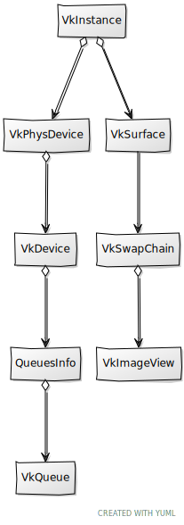

# Chapter 04 - Swap chain

In this chapter we will continue our road to render on the screen. We will describe in detail a concept that has been mentioned in previous
chapters, the swap chain.

You can find the complete source code for this chapter [here](../../booksamples/chapter-04).

## Swap chain

If you recall from previous chapters, rendering to the screen is an optional feature in Vulkan. The capability to present rendering results
to a surface is provided by the swap chain. A swap chain is basically an array of images that can be used as the destination of render
operations and that can be presented on a surface.

As you may already have guessed, swap chain creation will be encapsulated in a struct named `VkSwapChain` (Remember to update the `mod.zig`
file to include it: `pub const swap = @import("vkSwapChain.zig");`). Here is the diagram updated.


Let's start with its attributes and the `create` function for the `VkSwapChain` structure:

```zig
const std = @import("std");
const sdl3 = @import("sdl3");
const vulkan = @import("vulkan");
const vk = @import("mod.zig");

const log = std.log.scoped(.vk);

pub const AcquireResult = union(enum) {
    ok: u32,
    recreate,
};

pub const VkSwapChain = struct {
    extent: vulkan.Extent2D,
    imageViews: []vk.imv.VkImageView,
    surfaceFormat: vulkan.SurfaceFormatKHR,
    handle: vulkan.SwapchainKHR,
    vsync: bool,
    ...
    pub fn create(
        allocator: std.mem.Allocator,
        window: sdl3.video.Window,
        instance: vk.inst.VkInstance,
        physDevice: vk.phys.VkPhysDevice,
        device: vk.dev.VkDevice,
        surface: vk.surf.VkSurface,
        reqImages: u32,
        vsync: bool,
    ) !VkSwapChain {
        const caps = try surface.getSurfaceCaps(instance, physDevice);
        const imageCount = calcNumImages(caps, reqImages);
        const extent = try calcExtent(window, caps);
        const surfaceFormat = try surface.getSurfaceFormat(allocator, instance, physDevice);
        const presentMode = try calcPresentMode(allocator, instance, physDevice, surface.surface, vsync);

        const sameFamily =
            physDevice.queuesInfo.graphics_family ==
            physDevice.queuesInfo.present_family;

        const qfi = [_]u32{
            physDevice.queuesInfo.graphics_family,
            physDevice.queuesInfo.present_family,
        };

        const swapchain_info = vulkan.SwapchainCreateInfoKHR{
            .surface = surface.surface,
            .min_image_count = imageCount,
            .image_format = surfaceFormat.format,
            .image_color_space = surfaceFormat.color_space,
            .image_extent = extent,
            .image_array_layers = 1,
            .image_usage = .{
                .color_attachment_bit = true,
            },
            .image_sharing_mode = if (sameFamily) .exclusive else .concurrent,
            .queue_family_index_count = if (sameFamily) 0 else qfi.len,
            .p_queue_family_indices = if (sameFamily) null else &qfi,
            .pre_transform = caps.current_transform,
            .composite_alpha = .{ .opaque_bit_khr = true },
            .present_mode = presentMode,
            .clipped = vulkan.Bool32.true,
            .old_swapchain = .null_handle,
        };

        const handle = try device.deviceProxy.createSwapchainKHR(&swapchain_info, null);

        const imageViews = try createImageViews(
            allocator,
            device,
            handle,
            surfaceFormat.format,
        );

        log.debug(
            "VkSwapChain created: {d} images, extent {d}x{d}, present mode {any}",
            .{ imageViews.len, extent.width, extent.height, presentMode },
        );

        return .{
            .extent = extent,
            .imageViews = imageViews,
            .surfaceFormat = surfaceFormat,
            .handle = handle,
            .vsync = vsync,
        };
    }
    ...
};
```

We will be identifying the purpose of the different arguments of the `create` function while we go through the code. The first thing we do
to calculate the number of images that our swap chain will have bu calling the `calcNumImages` function. You may be wondering why do we need
more than one image? The answer is to increase performance, while an image is being presented, we may be using another one to render the
results of the next frame. We need to have several in order to parallelize the tasks and use both the CPU and GPU at their maximum capacity.
The most common use cases employ two images (double buffering) or three (triple buffering), as in the figure below.


The figure above represents the triple buffer case. While image #1 is used for presentation we have ready another one, image #2, ready to be
presented. In parallel, we are using image #3 for rendering. Triple buffering is commonly used to avoid frame rate dropout, when we cannot
guarantee that a frame will be ready between v-syncs (You can read more about this [here](https://github.com/KhronosGroup/Vulkan-Samples/blob/master/samples/performance/swapchain_images/swapchain_images_tutorial.md)).

Our `SwapChain` `create` function has a parameter named `reqImages` which is used to express the desired number of images our swap chain
should have. The `calcNumImages` function tries to accommodate that request to the surface limits defined by the surface capabilities that
we obtained at the beginning of the `create` function. We will see the definition later on.

The next thing to do in the `create` function is to calculate the swp chain extent, width and size of the images that compose it, by calling
the `calcExtent` function (we will see it later). After that we calculate the presentation mode by calling the `calcPresentMode` function
(again, we will see the implementation later on). We are now ready to create the swap chain by filling up the `SwapchainCreateInfoKHR`
structure. Let's review the attributes of that structure:

- `surface`: A reference to our surface.
- `min_image_count`: The minimum number of images that this swap chain should use. This is the value that we have got calling the
`calcNumImages` function.
- `image_format`: The format of the images of this swap chain (for example RGB with 8 bits per channel). 
- `image_color_space`: The color space of the images of this swap chain (for example sRGB).
- `image_extent`: The size (width and height in pixels)  of the images of this swap chain.
- `image_array_layers`: The number of views in a multi-view / stereo surface. In our case, since we are not creating a stereoscopic-3D
application, this will set to `1`.
- `image_usage`: It will define the intended usage of the (acquired) swap chain images. That is, what operations we will be doing with them.
In our case we will be rendering these images to the surface, so we will use the `color_attachment_bit` flag (equivalent to `VK_IMAGE_USAGE_COLOR_ATTACHMENT_BIT` ). That is,
we will be outputting colors. There are other usages such as the ones used for depth buffers or for transferring operations.
- `image_sharing_mode`: This controls how the images can be accessed from queues. Remember that in Vulkan we will record the render
operations to be executed in `CommandBuffer`s  that will be queued. Those commands will be de-queued for being executed asynchronously.
There are two possible modes:
  - Concurrent: Multiple queue families can access the images concurrently.  
  - Exclusive: Only one queue family can access the images at a time. This is the most performant mode.
In our case we will check if present and queue families are the same. If they are, we will use exclusive mode.
- `queue_family_index_count`: The number of queue families that will access the swap chain. When in exclusive mode there is no need to
specify the different que families supported.
- `p_queue_family_indices`: The queue families to be used when in concurrent mode.
- `pre_transform`: Describes the transform, relative to the presentation engine’s natural orientation, applied to the image content prior to
presentation (such as rotation of certain angles). In our case, we will use the current transformation mode.
- `composite_alpha`: Indicates the alpha compositing mode to use when this surface is composited together with other surfaces on certain
window systems. In our case we will use the `opaque_bit_khr` flag (equivalent to `VK_COMPOSITE_ALPHA_OPAQUE_BIT_KHR`).  This basically
ignores the alpha component when compositing (no transparencies to be used for the surface).
- `presentMode`: Specifies the presentation mode the Swap chain will use.
- `clipped`: Specifies whether the Vulkan implementation is allowed to discard rendering operations that affect regions of the surface that
are not visible. It is recommended to set this to parameter to `true`.
- `old_swapchain`: We will not use this, it can be used to reuse existing assets from another swap chain which is still associated to the
surface.

Presentation modes need to be explained in detail. Vulkan defines the following presentation modes:

- `VK_PRESENT_MODE_IMMEDIATE_KHR`: The generated images are transferred immediate to the screen without waiting for a vertical blanking
period. This may produce tearing in some cases.
- `VK_PRESENT_MODE_FIFO_KHR`: Images are presented when a vertical blanking occurs. Images ready to be presented are internally queued using
a FIFO schema (First In First Out), which means that new images are appended to the end of the queue. This is the only mode that is
guaranteed to be supported. If the queue is full, the application blocks. Tearing is not observed in this case.
- `VK_PRESENT_MODE_FIFO_RELAXED_KHR`: Similar to the previous mode. In the case that the queue fills up, the application waits, but the
queued images during this waiting period are presented without waiting for the vertical blanking. This may produce tearing in some cases.
- `VK_PRESENT_MODE_MAILBOX_KHR`: Similar to the `VK_PRESENT_MODE_IMMEDIATE_KHR` mode, but in the case that the queue is full, the last image
queued is overwritten by the new one.

In our case, the `Swapchain` `create` function receives a parameter, named `vsync` which we will use to specify if we want to wait for the
vertical blanking or not. If `vsync` is true we will use the `VK_PRESENT_MODE_FIFO_KHR`. In this case our frame rate will be, as a maximum,
the maximum refresh rate of our screen. If `vsync` is false we will try to first use `VK_PRESENT_MODE_MAILBOX_KHR` then,
`VK_PRESENT_MODE_IMMEDIATE_KHR` and finally, if none of them are supported, we will use `VK_PRESENT_MODE_FIFO_KHR`. This is done in the
`calcPresentMode` function:

```zig
pub const VkSwapChain = struct {
    ...
    fn calcPresentMode(
        allocator: std.mem.Allocator,
        instance: vk.inst.VkInstance,
        physDevice: vk.phys.VkPhysDevice,
        surface: vulkan.SurfaceKHR,
        vsync: bool,
    ) !vulkan.PresentModeKHR {
        const modes = try instance.instanceProxy.getPhysicalDeviceSurfacePresentModesAllocKHR(
            physDevice.pdev,
            surface,
            allocator,
        );
        defer allocator.free(modes);

        if (!vsync) {
            for (modes) |m| {
                if (m == .mailbox_khr) return m;
            }
            for (modes) |m| {
                if (m == .immediate_khr) return m;
            }
        }

        return .fifo_khr;
    }
    ...
};
```

Back, to the `create` function we can finally create swap chain by invoking the `createSwapchainKHR` function. The last step is to create
swap chain image views. Prior to analyze that we will start by showing pending functions already used in the `create` function. Let's start
with the definition of `calcNumImages`:

```zig
pub const VkSwapChain = struct {
    ...
    fn calcNumImages(caps: vulkan.SurfaceCapabilitiesKHR, requested: u32) u32 {
        var count = if (requested > 0) requested else caps.min_image_count + 1;

        if (count < caps.min_image_count) {
            count = caps.min_image_count;
        }

        if (caps.max_image_count > 0 and count > caps.max_image_count) {
            count = caps.max_image_count;
        }

        return count;
    }
    ...
};
```

The first thing we do is retrieve the minimum and maximum number of images that our surface supports. The rest of the code is basically to
try to stick with the requested value if it's within the maximum-minimum range.

Now it is the turn to show the definition of the `calcExtent` function:

```zig
pub const VkSwapChain = struct {
    ...
    fn calcExtent(window: sdl3.video.Window, caps: vulkan.SurfaceCapabilitiesKHR) !vulkan.Extent2D {
        if (caps.current_extent.width != std.math.maxInt(u32)) {
            return caps.current_extent;
        }

        const size = try sdl3.video.Window.getSizeInPixels(window);

        return .{
            .width = std.math.clamp(
                @as(u32, @intCast(size[0])),
                caps.min_image_extent.width,
                caps.max_image_extent.width,
            ),
            .height = std.math.clamp(
                @as(u32, @intCast(size[1])),
                caps.min_image_extent.height,
                caps.max_image_extent.height,
            ),
        };
    }
    ...
};
```

If the surface has already defined its extent, we pick that. If it is not defined, we try to set the extent to the window size if it is
within the ranges of minimum  and maximum supported sizes.

## Swap chain images

We have seen that the last step in `VkSwapChain` `create` function is to create image views. What are image views? We would need images to
render to, but in the specific case of the swap chain these images have already been created when we created the swap chain. Therefore, why
not just retrieve them? Why we need image views? In Vulkan we cannot just use the images, we need an indirect element to access them. This
element is called Image View and basically it states how the image will be accessed. Before going on, it is important to precisely define
the concepts involved in handling images in Vulkan. In order to have an image that can be accessed by shaders in Vulkan we need:

- A `VkBuffer` which contains the raw data of the image, its contents. A `VkBuffer` is just a linear array of data.
- A `VkImage` which basically defines the metadata associated to the `VkBuffer`, to the raw data. That is, the image format, its dimensions,
etc.
- A `VkImageView`, which specifies how we are going to use an image, which parts of that image can be accessed, which format are we going to
use, etc. We could have several views over the same `VkImage` instance to restrict the range or event to use different formats while using
it, making automatic conversions to the `VkImage` format. As its name says, it is just a view over the image.

As it has been said before, the images for our swap chain have already been created, we just need to create the associated image views. In
the next chapters we will need to create images for textures and, their associated buffers, but right now, we just need image views. 



The definition of the `createImageViews` function is as follows:

```zig
pub const VkSwapChain = struct {
    ...
    fn createImageViews(
        allocator: std.mem.Allocator,
        device: vk.dev.VkDevice,
        swapChain: vulkan.SwapchainKHR,
        format: vulkan.Format,
    ) ![]vk.imv.VkImageView {
        const images = try device.deviceProxy.getSwapchainImagesAllocKHR(swapChain, allocator);
        defer allocator.free(images);

        const views = try allocator.alloc(vk.imv.VkImageView, images.len);

        const ivData = vk.imv.VkImageViewData{ .format = format };

        var i: usize = 0;
        for (images) |img| {
            views[i] = try vk.imv.VkImageView.create(device, img, ivData);
            i += 1;
        }

        return views;
    }
    ...
};
```

The first thing we do is retrieve the **actual** number of images that our swap chain has. But wait, we had already specified this when we
created the swap chain, why we do need to retrieve that again? The answer is that we created the swap chain with a desired number of images,
but the Vulkan driver may have returned a different number. This is why we need to call the `getSwapchainImagesAllocKHR` function to
retrieve the images.

Now we iterate over the images to create new `VkImageView` instances. The `VkImageView` struct encapsulates the creation and disposal of
Vulkan image views (Remember to update the `mod.zig` file to include it: `pub const imv = @import("vkImageView.zig");`). Since the
parameters to properly set up image views can be quite lengthy, it defines a helper struct named `VkImageViewData` to assist in the
creation.

```zig
const vk = @import("mod.zig");
const vulkan = @import("vulkan");

pub const VkImageViewData = struct {
    aspectmask: vulkan.ImageAspectFlags = vulkan.ImageAspectFlags{ .color_bit = true },
    baseArrayLayer: u32 = 0,
    baseMipLevel: u32 = 0,
    format: vulkan.Format,
    layerCount: u32 = 1,
    levelCount: u32 = 1,
    viewType: vulkan.ImageViewType = .@"2d",
};
...
```

You will see how all these parameters in the `create` function of the `VkImageView` struct.
```zig
...
pub const VkImageView = struct {
    image: vulkan.Image,
    view: vulkan.ImageView,

    pub fn create(vkDevice: vk.dev.VkDevice, image: vulkan.Image, imageViewData: VkImageViewData) !VkImageView {
        const createInfo = vulkan.ImageViewCreateInfo{
            .image = image,
            .view_type = imageViewData.viewType,
            .format = imageViewData.format,
            .components = .{ .r = .identity, .g = .identity, .b = .identity, .a = .identity },
            .subresource_range = .{
                .aspect_mask = imageViewData.aspectmask,
                .base_mip_level = imageViewData.baseMipLevel,
                .level_count = imageViewData.levelCount,
                .base_array_layer = imageViewData.baseArrayLayer,
                .layer_count = imageViewData.layerCount,
            },
            .p_next = null,
        };
        const imageView = try vkDevice.deviceProxy.createImageView(&createInfo, null);

        return .{
            .image = image,
            .view = imageView,
        };
    }

    pub fn cleanup(self: *VkImageView, vkDevice: vk.dev.VkDevice) void {
        vkDevice.deviceProxy.destroyImageView(self.view, null);
        self.view = .null_handle;
    }
};
```

In order to create a Image View we need to fill up a `ImageViewCreateInfo` structure. This structure is defined by the following attributes:

- `image`: A reference to the image handle that this view refers to. In our case it will be one of the swap chain images.
- `view_type`: The type of image view. In our case they will be 2D images.
- `format`: The format of the image. In this case we just use the format of the underlying swap chain images.
- `components`: It allows the remapping of color components. We will just map them to identity since we will not be doing remapping.
- `subresource_range`: This parameter allow us to select a specific range of the underlying image. We can select a specific set of mipmap
levels or layers (in the case of array of layers). In this case, we can control the maximum mipmap level (through the `level_count`
argument), and we stick to 1 layer. Regarding the aspects, for this specific case, we will get the color aspect (for example there are some
other aspect for depth images).

With the `ImageViewCreateInfo` structure filled up, we just need to call the `createImageView` to get a handle to the image view. The rest
of the struct is completed with the `cleanup` function to free the resources.

Going back to the `VkSwapChain` struct we need also to create a `cleanup` function to free the resources:
```zig
pub const VkSwapChain = struct {
    ...
    pub fn cleanup(self: *const VkSwapChain, allocator: std.mem.Allocator, device: vk.dev.VkDevice) void {
        for (self.imageViews) |*iv| {
            iv.cleanup(device);
        }
        allocator.free(self.imageViews);
        device.deviceProxy.destroySwapchainKHR(self.handle, null);
    }
    ...
};
```

Now we can use the `VkSwapChain` struct in our `VkCtx` struct:

```zig
pub const VkCtx = struct {
    ...
    vkSwapChain: vk.swap.VkSwapChain,

    pub fn create(allocator: std.mem.Allocator, constants: com.common.Constants, window: sdl3.video.Window) !VkCtx {
        ...
        const vkSwapChain = try vk.swap.VkSwapChain.create(
            allocator,
            window,
            vkInstance,
            vkPhysDevice,
            vkDevice,
            vkSurface,
            constants.swapChainImages,
            constants.vsync,
        );

        return .{
            .constants = constants,
            .vkDevice = vkDevice,
            .vkInstance = vkInstance,
            .vkPhysDevice = vkPhysDevice,
            .vkSurface = vkSurface,
            .vkSwapChain = vkSwapChain,
        };
    }

    pub fn cleanup(self: *VkCtx, allocator: std.mem.Allocator) !void {
        self.vkSwapChain.cleanup(allocator, self.vkDevice);
        ...
    }
    ...
}
```

We have also modified also the `Constants` struct to read a new property to configure the usage of vsync and to define the requested number
of images for the swap chain:

```zig
pub const Constants = struct {
    ...
    swapChainImages: u8,
    ...
    vsync: bool,

    pub fn load(allocator: std.mem.Allocator) !Constants {
        ...
        const constants = Constants{
            .gpu = try allocator.dupe(u8, tmp.gpu),
            .swapChainImages = tmp.swapChainImages,
            .ups = tmp.ups,
            .validation = tmp.validation,
            .vsync = tmp.vsync,
        };
        ...
    }
    ...
    public int getRequestedImages() {
        return requestedImages;
    }
    ...
}        
```

Don't forget to add the changes in the `res/cfg/cfg.toml` file:

```
...
swapChainImages=3
...
vsync=true
...
```

And that is all for now, we are still getting a plain white window, but soon we will be able to render something.

[Next chapter](../chapter-05/chapter-05.md)