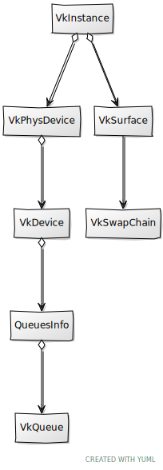

# Chapter 04 - Swap chain

In this chapter we will continue our road to render on the screen. We will describe in detail a concept that has been mentioned in previous chapters, the swap chain.

You can find the complete source code for this chapter [here](../../booksamples/chapter-04).

## Swap chain

If you recall from previous chapters, rendering to the screen is an optional feature in Vulkan. The capability to present rendering results to a surface is provided by the swap chain. A swap chain is basically an array of images that can be use as the destination of render operations and that can be presented on a surface.

As you may already have guessed, swap chain creation will be encapsulated in a struct named `VkSwapChain`. This the class diagram updated.

Let's start with its attributes and the `create` function for the `VkSwapChain` structure:

