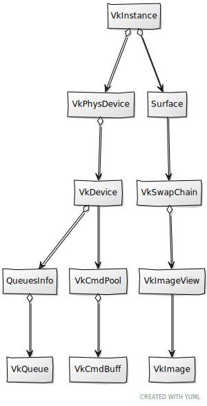
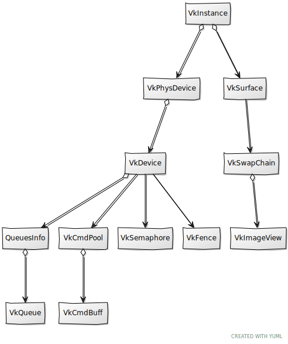

# Chapter 05 - Clearing the screen

In this chapter we will introduce new concepts that are required to render a scene to the screen. We will finally combine all these new
concepts with the elements described in previous chapters to clear the screen. Therefore, it is crucial to understand all of them and how
are they related in order to be able to progress in the book.

You can find the complete source code for this chapter [here](../../booksamples/chapter-05).

## Command Buffers

When we talked about queues we already mentioned that in Vulkan, work is submitted by recording commands (stored in a command buffer), and
submitting them to a queue. It is time now to implement the support for these elements. Command buffers need to be instantiated through a
command pool. Therefore, let's encapsulate Command pool creation in a struct named `VkCmdPool`. Its definition is quite simple (it's defined
in the file `src/eng/vkVkCmd.zig` remember to include it in the `mod.zig` file: `pub const cmd = @import("vkCmd.zig");`):

```zig
const std = @import("std");
const vulkan = @import("vulkan");
const vk = @import("mod.zig");

pub const VkCmdPool = struct {
    commandPool: vulkan.CommandPool,

    pub fn create(vkCtx: *const vk.ctx.VkCtx, queueFamilyIndex: u32, resetSupport: bool) !VkCmdPool {
        const createInfo: vulkan.CommandPoolCreateInfo = .{ .queue_family_index = queueFamilyIndex, .flags = .{ .reset_command_buffer_bit = resetSupport } };
        const commandPool = try vkCtx.vkDevice.deviceProxy.createCommandPool(&createInfo, null);
        return .{ .commandPool = commandPool };
    }

    pub fn cleanup(self: *const VkCmdPool, vkCtx: *const vk.ctx.VkCtx) void {
        vkCtx.vkDevice.deviceProxy.destroyCommandPool(self.commandPool, null);
    }

    pub fn reset(self: *const VkCmdPool, vkCtx: *const vk.ctx.VkCtx) !void {
        try vkCtx.vkDevice.deviceProxy.resetCommandPool(self.commandPool, .{});
    }
};
```

Creating a command pool is pretty straightforward, we just set up an initialization structure, named `CommandPoolCreateInfo` which has the
following main parameter:
- `queueFamilyIndex`: Selects the queue family index where the commands created in this pool can be submitted to. 
- `flags`:  It allows to specify the behavior of the command pool. Basically, we have two options, we can get command buffers from the pool
and return them whenever we have used them (we have submitted them tio a queue), or we can reuse them between several submits. In this later
case, you need to reset them. In order to do so, you need to explicitly create the command pool to support this behavior, by setting the
`flags` parameter with the `VK_COMMAND_POOL_CREATE_RESET_COMMAND_BUFFER_BIT` value (`reset_command_buffer_bit` flag). This will allow
commands to be reset individually.

The rest of the functions of the struct are, as usual, a `cleanup` function to release resources. Now that are able to create command
pools, let's review the struct that will allow us to instantiate command buffers, which as you can imagine it's named `VkCmdBuff`
(defined in the same file as `VkCmdPool`). It starts like this:

```zig
pub const VkCmdBuff = struct {
    cmdBuffProxy: vulkan.CommandBufferProxy,
    oneTime: bool,

    pub fn create(vkCtx: *const vk.ctx.VkCtx, vkCmdPool: *vk.cmd.VkCmdPool, oneTime: bool) !VkCmdBuff {
        const allocateInfo: vulkan.CommandBufferAllocateInfo = .{
            .command_buffer_count = 1,
            .command_pool = vkCmdPool.commandPool,
            .level = vulkan.CommandBufferLevel.primary,
        };
        var cmds: [1]vulkan.CommandBuffer = undefined;
        try vkCtx.vkDevice.deviceProxy.allocateCommandBuffers(&allocateInfo, &cmds);
        const cmdBuffProxy = vulkan.CommandBufferProxy.init(cmds[0], vkCtx.vkDevice.deviceProxy.wrapper);

        return .{ .cmdBuffProxy = cmdBuffProxy, .oneTime = oneTime };
    }
    ...
};
```

The `create` functions receives, as it first parameter, the Vulkan Context, since we need to access the device. The second parameter is the
command pool where this command buffer will be allocated to. The third parameter last parameter is a boolean that indicates if the command
buffer recordings will be submitted just once or if they can be submitted multiple times (we will see later on what this implies). We need
to fill a structure named `CommandBufferAllocateInfo`. The parameters are:

- `command_pool`: Handle to the command pool which will be used to allocate the command buffer.
- `level`: Indicates the level of the command buffer (primary or secondary).
- `command_buffer_count`: The number of command buffers to allocate.

To finalize the `create` function, once that structure is being set, we allocate the command buffer by creating a new `CommandBufferProxy`
instance. The next function of the `VkCmdBuff` struct, named `begin`, should be invoked when we want to start recording for that command
buffer:

```zig
pub const VkCmdBuff = struct {
    ...
    pub fn begin(self: *const VkCmdBuff, vkCtx: *const vk.ctx.VkCtx) !void {
        const beginInfo: vulkan.CommandBufferBeginInfo = .{ .flags = .{ .one_time_submit_bit = self.oneTime } };
        try vkCtx.vkDevice.deviceProxy.beginCommandBuffer(self.cmdBuffProxy.handle, &beginInfo);
    }
    ...
};
```

To start recording we need to create a `CommandBufferBeginInfo` structure and invoke the `beginCommandBuffer` function. If we are submitting
a short lived command, we can signal that using the flag `one_time_submit_bit` (`VK_COMMAND_BUFFER_USAGE_ONE_TIME_SUBMIT_BIT`). In this
case, the driver may not try to optimize that command buffer since it will only be used one time.

The next functions are the usual `cleanup` for releasing resources and `end` to finalize the recording:

```zig
pub const VkCmdBuff = struct {
    ...
    pub fn cleanup(self: *const VkCmdBuff, vkCtx: *const vk.ctx.VkCtx, vkCmdPool: *vk.cmd.VkCmdPool) void {
        const cmds = [_]vulkan.CommandBuffer{self.cmdBuffProxy.handle};
        vkCtx.vkDevice.deviceProxy.freeCommandBuffers(vkCmdPool.commandPool, cmds.len, &cmds);
    }
    ...
    pub fn end(self: *const VkCmdBuff, vkCtx: *const vk.ctx.VkCtx) !void {
        try vkCtx.vkDevice.deviceProxy.endCommandBuffer(self.cmdBuffProxy.handle);
    }
    ...
}
```

The `VkCmdBuff` struct is now almost complete, there is still one function missing which basically submits ut to a queue and waits it to be
processed. But,  prior to showing that function we need to introduce new concepts.



## Synchronization

Prior to progress in rendering something on the screen, we need to address a fundamental topic in Vulkan: synchronization. In Vulkan we will
be in charge of properly control the synchronization of the resources. This imposes certain complexity but allows us to have a full control
about how operations will be done. In this section we well address two main mechanisms involved in Vulkan synchronization: semaphores and
fences. There are some other elements such as barriers or events, we will explain them once we first use them. 

Fences are the mechanisms used in Vulkan to synchronize operations between the GPU and the CPU (our application). Semaphores are used to
synchronize operations inside the GPU (GPU to GPU synchronization), and are frequently used to synchronize queue submissions. These elements
are used to block the execution until a signal is performed. Once a signal is received  execution is resumed. It is important to note, that
signaling is always done in the GPU side. In the case of fences, our application can block (waiting in the CPU) until the GPU signals that
execution can go on, but we cannot trigger the signaling from the CPU. In the case of semaphores, since they are internal to the GPU,
waiting can only happen in the GPU.

Before using these elements, we will define some structs to manage them. We will firs start with the `VkSemaphore` struct (defined in the
file `vkSync.zig`. Remember to include this file in the `mod.zig` file: `pub const sync = @import("vkSync.zig");`):

```zig
const std = @import("std");
const vulkan = @import("vulkan");
const vk = @import("mod.zig");

...
pub const VkSemaphore = struct {
    semaphore: vulkan.Semaphore,

    pub fn create(vkCtx: *const vk.ctx.VkCtx) !VkSemaphore {
        const semaphore = try vkCtx.*.vkDevice.deviceProxy.createSemaphore(&.{}, null);
        return .{ .semaphore = semaphore };
    }

    pub fn cleanup(self: *const VkSemaphore, vkCtx: *const vk.ctx.VkCtx) void {
        vkCtx.*.vkDevice.deviceProxy.destroySemaphore(self.semaphore, null);
    }
};
```

In this case we are modeling what is called a binary semaphore, which can be in two states: signaled and un-signaled. When you create a
semaphore is in an un-signaled state. When we submit command we can specify a semaphore to be signaled when the commands complete. If later
on, we record some other commands or perform some operation that require those previous commands to be completed, we use the same semaphore
to wait. The cycle is like this, the semaphore in the first step is un-signaled, when the operations are completed get signaled and then,
commands that are waiting can continue (we say that these second step activities are waiting for the semaphore to be signaled). Creating a
semaphore is easy, just define call the `createSemaphore` function. We complete the code with the `cleanup` function to free the resources.

Now it's turn for the `VkFence` struct (defined in the same file):

```zig
pub const VkFence = struct {
    fence: vulkan.Fence,

    pub fn create(vkCtx: *const vk.ctx.VkCtx) !VkFence {
        const fence = try vkCtx.*.vkDevice.deviceProxy.createFence(&.{ .flags = .{ .signaled_bit = true } }, null);
        return .{ .fence = fence };
    }

    pub fn cleanup(self: *const VkFence, vkCtx: *const vk.ctx.VkCtx) void {
        vkCtx.*.vkDevice.deviceProxy.destroyFence(self.fence, null);
    }

    pub fn reset(self: *const VkFence, vkCtx: *const vk.ctx.VkCtx) !void {
        try vkCtx.*.vkDevice.deviceProxy.resetFences(1, @ptrCast(&self.fence));
    }

    pub fn wait(self: *const VkFence, vkCtx: *const vk.ctx.VkCtx) !void {
        _ = try vkCtx.*.vkDevice.deviceProxy.waitForFences(1, @ptrCast(&self.fence), vulkan.Bool32.true, std.math.maxInt(u64));
    }
};
```

As in the `VkSemaphore` struct, the `VkFence` struct is also very simple. We also need to call the `createFence` with some flags. In this
case, we will use a flag to state that the fence should be signaled when created. Besides the cleaning function and the one for getting the
handle we have one function called `wait` which waits for the fence to be signaled (waits in the CPU the signal raised by the GPU). We have
another one named `reset` which resets the fence to un-signaled state by calling the `resetFences` function.



With all of these synchronization elements we can go back to the `VkQueue` struct and add a function to submit command buffers named
`submit`:

```zig
pub const VkQueue = struct {
    ...
    pub fn submit(self: *const VkQueue, vkCtx: *const vk.ctx.VkCtx, cmdBufferSubmitInfo: []const vulkan.CommandBufferSubmitInfo, semSignalInfo: []const vulkan.SemaphoreSubmitInfo, semWaitInfo: []const vulkan.SemaphoreSubmitInfo, vkFence: vk.sync.VkFence) !void {
        try vkFence.reset(vkCtx);
        const si = vulkan.SubmitInfo2{
            .command_buffer_info_count = @as(u32, @intCast(cmdBufferSubmitInfo.len)),
            .p_command_buffer_infos = cmdBufferSubmitInfo.ptr,
            .signal_semaphore_info_count = @as(u32, @intCast(semSignalInfo.len)),
            .p_signal_semaphore_infos = semSignalInfo.ptr,
            .wait_semaphore_info_count = @as(u32, @intCast(semWaitInfo.len)),
            .p_wait_semaphore_infos = semWaitInfo.ptr,
        };
        try vkCtx.vkDevice.deviceProxy.queueSubmit2(
            self.handle,
            1,
            @ptrCast(&si),
            vkFence.fence,
        );
    }
    ...
};
```

This function can receive a list of command buffer handles (we can submit more than one at a time) and several synchronization elements. In
order to submit a list of command buffers to a queue we need to setup a `SubmitInfo2` structure. The attributes of this structure are:

- `p_command_buffer_infos`: The list of the command buffers to submit.
- `command_buffer_info_count`: The number of the commands to be submitted in that list.
- `p_signal_semaphore_infos`: It holds a list of semaphores that will be signaled when all the commands have finished. Remember that we use
semaphores for GPU-GPU synchronization.
- `signal_semaphore_info_count`: The number of semaphores to be signaled.
- `p_wait_semaphore_infos`:  It holds a list of semaphores that we will use to wait before the commands get executed. The execution of the
commands will block until the semaphores are signaled.
- `p_wait_semaphore_infos`:  The number of semaphores to be used for waiting.

When submitting the command buffers we can also set a handle to a fence. We will use this as a blocking mechanism in our application to
prevent re-submitting commands that are still in use. 

Now that we have introduced semaphores, fences, and queue submission it is time to show the pending function in the `VkCmdBuff` which is
called `submitAndWait`:

```zig
pub const VkCmdBuff = struct {
    ...
    pub fn submitAndWait(self: *const VkCmdBuff, vkCtx: *const vk.ctx.VkCtx, vkQueue: vk.queue.VkQueue) !void {
        const vkFence = try vk.sync.VkFence.create(vkCtx);
        defer vkFence.cleanup(vkCtx);

        const cmdBufferSubmitInfo = [_]vulkan.CommandBufferSubmitInfo{.{
            .device_mask = 0,
            .command_buffer = self.cmdBuffProxy.handle,
        }};

        const emptySemphs = [_]vulkan.SemaphoreSubmitInfo{};

        try vkQueue.submit(vkCtx, &cmdBufferSubmitInfo, &emptySemphs, &emptySemphs, vkFence);
        try vkFence.wait(vkCtx);
    }
    ...
};
```
The function is quite simple. We start by creating a `VkFence` instance, which will allows to block CPU execution until all the commands
submitted have been processed. We set the fence to be cleaned up when it goes out of scope. We then just wrap the command buffer handle into
a `CommandBufferSubmitInfo` structure and use the queue, received as a parameter, to submit it. Then we just wait for the commands to finish
by calling `wait`. This function will be used in future chapters to wait for the loading of assets (3D models, textures, ...) into the GPU.

## Render loop

Prior to progress on how we render graphics, we will analyze first how what we would need to do that. The first thing that comes to the mind
may be having a  command buffer and a command pool, of course having a queue to submit the commands and we will need something to do with
the image views of the `VkSwapChain`. So, let's just create one instance of each and that's it, right? Well, it turns out that is not so
easy. We need to make sure that the image we are rendering into is not in use. Ok, so let's then use a fence and a semaphore to prevent
that, and that's all, right? Again, it is not so easy. Remember when we talked about the `VkSwapChain` struct? We created several image
views. We want to be able to perform operations in the CPU while the GPU is working, this is why we tried to use triple buffering. So we
need to have several resources while processing each frame. How many of them? At first, you may think that you need as many as image views
have the `VkSwapChain` image views. The reality, however, is that you do not need as many, with just two is enough. The reason is that we do
not want the CPU to wait for the GPU to prevent having latency. We will refer to this number as frames in flight, which shall not be
confused with total swap chain image views. In fact, we will create a new constant in the `common.zig` file for this:

```zig
...
pub const FRAMES_IN_FLIGHT = 2;
...
```

There is an excellent resource [here](https://docs.vulkan.org/tutorial/latest/03_Drawing_a_triangle/03_Drawing/03_Frames_in_flight.html)
which provides additional information.

So then just create as many semaphores and fences as frames in flight an that's all, right? Again is not so easy!. We need to take care with
swap chain image presentation. We will use a semaphore when submitting the work to a queue to be signaled after all the work has been done.
We will use an array of semaphores for that, called `semsRenderComplete`. When presenting the acquired swap chain image we will use the
proper index `semsRenderComplete[i]` when calling the `queuePresentKHR` function so presentation cannot start until render work has been
finished. The issue here is that this will be an asynchronous call that can be processed later on. Imagine that we created as the
`semsRenderComplete` array is size to contain as many instances as flights in frame, let's say `2` and we will have `3` swap chain images.

- In Frame `#0`:
    - We acquire the first swap chain image (with an index equal to `0`).
    - We submit the work using `semsRenderComplete[0]`.
    - We present the swap chain image (that is, call the `queuePresentKHR` function using `semsRenderComplete[0]` semaphore).
- In Frame `#1`:
    - We acquire the next swap chain image (with an index equal to `1`).
    - We submit the work using `semsRenderComplete[1]`.
    - We present the swap chain image (that is, call the `queuePresentKHR` function using `semsRenderComplete[1]` semaphore).
    - Everything is ok up to this point.
- In Frame `#2`:
    - We acquire the next swap chain image (with an index equal to `2`).
    - We have just `2` instances of `semsRenderComplete`, so we need to use `semsRenderComplete[0]`.
    - The issue here is that presentation for Frame `#0` may not have finished, and thus `semsRenderComplete[0]` may still be in use. We may
    have a synchronization issue here.

But, shouldn't fences help us prevent us from this issue? The answer is no, fences will be used when submitting work to a queue. Therefore,
if we wait for a fence, we will be sure that previous work associated to the same frame in flight index will have finished. The issue is
with presentation, when presenting the swap chain image we just pass a semaphore to wait to be signaled when the render work is
finished, but we cannot signal when the presentation will be finished. Therefore, fence wait does not know anything about the presentation
state, The solution for this is to have as many render complete semaphores as swap  chain images. The rest of synchronization elements and
per-frame elements just need to be sized to the maximum number of frames in flight, because they are concerned to just render activities,
presentation is not involved at all.

Let's go now to the `Render` struct and see the new attributes that we will need (showing the changes in the `create` and the `cleanup`
functions):

```zig
...
const vulkan = @import("vulkan");

pub const Render = struct {
    vkCtx: vk.ctx.VkCtx,
    cmdPools: []vk.cmd.VkCmdPool,
    cmdBuffs: []vk.cmd.VkCmdBuff,
    currentFrame: u8,
    fences: []vk.sync.VkFence,
    queueGraphics: vk.queue.VkQueue,
    queuePresent: vk.queue.VkQueue,
    renderScn: eng.rscn.RenderScn,
    semsPresComplete: []vk.sync.VkSemaphore,
    semsRenderComplete: []vk.sync.VkSemaphore,

    pub fn cleanup(self: *Render, allocator: std.mem.Allocator) !void {
        try self.vkCtx.vkDevice.wait();

        self.renderScn.cleanup(allocator, &self.vkCtx);

        for (self.cmdPools) |cmdPool| {
            cmdPool.cleanup(&self.vkCtx);
        }
        allocator.free(self.cmdBuffs);

        defer allocator.free(self.cmdPools);
        for (self.fences) |fence| {
            fence.cleanup(&self.vkCtx);
        }
        defer allocator.free(self.fences);

        self.cleanupSemphs(allocator);

        try self.vkCtx.cleanup(allocator);
    }

    fn cleanupSemphs(self: *Render, allocator: std.mem.Allocator) void {
        for (self.semsRenderComplete) |sem| {
            sem.cleanup(&self.vkCtx);
        }
        defer allocator.free(self.semsRenderComplete);

        for (self.semsPresComplete) |sem| {
            sem.cleanup(&self.vkCtx);
        }
        defer allocator.free(self.semsPresComplete);
    }

    pub fn create(allocator: std.mem.Allocator, constants: com.common.Constants, window: sdl3.video.Window) !Render {
        const vkCtx = try vk.ctx.VkCtx.create(allocator, constants, window);

        const fences = try allocator.alloc(vk.sync.VkFence, com.common.FRAMES_IN_FLIGHT);
        for (fences) |*fence| {
            fence.* = try vk.sync.VkFence.create(&vkCtx);
        }

        const semsRenderComplete = try allocator.alloc(vk.sync.VkSemaphore, vkCtx.vkSwapChain.imageViews.len);
        for (semsRenderComplete) |*sem| {
            sem.* = try vk.sync.VkSemaphore.create(&vkCtx);
        }

        const semsPresComplete = try allocator.alloc(vk.sync.VkSemaphore, com.common.FRAMES_IN_FLIGHT);
        for (semsPresComplete) |*sem| {
            sem.* = try vk.sync.VkSemaphore.create(&vkCtx);
        }

        const cmdPools = try allocator.alloc(vk.cmd.VkCmdPool, com.common.FRAMES_IN_FLIGHT);
        for (cmdPools) |*cmdPool| {
            cmdPool.* = try vk.cmd.VkCmdPool.create(&vkCtx, vkCtx.vkPhysDevice.queuesInfo.graphics_family, false);
        }

        const cmdBuffs = try allocator.alloc(vk.cmd.VkCmdBuff, com.common.FRAMES_IN_FLIGHT);
        for (cmdBuffs, 0..) |*cmdBuff, i| {
            cmdBuff.* = try vk.cmd.VkCmdBuff.create(&vkCtx, &cmdPools[i], true);
        }

        const queueGraphics = vk.queue.VkQueue.create(&vkCtx, vkCtx.vkPhysDevice.queuesInfo.graphics_family);
        const queuePresent = vk.queue.VkQueue.create(&vkCtx, vkCtx.vkPhysDevice.queuesInfo.present_family);

        const renderScn = try eng.rscn.RenderScn.create(allocator, &vkCtx);

        return .{
            .vkCtx = vkCtx,
            .cmdPools = cmdPools,
            .cmdBuffs = cmdBuffs,
            .currentFrame = 0,
            .fences = fences,
            .queueGraphics = queueGraphics,
            .queuePresent = queuePresent,
            .renderScn = renderScn,
            .semsPresComplete = semsPresComplete,
            .semsRenderComplete = semsRenderComplete,
        };
    }
    ...
};
```

We will need:
- An array of command pools, whose size will be equal to the maximum number of flights in flight.
- An array of command buffers, one per frame in flight where will be recording the commands for each of them.
- Synchronization instances, semaphores and fences, as well, as many as frames in flight with the exception of the semaphores that will be
signaled when the render process is completed. 
- One `VkQueue` instance for graphics since we can use them in multiple frames. Synchronization wil be controlled by fences and semaphores.
- One `VkQueue` instance for presentation.
- The attribute `currentFrame` will hold the current frame to be processed. It will be updated in each render loop.

Now let's focus on the render loop. The next figure shows the main steps.


The loop loop main steps are as follows:
- *Wait for fence*: In order to be able to access, from CPU, resources associated to current frame, we need to make sure that they are still
not being used by the GPU. Remember that fences are the way to synchronize between GPU and CPU. When we will submit the work associated to
current frame, we will pass the associated fence.
- *Record commands A*: Once we have passed the fence, we can start recording commands in the command buffer associated to the current frame.
But Why having two sets of command "A" and "B" ? The reason for that is that we will have commands that do not depend on the specific swap
chain image that we need to acquire ("A commands") and commands that will perform operations over a specific image view ("B commands"). We
can start recording the first step prior to acquiring the swap chain image.
- *Acquire image*: We need to acquire the next swap chain image which will be used to render. In this chapter we will not have "A commands"
yet however.
- *Record commands B*: Already explained.
- *Submit commands*: Just submit the commands to a graphical queue.
- *Present Image*.

Remember that, depending on your case, you can pre-record your commands once and use them in your render loop. However, if your scene is
complex and the commands may change, it is acceptable to record them in the render loop (you can optimize this by reusing secondary command
buffers or using several threads).

Let's see how the code of the render loop (and associated functions) looks like:

```zig
pub const Render = struct {
    ...
    pub fn render(self: *Render, engCtx: *eng.engine.EngCtx) !void {
        const fence = self.fences[self.currentFrame];
        try fence.wait(&self.vkCtx);

        const vkCmdPool = self.cmdPools[self.currentFrame];
        try vkCmdPool.reset(&self.vkCtx);

        const vkCmdBuff = self.cmdBuffs[self.currentFrame];
        try vkCmdBuff.begin(&self.vkCtx);

        const res = try self.vkCtx.vkSwapChain.acquire(self.vkCtx.vkDevice, self.semsPresComplete[self.currentFrame]);
        if (engCtx.wnd.resized or res == .recreate) {
            try vkCmdBuff.end(&self.vkCtx);
            return;
        }
        const imageIndex = res.ok;

        self.renderInit(vkCmdBuff, imageIndex);

        try self.renderScn.render(&self.vkCtx, vkCmdBuff, imageIndex);

        self.renderFinish(vkCmdBuff, imageIndex);

        try vkCmdBuff.end(&self.vkCtx);

        try self.submit(&vkCmdBuff, imageIndex);

        _ = self.vkCtx.vkSwapChain.present(self.vkCtx.vkDevice, self.queuePresent, self.semsRenderComplete[imageIndex], imageIndex);

        self.currentFrame = (self.currentFrame + 1) % com.common.FRAMES_IN_FLIGHT;
    }
    ...
};
```
The `render` loop performs the following actions:
- We first wait for the fence associated to the current frame.
- After that, we select the command pool and command buffer associated to current frame.
- We then resets the command pool and set the command buffer in recording mode. Remember that we will not be resetting the command
buffers but the pool. After this step we could start recording "A commands".
- In our case, since we do not have "A commands" yet", we just acquire next swap chain image. We will see the implementation later on, but
this function returns the index of the image acquired (it may not be just the next image index). The `semsPresComplete` array contains the
semaphores used to synchronize image acquisition when the image is acquired, this semaphore will be signaled. Any operation depending on
this image to be acquired, can use this semaphore as a blocking mechanism.
- If the `acquire` does return an error, this will mean that the operation failed. This could be because the window has been resized. By
now, we just  finish recording and return.
- Then we can record "B commands" which we will do by calling `renderScn.render`
- After that we can stop the recording and submit the work to the graphics queue.
- Finally, we just present the image and increase current frame in the range [0-VkUtils.MAX_IN_FLIGHT].

We will see later on the implementation of `renderInit` and `renderFinish` functions. Let's review the definition of the `submit` function:

```zig
pub const Render = struct {
    ...
    fn submit(self: *Render, vkCmdBuff: *const vk.cmd.VkCmdBuff, imageIndex: u32) !void {
        const vkFence = self.fences[self.currentFrame];

        const cmdBufferInfo = vulkan.CommandBufferSubmitInfo{
            .device_mask = 0,
            .command_buffer = vkCmdBuff.cmdBuffProxy.handle,
        };

        const semWaitInfo = vulkan.SemaphoreSubmitInfo{
            .device_index = 0,
            .value = 0,
            .stage_mask = .{ .color_attachment_output_bit = true },
            .semaphore = self.semsPresComplete[self.currentFrame].semaphore,
        };

        const semSignalInfo = vulkan.SemaphoreSubmitInfo{
            .device_index = 0,
            .value = 0,
            .stage_mask = .{ .bottom_of_pipe_bit = true },
            .semaphore = self.semsRenderComplete[imageIndex].semaphore,
        };

        try self.queueGraphics.submit(&self.vkCtx, &.{cmdBufferInfo}, &.{semSignalInfo}, &.{semWaitInfo}, vkFence);
    }
};
```

This function basically delegates in the `submit` function provided by `VkQueue` constructing all the required arguments. Let's
concentrate on what semaphores we are using:
- `semWaitInfo`: It holds a list of semaphores that we will use to wait before the commands get executed. The execution of the commands will
block until the semaphores are signaled. In this case, we are submitting the semaphore that was used for acquiring the swap chain image.
This semaphore will be signaled when the image is effectively acquired, blocking the command execution until this happens. You will see that
we are using a `stage_mask` with the  `color_attachment_output_bit` flag set (`VK_PIPELINE_STAGE_2_COLOR_ATTACHMENT_OUTPUT_BIT`). 
You will understand this when we talk about pipelines, but this attribute allow us to fine control when we want to control this wait
process. Commands, when submitted go through different stages (vertex output, fragment output, ...). In this case we need to wait when
generating the output color, so we use the `color_attachment_output_bit` flag. Since we depend on swap chain image view, we want to make
sure that the image has been acquired when we start outputting final colors. 
- `semWaitInfo`: It holds a list of semaphores that will be signaled when all the commands have finished. Remember that we use semaphores
for GPU-GPU synchronization. In this case, we are submitting the semaphore used in the swap chain presentation. This will provoke that the
image cannot be presented until the commands have finished, that is, until render has finished. This is why we use the `bottom_of_pipe_bit`
flag (`VK_PIPELINE_STAGE_2_BOTTOM_OF_PIPE_BIT`), all the commands need to have finalized their journey through the pipeline.

Please notice that we have different array sizes for the presentation complete semaphores and the render complete semaphores. Later one
(`semsRenderComplete`) will need to be accessed with the swap chain acquire image index, while the first one (`semsPresComplete`) will
just need frame in flight index.

Finally, we use the current `VkFence` instance, this way we block the CPU from resetting command buffers that are still in use.

Let's start now by reviewing the missing functions in `VkSwapChain` struct. First function is `acquire`:

```zig
pub const VkSwapChain = struct {
    ...
    pub fn acquire(
        self: *const VkSwapChain,
        device: vk.dev.VkDevice,
        semaphore: vk.sync.VkSemaphore,
    ) !AcquireResult {
        const res = device.deviceProxy.acquireNextImageKHR(
            self.handle,
            std.math.maxInt(u64),
            semaphore.semaphore,
            .null_handle,
        );

        if (res) |ok| {
            return switch (ok.result) {
                .success, .suboptimal_khr => .{ .ok = ok.image_index },
                else => .recreate,
            };
        } else |err| {
            return switch (err) {
                error.OutOfDateKHR => .recreate,
                else => err,
            };
        }
    }
    ...
}
```
  
In order to acquire an image we need to call the function `acquireNextImageKHR`. The parameters for this function are:
- The handle to the Vulkan swap chain.
- A timeout to specify the maximum time to get blocked in this call (in nanoseconds). If the value is greater than `0` and we are not able
to get an image in that time, we will get a `VK_TIMEOUT` error. In our case, we maxium value of a 64 bits integer to block indefinitely.
- A semaphore that will be signaled when the GPU is done with the acquired image.
In our case, we use the presentation complete semaphore associated to current frame.
- A fence, which purpose is the same as in the semaphore attribute but using a `VkFence`. In our case we do not need this type of
synchronization so we just pass a null.

If the function invocation succeeds it will- `pImageIndex` it will return contains the index of the image acquired. It is important to note
that the driver may not return always the next image in the set of swap chain images. This is the reason the `acquireNextImageKHR` function
returns the image index that has been acquired.

The function can return different error values, but we are interested in a specific value: `OutOfDateKHR` (`VK_ERROR_OUT_OF_DATE_KHR`).
If this value is returned, it means that the window has been resized. If so, we need to handle that and recreate some resources.

Let's review the new function for image presentation named `present`:

```zig
pub const VkSwapChain = struct {
    ...
    pub fn present(
        self: *const VkSwapChain,
        device: vk.dev.VkDevice,
        queue: vk.queue.VkQueue,
        waitSem: vk.sync.VkSemaphore,
        imgIdx: u32,
    ) bool {
        const sems = [_]vulkan.Semaphore{waitSem.semaphore};
        const swaps = [_]vulkan.SwapchainKHR{self.handle};
        const indices = [_]u32{imgIdx};

        const info = vulkan.PresentInfoKHR{
            .wait_semaphore_count = 1,
            .p_wait_semaphores = &sems,
            .swapchain_count = 1,
            .p_swapchains = &swaps,
            .p_image_indices = &indices,
        };

        const result = device.deviceProxy.queuePresentKHR(queue.handle, &info) catch return false;

        return switch (result) {
            .success, .suboptimal_khr => true,
            else => false,
        };
    }
};
```

In order to present an image we need to call the `queuePresentKHR` function which receives  two parameters:

- The queue to be used to enqueue the image to the presentation engine.
- A `PresentInfoKHR` structure with the information for presenting the image.

The `PresentInfoKHR` structure can be used to present more than one image. In this case we will be presenting just once at a time. The
`p_wait_semaphores` will hold the list of semaphores that will be used to wait to present the images. Remember that this structure can refer
 to more than one image. In our case, is the semaphore that we use to signal that the render has been completed (we cannot present the image
 until render has finished). The rest of attributes refer to the swap chain Vulkan handle and the indices of the images to be presented
 (the `p_image_indices` parameter in the function).

## Dynamic Rendering

In this book we will use Vulkan dynamic rendering vs the traditional approach based on render passes. Dynamic render provides a simpler
API in which we just refer to the attachments (the images) that we want to render to vs having to specify them upfront through render
passes and frame buffers. The result is fewer code and reduced setup steps. Dynamic render provides more flexibility and we can change the
target attachments at runtime without recreating the associated elements (render passes and frame buffers). However, for certain tasks it is
a little bit more explicit than the traditional approach. For example, with render passes you get som implicit image transitions (which
basically prepared images from undefined layouts to the proper render one). Dynamic render requires us to explicitly define layout
transitions and synchronization, which requires a little bit m ore of code, but is not so dramatic. In addition, I personally find more
clear the dynamic render approach, where everything is explicit and you do not have to guess what automatic transition or locking is
applied.

We will explain how to use dynamic rendering while we define the `RenderScn` struct

```zig
const std = @import("std");
const vk = @import("vk");
const vulkan = @import("vulkan");

pub const RenderScn = struct {
    pub fn cleanup(self: *RenderScn, allocator: std.mem.Allocator, vkCtx: *const vk.ctx.VkCtx) void {
        _ = self;
        _ = allocator;
        _ = vkCtx;
    }

    pub fn create(allocator: std.mem.Allocator, vkCtx: *const vk.ctx.VkCtx) !RenderScn {
        _ = allocator;
        _ = vkCtx;

        return .{};
    }

    pub fn render(self: *RenderScn, vkCtx: *const vk.ctx.VkCtx, vkCmd: vk.cmd.VkCmdBuff, imageIndex: u32) !void {
        _ = self;

        const cmdHandle = vkCmd.cmdBuffProxy.handle;
        const device = vkCtx.vkDevice.deviceProxy;

        const renderAttInfo = vulkan.RenderingAttachmentInfo{
            .image_view = vkCtx.vkSwapChain.imageViews[imageIndex].view,
            .image_layout = vulkan.ImageLayout.attachment_optimal_khr,
            .load_op = vulkan.AttachmentLoadOp.clear,
            .store_op = vulkan.AttachmentStoreOp.store,
            .clear_value = vulkan.ClearValue{ .color = .{ .float_32 = .{ 0.5, 0.7, 0.9, 1.0 } } },
            .resolve_mode = vulkan.ResolveModeFlags{},
            .resolve_image_layout = vulkan.ImageLayout.attachment_optimal_khr,
        };

        const extent = vkCtx.vkSwapChain.extent;
        const renderInfo = vulkan.RenderingInfo{
            .render_area = .{ .extent = extent, .offset = .{ .x = 0, .y = 0 } },
            .layer_count = 1,
            .color_attachment_count = 1,
            .p_color_attachments = @ptrCast(&renderAttInfo),
            .view_mask = 0,
        };

        device.cmdBeginRendering(cmdHandle, @ptrCast(&renderInfo));
        device.cmdEndRendering(cmdHandle);
    }
};
```

The `create` function will be used to instantiate the `RenderScn` struct. You will see that there are many unused parameters. Do not worry
about them, we will use them in the next chapters. The `cleanup` function is also empty by now. The interesting part is in the `render`
function.

In this function you may see that we create an instance of the `RenderingAttachmentInfo` struct which is defined by the following
attributes:

- `image_view`: This is the image view that will be used for rendering. In our case a swap chain image (the one that we have acquired).
- `image_layout`: The layout that the image will be when rendering. Vulkan image layouts define how the GPU interprets the memory of an
image at any given time. Is like the "mode" into which an image is in in order to read/write data to/from it.
- `load_op`: Specifies what will happen to the contents of this attachment when the render starts. In our case we want to clear the
contents so we use the `vulkan.AttachmentLoadOp.clear` value (equivalent to `VK_ATTACHMENT_LOAD_OP_CLEAR` value). Other possible values are
`vulkan.AttachmentLoadOp.load` (equivalent to `VK_ATTACHMENT_LOAD_OP_LOAD`) to preserve the contents of the attachment (from a previous
pass) or `vulkan.AttachmentLoadOp.dont_care` (equivalent to`VK_ATTACHMENT_LOAD_OP_DONT_CARE`) if we just simply do not care (for example, we
may be sure that we are going to fill up again the attachment contents and we do not want to waste time in clearing it).
- `store_op`: Which specify what we will do the contents of the attachment once we have finished rendering. In this case we use
`vulkan.AttachmentStoreOp.store` (equivalent to`VK_ATTACHMENT_STORE_OP_STORE`) which states that the contents of the attachment will be
stored in memory. We want to preserve the contents to be presented on the screen. Another option is to use the
`vulkan.AttachmentStoreOp.dont_care` (equivalent to `VK_ATTACHMENT_STORE_OP_DONT_CARE`) value if we just simply don`t care.
- `clear_value`: The color that will be used to clear the render area.
- `resolve_mode` and `resolve_image_layout`: These attributes can be used when applying MSAA, we can ignore them by now.

Render information is defined by the `RenderingInfo` structure which is defined by the following attributes:
- receives the attachments array created in the `createAttachments` and will also require to create specific render information per swap
chain image in the form of `VkRenderingInfo` instances, which is defined by the following attributes:

- `render_area`: Is the area of the attachments that we will be using to render.
- `layer_count`: The number of layers rendered in each attachment.
- `color_attachment_count`: The number of color attachments to be used (from the list passed in the `)p_color_attachments`).
- `p_color_attachments`: The list of color attachments (we may have other types of attachments for example to render depth). In our case it
will be the attachments created previously.
- `view_mask`: It is bitmask which controls which views are active while rendering. We will not be using this so we will set it to `0`. 

Now it is turn to go back to the `Render` struct to revisit pending functions to be described. Let's start with `renderInit`:

```zig
pub const Render = struct {
    ...
    fn renderInit(self: *Render, vkCmd: vk.cmd.VkCmdBuff, imageIndex: u32) void {
        const initBarriers = [_]vulkan.ImageMemoryBarrier2{.{
            .old_layout = vulkan.ImageLayout.undefined,
            .new_layout = vulkan.ImageLayout.color_attachment_optimal,
            .src_stage_mask = .{ .color_attachment_output_bit = true },
            .dst_stage_mask = .{ .color_attachment_output_bit = true },
            .src_access_mask = .{},
            .dst_access_mask = .{ .color_attachment_write_bit = true },
            .src_queue_family_index = vulkan.QUEUE_FAMILY_IGNORED,
            .dst_queue_family_index = vulkan.QUEUE_FAMILY_IGNORED,
            .subresource_range = .{
                .aspect_mask = .{ .color_bit = true },
                .base_mip_level = 0,
                .level_count = vulkan.REMAINING_MIP_LEVELS,
                .base_array_layer = 0,
                .layer_count = vulkan.REMAINING_ARRAY_LAYERS,
            },
            .image = self.vkCtx.vkSwapChain.imageViews[imageIndex].image,
        }};
        const initDepInfo = vulkan.DependencyInfo{
            .image_memory_barrier_count = initBarriers.len,
            .p_image_memory_barriers = &initBarriers,
        };
        self.vkCtx.vkDevice.deviceProxy.cmdPipelineBarrier2(vkCmd.cmdBuffProxy.handle, &initDepInfo);
    }    
    ...
};
```

this code sets up an image barrier for the current swap chain image to be used to render to. This is a new synchronization element
that we will use to set up the image view in the proper layout. When using render passes (old Vulkan approach), some of these transitions
were done automatically when starting the render pass. With dynamic render we need to explicitly transition all the images. It may seem a
little bit verbose, but, in my opinion, it helps to properly understand what is happening under the hood. Dynamic rendering also removes
some verbosity associated to render passes, so at the end, I think it is worth the effort of explicitly transition image layouts.

So what are image barriers? Image barriers are the way to proper synchronize access to images in Vulkan, either for read or write operations
and to manage image layout transitions. A barrier is set in a command buffer to control the execution of next commands. In order to execute
them, the conditions set by the barrier need to be fulfilled. This is why it is called a barrier, because it blocks next commands to be
processed. In order to properly use swap chain images, we need to transition to the proper layout. We need to transition from
`vulkan.ImageLayout.undefined` (`VK_IMAGE_LAYOUT_UNDEFINED`) to `vulkan.ImageLayout.color_attachment_optimal`
(`VK_IMAGE_LAYOUT_COLOR_ATTACHMENT_OPTIMAL`) before rendering, and then to `vulkan.ImageLayout.present_src_khr`
(`VK_IMAGE_LAYOUT_PRESENT_SRC_KHR`) before presentation. We will achieve this with memory barriers.

In the code, we just create a `ImageMemoryBarrier2` structure and record it to the command buffer by calling `cmdPipelineBarrier2`.
The layout fields of the `ImageMemoryBarrier2` are:
- `old_layout` is the old layout in an image layout transition. The layout that we expect to have.
- `new_layout` is the new layout in an image layout transition. The layout that we want to have after the barrier.

Let's talk about a little bit about memory. In the GPU there will be multiple caches, which allow fast access to memory data for the
ongoing commands. As you may guess, having multiple places where data can reside may lead to inconsistencies. Therefore, we need to properly 
control how we access that. In Vulkan, when we say that memory is "available" this means that the data is ready in the main cache, so it can
be accessed by lower level caches, which will the ones used by the cores that execute the commands. When the data finally reaches those low
level caches we say that is "visible". In order to control "availability" and "visibility" we use the combination of stage and access masks.
With stage masks, we control to which point in the pipeline (think as a set of steps which command need to transverse) we are referring to,
and with access masks we define the purpose (for what, to read to write, etc.).

Let's analyze the first image memory barrier:
- We set the `old_layout` to `vulkan.ImageLayout.undefined` (`VK_IMAGE_LAYOUT_UNDEFINED`), which basically says, we do not care about
previous layout state and set `new_layout` to `vulkan.ImageLayout.color_attachment_optimal` (`VK_IMAGE_LAYOUT_COLOR_ATTACHMENT_OPTIMAL`)
which is the state we want to perform rendering operations.
- We set `src_stage_mask` mask to `color_attachment_output_bit` (`VK_PIPELINE_STAGE_2_COLOR_ATTACHMENT_OUTPUT_BIT`) which basically states
that all previously submitted commands need to have finished that state in the pipeline.
- We set `src_access_mask` empty (equivalent to `VK_ACCESS_2_NONE`), because we do not care an initial layout we do not need to set any
special restriction on source access.
- We set `dst_stage_mask` to `color_attachment_output_bit` (`VK_PIPELINE_STAGE_2_COLOR_ATTACHMENT_OUTPUT_BIT`) because we will be accessing
this image when outputting color. Any command that we submit later on does not need to be affected until it reaches this stage.
- We set `dst_access_mask` to `color_attachment_write_bit` (`VK_ACCESS_2_COLOR_ATTACHMENT_WRITE_BIT`) because we want to control write
operations, which will only happen in combination with `dstStage`.
- We use  the `color_bit` flag (`VK_IMAGE_ASPECT_COLOR_BIT`) as `aspect_mask` since we are dealing with color information now. We will not
be using mipmap levels or array layers of images so we just set them to default values.

It is now the turn for the `renderFinish` function:

```zig
pub const Render = struct {
    ...
    fn renderFinish(self: *Render, vkCmd: vk.cmd.VkCmdBuff, imageIndex: u32) void {
        const endBarriers = [_]vulkan.ImageMemoryBarrier2{.{
            .old_layout = vulkan.ImageLayout.color_attachment_optimal,
            .new_layout = vulkan.ImageLayout.present_src_khr,
            .src_stage_mask = .{ .color_attachment_output_bit = true },
            .dst_stage_mask = .{ .bottom_of_pipe_bit = true },
            .src_access_mask = .{ .color_attachment_write_bit = true },
            .dst_access_mask = .{},
            .src_queue_family_index = vulkan.QUEUE_FAMILY_IGNORED,
            .dst_queue_family_index = vulkan.QUEUE_FAMILY_IGNORED,
            .subresource_range = .{
                .aspect_mask = .{ .color_bit = true },
                .base_mip_level = 0,
                .level_count = vulkan.REMAINING_MIP_LEVELS,
                .base_array_layer = 0,
                .layer_count = vulkan.REMAINING_ARRAY_LAYERS,
            },
            .image = self.vkCtx.vkSwapChain.imageViews[imageIndex].image,
        }};
        const endDepInfo = vulkan.DependencyInfo{
            .image_memory_barrier_count = endBarriers.len,
            .p_image_memory_barriers = &endBarriers,
        };
        self.vkCtx.vkDevice.deviceProxy.cmdPipelineBarrier2(vkCmd.cmdBuffProxy.handle, &endDepInfo);
    }    
    ...
};
```

This will be called once the render commands have been recorded and prior to swap chain image presentation. We need just to set up another
image barrier to perform the layout transition:

- We set the `old_layout` to `vulkan.ImageLayout.color_attachment_optimal` (`VK_IMAGE_LAYOUT_COLOR_ATTACHMENT_OPTIMAL`), which is the layout
that our swap chain image will be when rendering, and set `new_layout` to `vulkan.ImageLayout.present_src_khr`
(`VK_IMAGE_LAYOUT_PRESENT_SRC_KHR`) which is  the state we want to have when presenting the image.
- We set `src_stage_mask` mask to `color_attachment_output_bit` (`VK_PIPELINE_STAGE_2_COLOR_ATTACHMENT_OUTPUT_BIT`) which basically states
that all previously submitted commands need to have finished that state in the pipeline. All the rendering commands must have passed that
stage.
- We set `src_access_mask` to `color_attachment_write_bit` (`VK_ACCESS_2_COLOR_ATTACHMENT_WRITE_BIT`), because we need to wait to any
operation which writes to the image.
- We set `dst_stage_mask` to `bottom_of_pipe_bit` (`VK_PIPELINE_STAGE_2_BOTTOM_OF_PIPE_BIT`) to represent the end of the pipeline and we use
it to state that no subsequent GPU operations depend on it.
- We set `dst_access_mask` to an empty value (equivalent to `VK_PIPELINE_STAGE_2_NONE`) since , again, no subsequent GPU operations depend
on it.
- We use  the `color_bit` flag (`VK_IMAGE_ASPECT_COLOR_BIT`) as `aspect_mask` since we are dealing with color information now. We will not
be using mip levels or array layers of images so we just them to default values.

Synchronization is a complex topic. If you want to have good understanding of it this
[video](https://youtu.be/GiKbGWI4M-Y?si=lNfBCfV4w6V7GsD5) is the best one you can find. I definitely recommend you to watch it.

We have finished by now! With all that code we are no able to see a wonderful empty  screen with the clear color specified like this:


This chapter is a little bit long, but I think is important to present all these concepts together. Now you are really starting to
understand why Vulkan is called an explicit API.  The good news is that, in my opinion, the elements presented here are the more difficult
to understand. Although we still need to define some important topics, such as pipelines or data buffers, I think they will be easier to
understand once you have made your head around this.

[Next chapter](../chapter-06/chapter-06.md)