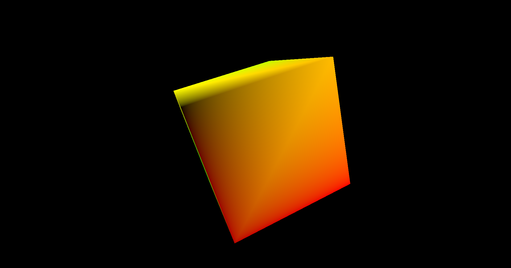

# Chapter 07 - Going 3D

In this chapter we will be rendering a 3D model, a spinning cube. Although our models did already have a z-coordinate, the output attachments we are using only
deal with colors, depth values were not handled at all. We need to define a new attachment to store depth information, a depth image. In addition to that, we
will add support for window resizing. You can find the complete source code for this chapter [here](../../booksamples/chapter-07).

## Depth Image

The first thing we must do is create a depth image. In the case of the swap chain, images were already there, we just used an image view to access them. This case is different, we need to allocate the images by ourselves. In order to handle that task we will create a new struct named `VkImage`. Since image creation parameters can be lengthy, we will create first a struct named `VkImageData`, which will act as build helper class using a fluent style API. All these code
will be located in a new file `src/eng/vk/VkImage.zig`. Remember to  include it in the `mod.zig`: `pub const img = @import("vkImage.zig");`.

```zig
const vk = @import("mod.zig");
const vulkan = @import("vulkan");

pub const VkImageData = struct {
    arrayLayers: u32 = 1,
    format: vulkan.Format = vulkan.Format.r8g8b8a8_srgb,
    height: u32,
    mipLevels: u32 = 1,
    sampleCount: vulkan.SampleCountFlags = vulkan.SampleCountFlags.fromInt(1),
    tiling: vulkan.ImageTiling = vulkan.ImageTiling.optimal,
    usage: vulkan.ImageUsageFlags,
    width: u32,
};
```

The attributes for creating an image are:

- `width` and `height`: The size of the image.
- `format`:  Describes the format of the texel blocks that compose the image.
- `usage`:  Describes the intended usage that this image will have.
- `mipLevels`:  Describes the levels of detail available for this image (more on this in later chapters).
- `sampleCount`:  Specifies the number of texels per sample (more on this in later chapters).
- `arrayLayers`: Specifies the number of layers of an image (more on this in later chapters).
- `tiling`: Specifiy the tiling arrangement of the texel blocks of the image in memory.


The `VkImage` struct starts like this:

```zig
pub const VkImage = struct {
    image: vulkan.Image,
    width: u32,
    height: u32,
    memory: vulkan.DeviceMemory,

    pub fn create(vkCtx: *const vk.ctx.VkCtx, vkImageData: VkImageData) !VkImage {
        const createInfo = vulkan.ImageCreateInfo{
            .image_type = vulkan.ImageType.@"2d",
            .format = vkImageData.format,
            .extent = .{
                .width = vkImageData.width,
                .height = vkImageData.height,
                .depth = 1,
            },
            .mip_levels = vkImageData.mipLevels,
            .array_layers = vkImageData.arrayLayers,
            .samples = vkImageData.sampleCount,
            .usage = vkImageData.usage,
            .sharing_mode = vulkan.SharingMode.exclusive,
            .initial_layout = vulkan.ImageLayout.undefined,
            .tiling = vkImageData.tiling,
        };
        ...
    }
    ...
};
```

It provides a `create` function to instantiate it which first creates a `ImageCreateInfo` structure which attributes are:

- `image_type`:  It specifies the dimensions of the image. In our case we will be using regular 2D dimensions, so we set to the value 
`vulkan.ImageType.@"2d"` (`VK_IMAGE_TYPE_2D`). Three dimensions images `vulkan.ImageType.@"3d"`(`VK_IMAGE_TYPE_3D`) are like a set of slices of 2D textures
and are used for volumetric effects or for scientific or medical visualizations (like MRIs). One dimension textures are define by the value
`vulkan.ImageType.@"1d"` (`VK_IMAGE_TYPE_1D`).
- `format`: Described above, format of the texel blocks that compose the image.
- `extent`:  It is the size of the image. In this case, the structure needs to support 3D images, so it includes the depth. For 2D images we just set it to `1`.
- `mip_levels`:  Already described in the constructor's parameters description.
- `array_layers`:  Images can be an array of layers. This is different than a 3D image. A 3D image contains data that is referred to the three axis. An array of layers are a set of 2D images indexed by a layer number. 
- `samples`: Already described in `VkImageData` (`sampleCount`).
- `usage`: Already described in `VkImageData` .
- `sharing_mode`: It specifies if this resource will be shared by more than a single queue family at a time (`vulkan.SharingMode.concurrent`
equivalent to `VK_SHARING_MODE_CONCURRENT`) or not (`vulkan.SharingMode.exclusive` equivalent to `VK_SHARING_MODE_EXCLUSIVE`).
- `initial_layout`:  This is the initial layout of the image. We just set it to `vulkan.ImageLayout.undefined` (`VK_IMAGE_LAYOUT_UNDEFINED`).
If a transition to another layout is required it will need to be done later on. (This depends on the use case for the image, this is why we do not perform
the transition here).
- `tiling`: It specifies the tiling arrangement of the texel blocks in memory. In our case, we chose to use the optimal value, so that the texels are laid out in the best format for each GPU.

Now we can create the image by invoking the `createImage` Vulkan function:

```zig
pub const VkImage = struct {
    ...
    pub fn create(vkCtx: *const vk.ctx.VkCtx, vkImageData: VkImageData) !VkImage {
        ...
        const image = try vkCtx.vkDevice.deviceProxy.createImage(&createInfo, null);
        ...
    }
    ...
};
```

After that we need to allocate the memory associated to that image. As in the case of buffers, that image is just a handle, we need to manually allocate the memory that will host the contents for the image by ourselves. The first step is to get the memory requirements by calling the `getImageMemoryRequirements` function:

```zig
pub const VkImage = struct {
    ...
    pub fn create(vkCtx: *const vk.ctx.VkCtx, vkImageData: VkImageData) !VkImage {
        ...
        const memReqs = vkCtx.vkDevice.deviceProxy.getImageMemoryRequirements(image);
        ...
    }
    ...
};
```

With that information we can populate the `MemoryAllocateInfo` structure which contains the information to perform the memory allocation.

```zig
pub const VkImage = struct {
    ...
    pub fn create(vkCtx: *const vk.ctx.VkCtx, vkImageData: VkImageData) !VkImage {
        ...
        const allocInfo = vulkan.MemoryAllocateInfo{
            .allocation_size = memReqs.size,
            .memory_type_index = try vkCtx.findMemoryTypeIndex(memReqs.memory_type_bits, vulkan.MemoryPropertyFlags.fromInt(0)),
        };
        ...
    }
    ...
};
```

Again, the code is similar as the one used with the buffers, once we have got the requirements, we set the memory size and select the adequate memory type index (obtained by calling the `findMemoryTypeIndex` from the `VkCtx` structs). After that we can finally allocate the memory and bind it to the image:

```zig
pub const VkImage = struct {
    ...
    pub fn create(vkCtx: *const vk.ctx.VkCtx, vkImageData: VkImageData) !VkImage {
        ...
        const memory = try vkCtx.vkDevice.deviceProxy.allocateMemory(&allocInfo, null);

        try vkCtx.vkDevice.deviceProxy.bindImageMemory(image, memory, 0);

        return .{
            .image = image,
            .width = vkImageData.width,
            .height = vkImageData.height,
            .memory = memory,
        };
        ...
    }
};
```

The rest of the functions of this struct is the `cleanup` one to free resources.

```zig
pub const VkImage = struct {
    ...
    pub fn cleanup(self: *const VkImage, vkCtx: *const vk.ctx.VkCtx) void {
        vkCtx.vkDevice.deviceProxy.destroyImage(self.image, null);
        vkCtx.vkDevice.deviceProxy.freeMemory(self.memory, null);
    }
};
```

## Attachment

In order to use the depth image we will also to setup an `VkImageView`. Both the depth `VkImage` and the associated `VkImageView` will constitute an
attachment, a depth attachment. Since we will handle both objects together, we will create a new class, named `Attachment`, that will handle their creation
and will be handy for next chapters. The definition is quite simple (it is included in the `render.zig` file):

```zig
pub const Attachment = struct {
    vkImage: vk.img.VkImage,
    vkImageView: vk.imv.VkImageView,

    pub fn create(vkCtx: *const vk.ctx.VkCtx, width: u32, height: u32, format: vulkan.Format, usage: vulkan.ImageUsageFlags) !Attachment {
        var currUsage = usage;
        currUsage.sampled_bit = true;
        const vkImageData = vk.img.VkImageData{
            .format = format,
            .width = width,
            .height = height,
            .usage = currUsage,
        };

        const vkImage = try vk.img.VkImage.create(vkCtx, vkImageData);
        var aspectMask: vulkan.ImageAspectFlags = vulkan.ImageAspectFlags{ .color_bit = true };
        if (usage.depth_stencil_attachment_bit) {
            aspectMask.color_bit = false;
            aspectMask.depth_bit = true;
        }
        const imageViewData = vk.imv.VkImageViewData{
            .format = format,
            .aspectmask = aspectMask,
        };
        const vkImageView = try vk.imv.VkImageView.create(vkCtx.vkDevice, vkImage.image, imageViewData);

        return .{
            .vkImage = vkImage,
            .vkImageView = vkImageView,
        };
    }

    pub fn cleanup(self: *Attachment, vkCtx: *const vk.ctx.VkCtx) void {
        self.vkImageView.cleanup(vkCtx.vkDevice);
        self.vkImage.cleanup(vkCtx);
    }
};
```
We just create and image and the associated image view. Depending on the type of image (color or depth image), we setup the aspect mask accordingly.

## Changing vertices structure

In the previous chapter, we defined the structure of our vertices, which basically stated that our vertices were composed by x, y and z positions. Therefore, we would not need anything more to display 3D models. However, displaying a 3D model just using a single color (without shadows or light effects), makes difficult to verify if the model is being loaded property. So, we will add extra components that we will reuse in next chapters, we will add texture coordinates. Although we will not be handling textures in this chapter, we can use those components to pass some color information (at lest for two color channels). We need to modify the `VtxBuffDesc` struct in this way:

```zig
const VtxBuffDesc = struct {
    const binding_description = vulkan.VertexInputBindingDescription{
        .binding = 0,
        .stride = @sizeOf(VtxBuffDesc),
        .input_rate = .vertex,
    };

    const attribute_description = [_]vulkan.VertexInputAttributeDescription{
        .{
            .binding = 0,
            .location = 0,
            .format = .r32g32b32_sfloat,
            .offset = @offsetOf(VtxBuffDesc, "pos"),
        },
        .{
            .binding = 0,
            .location = 1,
            .format = .r32g32_sfloat,
            .offset = @offsetOf(VtxBuffDesc, "textCoords"),
        },
    };

    pos: [3]f32,
    textCoords: [2]f32,
};
```

The number of attributes of each vertex will be now two, one for the position components and another one for the texture coordinates. The attribute
definition itself is quite similar to the one used for the positions, in this case, the size will be for two floats.

## Scene

If we are going to represent 3D scenes, we need to project from the 3D world into a 2D space (the screen). We will need to use a perspective projection matrix
in order to avoid distortions and to represent far away objects smaller than closer ones. We will create a new structs to model world information ina file
named `scene.zig` (located in `src/eng` and that shall be added to `mod.zig`: `pub const scn = @import("scene.zig");`). It will include a new strcut namned 
`ProjData` that which is defined like this:

```zig
const com = @import("com");
const eng = @import("mod.zig");
const std = @import("std");
const zm = @import("zmath");
const log = std.log.scoped(.eng);

pub const ProjData = struct {
    projMatrix: zm.Mat = zm.identity(),
    zoomFactor: f32 = 1.0,
    fov: f32 = 0.0,
    near: f32 = 0.0,
    far: f32 = 0.0,

    pub fn update(self: *ProjData, fov: f32, near: f32, far: f32, width: f32, height: f32) void {
        self.fov = fov;
        self.near = near;
        self.far = far;

        const aspect = width / height;

        const tan_half_fovy = @tan(fov * 0.5);

        const x_scale = 1.0 / (aspect * tan_half_fovy);
        const y_scale = 1.0 / tan_half_fovy;
        const z_scale = far / (near - far);
        const w_scale = (near * far) / (near - far);

        self.projMatrix = zm.Mat{
            zm.f32x4(x_scale, 0.0, 0.0, 0.0),
            zm.f32x4(0.0, y_scale, 0.0, 0.0),
            zm.f32x4(0.0, 0.0, z_scale, -1.0),
            zm.f32x4(0.0, 0.0, w_scale, 0.0),
        };
    }
};
```

We are using the [zmath](https://github.com/zig-gamedev/zmath) so you will need to include it in the `build.zig.zon` file byu executing:
`zig fetch --save git+https://github.com/zig-gamedev/zmath`. In addition, you wil need to include it in the `build.zig` file:

```zig
pub fn build(b: *std.Build) void {
    ...
    // Zmath
    const zmathDep = b.dependency("zmath", .{});
    const zmath = zmathDep.module("root");
    exe.root_module.addImport("zm", zmath);    
    ...
    eng.addImport("zmath", zmath);
    ... 
}
```

We will create a 4x4 matrix `projMatrix` that will be constructed as a projection matrix. It requires the following parameters:
- `fov`: Field of view in radians.
- `near`: Z coordinate of the near plane.
- `near`: Z coordinates of the far plane of.
- `width`: Width of the render area.
- `height`: Height of the render area.


This struct will be included in a `Camera` struct (defined in the same file):

```zig
pub const Camera = struct {
    projData: ProjData,

    pub fn create() Camera {
        const projData = ProjData{};
        return .{ .projData = projData };
    }
};
```

This structure will hold later on the view matrix. The parameters of the perspective matrix can be configured in the `cfg.toml` file, so we need to update
the `Constants` struct:

```zig
pub const Constants = struct {
    fov: f32,
    ...
    zFar: f32,
    zNear: f32,

    pub fn load(allocator: std.mem.Allocator) !Constants {
        ...
        const constants = Constants{
            .fov = tmp.fov * std.math.pi / 180.0,
            .gpu = try allocator.dupe(u8, tmp.gpu),
            .swapChainImages = tmp.swapChainImages,
            .ups = tmp.ups,
            .validation = tmp.validation,
            .vsync = tmp.vsync,
            .zFar = tmp.zFar,
            .zNear = tmp.zNear,
        };
       ...
    }
    ...
};
```

Remember to include the parameters in the `cfg.toml` file:

```toml
fov=60
...
zFar=50.0
zNear=1.0
```

We are going also to introduce a new concept for the engine that will allow to define game entities and use the same `VkModel` to render multiple elements. Instead of directly rendering models, we will have entities which have some properties, such as their scale, position and rotation and will be associated to a model. They can model a player, NPCs or scene objects and will be managed by a struct named `Entity`. It will be included in a the `src/(eng/entity.zig`
(Remember to include it in the `mod.zig` file: `pub const ent = @import("entity.zig");`) and it is defined like this:

```zig
const eng = @import("mod.zig");
const std = @import("std");
const zm = @import("zmath");

pub const Entity = struct {
    id: []const u8,
    modelId: []const u8,
    pos: zm.F32x4,
    modelMatrix: zm.Mat,
    rotation: zm.Quat,
    scale: f32,

    pub fn create(allocator: std.mem.Allocator, id: []const u8, modelId: []const u8) !*Entity {
        const ownedId = try allocator.dupe(u8, id);
        var entity = try allocator.create(Entity);
        entity.id = ownedId;
        entity.modelId = try allocator.dupe(u8, modelId);
        entity.pos = zm.f32x4(0, 0, 0, 1);
        entity.modelMatrix = zm.identity();
        entity.rotation = zm.f32x4(0, 0, 0, 1);
        entity.scale = 1.0;

        entity.update();
        return entity;
    }

    pub fn cleanup(self: *Entity, allocator: std.mem.Allocator) void {
        allocator.free(self.id);
        allocator.free(self.modelId);
        allocator.destroy(self);
    }

    pub fn setPos(self: *Entity, x: f32, y: f32, z: f32) void {
        self.pos[0] = x;
        self.pos[1] = y;
        self.pos[2] = z;
    }

    pub fn update(self: *Entity) void {
        const translation = zm.translation(self.pos[0], self.pos[1], self.pos[2]);
        const scaling = zm.scaling(self.scale, self.scale, self.scale);
        const rotation = zm.quatToMat(self.rotation);
        self.modelMatrix = zm.mul(zm.mul(scaling, rotation), translation);
    }
};
```

Each `Entity` shall have an identifier which should be unique. It is also linked to the model that will be used to render it through the `modelId` attribute. An `Entity` will have also a position, a rotation (modeled using a quaternion) and a scale. With all that information we are able to construct a model matrix by calling the `update`. The `update` should be called, each time the position, rotation or scale changes.

Now we can setup the required infrastructure to put the `ProjData` and `Entity` structs into work. We will add this to a new struct named `Scene`
(defined inside the `scene.zig` file):

```zig
pub const Scene = struct {
    camera: Camera,
    entitiesMap: std.StringHashMap(*eng.ent.Entity),

    pub fn addEntity(self: *Scene, entity: *eng.ent.Entity) !void {
        try self.entitiesMap.put(entity.id, entity);
    }

    pub fn create(allocator: std.mem.Allocator) !Scene {
        const camera = Camera.create();
        const entitiesMap = std.StringHashMap(*eng.ent.Entity).init(allocator);

        return .{
            .camera = camera,
            .entitiesMap = entitiesMap,
        };
    }

    pub fn cleanup(self: *Scene, allocator: std.mem.Allocator) void {
        var iter = self.entitiesMap.valueIterator();
        while (iter.next()) |entityRef| {
            const entity = entityRef.*;
            entity.cleanup(allocator);
        }
        self.entitiesMap.deinit();
    }
};
```

The `create` function creates an instance of the `Camera` and a `StringHashMap` that will store entity references indexed by its identifier. The other
functions will be used to add entities and the `cleanup` one.

## Enable depth testing

We need also to modify the pipeline to actually use the depth image for depth testing. Since we may have pipelines that do not use depth testing at all, we will indicate if it's required in the `VkPipelineCreateInfo` struct:

```zig
pub const VkPipelineCreateInfo = struct {
    ...
    depthFormat: vulkan.Format = vulkan.Format.undefined,
    ...
    pushConstants: ?[]const vulkan.PushConstantRange,
    ...
};
```

You may see also that there's another attribute, named `pushConstants`. We will explain its usage later on. Now, in the `VkPipeline` `construct` function
constructor we need to enable the depth stencil state if the `depthFormat` attribute from the `VkPipelineCreateInfo` struct is not equal to
`vulkan.Format.undefined` (`VK_FORMAT_UNDEFINED`=.

```zig
pub const VkPipeline = struct {
    ...
    pub fn create(allocator: std.mem.Allocator, vkCtx: *const vk.ctx.VkCtx, createInfo: *const VkPipelineCreateInfo) !VkPipeline {
        ...
        const renderCreateInfo = vulkan.PipelineRenderingCreateInfo{
            .color_attachment_count = 1,
            .p_color_attachment_formats = &formats,
            .view_mask = 0,
            .depth_attachment_format = createInfo.depthFormat,
            .stencil_attachment_format = vulkan.Format.undefined,
        };
        ...    
        const depthState = vulkan.PipelineDepthStencilStateCreateInfo{
            .flags = .{},
            .depth_test_enable = vulkan.Bool32.true,
            .depth_write_enable = vulkan.Bool32.true,
            .depth_compare_op = .less_or_equal,
            .depth_bounds_test_enable = vulkan.Bool32.false,
            .front = .{
                .fail_op = .keep,
                .pass_op = .keep,
                .depth_fail_op = .keep,
                .compare_op = .never,
                .compare_mask = 0,
                .write_mask = 0,
                .reference = 0,
            },
            .back = .{
                .fail_op = .keep,
                .pass_op = .keep,
                .depth_fail_op = .keep,
                .compare_op = .never,
                .compare_mask = 0,
                .write_mask = 0,
                .reference = 0,
            },
            .stencil_test_enable = vulkan.Bool32.false,
            .min_depth_bounds = 0.0,
            .max_depth_bounds = 0.0,
        };
        ...
    }
    ...
};
```

We need to instantiate a `VkPipelineCreateInfo` structure which has the following attributes:

- `depth_test_enable`: It controls if depth testing is enabled or not (when rendering it is used to discard fragments which are behind already rendered fragments, values which do not fulfill the test operation will be discarded). This is what we need, so we set it  to `true`. 
- `depth_write_enable`: This controls if depth writing to the depth attachment is enabled or not. You could enable depth testing but do not want to write depth values, for example if the depth image used as a depth attachment has already been created by another task. This is not our case, we want the depth image to be written while rendering, so we set it to `true`.
- `depth_compare_op`: It defines the operator used for the depth test. In our case, we use the `less_or_equal` (`VK_COMPARE_OP_LESS_OR_EQUAL`), which
means that only depth values that are less or equal than the existing value will pass the test. 
- `depth_bounds_test_enable`: This controls if depth values are also tested against a minimum and a maximum bound. This is used to avoid rendering far away objects, that may not be hidden by nearest objects but that it is useless to render.  We are not using this now, so we set it to `false`.
- `stencil_test_enable`: This enables stencil test. Since we are not using stencils at this moment, we set it to false.

This structure will be used later on while creating the pipeline:

```zig
pub const VkPipeline = struct {
    ...
    pub fn create(allocator: std.mem.Allocator, vkCtx: *const vk.ctx.VkCtx, createInfo: *const VkPipelineCreateInfo) !VkPipeline {
        ...
        const gpci = vulkan.GraphicsPipelineCreateInfo{
            .flags = .{},
            .stage_count = @intCast(createInfo.modulesInfo.len),
            .p_stages = pssci.ptr,
            .p_vertex_input_state = &pvisci,
            .p_input_assembly_state = &piasci,
            .p_tessellation_state = null,
            .p_viewport_state = &pvsci,
            .p_rasterization_state = &prsci,
            .p_multisample_state = &pmsci,
            .p_depth_stencil_state = if (createInfo.depthFormat != vulkan.Format.undefined) &depthState else null,
            .p_color_blend_state = &pcbsci,
            .p_dynamic_state = &pdsci,
            .layout = pipelineLayout,
            .subpass = 0,
            .base_pipeline_handle = .null_handle,
            .base_pipeline_index = -1,
            .p_next = @constCast(&renderCreateInfo),
        };
        ....
    }
    ...
};
```

## Passing data to the shaders

We have already talked about defining a projection matrix and creating the model matrices, but we have not addressed how to pass that data to the shaders. In OpenGL this is usually done using uniform buffers, but in Vulkan we have other options also. Vulkan defines several ways to pass this varying data to the shaders, including uniforms. However, using uniforms requires the definition of new concepts such as descriptor pools and descriptor sets, which require careful explanation. Nevertheless, Vulkan introduces a new way to pass data to the buffers which can be used for small sets of data and which is quite easy to set up. These are the so called push constants.

Push constants are small sets of data that can be set while recording command buffers. They do not require to create an underlying buffer nor they require the descriptors used in uniforms. They are a simple mechanism to push data to the shaders in a supposed fast way. How fast they are depends on the hardware. The mechanisms used by the GPU to handle this data are opaque to us, so different vendors choose different strategies which at end affects the performance. The maximum amount of data that we can push is very limited: 128 bytes. This is the minimum required by the specification, some GPUs extend that limit, but, in our case, we will work using that limit.

As it has been said before, push constants are intended to pass small amount of data that can change very frequently. As you can see, 128 bytes is quite small, but we can store there the model matrices for each entity (64 bytes). This will be the regular use case for push constants here. But, we also need to pass the projection matrix (another 64 bytes). In later chapters we will pass that information through uniforms. However, since we have not coded yet the mechanisms required to support uniforms, we will use the available space of push constants to pass also this information. Keep in mind that this is a temporary solution, we will change that in next chapters.

We already modified the `VkPipelineCreateInfo` struct to include push constants (by adding the `pushConstants` attribute). We now need to use this
information the `VkPipeline` struct:

```zig
pub const VkPipeline = struct {
    ...
    pub fn create(allocator: std.mem.Allocator, vkCtx: *const vk.ctx.VkCtx, createInfo: *const VkPipelineCreateInfo) !VkPipeline {
        ...
        const pipelineLayout = try vkCtx.vkDevice.deviceProxy.createPipelineLayout(&.{
            .flags = .{},
            .set_layout_count = 0,
            .p_set_layouts = null,
            .push_constant_range_count = if (createInfo.pushConstants) |pc| @as(u32, @intCast(pc.len)) else 0,
            .p_push_constant_ranges = if (createInfo.pushConstants) |pcs| pcs.ptr else null,
        }, null);
        ...
    }
    ...
};
```

## Putting it all up together

We have coded all the elements required to support the proper rendering of 3D models and pass transformation matrices to the shaders. We now can use them and
also support another missing feature: resizing support. Let's start with the changes required in the `Render` struct. We will calculate the projection
matrix in the `init` function. We will also add support for window resizing. When a window is resized, we need to update the projection matrix and
to recreate some Vulkan structures.

```zig
pub const Render = struct {
    ...
    mustResize: bool,

    pub fn create(allocator: std.mem.Allocator, constants: com.common.Constants, window: sdl3.video.Window) !Render {
        ...
        return .{
            ...
            .mustResize = false,
            ...
        };
    }

    pub fn init(self: *Render, allocator: std.mem.Allocator, engCtx: *eng.engine.EngCtx, initData: *const eng.engine.InitData) !void {
        const constants = engCtx.constants;
        const extent = self.vkCtx.vkSwapChain.extent;
        engCtx.scene.camera.projData.update(
            constants.fov,
            constants.zNear,
            constants.zFar,
            @as(f32, @floatFromInt(extent.width)),
            @as(f32, @floatFromInt(extent.height)),
        );
        try self.modelsCache.init(allocator, &self.vkCtx, &self.cmdPools[0], self.queueGraphics, initData);
    }
    
    pub fn render(self: *Render, engCtx: *eng.engine.EngCtx) !void {
        ...
        const res = try self.vkCtx.vkSwapChain.acquire(self.vkCtx.vkDevice, self.semsPresComplete[self.currentFrame]);
        if (engCtx.wnd.resized or self.mustResize or res == .recreate) {
            try vkCmdBuff.end(&self.vkCtx);
            try self.resize(engCtx);
            return;
        }
        ...
        try self.renderScn.render(&self.vkCtx, engCtx, vkCmdBuff, &self.modelsCache, imageIndex);
        ...
        self.mustResize = !self.vkCtx.vkSwapChain.present(self.vkCtx.vkDevice, self.queuePresent, self.semsRenderComplete[imageIndex], imageIndex);
        ...
    }
    ...
    fn resize(self: *Render, engCtx: *eng.engine.EngCtx) !void {
        const allocator = engCtx.allocator;
        const size = try engCtx.wnd.getSize();
        if (size.width == 0 and size.height == 0) {
            return;
        }
        self.mustResize = false;
        try self.vkCtx.vkDevice.wait();
        try self.vkCtx.resize(allocator, engCtx.wnd.window);

        for (self.semsRenderComplete) |sem| {
            sem.cleanup(&self.vkCtx);
        }
        allocator.free(self.semsRenderComplete);

        for (self.semsPresComplete) |sem| {
            sem.cleanup(&self.vkCtx);
        }
        allocator.free(self.semsPresComplete);

        const semsRenderComplete = try allocator.alloc(vk.sync.VkSemaphore, self.vkCtx.vkSwapChain.imageViews.len);
        for (semsRenderComplete) |*sem| {
            sem.* = try vk.sync.VkSemaphore.create(&self.vkCtx);
        }

        const semsPresComplete = try allocator.alloc(vk.sync.VkSemaphore, com.common.FRAMES_IN_FLIGHT);
        for (semsPresComplete) |*sem| {
            sem.* = try vk.sync.VkSemaphore.create(&self.vkCtx);
        }

        self.semsPresComplete = semsPresComplete;
        self.semsRenderComplete = semsRenderComplete;

        const constants = engCtx.constants;
        const extent = self.vkCtx.vkSwapChain.extent;
        engCtx.scene.camera.projData.update(
            constants.fov,
            constants.zNear,
            constants.zFar,
            @as(f32, @floatFromInt(extent.width)),
            @as(f32, @floatFromInt(extent.height)),
        );

        try self.renderScn.resize(&self.vkCtx, engCtx);
    }
    ...
};
```

In the `render` function, we check if the `mustResize` flag has been set to true or ig yhe image acquisition gails. If this happens, this will mean that we
need to handle window resizing and call the `resize` function. You may notice also that the `RenderScn` struct now receives an instance of `EngCtx` also.

The new `resize` function first checks if the window size is equal to zero. This will mean that the window is minimized and makes no sense
in continuing. After that, it resets the `mustResize` flag and  waits for the device to be idle, calls resize over `VkCtx` instance
and clean ups the synchronization semaphores and creates new ones. It also updates the projection matrix and calls the `resize` method over `RenderScn` struct.

Let's view the changes in the `VkCtx` class:

```zig
pub const VkCtx = struct {
    ...
    pub fn resize(self: *VkCtx, allocator: std.mem.Allocator, window: sdl3.video.Window) !void {
        const numImages = @as(u8, @intCast(self.vkSwapChain.imageViews.len));
        const vsync = self.vkSwapChain.vsync;
        self.vkSwapChain.cleanup(allocator, self.vkDevice);
        self.vkSurface.cleanup(self.vkInstance);
        const vkSurface = try vk.surf.VkSurface.create(window, self.vkInstance);
        const vkSwapChain = try vk.swap.VkSwapChain.create(
            allocator,
            window,
            self.vkInstance,
            self.vkPhysDevice,
            self.vkDevice,
            vkSurface,
            numImages,
            vsync,
        );
        self.vkSurface = vkSurface;
        self.vkSwapChain = vkSwapChain;
    }
}   
```

When resizing just we clean up the swap chain and surface and recreate them again.

Let's review the changes in the `RenderScn` struct:

```zig
...
const zm = @import("zmath");
...
const PushConstantsVtx = struct {
    modelMatrix: zm.Mat,
    projMatrix: zm.Mat,
};

const DEPTH_FORMAT = vulkan.Format.d16_unorm;

pub const RenderScn = struct {
    depthAttachments: []eng.rend.Attachment,
    vkPipeline: vk.pipe.VkPipeline,

    pub fn create(allocator: std.mem.Allocator, vkCtx: *const vk.ctx.VkCtx) !RenderScn {
        const depthAttachments = try createDepthAttachments(allocator, vkCtx);
        ...
    }
    ...
};
```

We need to create a ne attribute named `depthAttachments` which will hold the attachments that will contain depth data (image view and image). We will need
as many attachments as swap chain images.

We have defined also a new struct to store push constants information: `PushConstantsVtx` which will have an attribute for the model matrix associated
to an entity (`modelMatrix`) and the projection matrix (`projMatrix`).

In some other tutorials, you will see that they use a single image and image view for the depth data. The argument used to justify this is, in some cases, that
since the depth images are only used internally, while rendering, there's no need to use separate resources. This argument is not correct, render operations in
different frames may overlap, so we need to use separate resources or use the proper synchronization mechanisms to prevent that. Probably, the samples used in those tutorial work, because they have a different synchronizations schema that prevent this form happening, but the argument to justify that is not correct.
There's an excellent analysis of this in this [Stack overflow](https://stackoverflow.com/questions/62371266/why-is-a-single-depth-buffer-sufficient-for-this-vulkan-swapchain-render-loop) question.


The `depthAttachments` attribute is initialized by using some new utility methods. Let's review it.

```zig
pub const RenderScn = struct {
    ...
    fn createDepthAttachments(allocator: std.mem.Allocator, vkCtx: *const vk.ctx.VkCtx) ![]eng.rend.Attachment {
        const numImages = vkCtx.vkSwapChain.imageViews.len;
        const extent = vkCtx.vkSwapChain.extent;
        const depthAttachments = try allocator.alloc(eng.rend.Attachment, numImages);
        const flags = vulkan.ImageUsageFlags{
            .depth_stencil_attachment_bit = true,
        };
        for (depthAttachments) |*attachment| {
            attachment.* = try eng.rend.Attachment.create(
                vkCtx,
                extent.width,
                extent.height,
                DEPTH_FORMAT,
                flags,
            );
        }
        return depthAttachments;
    }
    ...
};
```

We create as many depth attachments (as many images and image views) as images are in the swap chain. We use the format `vulkan.Format.d16_unorm`
(`VK_FORMAT_D16_UNORM`) for the depth values (16-bit unsigned normalized format that has a single 16-bit depth component).

The `create` function needs also to be updated to set the push constants range:

```zig
pub const RenderScn = struct {
    ...
    pub fn create(allocator: std.mem.Allocator, vkCtx: *const vk.ctx.VkCtx) !RenderScn {
        ...
        // Push constants
        const pushConstants = [_]vulkan.PushConstantRange{.{
            .stage_flags = vulkan.ShaderStageFlags{ .vertex_bit = true },
            .offset = 0,
            .size = @sizeOf(PushConstantsVtx),
        }};

        // Pipeline
        const vkPipelineCreateInfo = vk.pipe.VkPipelineCreateInfo{
            .colorFormat = vkCtx.vkSwapChain.surfaceFormat.format,
            .depthFormat = DEPTH_FORMAT,
            .modulesInfo = modulesInfo,
            .pushConstants = pushConstants[0..],
            .useBlend = false,
            .vtxBuffDesc = .{
                .attribute_description = @constCast(&VtxBuffDesc.attribute_description)[0..],
                .binding_description = VtxBuffDesc.binding_description,
            },
        };
        const vkPipeline = try vk.pipe.VkPipeline.create(allocator, vkCtx, &vkPipelineCreateInfo);

        return .{
            .depthAttachments = depthAttachments,
            .vkPipeline = vkPipeline,
        };
    }
    ...
};
```

In the push constants ranges, we are saying that we will be using push constants in the vertex shader (`vertex_bit` which is equivalent to
`VK_SHADER_STAGE_VERTEX_BIT`), that the range will start at offset `0` in the buffer, and it will have the size of `PushConstantsVtx` struct (two 4x4
matrices).

The `cleanup` function needs also to be modified to free the new resources:

```zig
pub const RenderScn = struct {
    ...
    pub fn cleanup(self: *RenderScn, allocator: std.mem.Allocator, vkCtx: *const vk.ctx.VkCtx) void {
        self.vkPipeline.cleanup(vkCtx);
        for (self.depthAttachments) |*depthAttachment| {
            depthAttachment.cleanup(vkCtx);
        }
        allocator.free(self.depthAttachments);
    }
    ...
};
```

We need to take into consideration depth attachments in the `render` function:

```zig
pub const RenderScn = struct {
    ...
    pub fn render(
        self: *RenderScn,
        vkCtx: *const vk.ctx.VkCtx,
        engCtx: *const eng.engine.EngCtx,
        vkCmd: vk.cmd.VkCmdBuff,
        modelsCache: *const eng.mcach.ModelsCache,
        imageIndex: u32,
    ) !void {
        ...
        const depthAttInfo = vulkan.RenderingAttachmentInfo{
            .image_view = self.depthAttachments[imageIndex].vkImageView.view,
            .image_layout = vulkan.ImageLayout.depth_stencil_attachment_optimal,
            .load_op = vulkan.AttachmentLoadOp.clear,
            .store_op = vulkan.AttachmentStoreOp.dont_care,
            .clear_value = vulkan.ClearValue{ .depth_stencil = .{ .depth = 1.0, .stencil = 0.0 } },
            .resolve_mode = vulkan.ResolveModeFlags{},
            .resolve_image_layout = vulkan.ImageLayout.undefined,
        };
        ...
        const renderInfo = vulkan.RenderingInfo{
            .render_area = .{ .extent = extent, .offset = .{ .x = 0, .y = 0 } },
            .layer_count = 1,
            .color_attachment_count = 1,
            .p_color_attachments = @ptrCast(&renderAttInfo),
            .p_depth_attachment = &self.depthAttachmentInfos[imageIndex],
            .view_mask = 0,
        };        
        ...
    }
    ...
};
```

We nee dto create a new `RenderingAttachmentInfo` for the depth attachment. In this case we need to setup the layout to
`vulkan.ImageLayout.depth_stencil_attachment_optimal` (`VK_IMAGE_LAYOUT_DEPTH_STENCIL_ATTACHMENT_OPTIMAL`)
to state that is for depth values. In this case the store operation can be `vulkan.AttachmentStoreOp.dont_care` (`VK_ATTACHMENT_STORE_OP_DONT_CARE`)
instead of `vulkan.AttachmentStoreOp.store` (`VK_ATTACHMENT_STORE_OP_STORE`) because we do not need to store the results, we just
need a depth attachment to perform depth tests. We do not need to access those results later on.

We need also to modify the render function first to to take into consideration the depth attachments in the render information, by setting the
`p_depth_attachment` attribute in the `RenderingInfo` structure.


After that, we need first to add a new image layout transition, prior to the render to begin,  using a memory barrier for the depth image. It is quite
similar to the one used for swap chain images, but the stages to consider are now: `early_fragment_tests_bit`
(`VK_PIPELINE_STAGE_2_EARLY_FRAGMENT_TESTS_BIT`) and `late_fragment_tests_bit` (`VK_PIPELINE_STAGE_2_LATE_FRAGMENT_TESTS_BIT`) and the access flags shall
be specifically set for depth attachments: `depth_stencil_attachment_read_bit` (`VK_ACCESS_2_DEPTH_STENCIL_ATTACHMENT_READ_BIT`) and `depth_stencil_attachment_write_bit` (`VK_ACCESS_2_DEPTH_STENCIL_ATTACHMENT_WRITE_BIT`).

```zig
pub const RenderScn = struct {
    ...
    pub fn render(
        self: *RenderScn,
        vkCtx: *const vk.ctx.VkCtx,
        engCtx: *const eng.engine.EngCtx,
        vkCmd: vk.cmd.VkCmdBuff,
        modelsCache: *const eng.mcach.ModelsCache,
        imageIndex: u32,
    ) !void {
        ...    
        const initBarriers = [_]vulkan.ImageMemoryBarrier2{.{
            .old_layout = vulkan.ImageLayout.undefined,
            .new_layout = vulkan.ImageLayout.depth_attachment_optimal,
            .src_stage_mask = .{ .early_fragment_tests_bit = true, .late_fragment_tests_bit = true },
            .dst_stage_mask = .{ .early_fragment_tests_bit = true, .late_fragment_tests_bit = true },
            .src_access_mask = .{
                .depth_stencil_attachment_write_bit = true,
            },
            .dst_access_mask = .{
                .depth_stencil_attachment_read_bit = true,
                .depth_stencil_attachment_write_bit = true,
            },
            .src_queue_family_index = vulkan.QUEUE_FAMILY_IGNORED,
            .dst_queue_family_index = vulkan.QUEUE_FAMILY_IGNORED,
            .subresource_range = .{
                .aspect_mask = .{ .depth_bit = true },
                .base_mip_level = 0,
                .level_count = vulkan.REMAINING_MIP_LEVELS,
                .base_array_layer = 0,
                .layer_count = vulkan.REMAINING_ARRAY_LAYERS,
            },
            .image = self.depthAttachments[imageIndex].vkImage.image,
        }};
        const initDepInfo = vulkan.DependencyInfo{
            .image_memory_barrier_count = initBarriers.len,
            .p_image_memory_barriers = &initBarriers,
        };
        vkCtx.vkDevice.deviceProxy.cmdPipelineBarrier2(cmdHandle, &initDepInfo);
        ....
    }
    ...
};
```

Instead of looping through the models, we iterate over the entities, and getting the associated model through the `ModelsCache`
instance. For each of the entities, we set, as push constants the model matrix associated to the entity and the projection matrix.
It is not very efficient to update the projection matrix for each entity, but we will change this later on. The drawing commands
are exactly the same, for each entity, though its model, we iterate over their meshes in order to render them.

```zig
pub const RenderScn = struct {
    ...
    pub fn render(
        self: *RenderScn,
        vkCtx: *const vk.ctx.VkCtx,
        engCtx: *const eng.engine.EngCtx,
        vkCmd: vk.cmd.VkCmdBuff,
        modelsCache: *const eng.mcach.ModelsCache,
        imageIndex: u32,
    ) !void {
        ...    
        var iter = engCtx.scene.entitiesMap.valueIterator();

        while (iter.next()) |entityRef| {
            const entity = entityRef.*;
            self.setPushConstants(vkCtx, cmdHandle, entity, engCtx);
            const vulkanModel = modelsCache.modelsMap.get(entity.modelId);
            if (vulkanModel) |*vm| {
                for (vm.meshes.items) |mesh| {
                    device.cmdBindIndexBuffer(cmdHandle, mesh.buffIdx.buffer, 0, vulkan.IndexType.uint32);
                    device.cmdBindVertexBuffers(cmdHandle, 0, 1, @ptrCast(&mesh.buffVtx.buffer), &offset);
                    device.cmdDrawIndexed(cmdHandle, @as(u32, @intCast(mesh.numIndices)), 1, 0, 0, 0);
                }
            } else {
                std.log.warn("Could not find model {s}", .{entity.modelId});
            }
        }

        device.cmdEndRendering(cmdHandle);
    }
    ...
};
```

You may have notices that we do not add another image barrier for the depth attachment once we have finished drawing the meshes.
This is because we do not need to present that. Depth attachments will be used to perform depth comparisons and discard
fragments that are not visible. Therefore, we do not need to perform any layout transition to presentation mode.

Let's examine the `setPushConstants` function:

```zig
pub const RenderScn = struct {
    ...
    fn setPushConstants(self: *RenderScn, vkCtx: *const vk.ctx.VkCtx, cmdHandle: vulkan.CommandBuffer, entity: *eng.ent.Entity, engCtx: *const eng.engine.EngCtx) void {
        const pushConstantsVtx = PushConstantsVtx{
            .modelMatrix = entity.modelMatrix,
            .projMatrix = engCtx.scene.camera.projData.projMatrix,
        };
        vkCtx.vkDevice.deviceProxy.cmdPushConstants(
            cmdHandle,
            self.vkPipeline.pipelineLayout,
            vulkan.ShaderStageFlags{ .vertex_bit = true },
            0,
            @sizeOf(PushConstantsVtx),
            &pushConstantsVtx,
        );
    }
    ...
};
```

The function receives the entity and egine context and uses the projection and model matrices copying the data contained in those matrices into the `PushConstantsVtx` struct. Then we call the `cmdPushConstants` function to update the values of the push constants. The `vulkan.ShaderStageFlags`
is a combination of flags that states the shader stages that will access this range of push constants. We will use this in the vertex buffer so we pass
the `vertex_bit` (`VK_SHADER_STAGE_VERTEX_BIT`) flag.

Finally, in the `resize` method, we just clean render info attributes and recreate them again due to the change in size
of the underlying images.

```zig
pub const RenderScn = struct {
    ...
    pub fn resize(self: *RenderScn, vkCtx: *const vk.ctx.VkCtx, engCtx: *const eng.engine.EngCtx) !void {
        const allocator = engCtx.allocator;

        for (self.depthAttachments) |*depthAttachment| {
            depthAttachment.cleanup(vkCtx);
        }
        allocator.free(self.depthAttachments);

        const depthAttachments = try createDepthAttachments(allocator, vkCtx);

        self.depthAttachments = depthAttachments;
    }
    ...
}
```

The next step missing now is to modify the `init` method in or `Game` struct:

```zig
const zm = @import("zm");

const log = std.log.scoped(.main);
...
const Game = struct {
    const ENTITY_ID: []const u8 = "CubeModel";

    angle: f32 = 0,
    ...    
    pub fn init(self: *Game, engCtx: *eng.engine.EngCtx, arenaAlloc: std.mem.Allocator) !eng.engine.InitData {
        _ = self;

        const cubeModel = eng.mdata.ModelData{
            .id = "CubeModel",
            .meshes = &[_]eng.mdata.MeshData{
                .{
                    .id = "CubeMesh",
                    .vertices = &[_]f32{
                        -0.5, 0.5,  0.5,  0.0, 0.0,
                        -0.5, -0.5, 0.5,  0.5, 0.0,
                        0.5,  -0.5, 0.5,  1.0, 0.0,
                        0.5,  0.5,  0.5,  1.0, 0.5,
                        -0.5, 0.5,  -0.5, 1.0, 1.0,
                        0.5,  0.5,  -0.5, 0.5, 1.0,
                        -0.5, -0.5, -0.5, 0.0, 1.0,
                        0.5,  -0.5, -0.5, 0.0, 0.5,
                    },
                    .indices = &[_]u32{
                        // Front face
                        0, 1, 3, 3, 1, 2,
                        // Top Face
                        4, 0, 3, 5, 4, 3,
                        // Right face
                        3, 2, 7, 5, 3, 7,
                        // Left face
                        6, 1, 0, 6, 0, 4,
                        // Bottom face
                        2, 1, 6, 2, 6, 7,
                        // Back face
                        7, 6, 4, 7, 4, 5,
                    },
                },
            },
        };
        const models = try arenaAlloc.alloc(eng.mdata.ModelData, 1);
        models[0] = cubeModel;

        const cubeEntity = try eng.ent.Entity.create(engCtx.allocator, ENTITY_ID, "CubeModel");
        cubeEntity.setPos(0.0, 0.0, -2.0);
        cubeEntity.update();
        try engCtx.scene.addEntity(cubeEntity);

        return .{ .models = models };
    }
    ...
};
```

We are defining the coordinates of a cube, and setting some random texture coordinates to see some changes in the color. After that, we need to create also a new `Entity` instance in order to render the cube. We want the cube to spin, so we use the `update` method, that will be invoked periodically to update that angle:

```zig
const Game = struct {
    ...
    pub fn update(self: *Game, engCtx: *eng.engine.EngCtx, deltaSec: f32) void {
        _ = deltaSec;
        self.angle += 1.0;
        if (self.angle >= 360) {
            self.angle = 0;
        }
        const cubeEntityRef = engCtx.scene.entitiesMap.get(ENTITY_ID);
        if (cubeEntityRef == null) {
            log.debug("Could not find entity [{s}]", .{ENTITY_ID});
            return;
        }
        const cubeEntity = cubeEntityRef.?;
        const angleRad: f32 = std.math.degreesToRadians(self.angle);
        cubeEntity.rotation = zm.quatFromAxisAngle(zm.f32x4(1.0, 1.0, 1.0, 0.0), angleRad);
        cubeEntity.update();
    }
}
```

The final step is to modify the shaders. The vertex shader will now use the push constants, which is composed by two matrices and use them to transform the entity position from model coordinates system to word coordinate systems (by multiplying by the model matrix) and from world coordinates to normalized screen coordinates by multiplying by the projection matrix. We also pass the texture coordinates to the fragment shader.

```glsl
#version 450

layout(location = 0) in vec3 inPos;
layout(location = 1) in vec2 intTextCoords;

layout(location = 0) out vec2 outTextCoords;

layout(push_constant) uniform matrices {
    mat4 modelMatrix;
    mat4 projectionMatrix;
} push_constants;

void main()
{
    gl_Position = push_constants.projectionMatrix * push_constants.modelMatrix * vec4(inPos, 1);
    outTextCoords = intTextCoords;
}
```

In the fragment shader, we just use the texture coordinates for the R and G channels.

```glsl
#version 450

layout(location = 0) in vec2 inTextCoords;
layout(location = 0) out vec4 outFragColor;

void main()
{
    outFragColor = vec4(inTextCoords.x, inTextCoords.y, 0, 1);
}
```

We will also to update the `EngCtx` and `Engine` structs to use the new `Scene` struct:

```zig
pub const EngCtx = struct {
    ...
    scene: eng.scn.Scene,    
    ...
    pub fn cleanup(self: *EngCtx) !void {
        ...
        self.scene.cleanup(self.allocator);
    }
};

pub fn Engine(comptime GameLogic: type) type {
    ...
        pub fn create(allocator: std.mem.Allocator, gameLogic: *GameLogic, wndTitle: [:0]const u8) !Engine(GameLogic) {
            const engCtx = EngCtx{
                .allocator = allocator,
                .constants = try com.common.Constants.load(allocator),
                .scene = try eng.scn.Scene.create(allocator),
                .wnd = try eng.wnd.Wnd.create(wndTitle),
            };
            ...
        }    

        fn init(self: *Engine(GameLogic), allocator: std.mem.Allocator) !void {
            ...

            try self.render.init(allocator, &self.engCtx, &initData);
        }      
    ...
};
```

With all those changes we can now see a nice spinning cube in a window that can be resized.



[Next chapter](../chapter-08/chapter-08.md)