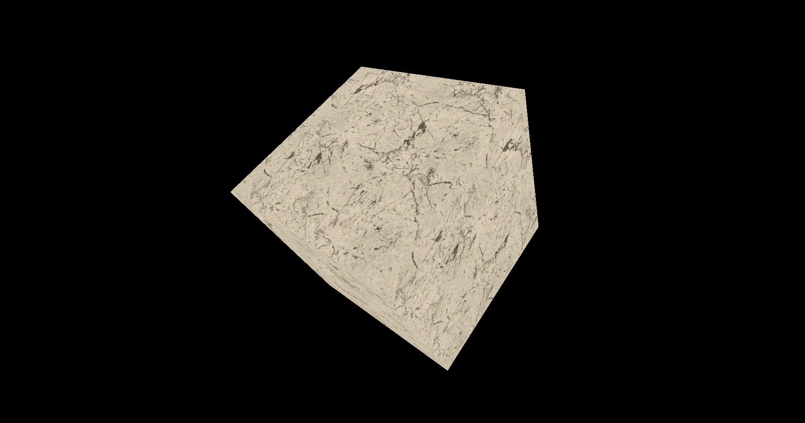

# Chapter 08 - Complex models and textures

In this chapter we will add support for loading complex 3D models which may include textures.

You can find the complete source code for this chapter [here](../../booksamples/chapter-08).

## ZMesh and zstbi

In order to load complex mopdels from disk we will use the [ZMesh](https://github.com/zig-gamedev/zmesh) library. Therefore, you will need
to add the dependency to the `build.zig.zon` using `zig fetch git+https://github.com/zig-gamedev/zmesh`.

We will create a new executable to process 3D models ([GLTF](https://github.com/KhronosGroup/glTF) models in our case). This executable will
process a 3D model and will generate the required files to load de model data into Vulkan. Therefore, in the `build.zig` file we will add
the following code at the end:

```zig
pub fn build(b: *std.Build) void {
    ...
    const modelGen = b.addExecutable(.{
        .name = "model-gen",
        .root_module = b.createModule(.{
            .root_source_file = b.path("src/eng/modelGen.zig"),
            .target = target,
            .optimize = optimize,
        }),
    });
    const zmesh = b.dependency("zmesh", .{});
    modelGen.root_module.addImport("zmesh", zmesh.module("root"));
    modelGen.linkLibrary(zmesh.artifact("zmesh"));
    b.installArtifact(modelGen);
}
```

The code for that executable will be located in the `src/eng/modelGen.zig` file.

Since we will also need to load textures, we will use the [Zstbi](https://github.com/zig-gamedev/zstbi) library. Therefore, you will need to
add the dependency to the `build-.zig.zon` using `zig fetch --save git+https://github.com/zig-gamedev/zstbi`.

In the `build.zig` file we need to define the zstbi dependency and add it to the `eng` module:

```zig
pub fn build(b: *std.Build) void {
    ...
    // zstbi
    const zstbiDep = b.dependency("zstbi", .{});
    const zstbi = zstbiDep.module("root");
    ...
    eng.addImport("zstbi", zstbi);
    ...
}
```

In order to load complex 3D models, we will develop a pre-processing stage to transform models using zmesh into an intermediate format which
will be ready to be loaded into the GPU. We will create a new struct that loads these models, process them using zmesh and ump the results
to a JSON file. It is a little bit overkill for a tutorial like this, but it will prevent you to process models again and again and will
simplify the loading process at the end. The `main` function defined in the `modelGen.zgi` file starts like this (you can skip this part if
you are not interested in preprocessing the models):

```zig
pub fn main() !void {
    var gpa = std.heap.GeneralPurposeAllocator(.{}){};
    var arena = std.heap.ArenaAllocator.init(gpa.allocator());
    const allocator = arena.allocator();
    defer arena.deinit();

    const args = try std.process.argsAlloc(allocator);
    defer std.process.argsFree(allocator, args);

    if (args.len < 3 or !std.mem.eql(u8, args[1], "-m")) {
        printHelp();
        return;
    }
    ...
}
```

The function expects to receive as a command line argument the path to the model preceded by the "-m" flag. After that we will get the base
directory of the model (used to construct other paths later on) and assign the model identifier using the file name. Then we initialize the
zmesh library and load  the GLTF file by calling the function `parseAndLoadFile`.

```zig
pub fn main() !void {
    ...
    const modelPath = args[2];
    const baseDir = try normalizePath(allocator, std.fs.path.dirname(modelPath) orelse ".");
    const baseName = std.fs.path.basename(modelPath);
    const modelId = std.fs.path.stem(baseName);

    var dir = try std.fs.cwd().openDir(baseDir, .{});
    defer dir.close();

    zmesh.init(allocator);
    defer zmesh.deinit();

    const data = try zmesh.io.zcgltf.parseAndLoadFile(modelPath);
    defer zmesh.io.zcgltf.freeData(data);    
    ...
}
```

Then we process the materials defined in the model:

```zig
pub fn main() !void {
    ...
    var materialList = std.ArrayListUnmanaged(eng.mdata.MaterialData){};
    defer materialList.deinit(allocator);

    if (data.materials_count > 0 and data.materials != null) {
        const materials = data.materials.?[0..data.materials_count];
        for (materials, 0..) |material, i| {
            const materialData = try processMaterial(allocator, &material, baseDir, modelId, i);
            try materialList.append(allocator, materialData);
        }
    }
    ...
}
```

We just iterate over the model materials and call the `processMaterial` which will return a `MaterialData` instance which stored in a list.
The `MaterialData` is defined in a struct like this (in the `src/eng/modelData.zig` file):

```zig
pub const MaterialData = struct {
    id: []const u8,
    texturePath: []const u8,
    color: [4]f32,
};
```

It just contains an identifier the path to a texture (for the albedo color by now if available) and a color (for the albedo also).
Let's continue with the `main` function code:

```zig
pub fn main() !void {
    ...
    // Create indices file
    const idxFileName = try std.fmt.allocPrint(allocator, "{s}.idx", .{modelId});
    const idxFile = try dir.createFile(idxFileName, .{ .truncate = true });
    defer idxFile.close();

    // Create vertices file
    const vtxFileName = try std.fmt.allocPrint(allocator, "{s}.vtx", .{modelId});
    const vtxFile = try dir.createFile(vtxFileName, .{ .truncate = true });
    defer vtxFile.close();
    ...
}
```
We will create two files, one that will store vertices data and the other that will store the indices. These files will store data
for all the meshes. Let's continue with the code.

```zig
pub fn main() !void {
    ...
    var meshDataList = std.ArrayListUnmanaged(eng.mdata.MeshData){};
    defer meshDataList.deinit(allocator);
    const defText = [_]f32{ 0.0, 0.0 };
    var idxOffset: usize = 0;
    var vtxOffset: usize = 0;
    if (data.meshes_count == 0 or data.meshes == null) {
        std.debug.print("No meshes found\n", .{});
        return;
    }
    const meshes = data.meshes.?[0..data.meshes_count];
    for (meshes, 0..) |mesh, meshIdx| {
        for (mesh.primitives, 0..mesh.primitives_count) |primitive, primIdx| {
            var meshIntData = try processMesh(
                allocator,
                data,
                &primitive,
                @as(u32, @intCast(meshIdx)),
                @as(u32, @intCast(primIdx)),
                materialList,
            );
            defer meshIntData.cleanup(allocator);

            // Dump to indices file
            try idxFile.writeAll(std.mem.sliceAsBytes(meshIntData.indices.items));

            // Dump to vertices file
            for (meshIntData.positions.items, 0..) |_, idx| {
                try vtxFile.writeAll(std.mem.sliceAsBytes(std.mem.asBytes(&meshIntData.positions.items[idx])));
                if (idx < meshIntData.texcoords.items.len) {
                    try vtxFile.writeAll(std.mem.sliceAsBytes(std.mem.asBytes(&meshIntData.texcoords.items[idx])));
                } else {
                    try vtxFile.writeAll(std.mem.sliceAsBytes(std.mem.asBytes(&defText)));
                }
            }

            const numIndices = meshIntData.indices.items.len;
            // There can be models with no texture coords, but we fill up with empty coords
            const numFloats = meshIntData.positions.items.len * 3 + meshIntData.positions.items.len * 2;
            const meshData = eng.mdata.MeshData{
                .id = meshIntData.id,
                .materialId = meshIntData.materialId,
                .idxOffset = idxOffset,
                .idxSize = numIndices * @sizeOf(u32),
                .vtxOffset = vtxOffset,
                .vtxSize = numFloats * @sizeOf(f32),
            };
            try meshDataList.append(allocator, meshData);

            idxOffset += meshData.idxSize;
            vtxOffset += meshData.vtxSize;
        }
    }
    ...
}
```

After that, we get the meshes and their primitives. In GLTF a model is composed by meshes and a meshes is composed by primitives. In our
case we will assimilate primitive as meshes in our engines. GLTF primitives will define the vertices, texture coordinates, indices and will
be associated to materials, so, from our point of view are the meshes. Each primitive will be processed in the `processMesh` function and
added to a list as a `MeshIntData` struct. This struct is defined in the beginning of the file as:

```zig
const MeshIntData = struct {
    id: []const u8,
    materialId: []const u8,
    indices: std.ArrayListUnmanaged(u32),
    positions: std.ArrayListUnmanaged([3]f32),
    texcoords: std.ArrayListUnmanaged([2]f32),

    pub fn cleanup(self: *MeshIntData, allocator: std.mem.Allocator) void {
        self.indices.deinit(allocator);
        self.positions.deinit(allocator);
        self.texcoords.deinit(allocator);
    }
};
```

It stores the mesh identifier (`id`), the identifier of the material associated to it (`materialId`), the indices, positions and texture
coordinates. We need this interim structs (that is what `Int` means) to store the data for the vertices and the indices. We will dump that
that to t he binary files associated to the model and will not need them in the `eng.mdata.MeshData` struct, which will be the one used in
the engine. In the `eng.mdata.MeshData` struct we will just store the offsets inside those binary files for the vertices and indices data
(Remember that this struct is stored in the `src/eng/modelData.zig` file):

```zig
pub const MeshData = struct {
    id: []const u8,
    materialId: []const u8,
    idxOffset: usize,
    idxSize: usize,
    vtxOffset: usize,
    vtxSize: usize,
};
```

Therefore, after we have dumped the data we just transform from `MeshIntData` to `MeshData`, store in the mesh lists and update the vertices
and indices offsets accordingly. You may have notices that we check if the number of texture coordinates match the number of positions.
If we have more positions than texture coordinates we just fill up with zeroes.


Going back to the `main` function:

```zig
pub fn main() !void {
    ...
    // Dump materials file
    var writerMaterials = std.Io.Writer.Allocating.init(allocator);
    var jsonMat = std.json.Stringify{
        .writer = &writerMaterials.writer,
        .options = .{
            .whitespace = .indent_2,
            .emit_null_optional_fields = true,
            .escape_unicode = false,
            .emit_nonportable_numbers_as_strings = false,
        },
    };
    const fileMaterialsName = try std.fmt.allocPrint(allocator, "{s}-mat.json", .{modelId});
    try jsonMat.write(materialList);
    const fileMaterials = try dir.createFile(fileMaterialsName, .{ .truncate = true });
    defer fileMaterials.close();
    try fileMaterials.writeAll(writerMaterials.written());
    std.debug.print("Dumped materials [{s}]\n", .{fileMaterialsName});
    ...
}
```

Now it is the turn to dump materials information to a JSON file. We will just dump the list of materials using Zig's builtin
JSON support. After that, we will build the model information:

```zig
pub fn main() !void {
    ...
    // Build model data
    const idxRelPath = try std.fmt.allocPrint(allocator, "{s}/{s}", .{ baseDir, idxFileName });
    const vtxRelPath = try std.fmt.allocPrint(allocator, "{s}/{s}", .{ baseDir, vtxFileName });

    const modelData = eng.mdata.ModelData{
        .id = modelId,
        .meshes = meshDataList,
        .idxFilename = idxRelPath,
        .vtxFilename = vtxRelPath,
    };
    ...
}
```

The model data struct has been updated store the path to the vertices and indices files. You will need to modfiy the struct as
follows (Remember that this struct is stored in the `src/eng/modelData.zig` file):

```zig
pub const ModelData = struct {
    id: []const u8,
    meshes: std.ArrayListUnmanaged(MeshData),
    idxFilename: []const u8,
    vtxFilename: []const u8,

    pub fn cleanup(self: *const ModelData, allocator: std.mem.Allocator) void {
        allocator.free(self.id);
        allocator.free(self.idxFilename);
        allocator.free(self.vtxFilename);
        for (self.meshes.items) |*meshData| {
            allocator.free(meshData.id);
            allocator.free(meshData.materialId);
        }
    }
};
```

After that, going back to the `main` function, we will just dump model information to a JSON file:

Let's review the `processMaterial` function:

```zig
pub fn main() !void {
    ...
    // Dump model file
    var writerModel = std.Io.Writer.Allocating.init(allocator);
    defer writerModel.deinit();
    var jsonModel = std.json.Stringify{
        .writer = &writerModel.writer,
        .options = .{
            .whitespace = .indent_2,
            .emit_null_optional_fields = true,
            .escape_unicode = false,
            .emit_nonportable_numbers_as_strings = false,
        },
    };

    const fileModelName = try std.fmt.allocPrint(allocator, "{s}.json", .{modelId});
    try jsonModel.write(modelData);
    const fileModel = try dir.createFile(fileModelName, .{ .truncate = true });
    defer fileModel.close();
    try fileModel.writeAll(writerModel.written());
    std.debug.print("Dumped model [{s}]\n", .{fileModelName});
}
```

That's all. Let's review now the missing functions used in `main`. The first one, `normalizePath`, just modifies path
strings to use `/` as path separator:

```zig
pub fn normalizePath(allocator: std.mem.Allocator, input_path: []const u8) ![]const u8 {
    var result = try allocator.alloc(u8, input_path.len);
    for (input_path, 0..) |c, i| {
        result[i] = if (c == '\\') '/' else c;
    }
    return result;
}
```

The next function is the `processMaterial` one:

```zig
fn processMaterial(
    allocator: std.mem.Allocator,
    material: *const zmesh.io.zcgltf.Material,
    baseDir: []const u8,
    modelId: []const u8,
    pos: usize,
) !eng.mdata.MaterialData {
    var color = [_]f32{ 0.0, 0.0, 0.0, 0.0 };
    var texturePath: [*:0]const u8 = "";
    if (material.has_pbr_metallic_roughness > 0) {
        if (material.pbr_metallic_roughness.base_color_texture.texture) |texture| {
            texturePath = texture.image.?.uri.?;
        }
        color = material.pbr_metallic_roughness.base_color_factor;
    }
    const materialRelPath = try std.fmt.allocPrint(allocator, "{s}/{s}", .{ baseDir, std.mem.span(texturePath) });
    const materialId = try std.fmt.allocPrint(allocator, "{s}-mat-{d}", .{ modelId, pos });
    return eng.mdata.MaterialData{
        .id = materialId,
        .texturePath = materialRelPath,
        .color = color,
    };
}
```

This functions is executed for each of the materials found in the model file. First we retrieve the diffuse texture path (if present) and
then, the diffuse color accesing `zmesh.io.zcgltf.Material`'s `pbr_metallic_roughness` attribute. We just dump that information into a
`eng.mdata.MaterialData` instance and return it. We will not be supporting embedded textures (textures contained inside the
GLTF file) by now.

The next function is the `processMesh` one, which processes GLTF primitives and converts them to `MeshIntData` instances:

```zig
fn processMesh(
    allocator: std.mem.Allocator,
    data: *zmesh.io.zcgltf.Data,
    primitive: *const zmesh.io.zcgltf.Primitive,
    meshIdx: u32,
    primIdx: u32,
    materialList: std.ArrayListUnmanaged(eng.mdata.MaterialData),
) !MeshIntData {
    const id = try std.fmt.allocPrint(allocator, "mesh-{d}-{d}", .{ meshIdx, primIdx });

    var indices = std.ArrayListUnmanaged(u32){};
    var positions = std.ArrayListUnmanaged([3]f32){};
    var texcoords = std.ArrayListUnmanaged([2]f32){};

    var materialId: []const u8 = "";
    if (primitive.material) |material| {
        const idx = materialIndexFromPtr(data, material);
        materialId = materialList.items[idx].id;
    }
    try zmesh.io.zcgltf.appendMeshPrimitive(
        allocator,
        data,
        meshIdx,
        @as(u32, @intCast(primIdx)),
        &indices,
        &positions,
        null,
        &texcoords,
        null,
    );

    return MeshIntData{
        .id = id,
        .materialId = materialId,
        .indices = indices,
        .positions = positions,
        .texcoords = texcoords,
    };
}
```

This function extracts indices, positions and texture coordinates from a GLTF primitive by calling the `appendMeshPrimitive`. It also
associates the mes with its material. Each primitive will have a pointer to the associated material the vertices, we need to get the index
of that material in the list that we constructed previously taking that pointer as a input. This what the `materialIndexFromPtr` function
does:

```zig
fn materialIndexFromPtr(
    data: *const zmesh.io.zcgltf.Data,
    mat: *const zmesh.io.zcgltf.Material,
) usize {
    const base = @intFromPtr(data.materials.?);
    const ptr = @intFromPtr(mat);
    return (ptr - base) / @sizeOf(zmesh.io.zcgltf.Material);
}
```

All the materials pointers are basically an offset over the base pointer which address the materials list, so subtracting the material
pointer form the base pointer we basically get an offset in bytes which we can divided by the `zmesh.io.zcgltf.Material`
size to get an index.

Finally the last function just prints some help text if the wrong number of arguments have been passed to the model generation executable:

```zig
fn printHelp() void {
    std.debug.print(
        \\Usage: model-gen [OPTIONS]
        \\
        \\Options:
        \\  -m  FILE       Path to the model file
        \\
    , .{});
}
```

## Textures

We have already created the structs that support images and image views, however, we need to be able to load texture context from image
files and to properly copy its contents to a buffer setting up the adequate layout. We will create a new struct named `VkTexture` to support
this. It will be included in a new file under `src/eng/vk/vkTexture` file. You will need to include in the `mod.zig` file: 
`pub const text = @import("vkTexture.zig");`. In order to create textures we will a helper struct that will hold relevant information for
texture creation. It will be named `VkTextureInfo` (defined in the same file):

```zig
pub const VkTextureInfo = struct {
    data: []const u8,
    width: u32,
    height: u32,
    format: vulkan.Format,
};
```

It will store the texture data, its dimensions and the format of the image data. We will review now the `VkTexture` struct which starts like
this:

```zig
pub const VkTexture = struct {
    vkImage: vk.img.VkImage,
    vkImageView: vk.imv.VkImageView,
    vkStageBuffer: ?vk.buf.VkBuffer,
    width: u32,
    height: u32,
    recorded: bool = false,

    pub fn create(vkCtx: *const vk.ctx.VkCtx, vkTextureInfo: *const VkTextureInfo) !VkTexture {
        const flags = vulkan.ImageUsageFlags{
            .transfer_dst_bit = true,
            .sampled_bit = true,
        };
        const vkImageData = vk.img.VkImageData{
            .width = vkTextureInfo.width,
            .height = vkTextureInfo.height,
            .usage = flags,
            .format = vkTextureInfo.format,
        };
        const vkImage = try vk.img.VkImage.create(vkCtx, vkImageData);
        const imageViewData = vk.imv.VkImageViewData{ .format = vkTextureInfo.format };

        const vkImageView = try vk.imv.VkImageView.create(vkCtx.vkDevice, vkImage.image, imageViewData);

        const dataSize = vkTextureInfo.data.len;
        const vkStageBuffer = try vk.buf.VkBuffer.create(
            vkCtx,
            dataSize,
            .{ .transfer_src_bit = true },
            .{ .host_visible_bit = true, .host_coherent_bit = true },
        );
        try vk.buf.copyDataToBuffer(vkCtx, &vkStageBuffer, &vkTextureInfo.data);

        return .{
            .vkImage = vkImage,
            .vkImageView = vkImageView,
            .vkStageBuffer = vkStageBuffer,
            .width = vkTextureInfo.width,
            .height = vkTextureInfo.height,
        };
    }
    ...
};
```

The `create` function will create new instances of `VkTexture` structs and will receive, in addition of the Vulkan the context, an instance
of the `vkTextureInfo` struct that will hold all the required data. It creates first an image and image view and then a staging buffer
which is CPU accessible to copy image contents.It is interesting to review the usage flags we are using in in this case:

- `transfer_dst_bit` (`VK_IMAGE_USAGE_TRANSFER_DST_BIT`): The image can be used as a destination of a transfer command.
We need this, because in our case, we will copy from a staging buffer to the image.
- `sampled_bit` (`VK_IMAGE_USAGE_SAMPLED_BIT`): The image can be used to occupy a descriptor set (more on this later).
In our case, the image needs to be used by a sampler in a fragment shader, so we need to set this flag.

The `recorded` attribute will control ig a texture has been recorded (transitioned to ist final layout) or not.

At the end of the `create` function we just copy the image data to the staging buffer associated to the image by calling a function
that is located in the `vkBuffer.zig`:

```zig
pub fn copyDataToBuffer(vkCtx: *const vk.ctx.VkCtx, vkBuffer: *const VkBuffer, data: *const []const u8) !void {
    const buffData = try vkBuffer.map(vkCtx);
    defer vkBuffer.unMap(vkCtx);

    const gpuBytes: [*]u8 = @ptrCast(buffData);

    @memcpy(gpuBytes[0..data.len], data.ptr);
}
```

The `VkTexture` struct defines a `cleanup` function to free the resources and a specific `cleanupStgBuffer` to clean the staging
buffer (this should be called when the texture transition recording has been finished):

```zig
pub const VkTexture = struct {
    ...
    pub fn cleanup(self: *VkTexture, vkCtx: *const vk.ctx.VkCtx) void {
        self.cleanupStgBuffer(vkCtx);
        self.vkImageView.cleanup(vkCtx.vkDevice);
        self.vkImage.cleanup(vkCtx);
    }

    pub fn cleanupStgBuffer(self: *VkTexture, vkCtx: *const vk.ctx.VkCtx) void {
        if (self.vkStageBuffer) |sb| {
            sb.cleanup(vkCtx);
        }
        self.vkStageBuffer = null;
    }
    ...
};
```

In order for Vulkan to correctly use the image, we need to perform the following steps:
- We need to set the image into `transfer_dst_optimal` (`VK_IMAGE_LAYOUT_TRANSFER_DST_OPTIMAL`) layout to be ready to be in transfer state
so we can copy the contents of the buffer.
- Record a copy operation from the buffer to the image.
- Set the image into `shader_read_only_optimal` (`VK_IMAGE_LAYOUT_SHADER_READ_ONLY_OPTIMAL`) so it can be used in shaders.

We will do all of these operations by recording image memory barriers and copy operations inside a command buffer in a
function called `recordTransition`, which is defined like this:

```zig
pub const VkTexture = struct {
    ...
    pub fn recordTransition(self: *VkTexture, vkCtx: *const vk.ctx.VkCtx, cmdHandle: vulkan.CommandBuffer) void {
        if (self.recorded) {
            return;
        }
        // Record transition to dst optimal
        const device = vkCtx.vkDevice.deviceProxy;
        const initBarriers = [_]vulkan.ImageMemoryBarrier2{.{
            .old_layout = vulkan.ImageLayout.undefined,
            .new_layout = vulkan.ImageLayout.transfer_dst_optimal,
            .src_stage_mask = .{ .top_of_pipe_bit = true },
            .dst_stage_mask = .{ .all_transfer_bit = true },
            .src_access_mask = .{},
            .dst_access_mask = .{ .transfer_write_bit = true },
            .src_queue_family_index = vulkan.QUEUE_FAMILY_IGNORED,
            .dst_queue_family_index = vulkan.QUEUE_FAMILY_IGNORED,
            .subresource_range = .{
                .aspect_mask = .{ .color_bit = true },
                .base_mip_level = 0,
                .level_count = vulkan.REMAINING_MIP_LEVELS,
                .base_array_layer = 0,
                .layer_count = vulkan.REMAINING_ARRAY_LAYERS,
            },
            .image = self.vkImage.image,
        }};
        const initDepInfo = vulkan.DependencyInfo{
            .image_memory_barrier_count = initBarriers.len,
            .p_image_memory_barriers = &initBarriers,
        };
        device.cmdPipelineBarrier2(cmdHandle, &initDepInfo);

        // Record copy
        const region = [_]vulkan.BufferImageCopy{.{
            .buffer_offset = 0,
            .buffer_row_length = 0,
            .buffer_image_height = 0,
            .image_subresource = .{
                .aspect_mask = vulkan.ImageAspectFlags{ .color_bit = true },
                .mip_level = 0,
                .base_array_layer = 0,
                .layer_count = 1,
            },
            .image_offset = .{
                .x = 0,
                .y = 0,
                .z = 0,
            },
            .image_extent = .{
                .width = self.vkImage.width,
                .height = self.vkImage.height,
                .depth = 1,
            },
        }};
        device.cmdCopyBufferToImage(
            cmdHandle,
            self.vkStageBuffer.?.buffer,
            self.vkImage.image,
            vulkan.ImageLayout.transfer_dst_optimal,
            region.len,
            &region,
        );

        // Record transition to src optimal
        const endBarriers = [_]vulkan.ImageMemoryBarrier2{.{
            .old_layout = vulkan.ImageLayout.transfer_dst_optimal,
            .new_layout = vulkan.ImageLayout.shader_read_only_optimal,
            .src_stage_mask = .{ .all_transfer_bit = true },
            .dst_stage_mask = .{ .fragment_shader_bit = true },
            .src_access_mask = .{ .transfer_write_bit = true },
            .dst_access_mask = .{ .shader_read_bit = true },
            .src_queue_family_index = vulkan.QUEUE_FAMILY_IGNORED,
            .dst_queue_family_index = vulkan.QUEUE_FAMILY_IGNORED,
            .subresource_range = .{
                .aspect_mask = .{ .color_bit = true },
                .base_mip_level = 0,
                .level_count = vulkan.REMAINING_MIP_LEVELS,
                .base_array_layer = 0,
                .layer_count = vulkan.REMAINING_ARRAY_LAYERS,
            },
            .image = self.vkImage.image,
        }};
        const endDepInfo = vulkan.DependencyInfo{
            .image_memory_barrier_count = endBarriers.len,
            .p_image_memory_barriers = &endBarriers,
        };
        device.cmdPipelineBarrier2(cmdHandle, &endDepInfo);
        self.recorded = true;        
    }
};
```

This function first records the transition of the image layout to one where we can copy the staging buffer contents. That is, we transition
from `vulkan.ImageLayout.undefined` (`VK_IMAGE_LAYOUT_UNDEFINED`) to `vulkan.ImageLayout.transfer_dst_optimal`
(`VK_IMAGE_LAYOUT_TRANSFER_DST_OPTIMAL`) layout by setting an image memory barrier. After that, it records the commands to copy the staging
buffer contents to the image. It first defines the region to copy (in this case the whole image size) and calls
the `cmdCopyBufferToImage` function. Finally, we record the commands to transition the layout from `vulkan.ImageLayout.transfer_dst_optimal`
(`VK_IMAGE_LAYOUT_TRANSFER_DST_OPTIMAL`) to `vulkan.ImageLayout.shader_read_only_optimal` (`VK_IMAGE_LAYOUT_SHADER_READ_ONLY_OPTIMAL`)
by setting again an image memory barrier. The texture will be used in a shader, no one will be writing to it after we have finished with the
staging buffer, therefore, the `vulkan.ImageLayout.shader_read_only_optimal` is the appropriate state.

An important issue to highlight is that we are recording commands that can be submitted to a queue. In this way, we can group the commands
associated to several textures and submit them using a single call, instead of going one by one. This should  reduce the loading time when
dealing with several textures.

Now that the `VkTexture` struct is complete, we are ready to to use it. In 3D models, it is common that multiple meshes share the same
texture file, we want to control that to avoid loading the same resource multiple times. We will create a new struct named `TextureCache` to
control this:

```zig
const com = @import("com");
const std = @import("std");
const vk = @import("vk");
const vulkan = @import("vulkan");
const zstbi = @import("zstbi");
const log = std.log.scoped(.eng);

pub const MAX_TEXTURES: u32 = 100;

pub const TextureInfo = struct {
    id: []const u8,
    data: []const u8,
    width: u32,
    height: u32,
    format: vulkan.Format,
};

const EMPTY_PIXELS = [_]u8{ 0, 0, 0, 0 };

pub const TextureCache = struct {
    textureMap: std.ArrayHashMap([]const u8, vk.text.VkTexture, std.array_hash_map.StringContext, false),
    ...
    pub fn create(allocator: std.mem.Allocator) TextureCache {
        const textureMap = std.ArrayHashMap([]const u8, vk.text.VkTexture, std.array_hash_map.StringContext, false).init(allocator);
        return .{ .textureMap = textureMap };
    }
    ...    
};
```

This struct will store in a `ArrayHashMap` the textures indexed by the path to the file use to load them. The reason for this structure is
to be able to recover the texture by its identifier (like in a `StringHashMap`) while maintaining the insertion order. Although by now, we
will be accessing by identifier, later on we will need to get the textures by the position they were loaded.

The `TextureCache` struct defines a function to add a `VkTexture` named `addTexture`. That function receives a `TextureInfo` struct with all
the information required to create a `VkTexture` and will check if the texture has been already added to the cache, to avoid creating
multiple textures for the same data. If it does not exists it will just instantiate a new `VkTexture` and store it in the cache. We have
another variant that receives a path to a texture and another one receiving a `TextureInfo` will receive the path to the texture image:

```zig
pub const TextureCache = struct {
    ...
    pub fn addTexture(self: *TextureCache, allocator: std.mem.Allocator, vkCtx: *const vk.ctx.VkCtx, textureInfo: *const TextureInfo) !void {
        if (self.textureMap.contains(textureInfo.id)) {
            return;
        }
        if (self.textureMap.count() >= MAX_TEXTURES) {
            @panic("Exceeded maximum number of textures");
        }
        const ownedId = try allocator.dupe(u8, textureInfo.id);
        const vkTextureInfo = vk.text.VkTextureInfo{
            .data = textureInfo.data,
            .width = textureInfo.width,
            .height = textureInfo.height,
            .format = textureInfo.format,
        };
        const vkTexture = try vk.text.VkTexture.create(vkCtx, &vkTextureInfo);
        try self.textureMap.put(ownedId, vkTexture);
    }

    pub fn addTextureFromPath(self: *TextureCache, allocator: std.mem.Allocator, vkCtx: *const vk.ctx.VkCtx, path: [:0]const u8) !bool {
        if (self.textureMap.count() >= MAX_TEXTURES) {
            @panic("Exceeded maximum number of textures");
        }
        std.fs.cwd().access(path, .{}) catch {
            log.err("Could not load texture file [{s}]", .{path});
            return false;
        };
        var image = try zstbi.Image.loadFromFile(path, 4);
        defer image.deinit();

        const textureInfo = TextureInfo{
            .id = path,
            .data = image.data,
            .width = image.width,
            .height = image.height,
            .format = vulkan.Format.r8g8b8a8_srgb,
        };

        try self.addTexture(allocator, vkCtx, &textureInfo);
        return true;
    }
    ...
};
```

We will add also the classical `cleanup` function to free the images and a function to get a texture using its
identifier.

```zig
pub const TextureCache = struct {
    ...
    pub fn cleanup(self: *TextureCache, allocator: std.mem.Allocator, vkCtx: *const vk.ctx.VkCtx) void {
        var iter = self.textureMap.iterator();
        while (iter.next()) |entry| {
            allocator.free(entry.key_ptr.*);
            const texture = entry.value_ptr;
            texture.cleanup(vkCtx);
        }
        self.textureMap.deinit();
    }

    pub fn getTexture(self: *const TextureCache, id: []const u8) vk.text.VkTexture {
        const texture = self.textureMap.get(id) orelse {
            @panic("Could not find texture");
        };

        return texture;
    }
    ...
};
```

The only missing function is `recordTextures` which performs layout transitions over all the textures stored in the cache.
It is defined like this:

```zig
pub const TextureCache = struct {
    ...
    pub fn recordTextures(self: *TextureCache, allocator: std.mem.Allocator, vkCtx: *const vk.ctx.VkCtx, vkCmdPool: *vk.cmd.VkCmdPool, vkQueue: vk.queue.VkQueue) !void {
        log.debug("Recording textures", .{});
        const numTextures = self.textureMap.count();
        if (numTextures < MAX_TEXTURES) {
            const numPadding = MAX_TEXTURES - numTextures;
            for (0..numPadding) |_| {
                const id = try com.utils.generateUuid(allocator);
                defer allocator.free(id);
                const textureInfo = TextureInfo{
                    .data = EMPTY_PIXELS[0..],
                    .width = 1,
                    .height = 1,
                    .format = vulkan.Format.r8g8b8a8_srgb,
                    .id = id,
                };
                try self.addTexture(allocator, vkCtx, &textureInfo);
            }
        }
        const cmd = try vk.cmd.VkCmdBuff.create(vkCtx, vkCmdPool, true);
        defer cmd.cleanup(vkCtx, vkCmdPool);

        try cmd.begin(vkCtx);
        const cmdHandle = cmd.cmdBuffProxy.handle;
        var it = self.textureMap.iterator();
        while (it.next()) |entry| {
            entry.value_ptr.*.recordTransition(vkCtx, cmdHandle);
        }
        try cmd.end(vkCtx);
        try cmd.submitAndWait(vkCtx, vkQueue);

        while (it.next()) |entry| {
            entry.value_ptr.*.cleanupStgBuffer(vkCtx);
        }

        log.debug("Recorded textures", .{});
    }
    ...
};
```

We first check if we have reached the maximum number of textures. If we do not have reached that size, we will add empty slots with a
default texture (just one pixel). The reason behind this code is that we will be using arrays of textures in the shaders. When using those
arrays, the size needs to be set upfront and it expects to have valid images (empty slots will not work). We will see later on how this
works. After that we just create a command buffer, iterate over the textures calling `recordTextureTransition` and submit the work and wait
it to be completed. Using arrays of textures is also the reason  why we need to keeping track of the position of each texture is important.
This is why we use the `ArrayHashMap` struct which basically keeps insertion order. After we have finished recording texture transitions
and the work has been completed, we can free the staging buffers of all the textures.

In order to generate the identifiers of the "dummy" textures we will create an UUID identifiers so we guarantee that they ar unique. The
function `generateUuid` (defined in the `src/eng/com/utils.zig` file) is defined like this:

```zig
pub fn generateUuid(allocator: std.mem.Allocator) ![]const u8 {
    var bytes: [16]u8 = undefined;
    std.crypto.random.bytes(&bytes);

    // Set version (4) and variant bits (RFC 4122)
    bytes[6] = (bytes[6] & 0x0F) | 0x40;
    bytes[8] = (bytes[8] & 0x3F) | 0x80;

    // Format as UUID string
    const hex_chars = "0123456789abcdef";
    var uuid = try allocator.alloc(u8, 36);
    errdefer allocator.free(uuid);

    var i: usize = 0;
    for (bytes, 0..) |byte, j| {
        switch (j) {
            4, 6, 8, 10 => {
                uuid[i] = '-';
                i += 1;
            },
            else => {},
        }
        uuid[i] = hex_chars[byte >> 4];
        uuid[i + 1] = hex_chars[byte & 0x0F];
        i += 2;
    }

    return uuid;
}
```

## Models and Materials

The next step is to update the `VulkanMesh` struct to hold a reference to the material identifier it is associated:

```zig
pub const VulkanMesh = struct {
    buffIdx: vk.buf.VkBuffer,
    buffVtx: vk.buf.VkBuffer,
    id: []const u8,
    materialId: []const u8,
    numIndices: usize,

    pub fn cleanup(self: *const VulkanMesh, allocator: std.mem.Allocator, vkCtx: *const vk.ctx.VkCtx) void {
        self.buffVtx.cleanup(vkCtx);
        self.buffIdx.cleanup(vkCtx);
        allocator.free(self.id);
        allocator.free(self.materialId);
    }
};
```

We will also add a new `VulkanMaterial` struct which will just store an identifier by now:

```zig
pub const VulkanMaterial = struct {
    id: []const u8,

    pub fn cleanup(self: *VulkanMaterial, allocator: std.mem.Allocator) void {
        allocator.free(self.id);
    }
};
```

Let's update now the `ModelsCache` struct to be able to load preprocessed models. Remember that prior to use any model you need to
preprocess it by using the model generator executable. Let's start with the `init` function:

```zig
const com = @import("com");
...
pub const ModelsCache = struct {
    ...
    pub fn init(
        self: *ModelsCache,
        allocator: std.mem.Allocator,
        vkCtx: *const vk.ctx.VkCtx,
        cmdPool: *vk.cmd.VkCmdPool,
        vkQueue: vk.queue.VkQueue,
        initData: *const eng.engine.InitData,
    ) !void {
        log.debug("Loading {d} model(s)", .{initData.models.len});

        const cmdBuff = try vk.cmd.VkCmdBuff.create(vkCtx, cmdPool, true);
        const cmdHandle = cmdBuff.cmdBuffProxy.handle;

        var srcBuffers = try std.ArrayList(vk.buf.VkBuffer).initCapacity(allocator, 1);
        defer srcBuffers.deinit(allocator);
        try cmdBuff.begin(vkCtx);

        for (initData.models) |*modelData| {
            const vtxData = try com.utils.loadFile(allocator, modelData.vtxFilename);
            defer allocator.free(vtxData);
            const idxData = try com.utils.loadFile(allocator, modelData.idxFilename);
            defer allocator.free(idxData);

            var vulkanMeshes = try std.ArrayList(VulkanMesh).initCapacity(allocator, modelData.meshes.items.len);

            for (modelData.meshes.items) |meshData| {
                const verticesSize = meshData.vtxSize;
                const srcVtxBuffer = try vk.buf.VkBuffer.create(
                    vkCtx,
                    verticesSize,
                    vulkan.BufferUsageFlags{ .transfer_src_bit = true },
                    vulkan.MemoryPropertyFlags{ .host_visible_bit = true, .host_coherent_bit = true },
                );
                try srcBuffers.append(allocator, srcVtxBuffer);
                const dstVtxBuffer = try vk.buf.VkBuffer.create(
                    vkCtx,
                    verticesSize,
                    vulkan.BufferUsageFlags{ .vertex_buffer_bit = true, .transfer_dst_bit = true },
                    vulkan.MemoryPropertyFlags{ .device_local_bit = true },
                );

                const dataVertices = try srcVtxBuffer.map(vkCtx);
                const gpuVertices: [*]u8 = @ptrCast(@alignCast(dataVertices));
                const endVtx = meshData.vtxOffset + meshData.vtxSize;
                @memcpy(gpuVertices, vtxData[meshData.vtxOffset..endVtx]);
                srcVtxBuffer.unMap(vkCtx);

                const indicesSize = meshData.idxSize;
                const srcIdxBuffer = try vk.buf.VkBuffer.create(
                    vkCtx,
                    indicesSize,
                    vulkan.BufferUsageFlags{ .transfer_src_bit = true },
                    vulkan.MemoryPropertyFlags{ .host_visible_bit = true, .host_coherent_bit = true },
                );
                try srcBuffers.append(allocator, srcIdxBuffer);
                const dstIdxBuffer = try vk.buf.VkBuffer.create(
                    vkCtx,
                    indicesSize,
                    vulkan.BufferUsageFlags{ .index_buffer_bit = true, .transfer_dst_bit = true },
                    vulkan.MemoryPropertyFlags{ .device_local_bit = true },
                );

                const dataIndices = try srcIdxBuffer.map(vkCtx);
                const gpuIndices: [*]u8 = @ptrCast(@alignCast(dataIndices));
                const endIdx = meshData.idxOffset + meshData.idxSize;
                @memcpy(gpuIndices, idxData[meshData.idxOffset..endIdx]);
                srcIdxBuffer.unMap(vkCtx);

                const vulkanMesh = VulkanMesh{
                    .buffIdx = dstIdxBuffer,
                    .buffVtx = dstVtxBuffer,
                    .id = try allocator.dupe(u8, meshData.id),
                    .materialId = try allocator.dupe(u8, meshData.materialId),
                    .numIndices = indicesSize / @sizeOf(u23),
                };
                try vulkanMeshes.append(allocator, vulkanMesh);

                recordTransfer(vkCtx, cmdHandle, &srcVtxBuffer, &dstVtxBuffer);
                recordTransfer(vkCtx, cmdHandle, &srcIdxBuffer, &dstIdxBuffer);
            }

            const vulkanModel = VulkanModel{ .id = try allocator.dupe(u8, modelData.id), .meshes = vulkanMeshes };
            try self.modelsMap.put(try allocator.dupe(u8, modelData.id), vulkanModel);
        }

        try cmdBuff.end(vkCtx);
        try cmdBuff.submitAndWait(vkCtx, vkQueue);

        for (srcBuffers.items) |vkBuff| {
            vkBuff.cleanup(vkCtx);
        }

        log.debug("Loaded {d} model(s)", .{initData.models.len});
    }
};
```

We will be loading data for vertices and indices from files, so we need to get the data by calling the `com.utils.loadFile` functions.
Since all the meshes of a model share the same data, we need to take into consideration offset and the end of the mesh data in the 
vertices and indices.

In order to manage materials we will need to create a new struct named `MaterialsCache` which starts like this (it will be defined
in the same file as `ModelsCache`: `src/eng/modelsCache.zig`):

```zig
...
const MaterialBuffRecord = struct {
    diffuseColor: zm.Vec,
    hasTexture: u32,
    textureIdx: u32,
    padding: [2]u32,
};
...
pub const MaterialsCache = struct {
    materialsMap: std.ArrayHashMap([]const u8, VulkanMaterial, std.array_hash_map.StringContext, false),
    materialsBuffer: ?vk.buf.VkBuffer,

    pub fn cleanup(self: *MaterialsCache, allocator: std.mem.Allocator, vkCtx: *const vk.ctx.VkCtx) void {
        var iter = self.materialsMap.iterator();
        while (iter.next()) |entry| {
            entry.value_ptr.cleanup(allocator);
        }
        self.materialsMap.deinit();
        if (self.materialsBuffer) |buff| {
            buff.cleanup(vkCtx);
        }
    }

    pub fn create(allocator: std.mem.Allocator) MaterialsCache {
        const materialsMap = std.ArrayHashMap([]const u8, VulkanMaterial, std.array_hash_map.StringContext, false).init(allocator);
        return .{
            .materialsMap = materialsMap,
            .materialsBuffer = null,
        };
    }
    ...
};
```

This struct, will create a single `VkBuffer` which will store all the materials information for all the models, which in our case will be:
- The diffuse color (for non textured materials), stored as a vector of 4 elements.
- If the material has a texture associated or not.
- The texture index associated to the material.

We will need to store the materials in an `ArrayHashMap` since we will need to get he position of the material in the buffer.
Now we need a function to load the materials:

```zig
pub const MaterialsCache = struct {
    ...
    pub fn init(
        self: *MaterialsCache,
        allocator: std.mem.Allocator,
        vkCtx: *const vk.ctx.VkCtx,
        textureCache: *eng.tcach.TextureCache,
        cmdPool: *vk.cmd.VkCmdPool,
        vkQueue: vk.queue.VkQueue,
        initData: *const eng.engine.InitData,
    ) !void {
        // Create a copy an add default material at first position
        var materialsList = try std.ArrayList(*eng.mdata.MaterialData).initCapacity(
            allocator,
            initData.materials.items.len + 1,
        );
        defer materialsList.deinit(allocator);
        var defaultMaterial = eng.mdata.MaterialData{
            .color = [_]f32{ 1, 1, 1, 1 },
            .id = "DEFAULT_MATERIAL_ID",
            .texturePath = "",
        };
        try materialsList.append(allocator, &defaultMaterial);
        for (initData.materials.items) |*materialData| {
            try materialsList.append(allocator, materialData);
        }

        const numMaterials = materialsList.items.len;
        log.debug("Loading {d} material(s)", .{numMaterials});
        const cmdBuff = try vk.cmd.VkCmdBuff.create(vkCtx, cmdPool, true);
        const cmdHandle = cmdBuff.cmdBuffProxy.handle;

        const buffSize = numMaterials * @sizeOf(MaterialBuffRecord);
        const srcBuffer = try vk.buf.VkBuffer.create(
            vkCtx,
            buffSize,
            vulkan.BufferUsageFlags{ .transfer_src_bit = true },
            vulkan.MemoryPropertyFlags{ .host_visible_bit = true },
        );
        defer srcBuffer.cleanup(vkCtx);
        const dstBuffer = try vk.buf.VkBuffer.create(
            vkCtx,
            buffSize,
            vulkan.BufferUsageFlags{ .storage_buffer_bit = true, .transfer_dst_bit = true },
            vulkan.MemoryPropertyFlags{},
        );
        const data = try srcBuffer.map(vkCtx);
        defer srcBuffer.unMap(vkCtx);
        const mappedData: [*]MaterialBuffRecord = @ptrCast(@alignCast(data));

        for (materialsList.items, 0..) |materialData, i| {
            const materialId = try allocator.dupe(u8, materialData.id);
            const vulkanMaterial = VulkanMaterial{ .id = materialId };
            var hasTexture: u32 = 0;
            var textureIdx: u32 = 0;
            if (materialData.texturePath.len > 0) {
                const nullTermPath = try allocator.dupeZ(u8, materialData.texturePath);
                defer allocator.free(nullTermPath);
                if (try textureCache.addTextureFromPath(allocator, vkCtx, nullTermPath)) {
                    if (textureCache.textureMap.getIndex(nullTermPath)) |idx| {
                        textureIdx = @as(u32, @intCast(idx));
                        hasTexture = 1;
                    } else {
                        log.warn("Could not find texture added to the cache [{s}]", .{materialData.texturePath});
                    }
                }
            }
            const atBuffRecord = MaterialBuffRecord{
                .diffuseColor = materialData.color,
                .hasTexture = hasTexture,
                .textureIdx = textureIdx,
                .padding = [_]u32{ 0, 0 },
            };
            mappedData[i] = atBuffRecord;
            try self.materialsMap.put(materialId, vulkanMaterial);
        }

        try cmdBuff.begin(vkCtx);
        recordTransfer(vkCtx, cmdHandle, &srcBuffer, &dstBuffer);
        try cmdBuff.end(vkCtx);
        try cmdBuff.submitAndWait(vkCtx, vkQueue);

        self.materialsBuffer = dstBuffer;
        log.debug("Loaded {d} material(s)", .{numMaterials});
    }
};
```

We will alwyas have a default material, to fall back to when rendering if the associated material is not found. Therefore, we create a
default material, and create a list which stores references of the provided materials and this new default one which be located at position
`0'. As in the case of the models, we create a staging buffer and a GPU only accessible buffer for the materials. We iterate over the
materials populating the buffer. We also populate the texture cache with the textures that we find associated to the materials. Keep in mind
that we may use more textures than the ones strictly used by models. You will see that We need to add padding data, because due to the
layout rules used in shaders, the minimum size of data will be multiples of `vec4`, therefore since we initially only need 6 bytes, we need
to compensate with two more. At the end of the loop, we just record the transfer command, submit it to the queue, and wait for it to be
finished. 

## Descriptors

Descriptors represent shader resources such us buffers, images or samplers. We will need to use descriptors in order to access the textures
from the shaders and also for uniforms (in Vulkan uniforms are just the way to access buffers in the shaders). Descriptors are grouped in
descriptor sets, whose general structure is defined through descriptor layouts. Descriptors are like handles to access resources from
shaders, and they are created through a descriptor pool.

Managing descriptors is often a tedious tasks, you need to define, for each pool the number of descriptor sets that it will be able to hold
for each of the supported types. Each descriptor needs to be associated to a descriptor set layout, which are tightly related to how they
will be used in the shaders, etc. In order to facilitate this process, we are going to use the following approach:

- We will create descriptor pools which will support the descriptor sets we are going to use, size to the maximum number of elements
supported by the driver.
- If we reach the limit in a specific descriptor pool, we will create just a new pool.
- We will store descriptor sets by name, so we can easily access them by an identifier.

We will centralize all of above in a struct named `VkDescAllocator` in order to isolate other parts of the code from the complexity of
managing descriptor sets. It will be include din the `src/eng/vk/vkDescs.zig` so remember to include it in the `mod.zig` file:
`pub const desc = @import("vkDescs.zig");`.

Let's start first by defining a new struct to handle a descriptor pool named `VkDescPool` (also in `vkDescs.zig`):

```zig
pub const VkDescPool = struct {
    descPool: vulkan.DescriptorPool,

    pub fn create(vkDevice: vk.dev.VkDevice, descPoolSizes: []const vulkan.DescriptorPoolSize) !VkDescPool {
        var maxSets: u32 = 0;
        for (descPoolSizes) |*descPoolSize| {
            maxSets += descPoolSize.descriptor_count;
        }
        const createInfo = vulkan.DescriptorPoolCreateInfo{
            .flags = .{ .free_descriptor_set_bit = true },
            .p_pool_sizes = descPoolSizes.ptr,
            .pool_size_count = @as(u32, @intCast(descPoolSizes.len)),
            .max_sets = maxSets,
        };

        const descPool = try vkDevice.deviceProxy.createDescriptorPool(&createInfo, null);
        return .{ .descPool = descPool };
    }

    pub fn cleanup(self: *const VkDescPool, vkDevice: vk.dev.VkDevice) void {
        vkDevice.deviceProxy.destroyDescriptorPool(self.descPool, null);
    }
};
```

A descriptor pool is just a placeholder for descriptor set handles. When it is created, it just allocates different descriptor sets
according to their types. Vulkan defines several types for the descriptor sets, such as uniforms, texture samplers, etc. We can specify how
many descriptors we want to pre-create for each type. Therefore, the `VkDescPool` `create ` function receives, besides a reference to the
device, an array of `vulkan.DescriptorPoolSize` which specifies how many descriptor sets should be allocated for each type. With that
information we will fill in `DescriptorPoolCreateInfo` structure that requires the `createDescriptorPool` function. One important topic to
highlight is that in the `DescriptorPoolCreateInfo` we have set the flag `free_descriptor_set_bit`
(`VK_DESCRIPTOR_POOL_CREATE_FREE_DESCRIPTOR_SET_BIT`). This flag will allow us to return descriptor sets to the pool when they are no
longer used.


Before continuing with more code, let us clarify some concepts. Imagine we have, in GLSL, a definition of the following descriptor sets:
```glsl
layout(set = 0, binding = 0) uniform A {
    vec4 data;
} a;
layout(set = 0, binding = 1) uniform B {
    vec4 data;
} b;
layout(set = 1, binding = 0) uniform C {
    vec4 data;
} c;
```

In the fragment above we have two descriptor sets. The first one is composed by two uniforms (`a` and `b`), each of them located in a
different binding point `0` and `1`. The second descriptor set just defines a single uniform (`c`) located at binding `0`. Descriptor set
layouts are used to define that structure. In fact, we can have several descriptor sets sharing the same layout. In the example above we can
see two descriptor sets using different buffers associated to the same layout, for example, the layout shown for "c". 

We will create a struct to help us create descriptor set layouts:

```zig
pub const VkDescSetLayout = struct {
    binding: u32,
    descSetLayout: vulkan.DescriptorSetLayout,
    descType: vulkan.DescriptorType,

    pub fn create(vkCtx: *const vk.ctx.VkCtx, binding: u32, descType: vulkan.DescriptorType, stageFlags: vulkan.ShaderStageFlags, count: u32) !VkDescSetLayout {
        const bindingInfos = [_]vulkan.DescriptorSetLayoutBinding{.{
            .descriptor_count = count,
            .binding = binding,
            .descriptor_type = descType,
            .stage_flags = stageFlags,
        }};
        const createInfo = vulkan.DescriptorSetLayoutCreateInfo{
            .binding_count = bindingInfos.len,
            .p_bindings = &bindingInfos,
        };
        const descSetLayout = try vkCtx.vkDevice.deviceProxy.createDescriptorSetLayout(&createInfo, null);
        return .{ .binding = binding, .descSetLayout = descSetLayout, .descType = descType };
    }

    pub fn cleanup(self: *const VkDescSetLayout, vkCtx: *const vk.ctx.VkCtx) void {
        vkCtx.vkDevice.deviceProxy.destroyDescriptorSetLayout(self.descSetLayout, null);
    }
};
```

We define thee binding structure, in terms of types and binding points though descriptor set layout. We start by defining the binding point
(given a descriptor set, each of the descriptors will be assigned to a unique binding number). This is done by filling up a
`DescriptorSetLayoutCreateInfo` struct. The `binding` parameter shall match the one used in the shader for this specific descriptor. In
addition to that, we specify the descriptor type and the shader stage where it will be used. That information is used to call the 
`createDescriptorSetLayout` function. The struct is completed by the classical `cleanup` function.

Prior to getting deep dive with descriptor sets, let's review texture samplers. Images are not usually accessed directly when used as
textures. When we access a texture, we usually want to apply some type of filters, we may have mip levels and maybe specify some repetition
patterns. All that is handled through a sampler. We have already created images and image views, but in order to access them in shaders we
will need texture samplers. Therefore we will create a new struct named `TextureSampler` (it will be included in the `vkTexture.zig` file): 

```zig
pub const VkTextSamplerInfo = struct {
    addressMode: vulkan.SamplerAddressMode,
    anisotropy: bool,
    borderColor: vulkan.BorderColor,
};

pub const VkTextSampler = struct {
    sampler: vulkan.Sampler,

    pub fn create(vkCtx: *const vk.ctx.VkCtx, samplerInfo: VkTextSamplerInfo) !VkTextSampler {
        const anisotropy = (vkCtx.vkPhysDevice.features.sampler_anisotropy == vulkan.Bool32.true) and samplerInfo.anisotropy;
        const createInfo = vulkan.SamplerCreateInfo{
            .mag_filter = vulkan.Filter.nearest,
            .min_filter = vulkan.Filter.nearest,
            .address_mode_u = samplerInfo.addressMode,
            .address_mode_v = samplerInfo.addressMode,
            .address_mode_w = samplerInfo.addressMode,
            .border_color = samplerInfo.borderColor,
            .mipmap_mode = vulkan.SamplerMipmapMode.nearest,
            .min_lod = 0.0,
            .max_lod = 0.0,
            .mip_lod_bias = 0.0,
            .compare_enable = vulkan.Bool32.false,
            .compare_op = vulkan.CompareOp.never,
            .unnormalized_coordinates = vulkan.Bool32.false,
            .anisotropy_enable = if (anisotropy) vulkan.Bool32.true else vulkan.Bool32.false,
            .max_anisotropy = if (anisotropy) vkCtx.vkPhysDevice.props.limits.max_sampler_anisotropy else 0.0,
        };
        const sampler = try vkCtx.vkDevice.deviceProxy.createSampler(&createInfo, null);
        return .{ .sampler = sampler };
    }

    pub fn cleanup(self: *const VkTextSampler, vkCtx: *const vk.ctx.VkCtx) void {
        vkCtx.vkDevice.deviceProxy.destroySampler(self.sampler, null);
    }
};
```

We will first define a helper struct that will encapsulate creation parameters named `VkTextSamplerInfo` which by now it will store if
anisotropy should be enabled, the address mode and the border color for the texture (more on this later).

In order to create a sampler, we need to invoke the `createSampler` function which requires a `VkTextSamplerInfo` structure, defined by the
following fields:

- `mag_filter` and `min_filter`: control how magnification and magnification filter work while performing a texture lookup. In this case, we
are using a `vulkan.Filter.nearest` (`VK_FILTER_NEAREST`) filter, which just picks the closest value in the lookup. You can use other
options such as `vulkan.Filter.linear` (`VK_FILTER_LINEAR`) which  is the value for a linear filter (for a 2D texture, it combines for
values of four pixels weighted) or `vulkan.Filter.cubic_ext` (`VK_FILTER_CUBIC_EXT`) to apply cubic filtering (it uses 16 values for
2D textures).
- `address_mode_u`, `address_mode_v` and `address_mode_w`: This will control what will be returned for a texture lookup when the coordinates
lie out of the texture size. The `U`, `V` and `W` refer to the `x`, `y` and `z` axis (for 3D images). You can set several options such as
`vulkan.SamplerAddressMode.repeat` (`VK_SAMPLER_ADDRESS_MODE_REPEAT`) which means that the texture is repeated endlessly over all the axis
or `vulkan.SamplerAddressMode.mirrored_repeat` (`VK_SAMPLER_ADDRESS_MODE_MIRRORED_REPEAT`) which repeats in a mirrored way or
`vulkan.SamplerAddressMode.clamp_to_edge` (`VK_SAMPLER_ADDRESS_MODE_CLAMP_TO_EDGE`) which just uses the latest edge value.
- `border_color`: This sets the color for the border that will be used for texture lookups beyond bounds when 
`vulkan.SamplerAddressMode.clamp_to_edge` (`VK_SAMPLER_ADDRESS_MODE_CLAMP_TO_BORDER`) is used in the `address_mode_X` attributes.
- `mipmap_mode`: This is used to specify the mipmap filter to apply in lookups. We will address this in later chapters.
- `min_lod`, `max_lod` and `mip_lod_bias`: These parameters are used for mip mapping, so we will review them in later chapters.
- `compare_enable`: It enables a comparison when performing texture lookups.
- `compare_op`: It specifies the comparison operation. We will not be using this at this moment.
- `unnormalized_coordinates`: Texture coordinates cover the [0, 1] range. When this parameter is set to `true` the coordinates will cover
the ranges [0, width], [0, height].
- `anisotropy_enable`: It enables / disables anisotropic filtering. We will enable it if the device support

Finally, we enable anisotropic filter if the device supports it. With all that information we just call the `vkCreateSampler` function and
complete the struct with the usual `cleanup` and the getter functions. Anisotropic filtering is used to eliminate aliasing effects when
sampling from a texture. The struct completes with classical `cleanup` function and a *getter* to access the texture sampler handle.


It is now time to create the a struct to represent descriptor sets. The struct, named `VkDesSet`, starts like this:

```zig
pub const VkDesSet = struct {
    descSet: vulkan.DescriptorSet,

    pub fn create(vkDevice: vk.dev.VkDevice, vkDescPool: vk.desc.VkDescPool, vkDescSetLayout: VkDescSetLayout) !VkDesSet {
        const descSetLayouts = [_]vulkan.DescriptorSetLayout{vkDescSetLayout.descSetLayout};
        const allocInfo = vulkan.DescriptorSetAllocateInfo{
            .descriptor_pool = vkDescPool.descPool,
            .p_set_layouts = &descSetLayouts,
            .descriptor_set_count = descSetLayouts.len,
        };

        var descSet: [1]vulkan.DescriptorSet = undefined;
        try vkDevice.deviceProxy.allocateDescriptorSets(&allocInfo, &descSet);
        return .{ .descSet = descSet[0] };
    }
    ...
};
```

In the `create` function we allocate a Vulkan descriptor set. In order to do that, we need to invoke the `allocateDescriptorSets` Vulkan
function which requires a `DescriptorSetAllocateInfo` structure. This structure needs a handle to a descriptor pool and handle to the layout
which describes the descriptor set.

Now let's add some functions to associate a descriptor set with buffers or images, so we can use them in our shaders. Let's start with the
`setBuffer` function:

```zig
pub const VkDesSet = struct {
    ...
    pub fn setBuffer(self: *const VkDesSet, vkDevice: vk.dev.VkDevice, vkBuffer: vk.buf.VkBuffer, binding: u32, descType: vulkan.DescriptorType) void {
        const bufferInfo = [_]vulkan.DescriptorBufferInfo{.{
            .buffer = vkBuffer.buffer,
            .offset = 0,
            .range = vkBuffer.size,
        }};

        const imageInfo = [_]vulkan.DescriptorImageInfo{};
        const texelBufferView = [_]vulkan.BufferView{};

        const descSets = [_]vulkan.WriteDescriptorSet{.{
            .dst_set = self.descSet,
            .descriptor_count = 1,
            .dst_binding = binding,
            .descriptor_type = descType,
            .p_buffer_info = &bufferInfo,
            .p_image_info = &imageInfo,
            .p_texel_buffer_view = &texelBufferView,
            .dst_array_element = 0,
        }};

        vkDevice.deviceProxy.updateDescriptorSets(descSets.len, &descSets, 0, null);
    }
    ...
};
```

We first create an array of `DescriptorBufferInfo` (we will need one per descriptor set) which defines the buffer
information that will be associated to each descriptor set. It expects the following attributes:
- `buffer`: The Vulkan buffer to associate with.
- `offset`: An offset in bytes for that buffer (we may opt to not bind to the whole buffer but just a chunk).
- `range`: The size in bytes of the chunk of the buffer to be associated to the descriptor set.

After that, we create an array of `WriteDescriptorSet` (we will need one per descriptor set), which expects expects the following
attributes:
- `dst_set`: The handle to the descriptor set.
- `descriptor_count`: The number of descriptors.
- `dst_binding`: The binding point to which write operation refers to. Remember that a descriptor set can have many descriptors, each of
them in a different binding point.
- `descriptor_type`: The type of the descriptor (For example `uniform_buffer` (`VK_BUFFER_USAGE_UNIFORM_BUFFER_BIT`) for uniforms).
- `p_buffer_info`: A pointer to the `DescriptorBufferInfo` structure created before.
- `p_image_info`: A pointer to the images to be associated to this descriptor set. We will not use this feature
in this function so we just pass an empty array.
- `p_texel_buffer_view`: Same as above.
- `dst_array_element`: We will not use this (used for inline uniform blocks).

After that, we update the descriptor set by calling the `updateDescriptorSets` function. Let's add now a new function
to associate a descriptor set with an image view:

```zig
pub const VkDesSet = struct {
    ...
    pub fn setImage(self: *const VkDesSet, vkDevice: vk.dev.VkDevice, vkImageView: vk.imv.VkImageView, vkTextSampler: vk.text.VkTextSampler, binding: u32) void {
        const imageInfo = [_]vulkan.DescriptorImageInfo{.{
            .image_layout = vulkan.ImageLayout.shader_read_only_optimal,
            .image_view = vkImageView.view,
            .sampler = vkTextSampler.sampler,
        }};

        const bufferInfo = [_]vulkan.DescriptorBufferInfo{};
        const texelBufferView = [_]vulkan.BufferView{};

        const descSets = [_]vulkan.WriteDescriptorSet{.{
            .dst_set = self.descSet,
            .descriptor_count = 1,
            .dst_binding = binding,
            .descriptor_type = vulkan.DescriptorType.combined_image_sampler,
            .p_buffer_info = &bufferInfo,
            .p_image_info = &imageInfo,
            .p_texel_buffer_view = &texelBufferView,
            .dst_array_element = 0,
        }};

        vkDevice.deviceProxy.updateDescriptorSets(descSets.len, &descSets, 0, null);
    }
    ...
}
```

In this case, the process is quite similar, but we use a `DescriptorImageInfo` to associate with an image view instead of a buffer and use
the `p_image_info` when writing to a descriptor set. In this case, we provide a function to associate to a image view. We need to use a
`VkTextSampler`, which if you recall will specify how we will access the image.

Finally, let's add a new function to associate an array of images to a descriptor set:

```zig
pub const VkDesSet = struct {
    ...
    pub fn setImageArr(
        self: *const VkDesSet,
        allocator: std.mem.Allocator,
        vkDevice: vk.dev.VkDevice,
        vkImageViews: []const vk.imv.VkImageView,
        vkTextSampler: vk.text.VkTextSampler,
        binding: u32,
    ) !void {
        const imageInfos = try allocator.alloc(vulkan.DescriptorImageInfo, vkImageViews.len);
        defer allocator.free(imageInfos);

        for (vkImageViews, 0..) |vkImageView, i| {
            imageInfos[i] = .{
                .image_layout = vulkan.ImageLayout.shader_read_only_optimal,
                .image_view = vkImageView.view,
                .sampler = vkTextSampler.sampler,
            };
        }

        const bufferInfo = [_]vulkan.DescriptorBufferInfo{};
        const texelBufferView = [_]vulkan.BufferView{};

        const descSets = [_]vulkan.WriteDescriptorSet{.{
            .dst_set = self.descSet,
            .descriptor_count = @as(u23, @intCast(imageInfos.len)),
            .dst_binding = binding,
            .descriptor_type = vulkan.DescriptorType.combined_image_sampler,
            .p_buffer_info = &bufferInfo,
            .p_image_info = @ptrCast(imageInfos.ptr),
            .p_texel_buffer_view = &texelBufferView,
            .dst_array_element = 0,
        }};

        vkDevice.deviceProxy.updateDescriptorSets(descSets.len, &descSets, 0, null);
    }
};
```

Please note that an array of textures just requires a single descriptor. As you can see the loop is used just to iterate over the image
views to create as many `DescriptorImageInfo` instances as images, but we keep a single `WriteDescriptorSet` with a single binding point.
We will use this to associate an array of textures for the materials.

Now it is the time to put everything in place in the `VkDescAllocator` struct which starts like this:

```zig
pub const VkDescAllocator = struct {
    poolInfoList: std.ArrayList(*PoolInfo),
    descSetMap: std.StringHashMap(VkDesSet),
    ...
    pub fn create(allocator: std.mem.Allocator, vkPhysDevice: vk.phys.VkPhysDevice, vkDevice: vk.dev.VkDevice) !VkDescAllocator {
        const descSetMap = std.StringHashMap(VkDesSet).init(
            allocator,
        );

        const poolInfo = try allocator.create(PoolInfo);
        poolInfo.* = try PoolInfo.create(allocator, vkPhysDevice, vkDevice);
        var poolInfoList = try std.ArrayList(*PoolInfo).initCapacity(allocator, 1);
        try poolInfoList.append(allocator, poolInfo);

        return .{
            .poolInfoList = poolInfoList,
            .descSetMap = descSetMap,
        };
    }
    ...
};
```

The `poolInfoList` will store the list of  descriptor pools. Remember that we will create new pools as long as we exhaust existing ones.
The `descSetMap` will just contain the references to the descriptor sets to the pool used to create it (using the pool position). We
initialize the `poolInfoList` with one entry. Let's review how the `PoolInfo` struct looks like:

```zig
const PoolInfo = struct {
    descCount: std.AutoArrayHashMap(vulkan.DescriptorType, u32),
    vkDescPool: VkDescPool,

    pub fn cleanup(self: *PoolInfo, vkDevice: vk.dev.VkDevice) void {
        self.descCount.deinit();
        self.vkDescPool.cleanup(vkDevice);
    }

    pub fn create(allocator: std.mem.Allocator, vkPhysDevice: vk.phys.VkPhysDevice, vkDevice: vk.dev.VkDevice) !PoolInfo {
        const descPoolSize = [_]vulkan.DescriptorPoolSize{ .{
            .type = vulkan.DescriptorType.uniform_buffer,
            .descriptor_count = try getLimits(vkPhysDevice, vulkan.DescriptorType.uniform_buffer),
        }, .{
            .type = vulkan.DescriptorType.combined_image_sampler,
            .descriptor_count = try getLimits(vkPhysDevice, vulkan.DescriptorType.combined_image_sampler),
        }, .{
            .type = vulkan.DescriptorType.storage_buffer,
            .descriptor_count = try getLimits(vkPhysDevice, vulkan.DescriptorType.storage_buffer),
        } };
        const vkDescPool = try VkDescPool.create(vkDevice, &descPoolSize);
        var descCount = std.AutoArrayHashMap(vulkan.DescriptorType, u32).init(allocator);
        for (descPoolSize) |item| {
            try descCount.put(item.type, item.descriptor_count);
        }

        return .{
            .descCount = descCount,
            .vkDescPool = vkDescPool,
        };
    }

    pub fn getLimits(vkPhysDevice: vk.phys.VkPhysDevice, descType: vulkan.DescriptorType) !u32 {
        const limits = vkPhysDevice.props.limits;
        return switch (descType) {
            vulkan.DescriptorType.uniform_buffer => limits.max_descriptor_set_uniform_buffers,
            vulkan.DescriptorType.combined_image_sampler => limits.max_descriptor_set_samplers,
            vulkan.DescriptorType.storage_buffer => limits.max_descriptor_set_storage_buffers,
            else => return error.NotSupportedDeviceType,
        };
    }
};

```

In the `create` function we just get the device limits and define the size for each descriptor type to the maximum number supported. In our
case, we will be supporting uniform buffers (`max_descriptor_set_uniform_buffers`), texture samplers (`combined_image_sampler`) and storage
buffers (`max_descriptor_set_storage_buffers`).

Let's go back to the `VkDescAllocator` struct and review the function to add a single a descriptor set:

```zig
pub const VkDescAllocator = struct {
    ...
    pub fn addDescSet(
        self: *VkDescAllocator,
        allocator: std.mem.Allocator,
        vkPhysDevice: vk.phys.VkPhysDevice,
        vkDevice: vk.dev.VkDevice,
        id: []const u8,
        vkDescSetLayout: VkDescSetLayout,
    ) !VkDesSet {
        const count = 1;
        var vkDescPoolOpt: ?VkDescPool = null;
        var poolInfoOpt: ?*PoolInfo = null;
        if (self.descSetMap.contains(id)) {
            log.err("Duplicate key for descriptor set [{s}]", .{id});
            return error.DuplicateDescKey;
        }
        for (self.poolInfoList.items) |poolInfo| {
            const available = poolInfo.descCount.get(vkDescSetLayout.descType) orelse return error.KeyNotFound;
            const limit = try PoolInfo.getLimits(vkPhysDevice, vkDescSetLayout.descType);
            if (count > limit) {
                log.err("Cannot create more than [{d}] for descriptor type [{any}]", .{
                    limit, vkDescSetLayout.descType,
                });
                return error.DescLimitExceeded;
            }
            if (available >= count) {
                vkDescPoolOpt = poolInfo.vkDescPool;
                poolInfoOpt = poolInfo;
                break;
            }
        }

        if (poolInfoOpt == null) {
            const poolInfo = try allocator.create(PoolInfo);
            poolInfo.* = try PoolInfo.create(allocator, vkPhysDevice, vkDevice);
            try self.poolInfoList.append(allocator, poolInfo);

            vkDescPoolOpt = poolInfo.vkDescPool;
            poolInfoOpt = poolInfo;
        }

        if (vkDescPoolOpt) |vkDescPool| {
            const vkDescSet = try VkDesSet.create(vkDevice, vkDescPool, vkDescSetLayout);
            const poolInfo = poolInfoOpt.?;
            const available = poolInfo.descCount.get(vkDescSetLayout.descType) orelse return error.KeyNotFound;
            if (available < count) {
                return error.NotAvailable;
            }

            try poolInfo.descCount.put(
                vkDescSetLayout.descType,
                available - count,
            );
            const ownedId = try allocator.dupe(u8, id);
            try self.descSetMap.put(ownedId, vkDescSet);
            return vkDescSet;
        } else {
            return error.NotAvailable;
        }
    }
    ...
};
```

The process is as follows:
- We iterate over all the created descriptor pools.
- After that, we iterate over the descriptor set layout descriptor types. Remember that a descriptor set layout can reference several
descriptor types.
- For each of the types we get the available descriptors in the current pool.
- If we do not recognize the descriptor type or we are requesting more descriptors than a single pool can handle (exceeding the physical
device limits), we just abort.
- If we find no pool with available space we will create a new one.
- If we have finished iterating over the available descriptor pools and we have not found one with available space, this means
that we need to create another pool.
- Once we have a pool, either because one of the existing ones have enough spare space or because we have created a new one, we create
the descriptor set, and update the available space in the associated pool.

The process can still be improved to reduce fragmentation, but I did not want to complicate the code even more. In any case, you get the
idea and can modify it to be more efficient easily.

The rest of the functions of the struct are as follows:

```zig
pub const VkDescAllocator = struct {
    ...
    pub fn cleanup(self: *VkDescAllocator, allocator: std.mem.Allocator, vkDevice: vk.dev.VkDevice) void {
        for (self.poolInfoList.items) |poolInfo| {
            poolInfo.cleanup(vkDevice);
            allocator.destroy(poolInfo);
        }
        self.poolInfoList.deinit(allocator);

        var iter = self.descSetMap.iterator();
        while (iter.next()) |entry| {
            allocator.free(entry.key_ptr.*);
        }
        self.descSetMap.deinit();
    }
    ...
    pub fn getDescSet(self: *const VkDescAllocator, id: []const u8) ?VkDesSet {
        return self.descSetMap.get(id);
    }
};
```

The `cleanup` function just iterates over the created pools and destroys them. The `getDescSet` just returns a descriptor set using its
identifier. We will instantiate the `VkDescAllocator` struct in the `VkCtx` one so it can be used along the code:

```zig
pub const VkCtx = struct {
    ...
    vkDescAllocator: vk.desc.VkDescAllocator,
    ...
    pub fn create(allocator: std.mem.Allocator, constants: com.common.Constants, window: sdl3.video.Window) !VkCtx {
        ...
        const vkDescAllocator = try vk.desc.VkDescAllocator.create(allocator, vkPhysDevice, vkDevice);

        return .{
            .constants = constants,
            .vkDescAllocator = vkDescAllocator,
            .vkDevice = vkDevice,
            .vkInstance = vkInstance,
            .vkPhysDevice = vkPhysDevice,
            .vkSurface = vkSurface,
            .vkSwapChain = vkSwapChain,
        };
    }

    pub fn cleanup(self: *VkCtx, allocator: std.mem.Allocator) !void {
        self.vkDescAllocator.cleanup(allocator, self.vkDevice);
        ...
    }
    ...    
};
```

## Completing the changes

We are almost finishing, we just need to put all the pieces together. First, we need to update the `VkPipeline` struct to take descriptor
set layouts into consideration. We will first update the `VkPipelineCreateInfo` struct to be able to store an array of descriptor set
layouts:

```zig
pub const VkPipelineCreateInfo = struct {
    ...
    descSetLayouts: ?[]const vulkan.DescriptorSetLayout,
    ...
}
```

With that information, we can update the `VkPipeline` struct:

```zig
pub const VkPipeline = struct {
    ...
    pub fn create(allocator: std.mem.Allocator, vkCtx: *const vk.ctx.VkCtx, createInfo: *const VkPipelineCreateInfo) !VkPipeline {
        ...
        const pipelineLayout = try vkCtx.vkDevice.deviceProxy.createPipelineLayout(&.{
            .flags = .{},
            .set_layout_count = if (createInfo.descSetLayouts) |ds| @as(u32, @intCast(ds.len)) else 0,
            .p_set_layouts = if (createInfo.descSetLayouts) |ds| ds.ptr else null,
            .push_constant_range_count = if (createInfo.pushConstants) |pc| @as(u32, @intCast(pc.len)) else 0,
            .p_push_constant_ranges = if (createInfo.pushConstants) |pcs| pcs.ptr else null,
        }, null);
        ...
    }
    ...
}
```

With the descriptor layouts passed as a parameter (inside the `VkPipelineCreateInfo` struct), we can now use the `p_set_layouts` which will
hold a pointer to the descriptor set layouts and `set_layout_count` which will contain the number of those layouts.

Prior to see what the changes will be in the `RenderScn` struct, let's update first the shaders. This is the source code of the vertex
shader (`scn_vtx.glsl`):

```glsl
#version 450

layout(location = 0) in vec3 inPos;
layout(location = 1) in vec2 inTextCoords;

layout(location = 0) out vec2 outTextCoords;

layout(set = 0, binding = 0) uniform ProjUniform {
    mat4 matrix;
} projUniform;

layout(push_constant) uniform pc {
    mat4 modelMatrix;
} push_constants;

void main()
{
    gl_Position   = projUniform.matrix * push_constants.modelMatrix * vec4(inPos, 1);
    outTextCoords = inTextCoords;
}
```

In the vertex shader, we are using a uniform to hold the projection matrix as a uniform. Therefore, we will need a descriptor set for this.
The push constant just holds the model matrix. By changing this, we do not need to store the projection matrix in the push constants for
each mesh. It will be set just once.

The fragment shader source code (`scn_frg.glsl`) looks like this:

```glsl
#version 450

// Keep in sync manually with code
const int MAX_TEXTURES = 100;

layout(location = 0) in vec2 inTextCoords;
layout(location = 0) out vec4 outFragColor;

struct Material {
    vec4 diffuseColor;
    uint hasTexture;
    uint textureIdx;
    uint padding[2];
};

layout(set = 1, binding = 0) readonly buffer MaterialUniform {
    Material materials[];
} matUniform;

layout(set = 2, binding = 0) uniform sampler2D textSampler[MAX_TEXTURES];

layout(push_constant) uniform pc {
    layout(offset = 64) uint materialIdx;
} push_constants;

void main()
{
    Material material = matUniform.materials[push_constants.materialIdx];
    if (material.hasTexture == 1) {
        outFragColor = texture(textSampler[material.textureIdx], inTextCoords);
    } else {
        outFragColor = material.diffuseColor;
    }
}
```

We first define a constant (`MAX_TEXTURES`) which sets the maximum number of textures that we will support. We will be using an array of
`sampler2D` uniform to perform texture lookups. This array needs to be sized at compile time. So make sure that you are in sync with this
constant in `GLSL` code and the one in Zig side. In next chapters we will see how to use specialization constants, which allows us to modify
constants when loading shader modules, but this should not be used in these array of uniforms.

Then we define a read only buffer which holds an array of materials, which is a struct that maps material information (diffuse color, if it
has texture and the associated index). Remember, that due to `std140` layout constraints (the default), we need to take into consideration
extra padding. This will be a storage buffer, and does not need to be sized.

We will receive the position of the associated material in the buffer through a push constant. With all that information we can get the
output color either form the associated texture or the material diffuse color.

Now it is the time to use all these concepts together in the `RenderScn` struct:

```zig
...
const PushConstantsVtx = struct {
    modelMatrix: zm.Mat,
};

const PushConstantsFrg = struct {
    materialIdx: u32,
};

const DEPTH_FORMAT = vulkan.Format.d16_unorm;
const DESC_ID_MAT = "SCN_DESC_ID_MAT";
const DESC_ID_CAM = "SCN_DESC_ID_CAM";
const DESC_ID_TEXTS = "SCN_DESC_ID_TEXTS";

pub const RenderScn = struct {
    buffCamera: vk.buf.VkBuffer,
    depthAttachments: []eng.rend.Attachment,
    descLayoutFrgSt: vk.desc.VkDescSetLayout,
    descLayoutVtx: vk.desc.VkDescSetLayout,
    descLayoutTexture: vk.desc.VkDescSetLayout,
    textSampler: vk.text.VkTextSampler,
    vkPipeline: vk.pipe.VkPipeline,
    ...
    pub fn create(allocator: std.mem.Allocator, vkCtx: *vk.ctx.VkCtx) !RenderScn {
        ...
        // Textures
        const samplerInfo = vk.text.VkTextSamplerInfo{
            .addressMode = vulkan.SamplerAddressMode.repeat,
            .anisotropy = true,
            .borderColor = vulkan.BorderColor.float_opaque_black,
        };
        const textSampler = try vk.text.VkTextSampler.create(vkCtx, samplerInfo);

        // Descriptor set layouts
        const descLayoutVtx = try vk.desc.VkDescSetLayout.create(
            vkCtx,
            0,
            vulkan.DescriptorType.uniform_buffer,
            vulkan.ShaderStageFlags{ .vertex_bit = true },
            1,
        );
        const descLayoutFrgSt = try vk.desc.VkDescSetLayout.create(
            vkCtx,
            0,
            vulkan.DescriptorType.storage_buffer,
            vulkan.ShaderStageFlags{ .fragment_bit = true },
            1,
        );
        const descLayoutTexture = try vk.desc.VkDescSetLayout.create(
            vkCtx,
            0,
            vulkan.DescriptorType.combined_image_sampler,
            vulkan.ShaderStageFlags{ .fragment_bit = true },
            eng.tcach.MAX_TEXTURES,
        );
        const descSetLayouts = [_]vulkan.DescriptorSetLayout{ descLayoutVtx.descSetLayout, descLayoutFrgSt.descSetLayout, descLayoutTexture.descSetLayout };

        const buffCamera = try vk.util.createHostVisibleBuff(
            allocator,
            vkCtx,
            DESC_ID_PROJ,
            vk.util.MATRIX_SIZE,
            .{ .uniform_buffer_bit = true },
            descLayoutVtx,
        );

        // Push constants
        const pushConstants = [_]vulkan.PushConstantRange{
            .{
                .stage_flags = vulkan.ShaderStageFlags{ .vertex_bit = true },
                .offset = 0,
                .size = @sizeOf(PushConstantsVtx),
            },
            .{
                .stage_flags = vulkan.ShaderStageFlags{ .fragment_bit = true },
                .offset = @sizeOf(PushConstantsVtx),
                .size = @sizeOf(PushConstantsFrg),
            },
        };

        // Pipeline
        const vkPipelineCreateInfo = vk.pipe.VkPipelineCreateInfo{
            .colorFormat = vkCtx.vkSwapChain.surfaceFormat.format,
            .depthFormat = DEPTH_FORMAT,
            .descSetLayouts = descSetLayouts[0..],
            .modulesInfo = modulesInfo,
            .pushConstants = pushConstants[0..],
            .useBlend = false,
            .vtxBuffDesc = .{
                .attribute_description = @constCast(&VtxBuffDesc.attribute_description)[0..],
                .binding_description = VtxBuffDesc.binding_description,
            },
        };
        const vkPipeline = try vk.pipe.VkPipeline.create(allocator, vkCtx, &vkPipelineCreateInfo);

        return .{
            .buffCamera = buffCamera,
            .depthAttachments = depthAttachments,
            .descLayoutFrgSt = descLayoutFrgSt,
            .descLayoutVtx = descLayoutVtx,
            .descLayoutTexture = descLayoutTexture,
            .textSampler = textSampler,
            .vkPipeline = vkPipeline,
        };
    }
    ...
};
```

First we need to modify the push constant used in the vertex shader to hold just the model matrix and then create a new push constant to be
used in the fragment shader that will contain material infromation. Then we define some constants that will hold the identifiers associated
to the descriptor sets we are going to use:
- `DESC_ID_MAT`: for the materials.
- `DESC_ID_CAMERA`: for camera the projection matrix.
- `DESC_ID_TEXTS`: for the array of textures.

In the `create` function we create a new texture sampler, and the descriptor set layouts to support the descriptors declared in our shaders.
The descriptor set associated to the projection matrix will have the `vulkan.DescriptorType.uniform_buffer` layout
(`VK_DESCRIPTOR_TYPE_UNIFORM_BUFFER`) as it will be a uniform and the stage will have the `vertex_bit` activated
(`VK_SHADER_STAGE_VERTEX_BIT`) since it will be used in the vertex shader. The descriptor set layout for the storage buffer that will hold
the materials will have the `vulkan.DescriptorType.storage_buffer` type (`VK_DESCRIPTOR_TYPE_STORAGE_BUFFER`) and the `fragment_bit` flag
since it will be used in the fragment stage. The descriptor set layout used for the texture sampler will have the type
`combined_image_sampler` (`VK_DESCRIPTOR_TYPE_COMBINED_IMAGE_SAMPLER`) and will also be used in the fragment stage.

We will create a buffer to hold the projection matrix. Since we will be using buffers that can be accessed both by the GPU and the CPU,
which will have a descriptor set associated to it, we will create an utility function named `createHostVisibleBuff`, It will be defined in a
new file: `src/eng/vk/VkUtils.zig` (Remember to include it in the `mod.zig` file: `pub const util = @import("vkUtils.zig");`). It is defined
 like this:

```zig
const std = @import("std");
const vulkan = @import("vulkan");
const vk = @import("mod.zig");

pub const MATRIX_SIZE: u64 = 64;

pub fn createHostVisibleBuff(
    allocator: std.mem.Allocator,
    vkCtx: *vk.ctx.VkCtx,
    id: []const u8,
    size: u64,
    bufferUsage: vulkan.BufferUsageFlags,
    vkDescSetLayout: vk.desc.VkDescSetLayout,
) !vk.buf.VkBuffer {
    const buffer = try vk.buf.VkBuffer.create(
        vkCtx,
        size,
        bufferUsage,
        .{ .host_visible_bit = true, .host_coherent_bit = true },
    );

    const descSet = try vkCtx.vkDescAllocator.addDescSet(
        allocator,
        vkCtx.vkPhysDevice,
        vkCtx.vkDevice,
        id,
        vkDescSetLayout,
    );
    descSet.setBuffer(vkCtx.vkDevice, buffer, vkDescSetLayout.binding, vkDescSetLayout.descType);

    return buffer;
}
```

After that, we create the push constantas range definition and define the pipeline creation information using the descriptor sets layouts
in the new `descSetLayouts` attribute to create the pipeline.

We will add a new function named `init`. This function will create a descriptor set for the storage buffer that contains material data, and
associate it with the buffer we created in the `MaterialsCache` struct. We will also create the descriptor set for the array of images with
the textures loaded in the `TextureCache` function. This function will need to be invoked during initialization so descriptor sets are ready
during render process.

```zig
pub const RenderScn = struct {
    ...
    pub fn init(self: *RenderScn, allocator: std.mem.Allocator, vkCtx: *vk.ctx.VkCtx, textureCache: *eng.tcach.TextureCache, materialsCache: *eng.mcach.MaterialsCache) !void {
        const imageViews = try allocator.alloc(vk.imv.VkImageView, textureCache.textureMap.count());
        defer allocator.free(imageViews);

        const descSet = try vkCtx.vkDescAllocator.addDescSet(
            allocator,
            vkCtx.vkPhysDevice,
            vkCtx.vkDevice,
            DESC_ID_TEXTS,
            self.descLayoutTexture,
        );
        var iter = textureCache.textureMap.iterator();
        var i: u32 = 0;
        while (iter.next()) |entry| {
            imageViews[i] = entry.value_ptr.vkImageView;
            i += 1;
        }
        try descSet.setImageArr(allocator, vkCtx.vkDevice, imageViews, self.textSampler, 0);

        const matDescSet = try vkCtx.vkDescAllocator.addDescSet(
            allocator,
            vkCtx.vkPhysDevice,
            vkCtx.vkDevice,
            DESC_ID_MAT,
            self.descLayoutFrgSt,
        );
        matDescSet.setBuffer(vkCtx.vkDevice, materialsCache.materialsBuffer.?, self.descLayoutFrgSt.binding, self.descLayoutFrgSt.descType);
    }
    ...
};
```

We will need also to update the `render` function to use the descriptor sets:

```zig
pub const RenderScn = struct {
    ...
    pub fn render(
        self: *RenderScn,
        vkCtx: *const vk.ctx.VkCtx,
        engCtx: *const eng.engine.EngCtx,
        vkCmd: vk.cmd.VkCmdBuff,
        modelsCache: *const eng.mcach.ModelsCache,
        materialsCache: *const eng.mcach.MaterialsCache,
        imageIndex: u32,
    ) !void {
        const allocator = engCtx.allocator;
        const scene = &engCtx.scene;
        ...
        try self.updateCamera(vkCtx, &scene.camera.projData.projMatrix);

        // Bind descriptor sets
        const vkDescAllocator = vkCtx.vkDescAllocator;
        var descSets = try std.ArrayList(vulkan.DescriptorSet).initCapacity(allocator, 3);
        defer descSets.deinit(allocator);
        try descSets.append(allocator, vkDescAllocator.getDescSet(DESC_ID_CAM).?.descSet);
        try descSets.append(allocator, vkDescAllocator.getDescSet(DESC_ID_MAT).?.descSet);
        try descSets.append(allocator, vkDescAllocator.getDescSet(DESC_ID_TEXTS).?.descSet);

        device.cmdBindDescriptorSets(
            cmdHandle,
            vulkan.PipelineBindPoint.graphics,
            self.vkPipeline.pipelineLayout,
            0,
            @as(u32, @intCast(descSets.items.len)),
            descSets.items.ptr,
            0,
            null,
        );
        ...
        while (iter.next()) |entityRef| {
            const entity = entityRef.*;
            const vulkanModel = modelsCache.modelsMap.get(entity.modelId);
            if (vulkanModel) |*vm| {
                for (vm.meshes.items) |mesh| {
                    var materialIdx: u32 = 0;
                    if (materialsCache.materialsMap.getIndex(mesh.materialId)) |idx| {
                        materialIdx = @as(u32, @intCast(idx));
                    }
                    self.setPushConstants(vkCtx, cmdHandle, entity, materialIdx);
                    device.cmdBindIndexBuffer(cmdHandle, mesh.buffIdx.buffer, 0, vulkan.IndexType.uint32);
                    device.cmdBindVertexBuffers(cmdHandle, 0, 1, @ptrCast(&mesh.buffVtx.buffer), &offset);
                    device.cmdDrawIndexed(cmdHandle, @as(u32, @intCast(mesh.numIndices)), 1, 0, 0, 0);
                }
            } else {
                std.log.warn("Could not find model {s}", .{entity.modelId});
            }
        }
        ...
    }
    ...
};
```

We need to update the projection matrix buffer by calling the `updateCamera` function. After that we will use the `VkDescAllocator` struct,
we can fill a list with the descriptor sets handles retrieving them by their id. In order to use them we need to bind those descriptor sets
while rendering by calling the `cmdBindDescriptorSets` Vulkan function. While iterating over the meshes, we get the material index and set
the push constants accordingly.

The `setPushConstants` function also needs to be changed to use the new push constants:

```zig
pub const RenderScn = struct {
    ...
    fn setPushConstants(self: *RenderScn, vkCtx: *const vk.ctx.VkCtx, cmdHandle: vulkan.CommandBuffer, entity: *eng.ent.Entity, materialIdx: u32) void {
        const pushConstantsVtx = PushConstantsVtx{
            .modelMatrix = entity.modelMatrix,
        };
        vkCtx.vkDevice.deviceProxy.cmdPushConstants(
            cmdHandle,
            self.vkPipeline.pipelineLayout,
            vulkan.ShaderStageFlags{ .vertex_bit = true },
            0,
            @sizeOf(PushConstantsVtx),
            &pushConstantsVtx,
        );
        const pushConstantsFrg = PushConstantsFrg{
            .materialIdx = materialIdx,
        };
        vkCtx.vkDevice.deviceProxy.cmdPushConstants(
            cmdHandle,
            self.vkPipeline.pipelineLayout,
            vulkan.ShaderStageFlags{ .fragment_bit = true },
            @sizeOf(PushConstantsVtx),
            @sizeOf(PushConstantsFrg),
            &pushConstantsFrg,
        );
    }
    ...
};
```

Finally, the `updateCamera` function is defined like this:

```zig
pub const RenderScn = struct {
    ...
    fn updateCamera(self: *RenderScn, vkCtx: *const vk.ctx.VkCtx, projMatrix: *const zm.Mat) !void {
        const buffData = try self.v.map(vkCtx);
        defer self.buffCamera.unMap(vkCtx);
        const gpuBytes: [*]u8 = @ptrCast(buffData);

        const projMatrixBytes = std.mem.asBytes(projMatrix);
        const projMatrixPtr: [*]align(16) const u8 = projMatrixBytes.ptr;

        @memcpy(gpuBytes[0..@sizeOf(zm.Mat)], projMatrixPtr[0..@sizeOf(zm.Mat)]);
    }
    ...
};
```

The changes required in the `Render` struct are smaller, we basically instantiate the `MaterialsCache` and `TextureCache` struct and adapt
some functions to the new parameters added:

```zig
const log = std.log.scoped(.eng);
...
pub const Render = struct {
    ...
    materialsCache: eng.mcach.MaterialsCache,
    ...
    textureCache: eng.tcach.TextureCache,

    pub fn cleanup(self: *Render, allocator: std.mem.Allocator) !void {
        ...
        self.textureCache.cleanup(allocator, &self.vkCtx);
        self.materialsCache.cleanup(allocator, &self.vkCtx);
        ...
    }

    pub fn create(allocator: std.mem.Allocator, constants: com.common.Constants, window: sdl3.video.Window) !Render {
        var vkCtx = try vk.ctx.VkCtx.create(allocator, constants, window);
        ...
        const materialsCache = eng.mcach.MaterialsCache.create(allocator);
        const modelsCache = eng.mcach.ModelsCache.create(allocator);

        const textureCache = eng.tcach.TextureCache.create(allocator);

        return .{
            .vkCtx = vkCtx,
            .cmdPools = cmdPools,
            .cmdBuffs = cmdBuffs,
            .currentFrame = 0,
            .fences = fences,
            .materialsCache = materialsCache,
            .modelsCache = modelsCache,
            .mustResize = false,
            .queueGraphics = queueGraphics,
            .queuePresent = queuePresent,
            .renderScn = renderScn,
            .semsPresComplete = semsPresComplete,
            .semsRenderComplete = semsRenderComplete,
            .textureCache = textureCache,
        };
    }

    pub fn init(self: *Render, allocator: std.mem.Allocator, engCtx: *eng.engine.EngCtx, initData: *const eng.engine.InitData) !void {
        log.debug("Starting render init", .{});
        const constants = engCtx.constants;
        const extent = self.vkCtx.vkSwapChain.extent;
        engCtx.scene.camera.projData.update(
            constants.fov,
            constants.zNear,
            constants.zFar,
            @as(f32, @floatFromInt(extent.width)),
            @as(f32, @floatFromInt(extent.height)),
        );
        try self.materialsCache.init(allocator, &self.vkCtx, &self.textureCache, &self.cmdPools[0], self.queueGraphics, initData);

        try self.textureCache.recordTextures(allocator, &self.vkCtx, &self.cmdPools[0], self.queueGraphics);

        try self.modelsCache.init(allocator, &self.vkCtx, &self.cmdPools[0], self.queueGraphics, initData);

        try self.renderScn.init(allocator, &self.vkCtx, &self.textureCache, &self.materialsCache);
        log.debug("Finished render init", .{});
    }

    pub fn render(self: *Render, engCtx: *eng.engine.EngCtx) !void {
        ...
        try self.renderScn.render(
            &self.vkCtx,
            engCtx,
            vkCmdBuff,
            &self.modelsCache,
            &self.materialsCache,
            imageIndex,
        );
        ...        
    }
    ...
};
```

We will need also to update the `Engine` struct to initialize the zstbi library prior to any texture loading code gets executed. In the
`create` function we will add the following line prior to the `Render` instance creation: 

```zig
pub fn Engine(comptime GameLogic: type) type {
    ...
        pub fn create(allocator: std.mem.Allocator, gameLogic: *GameLogic, wndTitle: [:0]const u8) !Engine(GameLogic) {
            ...
            zstbi.init(allocator);
            ...
        }
    ...
}
```

In the `src/eng/modelData.zig` we will add to functions to load models and materials from the JSON files:

```zig
pub fn loadMaterials(allocator: std.mem.Allocator, path: []const u8) !std.ArrayList(MaterialData) {
    log.debug("Loading materials from [{s}]", .{path});

    const file = try std.fs.cwd().openFile(path, .{});
    defer file.close();

    const bytes = try file.readToEndAlloc(allocator, std.math.maxInt(usize));
    defer allocator.free(bytes);

    const parsed = try std.json.parseFromSlice(std.ArrayListUnmanaged(MaterialData), allocator, bytes, .{});
    defer parsed.deinit();

    var materials = try std.ArrayList(MaterialData).initCapacity(allocator, parsed.value.items.len);
    for (parsed.value.items) |materialData| {
        const ownedMaterialData = MaterialData{
            .color = materialData.color,
            .id = try allocator.dupe(u8, materialData.id),
            .texturePath = try allocator.dupe(u8, materialData.texturePath),
        };
        try materials.append(allocator, ownedMaterialData);
    }

    return materials;
}

pub fn loadModel(allocator: std.mem.Allocator, path: []const u8) !ModelData {
    log.debug("Loading model from [{s}]", .{path});

    const file = try std.fs.cwd().openFile(path, .{});
    defer file.close();

    const bytes = try file.readToEndAlloc(allocator, std.math.maxInt(usize));
    defer allocator.free(bytes);

    const parsed = try std.json.parseFromSlice(ModelData, allocator, bytes, .{});
    defer parsed.deinit();

    var modelData = parsed.value;
    modelData.id = try allocator.dupe(u8, modelData.id);
    modelData.idxFilename = try allocator.dupe(u8, modelData.idxFilename);
    modelData.vtxFilename = try allocator.dupe(u8, modelData.vtxFilename);

    for (modelData.meshes.items) |*meshData| {
        meshData.id = try allocator.dupe(u8, meshData.id);
        meshData.materialId = try allocator.dupe(u8, meshData.materialId);
    }

    return modelData;
}
```

We need to change we load the models in the `Game` struct. Instead of defining the data in the `init` function we just use the `loadModel`
and `loadMaterials` functions to load the data:

```zig
const Game = struct {
    ...
    pub fn init(self: *Game, engCtx: *eng.engine.EngCtx, arenaAlloc: std.mem.Allocator) !eng.engine.InitData {
        _ = self;

        const cubeModel = try eng.mdata.loadModel(arenaAlloc, "res/models/cube/cube.json");
        const models = try arenaAlloc.alloc(eng.mdata.ModelData, 1);
        models[0] = cubeModel;

        const cubeEntity = try eng.ent.Entity.create(engCtx.allocator, ENTITY_ID, cubeModel.id);
        cubeEntity.setPos(0.0, 0.0, -4.0);
        cubeEntity.update();
        try engCtx.scene.addEntity(cubeEntity);

        var materials = try std.ArrayList(eng.mdata.MaterialData).initCapacity(arenaAlloc, 1);
        const cubeMaterials = try eng.mdata.loadMaterials(arenaAlloc, "res/models/cube/cube-mat.json");
        try materials.appendSlice(arenaAlloc, cubeMaterials.items);

        return .{ .models = models, .materials = materials };
    }
    ...
};
```
With all of these changes you will be able to see a nice rotating cube with a texture:



[Next chapter](../chapter-09/chapter-09.md)