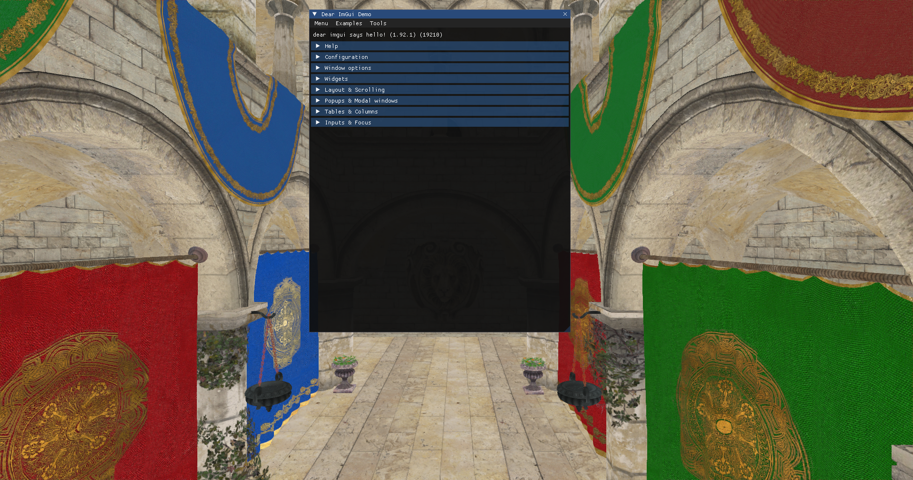

# Chapter 12 - GUI

In this chapter we will add the capability to display Graphical User Interfaces (GUI) on top of the rendered scene. We will use the
[Dear ImGui library](https://github.com/ocornut/imgui) through the [zgui](https://github.com/zig-gamedev/zgui) bindings. ImGui is a
light-weight GUI library render-agnostic which can be used with OpenGL, DirectX or Vulkan. We can construct complex GUIs, capable of
reacting to user input, and get its output as vertex buffers which we can render in our application as other regular shapes. The purpose of
this chapter is not to explain ImGui deeply, but to show how can it be integrated with our Vulkan based render pipeline.

You can find the complete source code for this chapter [here](../../booksamples/chapter-12).

## zgui dependencies

We will need to add the [zgui](https://github.com/zig-gamedev/zgui) dependency to the `build.zig.zon` using the command:
`zig fetch --save https://github.com/zig-gamedev/zgui/archive/d6c4f53c2fbd54673790dc2a5208160a3586ef29.tar.gz`.

We will need to update the `build.zig` file to include the zgui dependency in the `eng` and `root` modules:

```zig
pub fn build(b: *std.Build) void {
    ...
    // ZGui
    const zguiDep = b.dependency("zgui", .{
        .shared = false,
        .with_implot = false,
    });
    const zgui = zguiDep.module("root");    
    ...
    eng.addImport("zgui", zgui);
    ...
    eng.linkLibrary(zguiDep.artifact("imgui"));
    ...
    exe.root_module.addImport("zgui", zgui);
    ...
}
```

## Render the GUI

In this case, we will be rendering the GUI elements over the scene. Since we do not want to applyany additional filtering, since ImGui
applies its own gamma correction we will render the GUI after the post-processing stage. We will perform the render in a new struct named
`RenderGui` which is defined in the `src/eng/renderGui.zig` and you should include in the `mod.zig` file
(`pub const rgui = @import("renderGui.zig");`). It starts like this:

```zig
const com = @import("com");
const eng = @import("mod.zig");
const std = @import("std");
const vk = @import("vk");
const vulkan = @import("vulkan");
const zgui = @import("zgui");
const zstbi = @import("zstbi");

const PushConstants = struct {
    scaleX: f32 = 1.0,
    scaleY: f32 = 1.0,
};

const GuiVtxBuffDesc = struct {
    const binding_description = vulkan.VertexInputBindingDescription{
        .binding = 0,
        .stride = @sizeOf(GuiVtxBuffDesc),
        .input_rate = .vertex,
    };

    const attribute_description = [_]vulkan.VertexInputAttributeDescription{
        .{
            .binding = 0,
            .location = 0,
            .format = .r32g32_sfloat,
            .offset = @offsetOf(GuiVtxBuffDesc, "pos"),
        },
        .{
            .binding = 0,
            .location = 1,
            .format = .r32g32_sfloat,
            .offset = @offsetOf(GuiVtxBuffDesc, "textCoords"),
        },
        .{
            .binding = 0,
            .location = 2,
            .format = .r8g8b8a8_unorm,
            .offset = @offsetOf(GuiVtxBuffDesc, "color"),
        },
    };

    pos: [2]f32,
    textCoords: [2]f32,
    color: u32,
};
```

The `PushConstants` struct defines the parameters that we will pass as push constants to the shaders used during GUI render. In this case
we will pass a scale factor for x and y axis. The `GuiVtxBuffDesc` struct defines the vertex input structure that we will use in the 
shaders. We will see later on how that ImGui updates dynamically vertex information responding to the GUI drawing functions, and therefore,
imposes a vertex structure which is defined by an `x` and `y` positions (We are rendering 2D GUIs), texture coordinates and a color. Let's
continue with the code:

```zig
const TXT_ID_GUI = "TXT_ID_GUI";
const DESC_ID_TEXT_SAMPLER = "GUI_DESC_ID_TEXT_SAMPLER";
const DESC_ID_TEXT_PFX = "GUI_DESC_ID_TEXT_PFX_";
const DEFAULT_VTX_BUFF_SIZE: usize = 1024;
const DEFAULT_IDX_BUFF_SIZE: usize = 2024;

pub const RenderGui = struct {
    descLayoutFrg: vk.desc.VkDescSetLayout,
    guiTextureCache: eng.tcach.TextureCache,
    textSampler: vk.text.VkTextSampler,
    vtxBuffers: []vk.buf.VkBuffer,
    idxBuffers: []vk.buf.VkBuffer,
    vkPipeline: vk.pipe.VkPipeline,

    pub fn create(allocator: std.mem.Allocator, io: std.Io, vkCtx: *const vk.ctx.VkCtx) !RenderGui {
        // Init GUI
        try initGUI(allocator, vkCtx);

        // Textures
        const samplerInfo = vk.text.VkTextSamplerInfo{
            .addressMode = vulkan.SamplerAddressMode.repeat,
            .anisotropy = false,
            .borderColor = vulkan.BorderColor.float_opaque_black,
        };
        const textSampler = try vk.text.VkTextSampler.create(vkCtx, samplerInfo);

        // Push constants
        const pushConstants = [_]vulkan.PushConstantRange{.{
            .stage_flags = vulkan.ShaderStageFlags{ .vertex_bit = true },
            .offset = 0,
            .size = @sizeOf(PushConstants),
        }};

        // Descriptor Set layouts
        const descLayoutFrg = try vk.desc.VkDescSetLayout.create(
            allocator,
            vkCtx,
            &[_]vk.desc.LayoutInfo{.{
                .binding = 0,
                .descCount = 1,
                .descType = vulkan.DescriptorType.combined_image_sampler,
                .stageFlags = vulkan.ShaderStageFlags{ .fragment_bit = true },
            }},
        );

        const descSetLayouts = [_]vulkan.DescriptorSetLayout{descLayoutFrg.descSetLayout};

        // Shader modules
        var arena = std.heap.ArenaAllocator.init(std.heap.page_allocator);
        defer arena.deinit();
        const vertCode align(@alignOf(u32)) = try com.utils.loadFile(arena.allocator(), io, "res/shaders/gui_vtx.glsl.spv");
        const vert = try vkCtx.vkDevice.deviceProxy.createShaderModule(&.{
            .code_size = vertCode.len,
            .p_code = @ptrCast(@alignCast(vertCode)),
        }, null);
        defer vkCtx.vkDevice.deviceProxy.destroyShaderModule(vert, null);

        const fragCode align(@alignOf(u32)) = try com.utils.loadFile(arena.allocator(), io, "res/shaders/gui_frg.glsl.spv");
        const frag = try vkCtx.vkDevice.deviceProxy.createShaderModule(&.{
            .code_size = fragCode.len,
            .p_code = @ptrCast(@alignCast(fragCode)),
        }, null);
        defer vkCtx.vkDevice.deviceProxy.destroyShaderModule(frag, null);

        const modulesInfo = try allocator.alloc(vk.pipe.ShaderModuleInfo, 2);
        modulesInfo[0] = .{ .module = vert, .stage = .{ .vertex_bit = true } };
        modulesInfo[1] = .{ .module = frag, .stage = .{ .fragment_bit = true } };
        defer allocator.free(modulesInfo);

        // Pipeline
        const vkPipelineCreateInfo = vk.pipe.VkPipelineCreateInfo{
            .colorFormat = vkCtx.vkSwapChain.surfaceFormat.format,
            .descSetLayouts = descSetLayouts[0..],
            .pushConstants = pushConstants[0..],
            .modulesInfo = modulesInfo,
            .vtxBuffDesc = .{
                .attribute_description = @constCast(&GuiVtxBuffDesc.attribute_description)[0..],
                .binding_description = GuiVtxBuffDesc.binding_description,
            },
            .useBlend = true,
        };
        const vkPipeline = try vk.pipe.VkPipeline.create(allocator, vkCtx, &vkPipelineCreateInfo);
        ...
    }
    ...
};
```

The `create` function, as in the previous cases, is used to instantiate the `RenderGui` struct and starts by calling the `initGUI` function
which initializes ImGui (we will see the implementation later on). After that, we create a texture sampler, define the push constants range,
the descriptor set layouts, shader modules and create the pipeline. The `create` function continues like this:

```zig
pub const RenderGui = struct {
    ...
    pub fn create(allocator: std.mem.Allocator, io: std.Io, vkCtx: *const vk.ctx.VkCtx) !RenderGui {
        ...
        // Buffers
        const vtxBuffers = try allocator.alloc(vk.buf.VkBuffer, com.common.FRAMES_IN_FLIGHT);
        const idxBuffers = try allocator.alloc(vk.buf.VkBuffer, com.common.FRAMES_IN_FLIGHT);
        for (0..com.common.FRAMES_IN_FLIGHT) |i| {
            vtxBuffers[i] = try vk.buf.VkBuffer.create(
                vkCtx,
                DEFAULT_VTX_BUFF_SIZE,
                .{ .vertex_buffer_bit = true },
                @intFromEnum(vk.vma.VmaFlags.VmaAllocationCreateHostAccessSequentialWriteBit),
                vk.vma.VmaUsage.VmaUsageAuto,
                vk.vma.VmaMemoryFlags.MemoryPropertyHostVisibleBitAndCoherent,
            );
            idxBuffers[i] = try vk.buf.VkBuffer.create(
                vkCtx,
                DEFAULT_IDX_BUFF_SIZE,
                .{ .index_buffer_bit = true },
                @intFromEnum(vk.vma.VmaFlags.VmaAllocationCreateHostAccessSequentialWriteBit),
                vk.vma.VmaUsage.VmaUsageAuto,
                vk.vma.VmaMemoryFlags.MemoryPropertyHostVisibleBitAndCoherent,
            );
        }

        const guiTextureCache = eng.tcach.TextureCache.create();
        return .{
            .descLayoutFrg = descLayoutFrg,
            .guiTextureCache = guiTextureCache,
            .textSampler = textSampler,
            .vtxBuffers = vtxBuffers,
            .idxBuffers = idxBuffers,
            .vkPipeline = vkPipeline,
        };
    }
    ...
};
```

The next step is to build two arrays of buffers (as many as frame in flight). Those buffers will hold the vertices and associated indices
to render the GUI. They will be updated each frame to reflect the GUI state. They will need to be permanently accessible by both the CPU
and the GPU. We will create them initially with a default size although they can later change in size dynamically. We will see later how to
populate them. We will also need an instance of `TextureCache` to host the textures associated with the GUI. With all that information we
can create the structure.

We will need a `cleanup` function to free the resources:

```zig
pub const RenderGui = struct {
    ...
    pub fn cleanup(self: *RenderGui, allocator: std.mem.Allocator, vkCtx: *const vk.ctx.VkCtx) void {
        for (self.vtxBuffers) |vkVuffer| {
            vkVuffer.cleanup(vkCtx);
        }
        defer allocator.free(self.vtxBuffers);
        for (self.idxBuffers) |vkVuffer| {
            vkVuffer.cleanup(vkCtx);
        }
        defer allocator.free(self.idxBuffers);
        self.textSampler.cleanup(vkCtx);
        self.descLayoutFrg.cleanup(vkCtx);
        self.vkPipeline.cleanup(vkCtx);
        self.guiTextureCache.cleanup(allocator, vkCtx);
        zgui.deinit();
    }
    ...
};
```

In the `create` function we used the `initGUI` function  where we initialize the resources required by ImGui:

```zig
pub const RenderGui = struct {
    ...
    fn initGUI(allocator: std.mem.Allocator, vkCtx: *const vk.ctx.VkCtx) !void {
        const extent = vkCtx.vkSwapChain.extent;
        zgui.init(allocator);
        zgui.io.setIniFilename(null);
        zgui.io.setBackendFlags(.{ .renderer_has_textures = true });
        zgui.io.setDisplaySize(@as(f32, @floatFromInt(extent.width)), @as(f32, @floatFromInt(extent.height)));
    }
    ...
};
```

In the `initGUI` method, we first need to call the `init` ImGui function. This should be the very first call prior to invoking any other
ImGui functions. After that, we retrieve a reference to the `io`, and call the `setIniFilename` function with a null argument. The reason
for doing that, is that ImGui, by default, will create a file named `imgui.ini` when the context is destroyed. This `imgui.ini` file will
hold the position and size of the GUI elements, so they can be restored to their last positions. We will not be using that feature,
so we set `null` as the parameter of the `setIniFilename` function to deactivate it. After that, we need to set the `renderer_has_textures`
flag to true. By setting this we are telling ImGui that our render backend (the render which will be in charge to render to screen) has
texture capabilities. In addition we will enable dynamic font textures which is required by modern ImGui features. After that we set the
size of the display to match the render area., in our case, since we will be rendering after the post-processing stage it will
match swap chain extent.

We will define a `render` function that looks like this:

```zig
pub const RenderGui = struct {
    ...
    pub fn render(
        self: *RenderGui,
        vkCtx: *vk.ctx.VkCtx,
        engCtx: *const eng.engine.EngCtx,
        vkCmd: vk.cmd.VkCmdBuff,
        vkCmdPool: *vk.cmd.VkCmdPool,
        vkQueue: vk.queue.VkQueue,
        imageIndex: u32,
        frameIdx: u32,
    ) !void {
        if (!try self.updateBuffers(vkCtx, frameIdx)) {
            return;
        }

        const allocator = engCtx.allocator;
        const cmdHandle = vkCmd.cmdBuffProxy.handle;
        const device = vkCtx.vkDevice.deviceProxy;

        try self.updateGuiTextures(allocator, vkCtx, vkCmdPool, vkQueue);

        const renderAttInfo = vulkan.RenderingAttachmentInfo{
            .image_view = vkCtx.vkSwapChain.imageViews[imageIndex].view,
            .image_layout = vulkan.ImageLayout.color_attachment_optimal,
            .load_op = vulkan.AttachmentLoadOp.load,
            .store_op = vulkan.AttachmentStoreOp.store,
            .clear_value = vulkan.ClearValue{ .color = .{ .float_32 = .{ 0.0, 0.0, 0.0, 1.0 } } },
            .resolve_mode = vulkan.ResolveModeFlags{},
            .resolve_image_layout = vulkan.ImageLayout.attachment_optimal,
        };
        const extent = vkCtx.vkSwapChain.extent;
        const renderInfo = vulkan.RenderingInfo{
            .render_area = .{ .extent = extent, .offset = .{ .x = 0, .y = 0 } },
            .layer_count = 1,
            .color_attachment_count = 1,
            .p_color_attachments = &[_]vulkan.RenderingAttachmentInfo{renderAttInfo},
            .view_mask = 0,
        };

        device.cmdBeginRendering(cmdHandle, @ptrCast(&renderInfo));

        device.cmdBindPipeline(cmdHandle, vulkan.PipelineBindPoint.graphics, self.vkPipeline.pipeline);

        const viewPort = [_]vulkan.Viewport{.{
            .x = 0,
            .y = @as(f32, @floatFromInt(extent.height)),
            .width = @as(f32, @floatFromInt(extent.width)),
            .height = -1.0 * @as(f32, @floatFromInt(extent.height)),
            .min_depth = 0,
            .max_depth = 1,
        }};
        device.cmdSetViewport(cmdHandle, 0, &viewPort);

        self.setPushConstants(vkCtx, cmdHandle);

        const drawData = zgui.getDrawData();
        if (@intFromPtr(drawData) == 0) {
            return;
        }
        const offset = [_]vulkan.DeviceSize{0};
        device.cmdBindIndexBuffer(cmdHandle, self.idxBuffers[frameIdx].buffer, 0, vulkan.IndexType.uint16);
        device.cmdBindVertexBuffers(cmdHandle, 0, @ptrCast(&self.vtxBuffers[frameIdx].buffer), &offset);

        var descSets: [1]vulkan.DescriptorSet = undefined;

        var offsetIdx: u32 = 0;
        var offsetVtx: i32 = 0;
        const numCmds = @as(usize, @intCast(drawData.cmd_lists_count));
        for (0..numCmds) |i| {
            const cmd_list = drawData.cmd_lists.items[i];
            for (cmd_list.getCmdBuffer()) |cmd| {
                const x: i32 = @intFromFloat(cmd.clip_rect[0]);
                const y: i32 = @intFromFloat(cmd.clip_rect[1]);
                const z: i32 = @intFromFloat(cmd.clip_rect[2]);
                const w: i32 = @intFromFloat(cmd.clip_rect[3]);
                const scissor = [_]vulkan.Rect2D{.{
                    .offset = .{ .x = x, .y = y },
                    .extent = .{ .width = @intCast(z - x), .height = @intCast(w - y) },
                }};
                device.cmdSetScissor(cmdHandle, 0,  &scissor);

                const descSetInt = @intFromPtr(cmd.texture_ref.tex_data.?.backend_user_data.?);
                const descSet: vulkan.DescriptorSet = @enumFromInt(descSetInt);
                descSets[0] = descSet;

                device.cmdBindDescriptorSets(
                    cmdHandle,
                    vulkan.PipelineBindPoint.graphics,
                    self.vkPipeline.pipelineLayout,
                    0,
                    &descSets,
                    null,
                );

                device.cmdDrawIndexed(
                    cmdHandle,
                    @intCast(cmd.elem_count),
                    1,
                    offsetIdx + @as(u32, @intCast(cmd.idx_offset)),
                    offsetVtx + @as(i32, @intCast(cmd.vtx_offset)),
                    0,
                );
            }
            offsetIdx += @as(u32, @intCast(cmd_list.getIndexBufferLength()));
            offsetVtx += @as(i32, @intCast(cmd_list.getVertexBufferLength()));
        }
        device.cmdEndRendering(cmdHandle);
    }
    ...
};
```

The first thing that we do is to update the buffers that we will used to store vertices and indices. We will use separate buffers per
frames in flight. We will use just a single buffer (one for vertices and one for indices) when rendering the GUI elements, that is, we will
not have separate vertices buffers for the different GUI elements, just a single vertex buffer and a single index buffer. We will populate
those buffers in the `updateBuffers` function which will return `false` if there is nothing to render. The next step is to call the
`updateGuiTextures` function which will be used to dynamically build or update the textures used by the GUI. Modern ImGui library does not
build a texture atlas at startup but can recreate the textures used to render the GUI dynamically, so we need to wait until we are
rendering to create or update the textures. We will see the implementation later on. After that, we just do the usual steps, begin the
render, bind the pipeline, set the view port and bind the vertex and indices buffers. Then, we set push constants to pass a scaling factor
(composed by two floats). ImGui will use a coordinate system which sets `(0, 0)` at the top left corner of the screen and `(width, height)`
as the bottom right corner, being `width` and `height` the values set in the `ImGuiIO` `setDisplaySize` method call. We need to transform
from that coordinate system to one in the range of `[-1, 1]` for x and y axis, which will be done in the vertex shader with the help of
that scaling factor.

The next step is to iterate over the ImGui draw data, which will help us to set the proper offsets over the vertices and indices buffers
when calling `cmdDrawIndexed`. We also restrict the drawing area using the `cmdSetScissor` for each of the GUI elements to be rendered.
For each of these elements, we will get the descriptor set associated to the texture using the `backend_user_data` of the `TextureData`
struct. The `updateGuiTextures` function, in addition to create or update the textures will also create the required descriptor sets and
store them in the `backend_user_data` attribute.

The `setPushConstants` function is defined like this:

```zig
pub const RenderGui = struct {
    ...
    fn setPushConstants(self: *RenderGui, vkCtx: *const vk.ctx.VkCtx, cmdHandle: vulkan.CommandBuffer) void {
        const dispSize = zgui.io.getDisplaySize();
        const pushConstants = PushConstants{
            .scaleX = 2.0 / dispSize[0],
            .scaleY = -2.0 / dispSize[1],
        };

        vkCtx.vkDevice.deviceProxy.cmdPushConstants(
            cmdHandle,
            self.vkPipeline.pipelineLayout,
            vulkan.ShaderStageFlags{ .vertex_bit = true },
            0,
            @sizeOf(PushConstants),
            &pushConstants,
        );
    }
    ...
};
```

In the `resize` function we just update the display size of ImGui:

```zig
pub const RenderGui = struct {
    ...
    pub fn resize(self: *RenderGui, vkCtx: *const vk.ctx.VkCtx) !void {
        _ = self;
        const extent = vkCtx.vkSwapChain.extent;
        zgui.io.setDisplaySize(
            @as(f32, @floatFromInt(extent.width)),
            @as(f32, @floatFromInt(extent.height)),
        );
    }
    ...
};
```

Let us review now the `updateBuffers` function:

```zig
pub const RenderGui = struct {
    ...
    fn updateBuffers(self: *RenderGui, vkCtx: *const vk.ctx.VkCtx, frameIdx: u32) !bool {
        const drawData = zgui.getDrawData();
        if (@intFromPtr(drawData) == 0) {
            return false;
        }
        const vtxBuffSize: u64 = @as(u64, @intCast(drawData.total_vtx_count * @sizeOf(GuiVtxBuffDesc)));
        const idxBuffSize: u64 = @as(u64, @intCast(drawData.total_idx_count * @sizeOf(u16)));

        if (vtxBuffSize == 0 or idxBuffSize == 0) {
            return false;
        }

        const vtxBuffer = self.vtxBuffers[frameIdx];
        if (vtxBuffer.size < vtxBuffSize) {
            vtxBuffer.cleanup(vkCtx);
            self.vtxBuffers[frameIdx] = try vk.buf.VkBuffer.create(
                vkCtx,
                vtxBuffSize,
                .{ .vertex_buffer_bit = true },
                @intFromEnum(vk.vma.VmaFlags.VmaAllocationCreateHostAccessSequentialWriteBit),
                vk.vma.VmaUsage.VmaUsageAuto,
                vk.vma.VmaMemoryFlags.MemoryPropertyHostVisibleBitAndCoherent,
            );
        }

        const idxBuffer = self.idxBuffers[frameIdx];
        if (idxBuffer.size < idxBuffSize) {
            idxBuffer.cleanup(vkCtx);
            self.idxBuffers[frameIdx] = try vk.buf.VkBuffer.create(
                vkCtx,
                idxBuffSize,
                .{ .index_buffer_bit = true },
                @intFromEnum(vk.vma.VmaFlags.VmaAllocationCreateHostAccessSequentialWriteBit),
                vk.vma.VmaUsage.VmaUsageAuto,
                vk.vma.VmaMemoryFlags.MemoryPropertyHostVisibleBitAndCoherent,
            );
        }

        var vtxOffset: usize = 0;
        var idxOffset: usize = 0;
        const numCmds = @as(usize, @intCast(drawData.cmd_lists_count));

        const vtxBuffData = try vtxBuffer.map(vkCtx);
        defer vtxBuffer.unMap(vkCtx);
        const vtxGpuBuff: [*]GuiVtxBuffDesc = @ptrCast(@alignCast(vtxBuffData));

        const idxBuffData = try idxBuffer.map(vkCtx);
        defer idxBuffer.unMap(vkCtx);
        const idxGpuBuff: [*]u16 = @ptrCast(@alignCast(idxBuffData));

        for (0..numCmds) |i| {
            const cmd_list = drawData.cmd_lists.items[i];
            const vtxElemSize = @as(usize, @intCast(cmd_list.getVertexBufferLength()));
            const idxElemSize = @as(usize, @intCast(cmd_list.getIndexBufferLength()));

            const vtx_buffer_ptr: [*]GuiVtxBuffDesc = @ptrCast(@alignCast(cmd_list.getVertexBufferData()));
            const idx_buffer_ptr: [*]u16 = @ptrCast(@alignCast(cmd_list.getIndexBufferData()));

            const dstVtx = vtxOffset + vtxElemSize;
            const dstIdx = idxOffset + idxElemSize;

            @memcpy(vtxGpuBuff[vtxOffset..dstVtx], vtx_buffer_ptr[0..vtxElemSize]);
            @memcpy(idxGpuBuff[idxOffset..dstIdx], idx_buffer_ptr[0..idxElemSize]);

            vtxOffset += vtxElemSize;
            idxOffset += idxElemSize;
        }

        return true;
    }
    ...
};
```

As it has been described before, we will have two set of buffers, one for the vertices and the other one for the indices. We will have as
many buffers frames in flight we have, We first check if `drawData` is null, which may be caused because we have not initialized the GUI
or we do not have anything to render. After that, we retrieve the total size of the vertices and indices buffers to accommodate the
render of the GUI elements in this frame. If there are no vertices or no indices, we just return. If the buffers doe not have enough space
we create new Vulkan buffers cleaning up the old ones. The buffers need to be accessed from both the GPU and the application so we
we set `VmaAllocationCreateHostAccessSequentialWriteBit` and `MemoryPropertyHostVisibleBitAndCoherent` flags. After that, we just copy the
vertices and indices data to those buffers by iterating over the different ImGui drawing commands.

The `updateGuiTextures` function is defined like this:

```zig
pub const RenderGui = struct {
    ...
    fn updateGuiTextures(
        self: *RenderGui,
        allocator: std.mem.Allocator,
        vkCtx: *vk.ctx.VkCtx,
        vkCmdPool: *vk.cmd.VkCmdPool,
        vkQueue: vk.queue.VkQueue,
    ) !void {
        const drawData = zgui.getDrawData();
        if (@intFromPtr(drawData) == 0) {
            return;
        }

        var numTextures: u32 = 0;
        const numCmds = @as(usize, @intCast(drawData.cmd_lists_count));
        for (0..numCmds) |i| {
            const cmd_list = drawData.cmd_lists.items[i];
            for (cmd_list.getCmdBuffer()) |cmd| {
                const textData = cmd.texture_ref.tex_data.?;
                if (textData.status != zgui.TextureStatus.want_updates and textData.status != zgui.TextureStatus.want_create) {
                    continue;
                }
                numTextures += 1;
                const numPixels = textData.width * textData.height * textData.bytes_per_pixel;
                const id = try std.fmt.allocPrint(allocator, "{s}{d}", .{ TXT_ID_GUI, textData.tex_id });
                defer allocator.free(id);
                const textureData = textData.pixels[0..@as(usize, @intCast(numPixels))];
                if (textData.status == zgui.TextureStatus.want_updates) {
                    var texture = self.guiTextureCache.getTextureRef(id);
                    try texture.update(vkCtx, &textureData);
                } else {
                    const textureInfo = eng.tcach.TextureInfo{
                        .id = id,
                        .data = textureData,
                        .height = @as(u32, @intCast(textData.height)),
                        .width = @as(u32, @intCast(textData.width)),
                        .format = vulkan.Format.r8g8b8a8_srgb,
                    };
                    try self.guiTextureCache.addTexture(allocator, vkCtx, &textureInfo);
                    const idDesc = try std.fmt.allocPrint(allocator, "{s}{d}", .{ DESC_ID_TEXT_SAMPLER, textData.tex_id });
                    defer allocator.free(idDesc);
                    const descSet = try vkCtx.vkDescAllocator.addDescSet(
                        allocator,
                        vkCtx.vkPhysDevice,
                        vkCtx.vkDevice,
                        idDesc,
                        self.descLayoutFrg,
                    );
                    textData.backend_user_data = @ptrFromInt(@intFromEnum(descSet.descSet));
                    const texture = self.guiTextureCache.getTexture(textureInfo.id);
                    descSet.setImage(vkCtx.vkDevice, texture.vkImageView, self.textSampler, 0);
                }

                textData.status = zgui.TextureStatus.ok;
            }
        }

        if (numTextures > 0) {
            try self.guiTextureCache.recordTextures(vkCtx, vkCmdPool, vkQueue);
        }
    }
};
```

We first check if there is no drawing data so we can return. After that we iterate over the drawing commands checking the `TextureData`
status code. Since we enabled the `renderer_has_textures` flag in the `initGUI` function, any drawing code will have, at least, the default
texture used by ImGui to render. In case we may have a widget with a specific image it may have a different texture than the default one,
but the process will be same. If the texture is not in the creation (`want_create`) or update state (`want_updates`) we just continue.

For the textures that need to be created or updated, we first retrieve the texture data and create an unique identifier. The identifier
will use the `TextureData` `tex_id` attribute which will be unique per texture. If want to update the texture, we just retrieve the
associated texture form the cache (using the previously created identifier) and call a new  function defined in the `VkTexture` struct to
update the contents of the image. When updating the texture we need to access to get the texture reference from the tetxure cache since we
need to update its state, therefore we invoke the `getTextureRef` function which return a reference to it, not a copy. This is a new
function that we will add to the `TextureCache` struct.

If we need to create a new texture, we just fill the `TextureInfo` structure using the `TextureData` information, create the texture by
adding to the texture cache, and create an associated descriptor set. After we have created the descriptor set, we need to update the
`backend_user_data` attribute to store it and associate the image with the descriptor set.

When we have processed the texture we need to change its state to `gui.TextureStatus.ok`. Remember that the same texture may be associated
to multiple drawing commands, so we need to avoid reprocessing the same texture again and again. Finally, we need to record the layout 
transition of the textures created or updated by calling the `recordTextures` over the `guiTextureCache`.

The `renderGui.zig` file provides also a utility function to create a `zgui.TextureData` instance. This may be used to associate
an image to a ImGui widget. It takes a `zstbi.Image`reference which will contain the image data, and an identifier which shall be unique.
ImGui will use the `0` identifier for the default texture.

```zig
pub fn createTextureData(texId: u32, textureImage: *const zstbi.Image) zgui.TextureData {
    return zgui.TextureData{
        .unique_id = @intCast(texId),
        .backend_user_data = null,
        .bytes_per_pixel = 4,
        .pixels = textureImage.data.ptr,
        .format = .rgba32,
        .width = @intCast(textureImage.width),
        .height = @intCast(textureImage.height),
        .status = .want_create,
        .tex_id = @enumFromInt(texId),
        .used_rect = .{
            .x = 0,
            .y = 0,
            .w = @intCast(textureImage.width),
            .h = @intCast(textureImage.height),
        },
        .update_Rect = .{
            .x = 0,
            .y = 0,
            .w = @intCast(textureImage.width),
            .h = @intCast(textureImage.height),
        },
        .updates = undefined,
        .unused_Frames = 0,
        .ref_count = 0,
        .use_colors = true,
        .want_destroy_next_frame = false,
    };
}
```

We will need to create two new shaders named `gui_vtx.glsl` and `gui_frg.glsl` so we need to include the in the `build.zig` file:

```zig
pub fn build(b: *std.Build) void {
    ...
    const shaders = [_]Shader{
        ...
        .{ .path = "res/shaders/gui_vtx.glsl", .stage = "vertex" },
        .{ .path = "res/shaders/gui_frg.glsl", .stage = "fragment" },
    };    
    ...
}
```

The vertex shader used for rendering the GUI (`gui_vtx.glsl`) is quite simple, we just transform the coordinates so they are in the
`[-1, 1]` range and output the texture coordinates and color so they can be used in the fragment shader:

```glsl
#version 450

layout (location = 0) in vec2 inPos;
layout (location = 1) in vec2 inTextCoords;
layout (location = 2) in vec4 inColor;

layout (push_constant) uniform PushConstants {
    vec2 scale;
} pushConstants;

layout (location = 0) out vec2 outTextCoords;
layout (location = 1) out vec4 outColor;

out gl_PerVertex
{
    vec4 gl_Position;
};

void main()
{
    outTextCoords = inTextCoords;
    outColor = inColor;
    gl_Position = vec4(inPos * pushConstants.scale + vec2(-1.0, 1.0), 0.0, 1.0);
}
```

In the fragment shader (`gui_frg.glsl`) we just output the combination of the vertex color and the texture color associated to its texture
coordinates:

```glsl
#version 450

layout (location = 0) in vec2 inTextCoords;
layout (location = 1) in vec4 inColor;

layout (binding = 0) uniform sampler2D fontsSampler;

layout (location = 0) out vec4 outFragColor;

void main()
{
    outFragColor = inColor * texture(fontsSampler, inTextCoords);
}
```

## Complete the changes

The `VkTexture` struct needs to be updated to add the new `update` function:

```zig
pub const VkTexture = struct {
    ...
    pub fn update(self: *VkTexture, vkCtx: *const vk.ctx.VkCtx, data: *const []u8) !void {
        const dataSize = data.len;
        const vkStageBuffer = try vk.buf.VkBuffer.create(
            vkCtx,
            dataSize,
            vulkan.BufferUsageFlags{ .transfer_src_bit = true },
            @intFromEnum(vk.vma.VmaFlags.VmaAllocationCreateHostAccessSequentialWriteBit),
            vk.vma.VmaUsage.VmaUsageAuto,
            vk.vma.VmaMemoryFlags.MemoryPropertyHostVisibleBitAndCoherent,
        );
        try vk.buf.copyDataToBuffer(vkCtx, &vkStageBuffer, data);
        self.cleanupStgBuffer(vkCtx);
        self.vkStageBuffer = vkStageBuffer;
        self.recorded = false;
    } 
}
```

We just create a new stating buffer with the image contents, copy the data to it and reset the `recorded` flag so the texture can
layout can transition to the proper state when recording the layout transitions.

The new `getTextureRef` function in the `TextureCache` struct is defined like this:

```zig
pub const TextureCache = struct {
    ...
    pub fn getTextureRef(self: *const TextureCache, id: []const u8) *vk.text.VkTexture {
        const texture = self.textureMap.getPtr(id) orelse {
            @panic("Could not find texture");
        };

        return texture;
    }
    ...
};
```

Now we need to put the new `RenderGui` struct into play, so we will start with the changes in the `Render` struct:

```zig
pub const Render = struct {
    ...
    renderGui: eng.rgui.RenderGui,
    ...
    pub fn cleanup(self: *Render, allocator: std.mem.Allocator) !void {
        ...
        self.renderGui.cleanup(allocator, &self.vkCtx);
        ...
    }
    ...
    pub fn create(allocator: std.mem.Allocator, io: std.Io, constants: com.common.Constants, window: sdl3.video.Window) !Render {
        ...
        const renderGui = try eng.rgui.RenderGui.create(allocator, io, &vkCtx);
        ...
        return .{
            ...
            .renderGui = renderGui,
            ...
        };
    }
    ...
    pub fn render(self: *Render, engCtx: *eng.engine.EngCtx) !void {
        ...
        self.renderInitPost(vkCmdBuff, imageIndex);
        try self.renderPost.render(&self.vkCtx, engCtx, vkCmdBuff, imageIndex);
        try self.renderGui.render(
            &self.vkCtx,
            engCtx,
            vkCmdBuff,
            &self.cmdPools[0],
            self.queueGraphics,
            imageIndex,
            self.currentFrame,
        );
        self.renderFinishPost(vkCmdBuff, imageIndex);
        ...
    }
    ...
    fn resize(self: *Render, engCtx: *eng.engine.EngCtx) !void {
        ...
        guiRender.resize(vkCtx, postRender.getAttachment());
        try self.renderGui.resize(&self.vkCtx);
    }
}
```

We need to instantiate the `RenderGui` struct in the `Render` `create` function and free it in the `cleanup` one. In the `render` function
we just call the `RenderGui` `function` after we have finished with post-processing.

We will also need to modify the `Wnd` struct to properly handle text input in ImGui. We will first enable text input processing in SDL3.
By doing so, we will be able to get tetx input processed and handle properly the text taking into consideration the keyboard layout and the
state of special keys (such as caps lock, etc.):

```zig
...
const zgui = @import("zgui");
...
pub const Wnd = struct {
    ...
    pub fn create(wndTitle: [:0]const u8) !Wnd {
        ...
        try sdl3.keyboard.startTextInput(window);        
        ...
    }
    ...
};
```

In the `pollEvents` function we will react to `mouse_wheel`, `key_up`, `key_down` and `text_input` events (If we do not call the
`startTextInput` function we would not receive the `text_input` event):

```zig
pub const Wnd = struct {
    ...
    pub fn pollEvents(self: *Wnd) !void {
        ...
        while (sdl3.events.poll()) |event| {
            switch (event) {
                .quit, .terminating => self.closed = true,
                .mouse_motion => {
                    self.mouseState.deltaX += event.mouse_motion.x_rel;
                    self.mouseState.deltaY += event.mouse_motion.y_rel;
                },
                .mouse_wheel => {
                    processMouseWheel(event.mouse_wheel.scroll_x, event.mouse_wheel.scroll_y);
                },
                .key_down => {
                    processKey(event.key_down.key.?, event.key_down.down);
                },
                .key_up => {
                    processKey(event.key_up.key.?, event.key_up.down);
                },
                .text_input => {
                    processTextInput(event.text_input.text);
                },
                .window_resized => {
                    self.resized = true;
                },
                else => {},
            }
        }
        ...
    }
    ...
};
```

The functions used in the event loop are defined like this:

```zig
pub const Wnd = struct {
    ...
    fn processMouseWheel(x: f32, y: f32) void {
        if (zgui.io.getWantCaptureMouse()) {
            zgui.io.addMouseWheelEvent(x, y);
        }
    }

    fn processTextInput(text: [:0]const u8) void {
        if (zgui.io.getWantCaptureKeyboard()) {
            zgui.io.addInputCharactersUTF8(text);
        }
    }

    fn processKey(keyCode: sdl3.keycode.Keycode, keyDown: bool) void {
        if (!zgui.io.getWantCaptureKeyboard()) {
            return;
        }

        const result = toZgui(keyCode);

        if (result) |key| {
            zgui.io.addKeyEvent(key, keyDown);
        }
    }
    ...
};
```

The `processMouseWheel` function just passes the mouse wheel changes to ImGui if it the mouse is over the ImGui window (the
`getWantCaptureMouse` function will return true in this case). The `processTextInput` just receives the text entered by the user if ImGui
wants to process keyboard events (that is, the mouse is over an ImGui Window). The `processKey` function is called to process key up and key
down events and pass them to ImGui. We need to translate from SDL3 key codes to ImGui key codes by calling the `toZgui` function which is
defined like this:

```zig
pub const Wnd = struct {
    ...
    fn toZgui(keyCode: sdl3.keycode.Keycode) ?zgui.Key {
        return switch (keyCode) {
            .escape => zgui.Key.escape,
            .backspace => zgui.Key.back_space,
            .tab => zgui.Key.tab,
            .return_key => zgui.Key.enter,

            .right => zgui.Key.right_arrow,
            .left => zgui.Key.left_arrow,
            .down => zgui.Key.down_arrow,
            .up => zgui.Key.up_arrow,

            .func1 => zgui.Key.f1,
            .func2 => zgui.Key.f2,
            .func3 => zgui.Key.f3,
            .func4 => zgui.Key.f4,
            .func5 => zgui.Key.f5,
            .func6 => zgui.Key.f6,
            .func7 => zgui.Key.f7,
            .func8 => zgui.Key.f8,
            .func9 => zgui.Key.f9,
            .func10 => zgui.Key.f10,
            .func11 => zgui.Key.f11,
            .func12 => zgui.Key.f12,

            .left_ctrl => zgui.Key.left_ctrl,
            .right_ctrl => zgui.Key.right_ctrl,
            .left_shift => zgui.Key.left_shift,
            .right_shift => zgui.Key.right_shift,
            .left_alt => zgui.Key.left_alt,
            .right_alt => zgui.Key.right_alt,

            .a => zgui.Key.a,
            .b => zgui.Key.b,
            .c => zgui.Key.c,
            .d => zgui.Key.d,
            .e => zgui.Key.e,
            .f => zgui.Key.f,
            .g => zgui.Key.g,
            .h => zgui.Key.h,
            .i => zgui.Key.i,
            .j => zgui.Key.j,
            .k => zgui.Key.k,
            .l => zgui.Key.l,
            .m => zgui.Key.m,
            .n => zgui.Key.n,
            .o => zgui.Key.o,
            .p => zgui.Key.p,
            .q => zgui.Key.q,
            .r => zgui.Key.r,
            .s => zgui.Key.s,
            .t => zgui.Key.t,
            .u => zgui.Key.u,
            .v => zgui.Key.v,
            .w => zgui.Key.w,
            .x => zgui.Key.x,
            .y => zgui.Key.y,
            .z => zgui.Key.z,

            .zero => zgui.Key.zero,
            .one => zgui.Key.one,
            .two => zgui.Key.two,
            .three => zgui.Key.three,
            .four => zgui.Key.four,
            .five => zgui.Key.five,
            .six => zgui.Key.six,
            .seven => zgui.Key.seven,
            .eight => zgui.Key.eight,
            .nine => zgui.Key.nine,

            .space => zgui.Key.space,
            .apostrophe => zgui.Key.apostrophe,
            .comma => zgui.Key.comma,
            .period => zgui.Key.period,
            .slash => zgui.Key.slash,
            .semicolon => zgui.Key.semicolon,
            .backslash => zgui.Key.back_slash,
            .equals => zgui.Key.equal,
            .minus => zgui.Key.minus,
            .grave => zgui.Key.grave_accent,
            .left_bracket => zgui.Key.left_bracket,
            .right_bracket => zgui.Key.right_bracket,

            .kp_0 => zgui.Key.keypad_0,
            .kp_1 => zgui.Key.keypad_1,
            .kp_2 => zgui.Key.keypad_2,
            .kp_3 => zgui.Key.keypad_3,
            .kp_4 => zgui.Key.keypad_4,
            .kp_5 => zgui.Key.keypad_5,
            .kp_6 => zgui.Key.keypad_6,
            .kp_7 => zgui.Key.keypad_7,
            .kp_8 => zgui.Key.keypad_8,
            .kp_9 => zgui.Key.keypad_9,
            .kp_plus => zgui.Key.keypad_add,
            .kp_minus => zgui.Key.keypad_subtract,
            .kp_multiply => zgui.Key.keypad_multiply,
            .kp_divide => zgui.Key.keypad_divide,
            .kp_decimal => zgui.Key.keypad_decimal,
            .kp_enter => zgui.Key.keypad_enter,

            .delete => zgui.Key.delete,
            .insert => zgui.Key.insert,
            .home => zgui.Key.home,
            .end => zgui.Key.end,
            .page_up => zgui.Key.page_up,
            .page_down => zgui.Key.page_down,

            else => zgui.Key.space,
        };
    }
    ...
}
```

The final step is to modify the `Game` struct:

```zig
const Game = struct {
    defaultGui: bool = true,
    textureData: ?zgui.TextureData = null,
    textureImage: ?zstbi.Image = null,
    ...
    pub fn cleanup(self: *Game) void {
        if (self.textureImage) |*img| {
            img.deinit();
        }
    }

    pub fn init(self: *Game, engCtx: *eng.engine.EngCtx, arenaAlloc: std.mem.Allocator) !eng.engine.InitData {
        ...
        const textureImage = try zstbi.Image.loadFromFile("res/textures/vulkan.png", 4);
        self.textureImage = textureImage;

        self.textureData = eng.rgui.createTextureData(1, &textureImage);
        ...
    }

    fn handleGui(self: *Game, engCtx: *eng.engine.EngCtx) bool {
        const mouseState = engCtx.wnd.mouseState;
        zgui.io.addMousePositionEvent(mouseState.x, mouseState.y);
        zgui.io.addMouseButtonEvent(zgui.MouseButton.left, mouseState.flags.left);
        zgui.io.addMouseButtonEvent(zgui.MouseButton.middle, mouseState.flags.middle);
        zgui.io.addMouseButtonEvent(zgui.MouseButton.right, mouseState.flags.right);

        var open = true;
        if (self.defaultGui) {
            zgui.newFrame();
            zgui.showDemoWindow(&open);
            zgui.render();
        } else {
            const textRef = zgui.TextureRef{
                .tex_id = self.textureData.?.tex_id,
                .tex_data = &self.textureData.?,
            };
            zgui.newFrame();
            zgui.setNextWindowPos(.{ .x = 0, .y = 0 });
            zgui.setNextWindowSize(.{ .w = 300, .h = 300 });
            _ = zgui.begin("Test Window", .{ .popen = &open });
            zgui.image(textRef, .{ .w = 300, .h = 300 });
            zgui.end();
            zgui.endFrame();
            zgui.render();
        }

        return zgui.io.getWantCaptureKeyboard() or zgui.io.getWantCaptureMouse();
    }

    pub fn input(self: *Game, engCtx: *eng.engine.EngCtx, deltaSec: f32) void {
        if (self.handleGui(engCtx)) {
            return;
        }
        ...
        if (engCtx.wnd.isKeyPressed(sdl3.Scancode.one)) {
            self.defaultGui = true;
        } else if (engCtx.wnd.isKeyPressed(sdl3.Scancode.two)) {
            self.defaultGui = false;
        }
        ...        
    }    
    ...
};
```

We have two possible GUI Windows to show, the default ImGui demo window and a simple one window which shows a texture. ImGui is an immediate
mode library, therefore, we need to define the GUI contents in each frame, so we put that code in a `handleGui` function which is invoked
by the `input` one. It returns a `bool` indictaing if the input has been processed by ImGui components. In order to use an image with an
ImGui widget we need to create `zgui.TextureData` instance which is created in the `init` function. We will show the demo window when
pressing the `1` key and the simple window with an image when pressing the `2` key.



[Next chapter](../chapter-13/chapter-13.md)