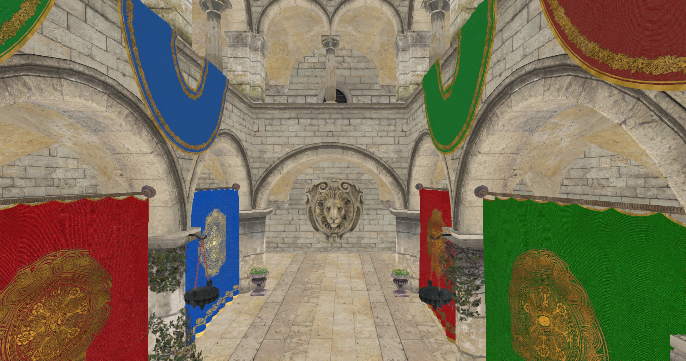

# Chapter 14 - Deferred Rendering (I)

In this chapter we will set up the basis to implement deferred shading. We will split the rendering into two phases, one to render the
geometry and relevant parameters of the scene and another one to apply lighting. In this chapter we will cove base changes, leaving the
changes required to apply lighting for the next chapter. We will not be introducing new Vulkan concepts, just combine the ones we have
described previously to support deferred shading. Therefore, you will see larger chunks of code with an explanatory overview, focusing on
the key concepts of Vulkan that need to be applied to implement deferred shading.

You can find the complete source code for this chapter [here](../../booksamples/chapter-14).

## Deferred shading

Up to now the way that we are rendering a 3D scene is called forward rendering. Deferred rendering is frequently used when having multiple
lights and usually consists of two phases. In the first phase data that is required for shading computation is generated (depth values,
albedo colors, material properties, etc.). In the second phase, taking all that information as inputs lighting is applied to each fragment. 

Hence, with deferred shading we perform two rendering phases. The first one, is the geometry pass, where we render the scene to several
attachments that will contain the following information:

- The diffuse colors for each position. We call this the 'albedo'.
- The normals at each position.
- Depth values.
- Other material information,

All that information is stored in attachments, as the depth attachment used in previous chapters.

The second step is called the lighting phase. This phase takes a shape that fills up all the screen and generates the final color
information, using lighting, for each fragment using as inputs the attachment outputs generated in the previous phase. When performing the
lighting phase, the depth test in the geometry phase will have already removed all the scene data that is not be seen. Hence, the number of
operations to be done are restricted to what will be displayed on the screen.

## Pipeline modifications

We need to modify the `VkPipeline` struct to be able to use more than one color output attachment. In order to do that, we first need to
update the `VkPipelineCreateInfo` struct to store an array of color formats, one per color output attachment:

```zig
pub const VkPipelineCreateInfo = struct {
    colorFormats: []const vulkan.Format,
    ...
};
```

In the `VkPipeline` struct we need to take into account the fact that we may have more than one attachment:

```zig
pub const VkPipeline = struct {
    ...
    pub fn create(allocator: std.mem.Allocator, vkCtx: *const vk.ctx.VkCtx, createInfo: *const VkPipelineCreateInfo) !VkPipeline {
        ...
        const numAttachments = createInfo.colorFormats.len;
        const pcbas = try allocator.alloc(vulkan.PipelineColorBlendAttachmentState, numAttachments);
        defer allocator.free(pcbas);
        for (0..numAttachments) |i| {
            pcbas[i] = vulkan.PipelineColorBlendAttachmentState{
                .blend_enable = if (createInfo.useBlend) vulkan.Bool32.true else vulkan.Bool32.false,
                .color_blend_op = .add,
                .src_color_blend_factor = .src_alpha,
                .dst_color_blend_factor = .one_minus_src_alpha,
                .alpha_blend_op = .add,
                .src_alpha_blend_factor = .src_alpha,
                .dst_alpha_blend_factor = .zero,
                .color_write_mask = .{ .r_bit = true, .g_bit = true, .b_bit = true, .a_bit = true },
            };
        }

        const pcbsci = vulkan.PipelineColorBlendStateCreateInfo{
            .logic_op_enable = vulkan.Bool32.false,
            .logic_op = .copy,
            .attachment_count = @as(u32, @intCast(pcbas.len)),
            .p_attachments = pcbas.ptr,
            .blend_constants = [_]f32{ 0, 0, 0, 0 },
        };

        const renderCreateInfo = vulkan.PipelineRenderingCreateInfo{
            .color_attachment_count = @as(u32, @intCast(createInfo.colorFormats.len)),
            .p_color_attachment_formats = createInfo.colorFormats.ptr,
            .view_mask = 0,
            .depth_attachment_format = createInfo.depthFormat,
            .stencil_attachment_format = vulkan.Format.undefined,
        };
        ...
    }
    ...
};
```

## Scene render modifications

The next step is to modify the `RenderScn` struct to also be able to use several attachments as color output. In previous chapters,
`RenderScn` used, a color output attachment that was managed in the `Render` struct, now, we will move that code to the `RenderScn` struct
and add support for having more than one color output:

```zig
const COLOR_ATTACHMENT_FORMAT = vulkan.Format.r16g16b16a16_sfloat;

pub const RenderScn = struct {
    attachments: []eng.rend.Attachment,
    ...
    depthAttachment: eng.rend.Attachment,
    ...
    pub fn cleanup(self: *RenderScn, allocator: std.mem.Allocator, vkCtx: *const vk.ctx.VkCtx) void {
        ...
        for (self.attachments) |*attachment| {
            attachment.cleanup(vkCtx);
        }
        allocator.free(self.attachments);

        self.depthAttachment.cleanup(vkCtx);
        ...
    }

    pub fn create(allocator: std.mem.Allocator, vkCtx: *vk.ctx.VkCtx) !RenderScn {
        const attachments = try createColorAttachment(allocator, vkCtx);
        const depthAttachment = try createDepthAttachment(vkCtx);
        ...
        // Pipeline
        const colorFormats = try allocator.alloc(vulkan.Format, attachments.len);
        defer allocator.free(colorFormats);
        for (0..colorFormats.len) |i| {
            colorFormats[i] = attachments[i].vkImageView.format;
        }
        const vkPipelineCreateInfo = vk.pipe.VkPipelineCreateInfo{
            .colorFormats = colorFormats,
            ...
        };
        ...
        return .{
            .attachments = attachments,
            .buffsCamera = buffsCamera,
            .depthAttachment = depthAttachment,
            .descLayoutFrgSt = descLayoutFrgSt,
            .descLayoutVtx = descLayoutVtx,
            .descLayoutTexture = descLayoutTexture,
            .textSampler = textSampler,
            .vkPipeline = vkPipeline,
        };
    }
    ...
};
```

The struct will store in the `attachments` attribute an array of attachments which will be used as color output. The depth attachment is no
longer an array, we will not need to have one per frame in flight since we will not have several sets of color output attachments to reduce
GPU memory usage. We will control the synchronization with barriers to prevent any issue. We may lose some degree of parallelism but
it is more important to reduce memory usage.

The `createColorAttachment` function is quite similar to the one used to create depth attachments, we just need to set the proper color
format and usage flags:

```zig
pub const RenderScn = struct {
    ...
    fn createColorAttachment(allocator: std.mem.Allocator, vkCtx: *const vk.ctx.VkCtx) ![]eng.rend.Attachment {
        const extent = vkCtx.vkSwapChain.extent;
        const flags = vulkan.ImageUsageFlags{
            .color_attachment_bit = true,
            .sampled_bit = true,
        };

        const numAttachments = 1;
        const attachments = try allocator.alloc(eng.rend.Attachment, numAttachments);
        errdefer allocator.free(attachments);

        for (0..numAttachments) |i| {
            const attachment = try eng.rend.Attachment.create(
                vkCtx,
                extent.width,
                extent.height,
                COLOR_ATTACHMENT_FORMAT,
                flags,
            );
            attachments[i] = attachment;
        }
        return attachments;
    }
    ...
};
```

By now, we will use just one color attachment but the code is ready to add more attachments. In next chapters we will see that we will need
more than color (albedo) and depth attachment but one also for normals, etc. The `createDepthAttachments` function has been renamed to
`createDepthAttachment` since it will return just one depth attachment:

```zig
pub const RenderScn = struct {
    ...
    fn createDepthAttachment(vkCtx: *const vk.ctx.VkCtx) !eng.rend.Attachment {
        const extent = vkCtx.vkSwapChain.extent;
        const flags = vulkan.ImageUsageFlags{
            .depth_stencil_attachment_bit = true,
        };
        return try eng.rend.Attachment.create(
            vkCtx,
            extent.width,
            extent.height,
            DEPTH_FORMAT,
            flags,
        );
    }    
    ...
};
```

The `render` function needs also to be modified:

```zig
pub const RenderScn = struct {
    ...
    pub fn render(
        self: *RenderScn,
        vkCtx: *const vk.ctx.VkCtx,
        engCtx: *const eng.engine.EngCtx,
        vkCmd: vk.cmd.VkCmdBuff,
        modelsCache: *const eng.mcach.ModelsCache,
        materialsCache: *const eng.mcach.MaterialsCache,
        frameIdx: u8,
    ) !void {
        ...
        try self.renderInit(allocator, vkCtx, cmdHandle);

        const renderAttInfos = try allocator.alloc(vulkan.RenderingAttachmentInfo, self.attachments.len);
        defer allocator.free(renderAttInfos);
        for (0..self.attachments.len) |i| {
            const renderAttInfo = vulkan.RenderingAttachmentInfo{
                .image_view = self.attachments[i].vkImageView.view,
                .image_layout = vulkan.ImageLayout.color_attachment_optimal,
                .load_op = vulkan.AttachmentLoadOp.clear,
                .store_op = vulkan.AttachmentStoreOp.store,
                .clear_value = vulkan.ClearValue{ .color = .{ .float_32 = .{ 0.0, 0.0, 0.0, 1.0 } } },
                .resolve_mode = vulkan.ResolveModeFlags{},
                .resolve_image_layout = vulkan.ImageLayout.attachment_optimal,
            };
            renderAttInfos[i] = renderAttInfo;
        }

        const depthAttInfo = vulkan.RenderingAttachmentInfo{
            .image_view = self.depthAttachment.vkImageView.view,
            .image_layout = vulkan.ImageLayout.depth_stencil_attachment_optimal,
            .load_op = vulkan.AttachmentLoadOp.clear,
            .store_op = vulkan.AttachmentStoreOp.dont_care,
            .clear_value = vulkan.ClearValue{ .depth_stencil = .{ .depth = 1.0, .stencil = 0.0 } },
            .resolve_mode = vulkan.ResolveModeFlags{},
            .resolve_image_layout = vulkan.ImageLayout.undefined,
        };

        const extent = vkCtx.vkSwapChain.extent;
        const renderInfo = vulkan.RenderingInfo{
            .render_area = .{ .extent = extent, .offset = .{ .x = 0, .y = 0 } },
            .layer_count = 1,
            .color_attachment_count = @as(u32, @intCast(renderAttInfos.len)),
            .p_color_attachments = renderAttInfos.ptr,
            .p_depth_attachment = &depthAttInfo,
            .view_mask = 0,
        };

        device.cmdBeginRendering(cmdHandle, @ptrCast(&renderInfo));
        
        const image: vulkan.Image = @enumFromInt(@intFromPtr(self.depthAttachment.vkImage.image));
        ...        
        try self.renderFinish(allocator, vkCtx, cmdHandle);
    }
    ...
};
```

We first call a function named `renderInit` which will be similar to the used in the `render` function of the `Render` struct. It will
set up image barriers to perform the image transition layouts and synchronization. The `RenderingAttachmentInfo` for color output will now
be an array sized to the number of attachments. After we have finished to record drawing commands, we will call the `renderFinish` which,
again, performs a new image transition layout. We have moved also the barriers associated to the depth attachment to the `renderInit`
function, which is defined like this:

```zig
pub const RenderScn = struct {
    ...
    fn renderInit(self: *RenderScn, allocator: std.mem.Allocator, vkCtx: *const vk.ctx.VkCtx, cmdHandle: vulkan.CommandBuffer) !void {
        const barriers = try allocator.alloc(vulkan.ImageMemoryBarrier2, self.attachments.len + 1);
        defer allocator.free(barriers);
        for (0..barriers.len - 1) |i| {
            const barrier = vulkan.ImageMemoryBarrier2{
                .old_layout = vulkan.ImageLayout.undefined,
                .new_layout = vulkan.ImageLayout.color_attachment_optimal,
                .src_stage_mask = .{ .color_attachment_output_bit = true },
                .dst_stage_mask = .{ .color_attachment_output_bit = true },
                .src_access_mask = .{},
                .dst_access_mask = .{ .color_attachment_write_bit = true },
                .src_queue_family_index = vulkan.QUEUE_FAMILY_IGNORED,
                .dst_queue_family_index = vulkan.QUEUE_FAMILY_IGNORED,
                .subresource_range = .{
                    .aspect_mask = .{ .color_bit = true },
                    .base_mip_level = 0,
                    .level_count = vulkan.REMAINING_MIP_LEVELS,
                    .base_array_layer = 0,
                    .layer_count = vulkan.REMAINING_ARRAY_LAYERS,
                },
                .image = @enumFromInt(@intFromPtr(self.attachments[i].vkImage.image)),
            };
            barriers[i] = barrier;
        }
        const depthImage: vulkan.Image = @enumFromInt(@intFromPtr(self.depthAttachment.vkImage.image));
        barriers[barriers.len - 1] = vulkan.ImageMemoryBarrier2{
            .old_layout = vulkan.ImageLayout.undefined,
            .new_layout = vulkan.ImageLayout.depth_attachment_optimal,
            .src_stage_mask = .{ .early_fragment_tests_bit = true, .late_fragment_tests_bit = true },
            .dst_stage_mask = .{ .early_fragment_tests_bit = true, .late_fragment_tests_bit = true },
            .src_access_mask = .{
                .depth_stencil_attachment_write_bit = true,
            },
            .dst_access_mask = .{
                .depth_stencil_attachment_read_bit = true,
                .depth_stencil_attachment_write_bit = true,
            },
            .src_queue_family_index = vulkan.QUEUE_FAMILY_IGNORED,
            .dst_queue_family_index = vulkan.QUEUE_FAMILY_IGNORED,
            .subresource_range = .{
                .aspect_mask = .{ .depth_bit = true },
                .base_mip_level = 0,
                .level_count = vulkan.REMAINING_MIP_LEVELS,
                .base_array_layer = 0,
                .layer_count = vulkan.REMAINING_ARRAY_LAYERS,
            },
            .image = depthImage,
        };
        const depInfo = vulkan.DependencyInfo{
            .image_memory_barrier_count = @as(u32, @intCast(barriers.len)),
            .p_image_memory_barriers = barriers.ptr,
        };
        vkCtx.vkDevice.deviceProxy.cmdPipelineBarrier2(cmdHandle, &depInfo);
    }

    ...
};
```

As you can see we set the same barriers we used previously in the `Render` struct but applied to the output color attachments. We also 
include here the transition of the depth attachment. The `renderFinish` function is defined like this.

```zig
pub const RenderScn = struct {
    ...
    fn renderFinish(self: *RenderScn, allocator: std.mem.Allocator, vkCtx: *const vk.ctx.VkCtx, cmdHandle: vulkan.CommandBuffer) !void {
        const barriers = try allocator.alloc(vulkan.ImageMemoryBarrier2, self.attachments.len);
        defer allocator.free(barriers);
        for (0..self.attachments.len) |i| {
            const barrier =
                vulkan.ImageMemoryBarrier2{
                    .old_layout = vulkan.ImageLayout.color_attachment_optimal,
                    .new_layout = vulkan.ImageLayout.read_only_optimal,
                    .src_stage_mask = .{ .color_attachment_output_bit = true },
                    .dst_stage_mask = .{ .fragment_shader_bit = true },
                    .src_access_mask = .{ .color_attachment_write_bit = true },
                    .dst_access_mask = .{ .color_attachment_read_bit = true },
                    .src_queue_family_index = vulkan.QUEUE_FAMILY_IGNORED,
                    .dst_queue_family_index = vulkan.QUEUE_FAMILY_IGNORED,
                    .subresource_range = .{
                        .aspect_mask = .{ .color_bit = true },
                        .base_mip_level = 0,
                        .level_count = vulkan.REMAINING_MIP_LEVELS,
                        .base_array_layer = 0,
                        .layer_count = vulkan.REMAINING_ARRAY_LAYERS,
                    },
                    .image = @enumFromInt(@intFromPtr(self.attachments[i].vkImage.image)),
                };
            barriers[i] = barrier;
        }
        const depInfo = vulkan.DependencyInfo{
            .image_memory_barrier_count = @as(u32, @intCast(barriers.len)),
            .p_image_memory_barriers = barriers.ptr,
        };
        vkCtx.vkDevice.deviceProxy.cmdPipelineBarrier2(cmdHandle, &depInfo);
    }
    ...
};
```

We just transition the color output images to `read_only_optimal` layout when all the previous commands have gone through color output
stage. We need also to update the `resize` function due to the changes in the attachments:

```zig
pub const RenderScn = struct {
    ...
    pub fn resize(self: *RenderScn, vkCtx: *const vk.ctx.VkCtx, engCtx: *const eng.engine.EngCtx) !void {
        const allocator = engCtx.allocator;

        for (self.attachments) |*attachment| {
            attachment.cleanup(vkCtx);
        }
        allocator.free(self.attachments);

        self.depthAttachment.cleanup(vkCtx);

        const attachments = try createColorAttachment(allocator, vkCtx);
        const depthAttachment = try createDepthAttachment(vkCtx);

        self.attachments = attachments;
        self.depthAttachment = depthAttachment;
    }
    ...
};
```

The vertex shader, does not need to be changed, however the fragment shader (`scn_frg.glsl`) is slightly modified:

```glsl
#version 450

// Keep in sync manually with code
const int MAX_TEXTURES = 100;

layout(location = 0) in vec2 inTextCoords;
layout(location = 0) out vec4 outAlbedo;

struct Material {
    vec4 diffuseColor;
    uint hasTexture;
    uint textureIdx;
    uint padding[2];
};

layout(set = 1, binding = 0) readonly buffer MaterialUniform {
    Material materials[];
} matUniform;

layout(set = 2, binding = 0) uniform sampler2D textSampler[MAX_TEXTURES];

layout(push_constant) uniform pc {
    layout(offset = 64) uint materialIdx;
} push_constants;

void main()
{
    Material material = matUniform.materials[push_constants.materialIdx];
    if (material.hasTexture == 1) {
        outAlbedo = texture(textSampler[material.textureIdx], inTextCoords);
    } else {
        outAlbedo = material.diffuseColor;
    }
}
```

The fragment shader is almost identical, we have changed the output attachment name by `outAlbedo`.

## Light render

We are ready now to develop the code needed to support the lighting phase. The rendering tasks of the lighting phase will be handled in a
new struct named `RenderLight`. It is defined in a new file under `src/eng/renderLight.zig` so you will need to include it in the
`src/eng/mod.zig` file (`pub const rlgt = @import("renderLight.zig");`). It starts like this:

```zig
const com = @import("com");
const eng = @import("mod.zig");
const std = @import("std");
const vk = @import("vk");
const vulkan = @import("vulkan");

pub const COLOR_ATTACHMENT_FORMAT = vulkan.Format.r32g32b32a32_sfloat;
const DESC_ID_LIGHT_TEXT_SAMPLER = "RENDER_LIGHT_DESC_ID_TEXT";

const EmptyVtxBuffDesc = struct {
    const binding_description = vulkan.VertexInputBindingDescription{
        .binding = 0,
        .stride = @sizeOf(EmptyVtxBuffDesc),
        .input_rate = .vertex,
    };

    const attribute_description = [_]vulkan.VertexInputAttributeDescription{};
};

pub const RenderLight = struct {
    descLayoutFrg: vk.desc.VkDescSetLayout,
    outputAtt: eng.rend.Attachment,
    textSampler: vk.text.VkTextSampler,
    vkPipeline: vk.pipe.VkPipeline,
    ...
    pub fn create(
        allocator: std.mem.Allocator,
        vkCtx: *vk.ctx.VkCtx,
        inputAttachments: *const []eng.rend.Attachment,
    ) !RenderLight {
        const outputAtt = try createColorAttachment(vkCtx);

        // Shader modules
        var arena = std.heap.ArenaAllocator.init(std.heap.page_allocator);
        defer arena.deinit();
        const vertCode align(@alignOf(u32)) = try com.utils.loadFile(arena.allocator(), "res/shaders/light_vtx.glsl.spv");
        const vert = try vkCtx.vkDevice.deviceProxy.createShaderModule(&.{
            .code_size = vertCode.len,
            .p_code = @ptrCast(@alignCast(vertCode)),
        }, null);
        defer vkCtx.vkDevice.deviceProxy.destroyShaderModule(vert, null);

        const fragCode align(@alignOf(u32)) = try com.utils.loadFile(arena.allocator(), "res/shaders/light_frg.glsl.spv");
        const frag = try vkCtx.vkDevice.deviceProxy.createShaderModule(&.{
            .code_size = fragCode.len,
            .p_code = @ptrCast(@alignCast(fragCode)),
        }, null);
        defer vkCtx.vkDevice.deviceProxy.destroyShaderModule(frag, null);

        const modulesInfo = try allocator.alloc(vk.pipe.ShaderModuleInfo, 2);
        modulesInfo[0] = .{ .module = vert, .stage = .{ .vertex_bit = true } };
        modulesInfo[1] = .{ .module = frag, .stage = .{ .fragment_bit = true } };
        defer allocator.free(modulesInfo);

        // Textures
        const samplerInfo = vk.text.VkTextSamplerInfo{
            .addressMode = vulkan.SamplerAddressMode.repeat,
            .anisotropy = true,
            .borderColor = vulkan.BorderColor.float_opaque_black,
        };
        const textSampler = try vk.text.VkTextSampler.create(vkCtx, samplerInfo);

        // Descriptor sets
        const layoutInfos = try allocator.alloc(vk.desc.LayoutInfo, inputAttachments.len);
        defer allocator.free(layoutInfos);
        const imageViews = try allocator.alloc(vk.imv.VkImageView, inputAttachments.len);
        defer allocator.free(imageViews);
        for (0..inputAttachments.len) |i| {
            layoutInfos[i] = vk.desc.LayoutInfo{
                .binding = 0,
                .descCount = 1,
                .descType = vulkan.DescriptorType.combined_image_sampler,
                .stageFlags = vulkan.ShaderStageFlags{ .fragment_bit = true },
            };
            imageViews[i] = inputAttachments.ptr[i].vkImageView;
        }
        const descLayoutFrg = try vk.desc.VkDescSetLayout.create(
            allocator,
            vkCtx,
            layoutInfos,
        );
        const attDescSet = try vkCtx.vkDescAllocator.addDescSet(
            allocator,
            vkCtx.vkPhysDevice,
            vkCtx.vkDevice,
            DESC_ID_LIGHT_TEXT_SAMPLER,
            descLayoutFrg,
        );
        try attDescSet.setImages(allocator, vkCtx.vkDevice, imageViews, textSampler, 0);

        const descSetLayouts = [_]vulkan.DescriptorSetLayout{descLayoutFrg.descSetLayout};

        // Pipeline
        const colorFormats = [_]vulkan.Format{COLOR_ATTACHMENT_FORMAT};
        const vkPipelineCreateInfo = vk.pipe.VkPipelineCreateInfo{
            .colorFormats = colorFormats[0..],
            .descSetLayouts = descSetLayouts[0..],
            .modulesInfo = modulesInfo,
            .useBlend = true,
            .pushConstants = null,
            .vtxBuffDesc = .{
                .attribute_description = @constCast(&EmptyVtxBuffDesc.attribute_description)[0..],
                .binding_description = EmptyVtxBuffDesc.binding_description,
            },
        };
        const vkPipeline = try vk.pipe.VkPipeline.create(allocator, vkCtx, &vkPipelineCreateInfo);

        return .{
            .descLayoutFrg = descLayoutFrg,
            .outputAtt = outputAtt,
            .textSampler = textSampler,
            .vkPipeline = vkPipeline,
        };
    }
};
```

The `create` function is similar to the one used in `RenderPost` struct. We will be rendering to an image just dumping color. We will use a
quad to cover the whole clip area and sample from the output attachments used while rendering the scene. This is why we create as many
descriptor set layouts as attachments we will have. We are using the `setImages` function to link the outout attachments used in the
geometry render phase (which will be inputs in this phase), to the descriptor set we will used for sampling. We will see the implementation
later on.

The `cleanup` function is defined like this:

```zig
pub const RenderLight = struct {
    ...
    pub fn cleanup(self: *RenderLight, vkCtx: *vk.ctx.VkCtx) void {
        self.descLayoutFrg.cleanup(vkCtx);
        self.outputAtt.cleanup(vkCtx);
        self.vkPipeline.cleanup(vkCtx);
        self.textSampler.cleanup(vkCtx);
    }
    ...
};
```

The `createColorAttachment` function is defined like this:

```zig
pub const RenderLight = struct {
    ...
    fn createColorAttachment(vkCtx: *const vk.ctx.VkCtx) !eng.rend.Attachment {
        const extent = vkCtx.vkSwapChain.extent;
        const flags = vulkan.ImageUsageFlags{
            .color_attachment_bit = true,
            .sampled_bit = true,
        };
        const attColor = try eng.rend.Attachment.create(
            vkCtx,
            extent.width,
            extent.height,
            COLOR_ATTACHMENT_FORMAT,
            flags,
        );
        return attColor;
    }
    ...
};
```

The `render` function is quite similar to the one used in the `PostRender` struct:

```zig
pub const RenderLight = struct {
    ...
    pub fn render(
        self: *RenderLight,
        vkCtx: *const vk.ctx.VkCtx,
        engCtx: *const eng.engine.EngCtx,
        vkCmd: vk.cmd.VkCmdBuff,
    ) !void {
        const allocator = engCtx.allocator;
        const cmdHandle = vkCmd.cmdBuffProxy.handle;
        const device = vkCtx.vkDevice.deviceProxy;

        self.renderInit(vkCtx, cmdHandle);

        const renderAttInfo = vulkan.RenderingAttachmentInfo{
            .image_view = self.outputAtt.vkImageView.view,
            .image_layout = vulkan.ImageLayout.attachment_optimal_khr,
            .load_op = vulkan.AttachmentLoadOp.clear,
            .store_op = vulkan.AttachmentStoreOp.store,
            .clear_value = vulkan.ClearValue{ .color = .{ .float_32 = .{ 0.0, 0.0, 0.0, 1.0 } } },
            .resolve_mode = vulkan.ResolveModeFlags{},
            .resolve_image_layout = vulkan.ImageLayout.attachment_optimal_khr,
        };
        const extent = vkCtx.vkSwapChain.extent;
        const renderInfo = vulkan.RenderingInfo{
            .render_area = .{ .extent = extent, .offset = .{ .x = 0, .y = 0 } },
            .layer_count = 1,
            .color_attachment_count = 1,
            .p_color_attachments = &[_]vulkan.RenderingAttachmentInfo{renderAttInfo},
            .view_mask = 0,
        };
        device.cmdBeginRendering(cmdHandle, @ptrCast(&renderInfo));

        device.cmdBindPipeline(cmdHandle, vulkan.PipelineBindPoint.graphics, self.vkPipeline.pipeline);

        const viewPort = [_]vulkan.Viewport{.{
            .x = 0,
            .y = @as(f32, @floatFromInt(extent.height)),
            .width = @as(f32, @floatFromInt(extent.width)),
            .height = -1.0 * @as(f32, @floatFromInt(extent.height)),
            .min_depth = 0,
            .max_depth = 1,
        }};
        device.cmdSetViewport(cmdHandle, 0, viewPort.len, &viewPort);
        const scissor = [_]vulkan.Rect2D{.{
            .offset = vulkan.Offset2D{ .x = 0, .y = 0 },
            .extent = extent,
        }};
        device.cmdSetScissor(cmdHandle, 0, scissor.len, &scissor);

        // Bind descriptor sets
        const vkDescAllocator = vkCtx.vkDescAllocator;
        var descSets = try std.ArrayList(vulkan.DescriptorSet).initCapacity(allocator, 1);
        defer descSets.deinit(allocator);
        try descSets.append(allocator, vkDescAllocator.getDescSet(DESC_ID_LIGHT_TEXT_SAMPLER).?.descSet);
        device.cmdBindDescriptorSets(
            cmdHandle,
            vulkan.PipelineBindPoint.graphics,
            self.vkPipeline.pipelineLayout,
            0,
            @as(u32, @intCast(descSets.items.len)),
            descSets.items.ptr,
            0,
            null,
        );

        device.cmdDraw(cmdHandle, 3, 1, 0, 0);

        device.cmdEndRendering(cmdHandle);

        self.renderFinish(vkCtx, cmdHandle);
    }
    ...
};
```

We will set the barriers associated to the output attachments used while rendering the scene in the `renderInit` function. After that we
just set up the view port and the scissor and just draw a quad as in the post processing stage. We bind the descriptor sets linked to the 
output attachments used in the geometry phase so we can sample them. As you can see it is quite similar to what we did in the post
processing phase. In the `renderInit` function we need to transition the layout of the image used as an output to the
`color_attachment_optimal` layout once the previous commands have finished.

```zig
pub const RenderLight = struct {
    ...
    fn renderInit(
        self: *RenderLight,
        vkCtx: *const vk.ctx.VkCtx,
        cmdHandle: vulkan.CommandBuffer,
    ) void {
        const initBarriers = [_]vulkan.ImageMemoryBarrier2{.{
            .old_layout = vulkan.ImageLayout.undefined,
            .new_layout = vulkan.ImageLayout.color_attachment_optimal,
            .src_stage_mask = .{ .color_attachment_output_bit = true },
            .dst_stage_mask = .{ .color_attachment_output_bit = true },
            .src_access_mask = .{},
            .dst_access_mask = .{ .color_attachment_write_bit = true },
            .src_queue_family_index = vulkan.QUEUE_FAMILY_IGNORED,
            .dst_queue_family_index = vulkan.QUEUE_FAMILY_IGNORED,
            .subresource_range = .{
                .aspect_mask = .{ .color_bit = true },
                .base_mip_level = 0,
                .level_count = vulkan.REMAINING_MIP_LEVELS,
                .base_array_layer = 0,
                .layer_count = vulkan.REMAINING_ARRAY_LAYERS,
            },
            .image = @enumFromInt(@intFromPtr(self.outputAtt.vkImage.image)),
        }};
        const initDepInfo = vulkan.DependencyInfo{
            .image_memory_barrier_count = initBarriers.len,
            .p_image_memory_barriers = &initBarriers,
        };
        vkCtx.vkDevice.deviceProxy.cmdPipelineBarrier2(cmdHandle, &initDepInfo);
    }
    ...
};
```

The `renderFinish` function jus transitions the output attachment to the `shader_read_only_optimal` layout so it can be sampled in next
phases:

```zig
pub const RenderLight = struct {
    ...
    fn renderFinish(
        self: *RenderLight,
        vkCtx: *const vk.ctx.VkCtx,
        cmdHandle: vulkan.CommandBuffer,
    ) void {
        const initBarriers = [_]vulkan.ImageMemoryBarrier2{.{
            .old_layout = vulkan.ImageLayout.color_attachment_optimal,
            .new_layout = vulkan.ImageLayout.shader_read_only_optimal,
            .src_stage_mask = .{ .color_attachment_output_bit = true },
            .dst_stage_mask = .{ .fragment_shader_bit = true },
            .src_access_mask = .{ .color_attachment_write_bit = true },
            .dst_access_mask = .{ .shader_read_bit = true },
            .src_queue_family_index = vulkan.QUEUE_FAMILY_IGNORED,
            .dst_queue_family_index = vulkan.QUEUE_FAMILY_IGNORED,
            .subresource_range = .{
                .aspect_mask = .{ .color_bit = true },
                .base_mip_level = 0,
                .level_count = vulkan.REMAINING_MIP_LEVELS,
                .base_array_layer = 0,
                .layer_count = vulkan.REMAINING_ARRAY_LAYERS,
            },
            .image = @enumFromInt(@intFromPtr(self.outputAtt.vkImage.image)),
        }};
        const initDepInfo = vulkan.DependencyInfo{
            .image_memory_barrier_count = initBarriers.len,
            .p_image_memory_barriers = &initBarriers,
        };
        vkCtx.vkDevice.deviceProxy.cmdPipelineBarrier2(cmdHandle, &initDepInfo);
    }
    ...
};    
```

We also define a resize function:

```zig
pub const RenderLight = struct {
    ...
    pub fn resize(self: *RenderLight, vkCtx: *const vk.ctx.VkCtx, engCtx: *const eng.engine.EngCtx, inputAttachments: *const []eng.rend.Attachment) !void {
        const allocator = engCtx.allocator;
        self.outputAtt.cleanup(vkCtx);

        const outputAtt = try createColorAttachment(vkCtx);

        const imageViews = try allocator.alloc(vk.imv.VkImageView, inputAttachments.len);
        defer allocator.free(imageViews);
        for (0..inputAttachments.len) |i| {
            imageViews[i] = inputAttachments.ptr[i].vkImageView;
        }
        const vkDescSetTxt = vkCtx.vkDescAllocator.getDescSet(DESC_ID_LIGHT_TEXT_SAMPLER).?;
        try vkDescSetTxt.setImages(allocator, vkCtx.vkDevice, imageViews, self.textSampler, 0);

        self.outputAtt = outputAtt;
    }
};
```

The `setImages` function of the `VkDesSet` function is defined like this:

```zig
pub const VkDesSet = struct {
    ...
    pub fn setImages(
        self: *const VkDesSet,
        allocator: std.mem.Allocator,
        vkDevice: vk.dev.VkDevice,
        vkImageViews: []vk.imv.VkImageView,
        vkTextSampler: vk.text.VkTextSampler,
        binding: u32,
    ) !void {
        const imageInfos = try allocator.alloc(vulkan.DescriptorImageInfo, vkImageViews.len);
        defer allocator.free(imageInfos);
        const writeDesSets = try allocator.alloc(vulkan.WriteDescriptorSet, vkImageViews.len);
        defer allocator.free(writeDesSets);
        const bufferInfo = [_]vulkan.DescriptorBufferInfo{};
        const texelBufferView = [_]vulkan.BufferView{};

        for (vkImageViews, 0..) |vkImageView, i| {
            const imageInfo = vulkan.DescriptorImageInfo{
                .image_layout = vulkan.ImageLayout.shader_read_only_optimal,
                .image_view = vkImageView.view,
                .sampler = vkTextSampler.sampler,
            };
            imageInfos[i] = imageInfo;
            writeDesSets[i] = vulkan.WriteDescriptorSet{
                .dst_set = self.descSet,
                .descriptor_count = 1,
                .dst_binding = binding + @as(u32, @intCast(i)),
                .descriptor_type = vulkan.DescriptorType.combined_image_sampler,
                .p_buffer_info = &bufferInfo,
                .p_image_info = imageInfos[i .. i + 1].ptr,
                .p_texel_buffer_view = &texelBufferView,
                .dst_array_element = 0,
            };
        }

        vkDevice.deviceProxy.updateDescriptorSets(@as(u32, @intCast(writeDesSets.len)), writeDesSets.ptr, 0, null);
    }
    ...
};
```

It is similar to the `setImagesArr`, but in this case, each image has a specific layout.

It is now the turn to view the shaders used in the lighting phase, this is the vertex shader (`light_vtx.glsl`):

```glsl
#version 450

layout(location = 0) out vec2 outTextCoord;

void main()
{
    outTextCoord = vec2((gl_VertexIndex << 1) & 2, gl_VertexIndex & 2);
    gl_Position = vec4(outTextCoord.x * 2.0f - 1.0f, outTextCoord.y * - 2.0f + 1.0f, 0.0f, 1.0f);
}
```

You can see that it is identical as the one used in the post processing phase. The fragment shader (`light_frg.glsl`) is defined like this:

```glsl
#version 450

layout(location = 0) in vec2 inTextCoord;

layout(location = 0) out vec4 outFragColor;

layout(set = 0, binding = 0) uniform sampler2D albedoSampler;
layout(set = 0, binding = 1) uniform sampler2D depthSampler;

void main() {
    outFragColor = vec4(texture(albedoSampler, inTextCoord).rgb, 1.0);
}
```

By now we will not apply lighting, we will just return the albedo color associated to the current coordinates sampling the attachment that
contains albedo information.

The next step is to update the `Render` struct to use the new `RenderLight` struct:

```zig
pub const Render = struct {
    ...
    renderLight: eng.rlgt.RenderLight,
    ...
    pub fn cleanup(self: *Render, allocator: std.mem.Allocator) !void {
        ...
        self.renderLight.cleanup(&self.vkCtx);
        ...
    }
    ...
    pub fn create(allocator: std.mem.Allocator, constants: com.common.Constants, window: sdl3.video.Window) !Render {
        ...
        const queueGraphics = vk.queue.VkQueue.create(&vkCtx, vkCtx.vkPhysDevice.queuesInfo.graphics_family);
        const queuePresent = vk.queue.VkQueue.create(&vkCtx, vkCtx.vkPhysDevice.queuesInfo.present_family);

        const renderGui = try eng.rgui.RenderGui.create(allocator, &vkCtx);
        const renderScn = try eng.rscn.RenderScn.create(allocator, &vkCtx);
        const renderLight = try eng.rlgt.RenderLight.create(allocator, &vkCtx, &renderScn.attachments);
        const renderPost = try eng.rpst.RenderPost.create(allocator, &vkCtx, constants, &renderLight.outputAtt);
        ...
        return .{
            .vkCtx = vkCtx,
            .cmdPools = cmdPools,
            .cmdBuffs = cmdBuffs,
            .currentFrame = 0,
            .fences = fences,
            .materialsCache = materialsCache,
            .modelsCache = modelsCache,
            .mustResize = false,
            .queueGraphics = queueGraphics,
            .queuePresent = queuePresent,
            .renderGui = renderGui,
            .renderLight = renderLight,
            .renderPost = renderPost,
            .renderScn = renderScn,
            .semsPresComplete = semsPresComplete,
            .semsRenderComplete = semsRenderComplete,
            .textureCache = textureCache,
        };
    }
    ...
    pub fn render(self: *Render, engCtx: *eng.engine.EngCtx) !void {
        ...
        const imageIndex = res.ok;

        try self.renderScn.render(
            &self.vkCtx,
            engCtx,
            vkCmdBuff,
            &self.modelsCache,
            &self.materialsCache,
            self.currentFrame,
        );
        try self.renderLight.render(
            &self.vkCtx,
            engCtx,
            vkCmdBuff,
        );
        ...
    }
    ...
    fn resize(self: *Render, engCtx: *eng.engine.EngCtx) !void {
        ...
        try self.renderLight.resize(&self.vkCtx, engCtx, &self.renderScn.attachments);
        try self.renderPost.resize(&self.vkCtx, &self.renderLight.outputAtt);
        ...
    }
    ...
};
```

We have removed:

- The `COLOR_ATTACHMENT_FORMAT` constant.
- The `attColor` attribute.
- The `createColorAttachment` function:
- The `renderMainInit` and `renderMainFinish` functions.

Finally, we need to update the other render structs to adapt to the changes in the pipeline creation:

```zig
pub const RenderGui = struct {
    ...
    pub fn create(allocator: std.mem.Allocator, vkCtx: *const vk.ctx.VkCtx) !RenderGui {
        ...
        // Pipeline
        const colorFormats = [_]vulkan.Format{vkCtx.vkSwapChain.surfaceFormat.format};
        const vkPipelineCreateInfo = vk.pipe.VkPipelineCreateInfo{
            .colorFormats = colorFormats[0..],
            ...
        };
        ...
    }    
    ...
};
```

```zig
pub const RenderPost = struct {
    ...
    pub fn create(
        allocator: std.mem.Allocator,
        vkCtx: *vk.ctx.VkCtx,
        constants: com.common.Constants,
        attColor: *const eng.rend.Attachment,
    ) !RenderPost {
        ...
        // Pipeline
        const colorFormats = [_]vulkan.Format{vkCtx.vkSwapChain.surfaceFormat.format};
        const vkPipelineCreateInfo = vk.pipe.VkPipelineCreateInfo{
            .colorFormats = colorFormats[0..],
            ...
        };
        ...
    }    
    ...
};
```

In the `init` function in the `main.zig` file we just remove sound effects code. You need to remove these lines:

```zig
        try engCtx.soundMgr.addSound("music", "res/sounds/music.mp3");
        try engCtx.soundMgr.play("music");
```

Finally, since we have added two new shaders, we need to update the `build.zig` file:

```zig
pub fn build(b: *std.Build) void {
    ...
    const shaders = [_]Shader{
        ...
        .{ .path = "res/shaders/light_vtx.glsl", .stage = "vertex" },
        .{ .path = "res/shaders/light_frg.glsl", .stage = "fragment" },
        ...
    };    
    ...
}
```

With all these changes, you will get something  like this:



Do not despair, it is exactly the same result as in the previous chapter, you will see in next chapter how we will dramatically improve
the visuals. In this chapter we have just set the basis for deferred rendering.

[Next chapter](../chapter-15/chapter-15.md)