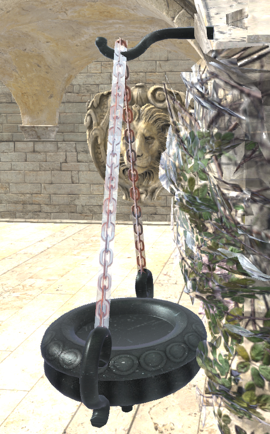
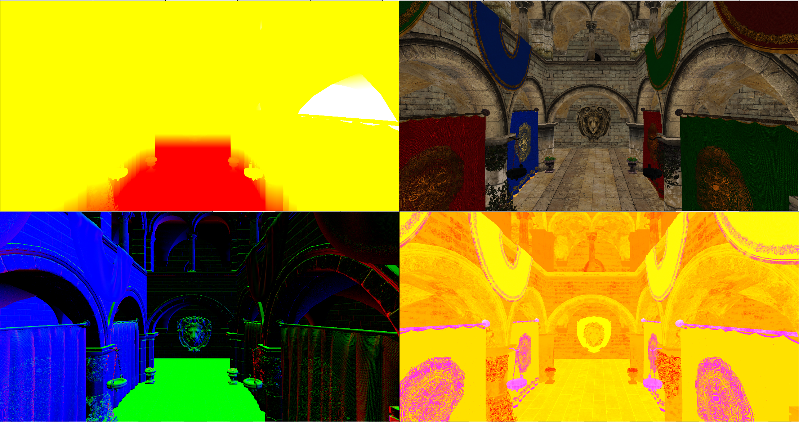
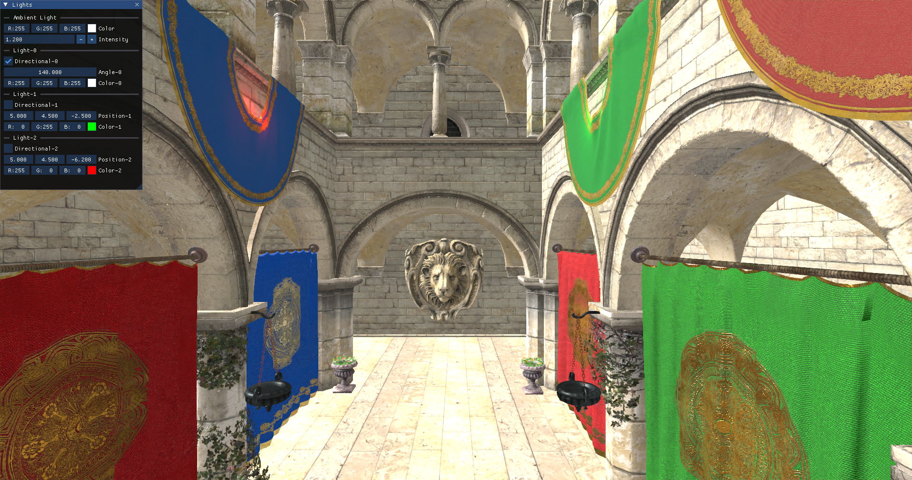

# Chapter 15 - Deferred Rendering (II)

In this chapter we will complete deferred shading example by adding support for lights and PBR (Physically based rendering) to improve the
visuals. You can find the complete source code for this chapter [here](../../booksamples/chapter-15).

## PBR

PBR tries to bring a more realistic way of handling lights, compared with simpler models such as Phong or Blinn-Phong models, but still
keeping it simple enough so it can be applied in real time. Instead of trying to summarize here what PBR consists of I will link to the best
tutorial I've found about this: [https://learnopengl.com/PBR/Theory](https://learnopengl.com/PBR/Theory). In that link you will be able to
read about theory and to see how it can be implemented. In fact, most of the PBR computation functions lighting fragment shader source
code are a copy of the ones defined in that page (developed by [Joey de Vries](https://twitter.com/JoeyDeVriez) and licensed under the
terms of the [CC BY-NC 4.0](https://creativecommons.org/licenses/by-nc/4.0/legalcode)).

## Material changes

We will need to modify the model generation code to load normal maps and PBR related material information from the models and dump it to
the generated files. We first need to update the `MeshIntData` struct to store normals, tangent and bitangent information since they will be
used for lighting calculations:

```zig
...
const zm = @import("zmath");
...
const MeshIntData = struct {
    ...
    normals: std.ArrayListUnmanaged([3]f32),
    tangents: std.ArrayListUnmanaged([3]f32),
    bitangents: std.ArrayListUnmanaged([3]f32),

    pub fn cleanup(self: *MeshIntData, allocator: std.mem.Allocator) void {
        ...
        self.normals.deinit(allocator);
        self.tangents.deinit(allocator);
        self.bitangents.deinit(allocator);
    }
};
```

We will start with the modifications in the `processMaterial` function, in which we will add the following code:

```zig
fn processMaterial(
    allocator: std.mem.Allocator,
    material: *const zmesh.io.zcgltf.Material,
    baseDir: []const u8,
    modelId: []const u8,
    pos: usize,
) !eng.mdata.MaterialData {
    ...
    var metalRoughMapPath: [*:0]const u8 = "";
    var metallicFactor: f32 = 0;
    var roughFactor: f32 = 0;
    if (material.has_pbr_metallic_roughness > 0) {
        ...
        if (material.pbr_metallic_roughness.metallic_roughness_texture.texture) |texture| {
            metalRoughMapPath = texture.image.?.uri.?;
        }
        ...
        metallicFactor = material.pbr_metallic_roughness.metallic_factor;
        roughFactor = material.pbr_metallic_roughness.roughness_factor;
    }
    var normalMapPath: [*:0]const u8 = "";
    if (material.normal_texture.texture) |texture| {
        normalMapPath = texture.image.?.uri.?;
    }
    const textRelPath = if (texturePath[0] != 0) try std.fmt.allocPrint(allocator, "{s}/{s}", .{ baseDir, std.mem.span(texturePath) }) else "";
    const normalMapRelPath = if (normalMapPath[0] != 0) try std.fmt.allocPrint(allocator, "{s}/{s}", .{ baseDir, std.mem.span(normalMapPath) }) else "";
    const metalRoughMapRelPath = if (metalRoughMapPath[0] != 0) try std.fmt.allocPrint(allocator, "{s}/{s}", .{ baseDir, std.mem.span(metalRoughMapPath) }) else "";
    const materialId = try std.fmt.allocPrint(allocator, "{s}-mat-{d}", .{ modelId, pos });
    return eng.mdata.MaterialData{
        .id = materialId,
        .texturePath = textRelPath,
        .color = color,
        .normalMapPath = normalMapRelPath,
        .metalRoughMapPath = metalRoughMapRelPath,
        .metallicFactor = metallicFactor,
        .roughFactor = roughFactor,
    };
}
```

We try to get the metal-roughness texture if the material has PBR information. We also try to get normal map texture if its available.
Normal maps are defined in the so called tangent space. The tangent space is a coordinate system that is local to each triangle of the
model. In that coordinate space the `z` axis always points out of the surface. This is the reason why a normal map is usually bluish,
even for complex models with opposing faces.
You can check a great tutorial on this aspect [here](https://learnopengl.com/Advanced-Lighting/Normal-Mapping).

We need to modify the `MaterialData` (in the `src/eng/modelData.zig` file) struct to be able to store that information:

```zig
pub const MaterialData = struct {
    ...
    normalMapPath: []const u8,
    metalRoughMapPath: []const u8,
    roughFactor: f32,
    metallicFactor: f32,    
};
```

In the same file we also need to update the `loadMaterials` function to handle the new data:

```zig
pub fn loadMaterials(allocator: std.mem.Allocator, path: []const u8) !std.ArrayList(MaterialData) {
    ...
    for (parsed.value.items) |materialData| {
        const ownedMaterialData = MaterialData{
            .color = materialData.color,
            .id = try allocator.dupe(u8, materialData.id),
            .texturePath = try allocator.dupe(u8, materialData.texturePath),
            .normalMapPath = try allocator.dupe(u8, materialData.normalMapPath),
            .metalRoughMapPath = try allocator.dupe(u8, materialData.metalRoughMapPath),
            .roughFactor = materialData.roughFactor,
            .metallicFactor = materialData.metallicFactor,
        };
        try materials.append(allocator, ownedMaterialData);
    }
    ...
}
```

## Model changes

Going back to the model generation code, we need also to get the normals of the model and the tangent and bitangent data when processing 
meshes. Therefore, we will modify the `processMesh` function:

```zig
fn processMesh(
    allocator: std.mem.Allocator,
    data: *zmesh.io.zcgltf.Data,
    primitive: *const zmesh.io.zcgltf.Primitive,
    meshIdx: u32,
    primIdx: u32,
    materialList: std.ArrayListUnmanaged(eng.mdata.MaterialData),
) !MeshIntData {
    ...
    var normals = std.ArrayListUnmanaged([3]f32){};
    var intTangents = std.ArrayListUnmanaged([4]f32){};
    var tangents = std.ArrayListUnmanaged([3]f32){};
    var bitangents = std.ArrayListUnmanaged([3]f32){};
    ...
    try zmesh.io.zcgltf.appendMeshPrimitive(
        allocator,
        data,
        meshIdx,
        @as(u32, @intCast(primIdx)),
        &indices,
        &positions,
        &normals,
        &texcoords,
        &intTangents,
    );

    const numTangents = intTangents.items.len;
    for (0..normals.items.len) |i| {
        const tangent = if (i < numTangents) intTangents.items[i] else [4]f32{ 0, 0, 0, 0 };
        try tangents.append(allocator, tangent[0..3].*);
        const normal = normals.items[i];
        const bitangent = calcBitangent(normal, tangent);
        try bitangents.append(allocator, bitangent);
    }

    return MeshIntData{
        .id = id,
        .materialId = materialId,
        .indices = indices,
        .positions = positions,
        .texcoords = texcoords,
        .normals = normals,
        .tangents = tangents,
        .bitangents = bitangents,
    };    
}
```

We just load the normals when calling the `appendMeshPrimitive` function and process the result. Some models may not have tangents data.
In this case, we just set a default value. We could calculate tangents for this case, but will leave as it this to not over-complicate code.
What we do need to calculate are bitangents, which is done in the `calcBitangent` function. 

```zig
pub fn calcBitangent(normal: [3]f32, tangent: [4]f32) [3]f32 {
    const normalVec = zm.normalize3(zm.loadArr3(normal));
    const tangentVec = zm.normalize3(zm.loadArr3(tangent[0..3].*));
    const crossResult = zm.cross3(normalVec, tangentVec);
    const bitangent = crossResult * @as(@Vector(4, f32), @splat(tangent[3]));
    return zm.vecToArr3(bitangent);
}
```

Finally, we just need to modify the code that dumps vertices information to a file:

```zig
pub fn main() !void {
    ...
            // Dump to vertices file
            for (meshIntData.positions.items, 0..) |_, idx| {
                try vtxFile.writeAll(std.mem.sliceAsBytes(std.mem.asBytes(&meshIntData.positions.items[idx])));
                if (idx < meshIntData.texcoords.items.len) {
                    try vtxFile.writeAll(std.mem.sliceAsBytes(std.mem.asBytes(&meshIntData.texcoords.items[idx])));
                } else {
                    try vtxFile.writeAll(std.mem.sliceAsBytes(std.mem.asBytes(&defText)));
                }
                try vtxFile.writeAll(std.mem.sliceAsBytes(std.mem.asBytes(&meshIntData.normals.items[idx])));
                try vtxFile.writeAll(std.mem.sliceAsBytes(std.mem.asBytes(&meshIntData.tangents.items[idx])));
                try vtxFile.writeAll(std.mem.sliceAsBytes(std.mem.asBytes(&meshIntData.bitangents.items[idx])));
            }

            const numIndices = meshIntData.indices.items.len;
            // There can be models with no texture coords, but we fill up with empty coords
            const numFloats = meshIntData.positions.items.len * 3 + meshIntData.texcoords.items.len * 2 +
                meshIntData.normals.items.len * 3 + meshIntData.tangents.items.len * 3 + meshIntData.bitangents.items.len * 3;

    ...
}
```

We will need to include the `zmath` module for the `modelGen` executable in the `build.zig` file:

```zig
pub fn build(b: *std.Build) void {
    ...
    const zmesh = b.dependency("zmesh", .{});
    modelGen.root_module.addImport("zmesh", zmesh.module("root"));
    modelGen.linkLibrary(zmesh.artifact("zmesh"));
    modelGen.root_module.addImport("zmath", zmath);
    b.installArtifact(modelGen);
}
```

## Data loading changes

We need to update the `MaterialData` (`modelData.zig`)struct to be able to include the new data:

```zig
pub const MaterialData = struct {
    ...
    normalMapPath: []const u8,
    metalRoughMapPath: []const u8,
    roughFactor: f32,
    metallicFactor: f32,
};
```

And also modify the `loadMaterials` function:

```zig
pub fn loadMaterials(allocator: std.mem.Allocator, path: []const u8) !std.ArrayList(MaterialData) {
    ...
    for (parsed.value.items) |materialData| {
        const ownedMaterialData = MaterialData{
            .color = materialData.color,
            .id = try allocator.dupe(u8, materialData.id),
            .texturePath = try allocator.dupe(u8, materialData.texturePath),
            .normalMapPath = try allocator.dupe(u8, materialData.normalMapPath),
            .metalRoughMapPath = try allocator.dupe(u8, materialData.metalRoughMapPath),
            .roughFactor = materialData.roughFactor,
            .metallicFactor = materialData.metallicFactor,
        };
        ...
    }
    ...
}
```

We need to modify the structure used while rendering the scene to be able to include the normals, tangents and bitangents as new input
attributes sop they can accessed in shaders:

```zig
const VtxBuffDesc = struct {
    ...
    const attribute_description = [_]vulkan.VertexInputAttributeDescription{
        ...  
        .{
            .binding = 0,
            .location = 2,
            .format = .r32g32b32_sfloat,
            .offset = @offsetOf(VtxBuffDesc, "normal"),
        },
        .{
            .binding = 0,
            .location = 3,
            .format = .r32g32b32_sfloat,
            .offset = @offsetOf(VtxBuffDesc, "tangent"),
        },
        .{
            .binding = 0,
            .location = 4,
            .format = .r32g32b32_sfloat,
            .offset = @offsetOf(VtxBuffDesc, "bitangent"),
        },
    };
    ...
    normal: [3]f32,
    tangent: [3]f32,
    bitangent: [3]f32,
};
```

We need to modify the `MaterialsCache` struct to to hold the associated information for normal map and metallic-roughness textures and
metallic and roughness factors. First we need to update the `MaterialBuffRecord` struct to include that information:

```zig
const MaterialBuffRecord = struct {
    ...
    hasNormalMap: u32,
    normalMapIdx: u32,
    hasRoughMap: u32,
    roughMapIdx: u32,
    metallicFactor: f32,
    roughFactor: f32,
};
```

We need also to update the `init` function of the `MaterialsCache` struct to process that information and load the new textures, when
present, in the textures cache:

```zig
pub const MaterialsCache = struct {
    ...
    pub fn init(
        self: *MaterialsCache,
        allocator: std.mem.Allocator,
        vkCtx: *const vk.ctx.VkCtx,
        textureCache: *eng.tcach.TextureCache,
        cmdPool: *vk.cmd.VkCmdPool,
        vkQueue: vk.queue.VkQueue,
        initData: *const eng.engine.InitData,
    ) !void {
        ...
        var defaultMaterial = eng.mdata.MaterialData{
            .color = [_]f32{ 1, 1, 1, 1 },
            .id = "DEFAULT_MATERIAL_ID",
            .texturePath = "",
            .normalMapPath = "",
            .metalRoughMapPath = "",
            .metallicFactor = 0,
            .roughFactor = 0,
        };
        ...
        for (materialsList.items, 0..) |materialData, i| {
            ...
            if (materialData.texturePath.len > 0) {
                ...
                if (try textureCache.addTextureFromPath(allocator, vkCtx, vulkan.Format.r8g8b8a8_srgb, nullTermPath)) {
                    ...
                }
            }
            var hasNormalMap: u32 = 0;
            var normalMapIdx: u32 = 0;
            if (materialData.normalMapPath.len > 0) {
                const nullTermPath = try allocator.dupeZ(u8, materialData.normalMapPath);
                defer allocator.free(nullTermPath);
                if (try textureCache.addTextureFromPath(allocator, vkCtx, vulkan.Format.r8g8b8a8_unorm, nullTermPath)) {
                    if (textureCache.textureMap.getIndex(nullTermPath)) |idx| {
                        normalMapIdx = @as(u32, @intCast(idx));
                        hasNormalMap = 1;
                    } else {
                        log.warn("Could not find normal map texture added to the cache [{s}]", .{materialData.normalMapPath});
                    }
                }
            }
            var hasRoughMap: u32 = 0;
            var roughMapIdx: u32 = 0;
            if (materialData.metalRoughMapPath.len > 0) {
                const nullTermPath = try allocator.dupeZ(u8, materialData.metalRoughMapPath);
                defer allocator.free(nullTermPath);
                if (try textureCache.addTextureFromPath(allocator, vkCtx, vulkan.Format.r8g8b8a8_unorm, nullTermPath)) {
                    if (textureCache.textureMap.getIndex(nullTermPath)) |idx| {
                        roughMapIdx = @as(u32, @intCast(idx));
                        hasRoughMap = 1;
                    } else {
                        log.warn("Could not find rough metal texture added to the cache [{s}]", .{materialData.metalRoughMapPath});
                    }
                }
            }
            const atBuffRecord = MaterialBuffRecord{
                .diffuseColor = materialData.color,
                .hasTexture = hasTexture,
                .textureIdx = textureIdx,
                .hasNormalMap = hasNormalMap,
                .normalMapIdx = normalMapIdx,
                .hasRoughMap = hasRoughMap,
                .roughMapIdx = roughMapIdx,
                .metallicFactor = materialData.metallicFactor,
                .roughFactor = materialData.roughFactor,
            };
            mappedData[i] = atBuffRecord;
            try self.materialsMap.put(materialId, vulkanMaterial);
        }
    }    
    ...
}
```

As you can see, we have modified the way we add textures in the texture cache to be able to pass a texture format. Normal and
metallic-roughness maps will have a different texture format (`r8g8b8a8_unorm` in this case) than the textures that will be used for the
albedo (`r8g8b8a8_srgb`). We do not want any color conversion to the normal maps. But, `r8g8b8a8_unorm` holds unsigned values, shouldn't
normal values contain signed values? The answer is yes, normals can have negative values. We will store as unsigned values in the texture
map (adjusting the values to match in the `[0-1]` range) and then and then apply a conversion when reading from the normal map.


The changes in the `TextureCache` struct are quite straightforward:

```zig
pub const TextureCache = struct {
    ...
    pub fn addTextureFromPath(self: *TextureCache, allocator: std.mem.Allocator, vkCtx: *const vk.ctx.VkCtx, format: vulkan.Format, path: [:0]const u8) !bool {
        ...
        const textureInfo = TextureInfo{ .id = path, .data = image.data, .width = image.width, .height = image.height, .format = format };
        ...
    }
    ...
};
```

## Lights

In order to apply lighting we need to add support for lights. Therefore, the first thing we should do is create new struct named `Light`
(defined in the `src/eng/scne.zig` file) which models a light:

```zig
pub const Light = struct {
    color: zm.Vec,
    directional: bool,
    intensity: f32,
    pos: zm.Vec,
};
```

We will support directional and point lights. A light is defined by a position (in the case of a point light) or a directional (in the case
of a directional light, for example the sun light). When using directional lights, the `pos` attribute will be the direction from the scene
to the light source. Lights will also have a color and an intensity.

We will need also to add support for ambient light (a color that will be added to all the fragments independently of their position and
normals). We will need a color for that light and an intensity. We will add all this information in the `Scene` struct along with the list
of lights.

```zig
pub const MAX_LIGHTS: u32 = 10;
pub const Scene = struct {
    // alpha component is intensity
    ambientLight: zm.Vec,
    ...
    lights: std.ArrayList(Light),
    ...
    pub fn addLight(self: *Scene, allocator: std.mem.Allocator, light: eng.scn.Light) !void {
        try self.lights.append(allocator, light);
    }

    pub fn create(allocator: std.mem.Allocator) !Scene {
        const camera = Camera.create();
        const entitiesMap = std.StringHashMap(*eng.ent.Entity).init(allocator);
        const lights = try std.ArrayList(Light).initCapacity(allocator, 1);
        const ambientLight = zm.Vec{ 1.0, 1.0, 1.0, 1.0 };

        return .{
            .ambientLight = ambientLight,
            .camera = camera,
            .entitiesMap = entitiesMap,
            .lights = lights,
        };
    }

    pub fn cleanup(self: *Scene, allocator: std.mem.Allocator) void {
        ...
        self.lights.deinit(allocator);
    } 
};   
```

We will see how we will use lighting information when viewing the modifications in the lighting stage.

## Scene render modifications

The `RenderScn` struct just require a slight change, we need to use more than one attachment. Since all of them will use the same format,
we already prepared the code in the previous chapter to be able to support more than one attachment. Therefore, we just need to update the
constant value used to model the number of attachments to `4`:

```zig
pub const RenderScn = struct {
    ...
    fn createColorAttachment(allocator: std.mem.Allocator, vkCtx: *const vk.ctx.VkCtx) ![]eng.rend.Attachment {
        ...
        const numAttachments = 4;
        ...
    }
    ...
};
```

We will be using the following output attachments:
- Position attachment, where we will write world position of each of the fragments (we will need this for lighting). You can avoid using
this attachment by reconstructing world position in the lighting stage from existing information playing with inverse projection matrices.
In our case, we will use it for simplicity. However, it is always a good idea to reduce the size of the attachments used in deferred render.
- Albedo attachment: the same attachment used in previous chapter where we just dump albedo color.
- Normals attachment which will hold normals data.
- The PBR attachment will hold information used for PBR shading (more on this later on). That is it will store information about the
roughness and metal factors of the materials.

In addition to that we will create a new utility function in the `vkUtils.zig` file to be able to create an array of buffers associated,
each of them, to a descriptor set, to be able to host per frame data, such as camera information, etc. The function is defined like this:

```zig
pub fn createHostVisibleBuffs(
    allocator: std.mem.Allocator,
    vkCtx: *vk.ctx.VkCtx,
    baseId: []const u8,
    numBuffers: u32,
    size: u64,
    bufferUsage: vulkan.BufferUsageFlags,
    descLayout: vk.desc.VkDescSetLayout,
) ![]vk.buf.VkBuffer {
    const buffers = try allocator.alloc(vk.buf.VkBuffer, numBuffers);
    for (buffers, 0..) |*buffer, i| {
        const id = try std.fmt.allocPrint(allocator, "{s}{d}", .{ baseId, i });
        defer allocator.free(id);
        buffer.* = try vk.util.createHostVisibleBuff(
            allocator,
            vkCtx,
            id,
            size,
            bufferUsage,
            descLayout,
        );
    }
    return buffers;
}
```

We will use this function in the `RenderScene` struct, in the `create` function when initializing the buffers, and their descriptor sets,
associated to camera information:

```zig
pub const RenderScn = struct {
    ...
    pub fn create(allocator: std.mem.Allocator, vkCtx: *vk.ctx.VkCtx) !RenderScn {
        ...
        const buffsCamera = try vk.util.createHostVisibleBuffs(
            allocator,
            vkCtx,
            DESC_ID_CAM,
            com.common.FRAMES_IN_FLIGHT,
            vk.util.MATRIX_SIZE * 2,
            .{ .uniform_buffer_bit = true },
            descLayoutVtx,
        );        
        ...
    }
    ...
};
```

Therefore, the `createCamBuffers` function is not needed any more.

It is turn now to examine the shaders. The `scn_vtx.glsl` vertex shader is defined like this:

```glsl
#version 450

layout(location = 0) in vec3 inPos;
layout(location = 1) in vec2 inTextCoords;
layout(location = 2) in vec3 inNormal;
layout(location = 3) in vec3 inTangent;
layout(location = 4) in vec3 inBitangent;

layout(location = 0) out vec4 outPos;
layout(location = 1) out vec3 outNormal;
layout(location = 2) out vec3 outTangent;
layout(location = 3) out vec3 outBitangent;
layout(location = 4) out vec2 outTextCoords;

layout(set = 0, binding = 0) uniform CamUniform {
    mat4 projMatrix;
    mat4 viewMatrix;
} camUniform;

layout(push_constant) uniform pc {
    mat4 modelMatrix;
} push_constants;

void main()
{
    vec4 worldPos = push_constants.modelMatrix * vec4(inPos, 1);
    gl_Position   = camUniform.projMatrix * camUniform.viewMatrix * worldPos;
    mat3 mNormal  = transpose(inverse(mat3(push_constants.modelMatrix)));
    outPos        = worldPos;
    outNormal     = normalize(mNormal * inNormal);
    outTangent    = normalize(mNormal * inTangent);
    outBitangent  = normalize(mNormal * inBitangent);
    outTextCoords = inTextCoords;
}
```

As you can see, since we have modified the vertex buffer structure, we need to define the new input attributes for the normal, tangent and
bitangent coordinates. We will transform these values in this shader and pass them to the fragment shader (to dump them in the output
attachments). As you can see the normals, tangents and bitangents are transformed transposing and inverting the model matrix since they
are directional vectors and we need to preserve their orthogonality.

The `scn_frg.glsl` fragment shader is defined like this:

```glsl
#version 450

// Keep in sync manually with code
const int MAX_TEXTURES = 100;

layout(location = 0) in vec4 inPos;
layout(location = 1) in vec3 inNormal;
layout(location = 2) in vec3 inTangent;
layout(location = 3) in vec3 inBitangent;
layout(location = 4) in vec2 inTextCoords;

layout(location = 0) out vec4 outPos;
layout(location = 1) out vec4 outAlbedo;
layout(location = 2) out vec4 outNormal;
layout(location = 3) out vec4 outPBR;

struct Material {
    vec4 diffuseColor;
    uint hasTexture;
    uint textureIdx;
    uint hasNormalMap;
    uint normalMapIdx;
    uint hasRoughMap;
    uint roughMapIdx;
    float roughnessFactor;
    float metallicFactor;
};

layout(set = 1, binding = 0) readonly buffer MaterialUniform {
    Material materials[];
} matUniform;

layout(set = 2, binding = 0) uniform sampler2D textSampler[MAX_TEXTURES];

layout(push_constant) uniform pc {
    layout(offset = 64) uint materialIdx;
} push_constants;

vec3 calcNormal(Material material, vec3 normal, vec2 textCoords, mat3 TBN)
{
    vec3 newNormal = normal;
    if (material.hasNormalMap > 0)
    {
        newNormal = texture(textSampler[material.normalMapIdx], textCoords).rgb;
        newNormal = normalize(newNormal * 2.0 - 1.0);
        newNormal = normalize(TBN * newNormal);
    }
    return newNormal;
}

void main()
{
    outPos = inPos;

    Material material = matUniform.materials[push_constants.materialIdx];
    if (material.hasTexture == 1) {
        outAlbedo = texture(textSampler[material.textureIdx], inTextCoords);
    } else {
        outAlbedo = material.diffuseColor;
    }

    // Hack to avoid transparent PBR artifacts
    if (outAlbedo.a < 0.5) {
        discard;
    }

    mat3 TBN = mat3(inTangent, inBitangent, inNormal);
    vec3 newNormal = calcNormal(material, inNormal, inTextCoords, TBN);
    outNormal = vec4(newNormal, 1.0);

    float ao = 1.0f;
    float roughnessFactor = 0.0f;
    float metallicFactor = 0.0f;
    if (material.hasRoughMap > 0) {
        vec4 metRoughValue = texture(textSampler[material.roughMapIdx], inTextCoords);
        roughnessFactor = metRoughValue.g;
        metallicFactor = metRoughValue.b;
    } else {
        roughnessFactor = material.roughnessFactor;
        metallicFactor = material.metallicFactor;
    }

    outPBR = vec4(ao, roughnessFactor, metallicFactor, 1.0f);
}
```

This shader defines three new output attachments, one for the world position, the normals and the other one for the PBR data (ambient
occlusion, roughness factor and metallic factor). The `Material` structure has also been modified to hold the new attributes. The
`calcNormal` function is used to transform the normals if a normal map has been defined. If the material has defined a normals map, we
sample from it using the texture coordinates and transform it to the range [-1, 1] (Texture values are defined in the range [0, 1]). After
that, we multiply the normal by the TBN matrix. What is the reason for this? Normal maps are usually built so the normal coordinates point
in the positive z direction (that is why the usually have that blueish color). They are expressed in tangent space. We need to transform
them to world coordinates space, this is why we multiply them by the TBN (Tangent Bitangent Normal) matrix. You can find an excellent
explanation about the calculations [Normal mapping](https://learnopengl.com/Advanced-Lighting/Normal-Mapping). 

The main block gets the albedo color as in the previous chapter, but, after that, we discard fragments with an alpha value below a certain
threshold. This is a trick to avoid apply lighting to transparent fragments. But, why do we do that? We are already rendering first non
transparent objects. The reason for that, is that we are outputting not only color information but normals and PBR data, which will be used
in the lighting stage to calculate final color. And by doing so, we are blending, not only color information (which would work ok just by
rendering non transparent objects first), but all this additional information (normals, etc.). We would be getting normals that are a
mix of the non transparent fragment with the transparent ones. You can see in next figure the effect of applying and not applying this fix,
when examining some transparent objects:



So, why not just simply apply blending to just the albedo attachment? If we would do that, we would have another problem, which normal
information we would get? We would be viewing albedo information which is a mix of the different fragments with the normal information of
the less distant one, which may be the transparent one. The solution we apply, although is not ideal, it is good enough. The fact is that
deferred rendering does not deal very well with transparencies. In fact, the recommended approach is to render transparent objects in a
separate render stage with a "forward" render approach.

Since we are using Vulkan 1.3 (and compiling the shaders for that version), in order to use the `discard` keyword we need to enable the
shader demote helper invocation feature. The reason for that is that the shader compiler may translate discard into
OpDemoteToHelperInvocation opperation. In this case, the fragment is not usually killed immediately, it ends up into a call to a helper
demote function invocation. We need to enable this in the device creation function:

```zig
pub const VkDevice = struct {
    ...
    pub fn create(allocator: std.mem.Allocator, vkInstance: vk.inst.VkInstance, vkPhysDevice: vk.phys.VkPhysDevice) !VkDevice {
        ...
        const features3 = vulkan.PhysicalDeviceVulkan13Features{
            ...
            .shader_demote_to_helper_invocation = vulkan.Bool32.true,
            ...
        };        
        ...
    }
    ...
};
```

The following picture shows how the output attachments look like (excluding depth attachment) when the scene render finishes.



## Light stage modifications

In order to use lights in the shaders we need modify the `RenderLight` struct:

```zig
const DESC_ID_LIGHTS = "RENDER_LIGHT_DESC_ID_LIGHTS";
const DESC_ID_SCENE_INFO = "RENDER_LIGHT_DESC_ID_SCENE_INFO";
const LIGHTS_BYTES_SIZE: u32 = 32;
const SCENE_INFO_BYTES_SIZE: u32 = 32;
...
pub const RenderLight = struct {
    buffsLights: []vk.buf.VkBuffer,
    buffsSceneInfo: []vk.buf.VkBuffer,
    descLayoutAtt: vk.desc.VkDescSetLayout,
    descLayoutLights: vk.desc.VkDescSetLayout,
    descLayoutScene: vk.desc.VkDescSetLayout,
    ...
    pub fn cleanup(self: *RenderLight, allocator: std.mem.Allocator, vkCtx: *vk.ctx.VkCtx) void {
        for (self.buffsLights) |*buffer| {
            buffer.cleanup(vkCtx);
        }
        allocator.free(self.buffsLights);
        for (self.buffsSceneInfo) |*buffer| {
            buffer.cleanup(vkCtx);
        }
        allocator.free(self.buffsSceneInfo);
        self.descLayoutAtt.cleanup(vkCtx);
        self.descLayoutLights.cleanup(vkCtx);
        self.descLayoutScene.cleanup(vkCtx);
        ....
    }

    pub fn create(
        allocator: std.mem.Allocator,
        vkCtx: *vk.ctx.VkCtx,
        inputAttachments: *const []eng.rend.Attachment,
    ) !RenderLight {
        ...
        // Descriptor set: Attachments
        const layoutInfos = try allocator.alloc(vk.desc.LayoutInfo, inputAttachments.len);
        defer allocator.free(layoutInfos);
        const imageViews = try allocator.alloc(vk.imv.VkImageView, inputAttachments.len);
        defer allocator.free(imageViews);
        for (0..inputAttachments.len) |i| {
            layoutInfos[i] = vk.desc.LayoutInfo{
                .binding = @as(u32, @intCast(i)),
                .descCount = 1,
                .descType = vulkan.DescriptorType.combined_image_sampler,
                .stageFlags = vulkan.ShaderStageFlags{ .fragment_bit = true },
            };
            imageViews[i] = inputAttachments.ptr[i].vkImageView;
        }
        const descLayoutAtt = try vk.desc.VkDescSetLayout.create(
            allocator,
            vkCtx,
            layoutInfos,
        );
        const attDescSet = try vkCtx.vkDescAllocator.addDescSet(
            allocator,
            vkCtx.vkPhysDevice,
            vkCtx.vkDevice,
            DESC_ID_LIGHT_TEXT_SAMPLER,
            descLayoutAtt,
        );
        try attDescSet.setImages(allocator, vkCtx.vkDevice, imageViews, textSampler, 0);

        // Descriptor set: Lights
        const descLayoutLights = try vk.desc.VkDescSetLayout.create(allocator, vkCtx, &[_]vk.desc.LayoutInfo{.{
            .binding = 0,
            .descCount = 1,
            .descType = vulkan.DescriptorType.storage_buffer,
            .stageFlags = vulkan.ShaderStageFlags{ .fragment_bit = true },
        }});
        const buffsLights = try vk.util.createHostVisibleBuffs(
            allocator,
            vkCtx,
            DESC_ID_LIGHTS,
            com.common.FRAMES_IN_FLIGHT,
            @sizeOf(eng.scn.Light) * eng.scn.MAX_LIGHTS,
            .{ .storage_buffer_bit = true },
            descLayoutLights,
        );

        // Descriptor set: SceneInfo
        const descLayoutScene = try vk.desc.VkDescSetLayout.create(allocator, vkCtx, &[_]vk.desc.LayoutInfo{.{
            .binding = 0,
            .descCount = 1,
            .descType = vulkan.DescriptorType.uniform_buffer,
            .stageFlags = vulkan.ShaderStageFlags{ .fragment_bit = true },
        }});
        const buffsSceneInfo = try vk.util.createHostVisibleBuffs(
            allocator,
            vkCtx,
            DESC_ID_SCENE_INFO,
            com.common.FRAMES_IN_FLIGHT,
            SCENE_INFO_BYTES_SIZE,
            .{ .uniform_buffer_bit = true },
            descLayoutScene,
        );

        const descSetLayouts = [_]vulkan.DescriptorSetLayout{
            descLayoutAtt.descSetLayout,
            descLayoutLights.descSetLayout,
            descLayoutScene.descSetLayout,
        };
        ...
        return .{
            .buffsLights = buffsLights,
            .buffsSceneInfo = buffsSceneInfo,
            .descLayoutAtt = descLayoutAtt,
            .descLayoutLights = descLayoutLights,
            .descLayoutScene = descLayoutScene,
            .outputAtt = outputAtt,
            .textSampler = textSampler,
            .vkPipeline = vkPipeline,
        };
    }
    ...
};
```

We will use two new descriptor sets, one to store light information and the other one to store general scene information (ambient light,
total number of active lights, and the camera position which will be used in light computation). Lights information will be exposed to the
shader as an storage buffer (it will be basically an array of lights) while scene information will be a uniform. For both descriptor sets
we will use buffers. Since the information stored in them may change in each frame we will use an array of buffers with as many instances
as frames in flight.

In the `render` function we will use those new descriptor sets and call two `update` functions (`updateSceneInfo` and `updateLights`) to
store the proper data in the associated buffers:

```java
public class LightRender {
    ...
    public void render(EngCtx engCtx, VkCtx vkCtx, CmdBuffer cmdBuffer, MrtAttachments mrtAttachments, int currentFrame) {
        ...
            LongBuffer descriptorSets = stack.mallocLong(3)
                    .put(0, descAllocator.getDescSet(DESC_ID_ATT).getVkDescriptorSet())
                    .put(1, descAllocator.getDescSet(DESC_ID_LIGHTS, currentFrame).getVkDescriptorSet())
                    .put(2, descAllocator.getDescSet(DESC_ID_SCENE, currentFrame).getVkDescriptorSet());

            Scene scene = engCtx.scene();
            updateSceneInfo(vkCtx, scene, currentFrame);
            updateLights(vkCtx, scene, currentFrame);
        ...
    }
    ...
}
```

The `updateSceneInfo` is defined like this:

```zig
pub const RenderLight = struct {
    ...
    pub fn render(
        self: *RenderLight,
        vkCtx: *const vk.ctx.VkCtx,
        engCtx: *const eng.engine.EngCtx,
        vkCmd: vk.cmd.VkCmdBuff,
        frameIdx: u8,
    ) !void {
        ...
        try self.updateLights(vkCtx, &engCtx.scene, frameIdx);
        try self.updateSceneInfo(vkCtx, &engCtx.scene, frameIdx);

        // Bind descriptor sets
        const vkDescAllocator = vkCtx.vkDescAllocator;
        var descSets = try std.ArrayList(vulkan.DescriptorSet).initCapacity(allocator, 3);
        defer descSets.deinit(allocator);
        try descSets.append(allocator, vkDescAllocator.getDescSet(DESC_ID_LIGHT_TEXT_SAMPLER).?.descSet);
        const lightDescId = try std.fmt.allocPrint(allocator, "{s}{d}", .{ DESC_ID_LIGHTS, frameIdx });
        defer allocator.free(lightDescId);
        try descSets.append(allocator, vkDescAllocator.getDescSet(lightDescId).?.descSet);
        const sceneDescId = try std.fmt.allocPrint(allocator, "{s}{d}", .{ DESC_ID_SCENE_INFO, frameIdx });
        defer allocator.free(sceneDescId);
        try descSets.append(allocator, vkDescAllocator.getDescSet(sceneDescId).?.descSet);
        ...
    }
    ...
};
```
The `updateLights` function just iterates over the lights array and dump its data to the buffer associated to current frame:

```zig
pub const RenderLight = struct {
    ...
    fn updateLights(
        self: *RenderLight,
        vkCtx: *const vk.ctx.VkCtx,
        scene: *const eng.scn.Scene,
        frameIdx: u8,
    ) !void {
        const buffData = try self.buffsLights[frameIdx].map(vkCtx);
        defer self.buffsLights[frameIdx].unMap(vkCtx);
        const gpuBytes: [*]u8 = @ptrCast(buffData);

        const numLights = scene.lights.items.len;
        var offset: usize = 0;
        for (0..numLights) |i| {
            const light = scene.lights.items[i];

            // Position
            const posBytes = std.mem.asBytes(&light.pos);
            @memcpy(gpuBytes[offset..][0..12], posBytes[0..12]);
            offset += 12;

            const directional: u32 = if (light.directional) 1.0 else 0.0;
            const dirBytes = std.mem.toBytes(directional);
            @memcpy(gpuBytes[offset..][0..4], &dirBytes);
            offset += 4;

            const intensityBytes = std.mem.toBytes(light.intensity);
            @memcpy(gpuBytes[offset..][0..4], &intensityBytes);
            offset += 4;

            const colorBytes = std.mem.asBytes(&light.color);
            @memcpy(gpuBytes[offset..][0..12], colorBytes[0..12]);
            offset += 12;
        }
    }
...
};
```

In the `updateSceneInfo` function we e just dump ambient light, camera position, ambient light values and the number of lights that are
active (remember that we have a maximum number of lights, but we can just have just one or two active). 

```zig
pub const RenderLight = struct {
    ...
    fn updateSceneInfo(
        self: *RenderLight,
        vkCtx: *const vk.ctx.VkCtx,
        scene: *const eng.scn.Scene,
        frameIdx: u8,
    ) !void {
        const buffData = try self.buffsSceneInfo[frameIdx].map(vkCtx);
        defer self.buffsSceneInfo[frameIdx].unMap(vkCtx);
        const gpuBytes: [*]u8 = @ptrCast(buffData);

        var offset: usize = 0;
        const ambientLightBytes = std.mem.asBytes(&scene.ambientLight);
        @memcpy(gpuBytes[offset..], ambientLightBytes);
        offset += ambientLightBytes.len;

        const posBytes = std.mem.asBytes(&scene.camera.viewData.pos);
        @memcpy(gpuBytes[offset..][0..12], posBytes[0..12]);
        offset += 12;

        const numLights = scene.lights.items.len;
        const numLightsBytes = std.mem.toBytes(numLights);
        @memcpy(gpuBytes[offset..], &numLightsBytes);
    }    
};
```

The lighting vertex shader (`light_vtx.glsl`) has not been modified at all. However, the lighting fragment shader (`light_frg.glsl`) has
been heavily changed. It starts like this:

```glsl
#version 450
#extension GL_EXT_scalar_block_layout: require

// CREDITS: Most of the functions here have been obtained from this link: https://github.com/SaschaWillems/Vulkan
// developed by Sascha Willems, https://twitter.com/JoeyDeVriez, and licensed under the terms of the MIT License (MIT)

layout(location = 0) in vec2 inTextCoord;

layout(location = 0) out vec4 outFragColor;

layout(set = 0, binding = 0) uniform sampler2D posSampler;
layout(set = 0, binding = 1) uniform sampler2D albedoSampler;
layout(set = 0, binding = 2) uniform sampler2D normalsSampler;
layout(set = 0, binding = 3) uniform sampler2D pbrSampler;

const float PI = 3.14159265359;

struct Light {
    vec3 position;
    uint directional;
    float intensity;
    vec3 color;
};

layout(scalar, set = 1, binding = 0) readonly buffer Lights {
    Light lights[];
} lights;

layout(scalar, set = 2, binding = 0) uniform SceneInfo {
    vec4 ambientLight;
    vec3 camPos;
    uint numLights;
} sceneInfo;
...
```

The fragment shader still only receives the texture coordinates and generates an output color. It uses four input attachments that
will be sampled as textures. These are the outputs generated in the scene render stage. We define some constants and then the structure to
hold lights information (a position, if its directional or not, its intensity and color). Lights are contained in an storage buffer which
defines an array of lights. Finally there is a uniform that stores camera  position, the ambient color and the number of lights. You may have
noticed that we are using a new layout format in the uniform, the `scalar` one. This layout allows us to use a more flexible layout of data,
without having to fulfill `std140` constraints. Basically it will remove the need to use padding data. In order to use it in the shaders, we
need to enable the `GL_EXT_scalar_block_layout` GLSL extension to use it, this is why we include the line
`#extension GL_EXT_scalar_block_layout: require`.

The next functions apply the PBR techniques to modify the fragment color associated to each light. As it has been said before, you can find
a great explanation here: [PBR](https://learnopengl.com/PBR/Theory) (It makes no sense to repeat that here):

```glsl
...
float distributionGGX(vec3 N, vec3 H, float roughness) {
    float a = roughness * roughness;
    float a2 = a * a;
    float NdotH = max(dot(N, H), 0.0);
    float NdotH2 = NdotH * NdotH;

    float nom = a2;
    float denom = (NdotH2 * (a2 - 1.0) + 1.0);
    denom = PI * denom * denom;

    return nom / denom;
}

float geometrySchlickGGX(float NdotV, float roughness) {
    float r = (roughness + 1.0);
    float k = (r * r) / 8.0;

    float nom = NdotV;
    float denom = NdotV * (1.0 - k) + k;

    return nom / denom;
}

float geometrySmith(vec3 N, vec3 V, vec3 L, float roughness) {
    float NdotV = max(dot(N, V), 0.0);
    float NdotL = max(dot(N, L), 0.0);
    float ggx2 = geometrySchlickGGX(NdotV, roughness);
    float ggx1 = geometrySchlickGGX(NdotL, roughness);

    return ggx1 * ggx2;
}

vec3 fresnelSchlick(float cosTheta, vec3 F0) {
    return F0 + (1.0 - F0) * pow(clamp(1.0 - cosTheta, 0.0, 1.0), 5.0);
}

vec3 calculatePointLight(Light light, vec3 worldPos, vec3 V, vec3 N, vec3 F0, vec3 albedo, float metallic, float roughness) {
    vec3 tmpSub = light.position - worldPos;
    vec3 L = normalize(tmpSub);
    vec3 H = normalize(V + L);

    // Calculate distance and attenuation
    float distance = length(tmpSub);
    float attenuation = 1.0 / (distance * distance);
    vec3 radiance = light.color * light.intensity * attenuation;

    // Cook-Torrance BRDF
    float NDF = distributionGGX(N, H, roughness);
    float G = geometrySmith(N, V, L, roughness);
    vec3 F = fresnelSchlick(max(dot(H, V), 0.0), F0);

    vec3 numerator = NDF * G * F;
    float denominator = 4.0 * max(dot(N, V), 0.0) * max(dot(N, L), 0.0) + 0.0001;
    vec3 specular = numerator / denominator;

    vec3 kS = F;
    vec3 kD = vec3(1.0) - kS;
    kD *= 1.0 - metallic;

    float NdotL = max(dot(N, L), 0.0);
    return (kD * albedo / PI + specular) * radiance * NdotL;
}

vec3 calculateDirectionalLight(Light light, vec3 V, vec3 N, vec3 F0, vec3 albedo, float metallic, float roughness) {
    vec3 L = normalize(-light.position);
    vec3 H = normalize(V + L);

    vec3 radiance = light.color * light.intensity;

    // Cook-Torrance BRDF
    float NDF = distributionGGX(N, H, roughness);
    float G = geometrySmith(N, V, L, roughness);
    vec3 F = fresnelSchlick(max(dot(H, V), 0.0), F0);

    vec3 numerator = NDF * G * F;
    float denominator = 4.0 * max(dot(N, V), 0.0) * max(dot(N, L), 0.0) + 0.0001;
    vec3 specular = numerator / denominator;

    vec3 kS = F;
    vec3 kD = vec3(1.0) - kS;
    kD *= 1.0 - metallic;

    float NdotL = max(dot(N, L), 0.0);
    return (kD * albedo / PI + specular) * radiance * NdotL;
}

vec3 calculateEnvironmentReflection(vec3 N, vec3 V, vec3 albedo, float metallic, float roughness) {
    // Basic reflection vector
    vec3 R = reflect(-V, N);
    
    // For now, use a simple gradient sky
    float horizon = smoothstep(-0.1, 0.1, R.y);
    vec3 skyColor = mix(
        vec3(0.5, 0.7, 1.0),  // Sky blue
        vec3(0.8, 0.9, 1.0),  // Horizon white
        horizon
    );
    
    // Ground color
    vec3 groundColor = vec3(0.2, 0.2, 0.3);
    
    // Blend based on reflection direction
    vec3 envColor = mix(groundColor, skyColor, smoothstep(-0.5, 0.5, R.y));
    
    // Fresnel effect for environment
    vec3 F0 = mix(vec3(0.04), albedo, metallic);
    vec3 F = F0 + (1.0 - F0) * pow(1.0 - max(dot(N, V), 0.0), 5.0);
    
    // Roughness affects blurriness of reflection
    // Simplified: lower roughness = stronger, clearer reflection
    float reflectionStrength = (1.0 - roughness) * F.r;
    
    return envColor * reflectionStrength;
}
...
```

The main block is defined like this:

```glsl
...
void main() {
    vec3 albedo   = texture(albedoSampler, inTextCoord).rgb;
    vec3 normal   = texture(normalsSampler, inTextCoord).rgb;
    vec3 worldPos = texture(posSampler, inTextCoord).rgb;
    vec3 pbr      = texture(pbrSampler, inTextCoord).rgb;
    vec3 ambientLightColor = sceneInfo.ambientLight.rgb;
    float ambientLightIntensity = sceneInfo.ambientLight.a;

    float ao = pbr.r;
    float roughness = pbr.g;
    float metallic  = pbr.b;

    vec3 N = normalize(normal);
    vec3 V = normalize(sceneInfo.camPos - worldPos);

    vec3 F0 = vec3(0.04);
    F0 = mix(F0, albedo, metallic);

    vec3 Lo = vec3(0.0);
    for (uint i = 0; i < sceneInfo.numLights; i++) {
        Light light = lights.lights[i];
        if (light.directional == 1) {
            Lo += calculateDirectionalLight(light, V, N, F0, albedo, metallic, roughness);
        } else {
            Lo += calculatePointLight(light, worldPos, V, N, F0, albedo, metallic, roughness);
        }
    }
    vec3 ambient = ambientLightColor * albedo * ambientLightIntensity * ao;
    vec3 envReflection = calculateEnvironmentReflection(N, V, albedo, metallic, roughness);
    vec3 color = ambient + Lo + envReflection;

    outFragColor = vec4(color, 1.0);
}
```

We first sample the albedo, normal map, world position and the PBR attachment according to current fragment coordinates. With all that
information we can perform lighting calculation. We have two types of light, directional (which are defined by a direction) and point lights
(which are defined by a position). In the case of directional lights, there will be no attenuation and will use its direction as the
position. In the case of point lights we calculate the attenuation based on the distance with the fragment position. We calculate how much
each light contributes to the final color, which is composed by an ambient factor and the sum of all light contributions.

## Other modifications

In the `Render` struct, we need to add minimal changes to handle changes in the paremeters of the `cleanup` and `render` functions in the
`RenderLight` struct:

```zig
pub const Render = struct {
    ...
    pub fn cleanup(self: *Render, allocator: std.mem.Allocator) !void {
        ...
        self.renderLight.cleanup(allocator, &self.vkCtx);
        ...
    }    
    ...
    pub fn render(self: *Render, engCtx: *eng.engine.EngCtx) !void {
        ...
        try self.renderLight.render(
            &self.vkCtx,
            engCtx,
            vkCmdBuff,
            self.currentFrame,
        );
        ...
    }
    ...
};
```

## Setting up some lights

The last step is to setup some lights in our scene. We will define the ambient light color, a directional light and one green point light.
We will add also a small GUI to be able to tune light properties:

```zig
...
const zgui = @import("zgui");
...
const Game = struct {
    ...
    lightAngle: f32 = 140.0,
    ...
    pub fn init(self: *Game, engCtx: *eng.engine.EngCtx, arenaAlloc: std.mem.Allocator) !eng.engine.InitData {
        ...
        engCtx.scene.ambientLight = zm.Vec{ 1.0, 1.0, 1.0, 0.9 };

        const dirLight = eng.scn.Light{
            .color = zm.Vec{ 1.0, 1.0, 1.0, 1.0 },
            .directional = true,
            .intensity = 10.0,
            .pos = zm.Vec{
                0.0,
                -std.math.sin(std.math.degreesToRadians(self.lightAngle)),
                -std.math.cos(std.math.degreesToRadians(self.lightAngle)),
                0.0,
            },
        };
        try engCtx.scene.addLight(engCtx.allocator, dirLight);

        const pointLight1 = eng.scn.Light{
            .color = zm.Vec{ 0.0, 1.0, 0.0, 1.0 },
            .directional = false,
            .intensity = 1.0,
            .pos = zm.Vec{ 5.0, 4.5, -2.5, 0.0 },
        };
        try engCtx.scene.addLight(engCtx.allocator, pointLight1);
        const pointLight2 = eng.scn.Light{
            .color = zm.Vec{ 1.0, 0.0, 0.0, 1.0 },
            .directional = false,
            .intensity = 1.0,
            .pos = zm.Vec{ 5.0, 4.5, -6.2, 0.0 },
        };
        try engCtx.scene.addLight(engCtx.allocator, pointLight2);
        ...        
    }

    fn handleGui(self: *Game, engCtx: *eng.engine.EngCtx) !bool {
        const scene = &engCtx.scene;
        const mouseState = engCtx.wnd.mouseState;
        zgui.io.addMousePositionEvent(mouseState.x, mouseState.y);
        zgui.io.addMouseButtonEvent(zgui.MouseButton.left, mouseState.flags.left);
        zgui.io.addMouseButtonEvent(zgui.MouseButton.middle, mouseState.flags.middle);
        zgui.io.addMouseButtonEvent(zgui.MouseButton.right, mouseState.flags.right);

        var open = true;
        zgui.newFrame();
        zgui.setNextWindowPos(.{ .x = 0, .y = 0 });
        zgui.setNextWindowSize(.{ .w = 300, .h = 400 });
        _ = zgui.begin("Lights", .{ .popen = &open });
        zgui.separatorText("Ambient Light");
        var ambientCol = [3]f32{ scene.ambientLight[0], scene.ambientLight[1], scene.ambientLight[2] };
        if (zgui.colorEdit3("Color", .{ .col = &ambientCol, .flags = zgui.ColorEditFlags{} })) {
            scene.ambientLight[0] = ambientCol[0];
            scene.ambientLight[1] = ambientCol[1];
            scene.ambientLight[2] = ambientCol[2];
        }
        var ambientLightIntensity = scene.ambientLight[3];
        if (zgui.inputFloat("Intensity", .{ .v = &ambientLightIntensity, .step = 0.1 })) {
            scene.ambientLight[3] = ambientLightIntensity;
        }

        const lights = &scene.lights;
        const numLights = lights.items.len;
        for (0..numLights) |i| {
            var light = &lights.items[i];

            var buf1: [32:0]u8 = undefined;
            const lightId = try std.fmt.bufPrintZ(&buf1, "Light-{d}", .{i});
            zgui.separatorText(lightId);

            var buf2: [32:0]u8 = undefined;
            const dirId = try std.fmt.bufPrintZ(&buf2, "Directional-{d}", .{i});
            var dirLight: bool = light.directional;
            _ = zgui.checkbox(dirId, .{ .v = &dirLight });
            if (light.directional) {
                var buf3: [32:0]u8 = undefined;
                const posId = try std.fmt.bufPrintZ(&buf3, "Angle-{d}", .{i});
                if (zgui.dragFloat(posId, .{ .v = &self.lightAngle, .speed = 1.00 })) {
                    if (self.lightAngle < 0) {
                        self.lightAngle = 0;
                    } else if (self.lightAngle > 180) {
                        self.lightAngle = 180;
                    }
                    light.pos[1] = -std.math.sin(std.math.degreesToRadians(self.lightAngle));
                    light.pos[2] = -std.math.cos(std.math.degreesToRadians(self.lightAngle));
                    light.pos = zm.normalize4(light.pos);
                }
            } else {
                var lightPos = [3]f32{ light.pos[0], light.pos[1], light.pos[2] };
                var buf3: [32:0]u8 = undefined;
                const posId = try std.fmt.bufPrintZ(&buf3, "Position-{d}", .{i});
                if (zgui.dragFloat3(posId, .{ .v = &lightPos, .speed = 0.05 })) {
                    light.pos[0] = lightPos[0];
                    light.pos[1] = lightPos[1];
                    light.pos[2] = lightPos[2];
                }
            }

            var lightCol = [3]f32{ light.color[0], light.color[1], light.color[2] };
            var buf4: [32:0]u8 = undefined;
            const lightColorId = try std.fmt.bufPrintZ(&buf4, "Color-{d}", .{i});

            if (zgui.colorEdit3(lightColorId, .{ .col = &lightCol, .flags = zgui.ColorEditFlags{} })) {
                light.color[0] = lightCol[0];
                light.color[1] = lightCol[1];
                light.color[2] = lightCol[2];
            }
        }
        zgui.end();
        zgui.endFrame();
        zgui.render();

        return zgui.io.getWantCaptureKeyboard() or zgui.io.getWantCaptureMouse();
    }

    pub fn input(self: *Game, engCtx: *eng.engine.EngCtx, deltaSec: f32) void {
        const guiHandled: bool = self.handleGui(engCtx) catch |err| {
            std.log.err("Error in handleGui: {any}", .{err});
            return;
        };
        if (guiHandled) {
            return;
        }
        ...
    }
    ...
};
```

With all these changes, you will get something like this:



[Next chapter](../chapter-16/chapter-16.md)