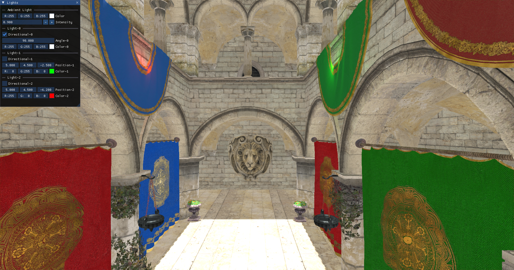
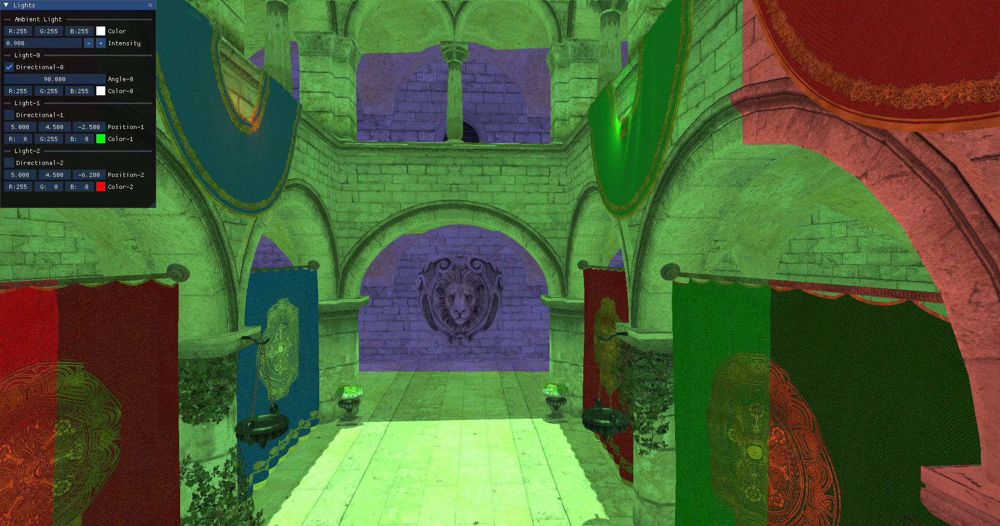

# Chapter 16 - Cascade Shadows

In this chapter, we will add shadows to the scene applying Cascaded Shadow Maps (CSM). This chapter applies the techniques shown by Sascha
Willems in his Vulkan examples. Specifically, it uses part of the source code for the examples related to
[cascaded shadow mapping](https://github.com/SaschaWillems/Vulkan/blob/master/examples/shadowmappingcascade). I cannot stress enough how
good the examples are provided by Sascha Willems, you should carefully have a look at them. Over that code we will implement some changes
to improve shadow quality and render them in a more efficient way.

You can find the complete source code for this chapter [here](../../booksamples/chapter-16).

## Cascade shadow mapping overview

In order to render shadows, we need to render the scene from the light point of view creating a depth map. Later on, when rendering the
scene, we transform the coordinates of the fragment being rendered to the light view space and check its depth. If its depth is lower than
the depth stored in the depth map for those coordinates, it will mean that the fragment is not in shadows. In our case, we will be
calculating shadows for a single directional light, so when rendering the depth map we will be using an orthographic projection (you can
think about directional light as a source which casts parallel rays from infinity. Those rays do not converge at a focal point).


The problem with shadow depth maps is its resolution, we need to cover a wide area, and in order to get high quality visuals we would need
huge images to store that information. One possible solution for that are cascade shadow maps. It is based on the fact that, shadows of
objects that are closer to the camera need to have a higher quality than shadows for distant objects. The approach that Cascaded Shadow
Maps (CSMs) use is to divide the view frustum into several splits. Splits closer to the camera cover a smaller amount of space whilst
distant regions cover much wider regions. CSMs use one depth map per split. For each of these splits, the depth map is rendered, adjusting
the light view and projection matrices to cover each split.

Specifically, we will use the Variance Shadow Mapping (VSM) technique to generate and calculate shadows. In Sascha Willems example referred
previously, only depth values were computed the depth for the different shadow map cascades. This caused several artifacts which were
difficult to mitigate, such as shadow acne and peter panning. Instead of just storing the depth values we will also store the depth squared.
By doing so, and by calculating in a different way if a fragment is in shadow, we will be able to get more quality in the shadows.
For any fragment, when computing if it is in shadow or not, we will calculate the mean and the variance. We will use Chebyshev's inequality
to estimate the probability that the fragment is in shadow. We will be able to better handle hard edges and smooth transitions.

## Rendering the depth map

We will start by creating a new file, named `renderShadow.zig` under the `src/eng` folder, that will hold all the code related to calculate and
render the shadow maps (Remember to add a line in the `src/eng/mod.zig` file: `pub const rsha = @import("renderShadow.zig");`). We find
first a struct named `CascadeData` which will store the projection view matrix (from light perspective) for a specific cascade shadow split
(`projViewMatrix` attribute) and the far plane distance for its ortho-projection matrix (`splitDistance` attribute):

```zig
const com = @import("com");
const eng = @import("mod.zig");
const std = @import("std");
const vk = @import("vk");
const vulkan = @import("vulkan");
const zm = @import("zmath");

pub const CascadeData = struct {
    splitDist: f32 = 0,
    projViewMatrix: zm.Mat = zm.identity(),
};

const LAMBDA: f32 = 0.95;
pub const SHADOW_MAP_CASCADE_COUNT: u32 = 3;
const UP = zm.f32x4(0.0, 1.0, 0.0, 0.0);
const UP_ALT = zm.f32x4(0.0, 0.0, 1.0, 0.0);
...
```
Shadow cascades calculation is done in a function named `updateCascadeShadows` which starts like this:

```zig
...
pub fn updateCascadeShadows(
    cascadeShadows: *[SHADOW_MAP_CASCADE_COUNT]CascadeData,
    scene: *eng.scn.Scene,
    constants: *com.common.Constants,
) void {
    const viewData = scene.camera.viewData;
    const viewMatrix = viewData.viewMatrix;
    const projData = scene.camera.projData;
    const projMatrix = projData.projMatrix;

    var dirLightOpt: ?eng.scn.Light = null;
    for (scene.lights.items) |l| {
        if (l.directional) {
            dirLightOpt = l;
            break;
        }
    }
    if (dirLightOpt == null) {
        std.log.err("Could not find directional light", .{});
        return;
    }
    const dirLight = dirLightOpt.?;

    const lightPos = dirLight.pos;

    var cascadeSplits = [SHADOW_MAP_CASCADE_COUNT]f32{ 0, 0, 0 };

    const nearClip = projData.near;
    const farClip = projData.far;
    const clipRange = farClip - nearClip;

    const minZ = nearClip;
    const maxZ = nearClip + clipRange;

    const range = maxZ - minZ;
    const ratio = maxZ / minZ;
    ...
}
```

We first extract view and projection matrices from the scene's camera. After that we loop through the scene's light list looking for a
directional light. If none is found, we just log an error and return. We assume there will be just one directional light which will be used
to cast the shadows. After that, we calculate cascade split parameters:

- `cascadeSplits`: Array to store depth splits for each cascade level.
- `nearClip`/`farClip`: Camera's clipping planes.
- `clipRange`: Total depth range of the camera.
- `minZ`/`maxZ`: Depth bounds.
- `ratio`: Ratio used later to compute cascade splits

These values are used to partition the view frustum into multiple shadow cascades (e.g., near/far splits) so we can have higher shadow
resolution near the camera and lower resolution farther away. The code follows like this:

```zig
pub fn updateCascadeShadows(
    cascadeShadows: *[SHADOW_MAP_CASCADE_COUNT]CascadeData,
    scene: *eng.scn.Scene,
    constants: *com.common.Constants,
) void {
    ...
    const numCascades = cascadeShadows.len;
    // Calculate split depths based on view camera frustum
    // Based on method presented in https://developer.nvidia.com/gpugems/GPUGems3/gpugems3_ch10.html
    for (0..numCascades) |i| {
        const p: f32 = @as(f32, @floatFromInt(i + 1)) /
            @as(f32, @floatFromInt(SHADOW_MAP_CASCADE_COUNT));

        const log = minZ * std.math.pow(f32, ratio, p);
        const uniform = minZ + range * p;
        const d = LAMBDA * (log - uniform) + uniform;

        cascadeSplits[i] = (d - nearClip) / clipRange;
    }
    ...
}
```

The algorithm used to calculate the split positions, employs a logarithmic schema to better distribute the distances. We could just use
other different approaches, such as splitting the cascades evenly, or according to a pre-set proportion. The advantage of the logarithmic
schema is that it covers less range for near view splits, achieving a higher resolution for the elements closer to the camera. Basically we
get more detail where it matters, in objects closer to the camera. You can check the
[NVIDIA article](https://developer.nvidia.com/gpugems/GPUGems3/gpugems3_ch10.html) for the math details. The `cascadeSplits` array will have
a set of values in the range [0, 1] which we will use later on to perform the required calculations to get the split distances and the
projection matrices for each cascade. The code continue like this:

```zig
pub fn updateCascadeShadows(
    cascadeShadows: *[SHADOW_MAP_CASCADE_COUNT]CascadeData,
    scene: *eng.scn.Scene,
    constants: *com.common.Constants,
) void {
    ...
    // Calculate orthographic projection matrix for each cascade
    var lastSplitDist: f32 = 0.0;
    for (0..numCascades) |i| {
        const splitDist = cascadeSplits[i];

        var frustumCorners = [_]zm.Vec{
            zm.Vec{ -1.0, 1.0, 0.0, 1.0 },
            zm.Vec{ 1.0, 1.0, 0.0, 1.0 },
            zm.Vec{ 1.0, -1.0, 0.0, 1.0 },
            zm.Vec{ -1.0, -1.0, 0.0, 1.0 },
            zm.Vec{ -1.0, 1.0, 1.0, 1.0 },
            zm.Vec{ 1.0, 1.0, 1.0, 1.0 },
            zm.Vec{ 1.0, -1.0, 1.0, 1.0 },
            zm.Vec{ -1.0, -1.0, 1.0, 1.0 },
        };

        // Project frustum corners into world space
        const invCam = zm.inverse(zm.mul(viewMatrix, projMatrix));
        for (0..8) |j| {
            const invCorner = zm.mul(frustumCorners[j], invCam);
            const w = invCorner[3];
            frustumCorners[j] = zm.f32x4(
                invCorner[0] / w,
                invCorner[1] / w,
                invCorner[2] / w,
                1.0,
            );
        }
        ...
    }
    ...
}
```

Now we define a loop to calculate all the data for the cascade splits. In that loop, we first create the frustum corners in NDC
(Normalized Device Coordinates) space. After that, we project those coordinates into world space by using the inverse of the view and
perspective matrices. This gives us the 8 world-space points defining the frustum volume for the current shadow cascade, which will later
be used to compute an orthographic shadow projection matrix that tightly fits around that cascade's view frustum slice (Since we are using
directional lights, we will use orthographic projection matrices for rendering the shadow maps. Directional lights have no position but a
direction. From light perspective, farthest objects do not appear smaller than closer ones, light rays from a directional light do not
diverge, they are all parallel). Let's continue with the code:

```zig
pub fn updateCascadeShadows(
    cascadeShadows: *[SHADOW_MAP_CASCADE_COUNT]CascadeData,
    scene: *eng.scn.Scene,
    constants: *com.common.Constants,
) void {
    ...
    for (0..numCascades) |i| {
        ...
        for (0..4) |j| {
            const dist = frustumCorners[j + 4] - frustumCorners[j];
            const split1: @Vector(4, f32) = @splat(splitDist);
            frustumCorners[j + 4] = frustumCorners[j] + dist * split1;
            const split2: @Vector(4, f32) = @splat(lastSplitDist);
            frustumCorners[j] = frustumCorners[j] + dist * split2;
        }
        ...
    }
    ...
}
```

In the previous code, we transform `frustumCorners` to be adapted to the world coordinates for this specific cascade split. We
interpolate frustum corners between lastSplitDist and splitDist to get the cascade's bounding box slice. After that, we calculate the
coordinates of the center of that split (still working in world coordinates), and the radius of a bounding sphere that encloses that split.
The radius is rounded up to a power-of-16 to reduce shadow flickering:

```zig
pub fn updateCascadeShadows(
    cascadeShadows: *[SHADOW_MAP_CASCADE_COUNT]CascadeData,
    scene: *eng.scn.Scene,
    constants: *com.common.Constants,
) void {
    ...
    for (0..numCascades) |i| {
        ...
        // Get frustum center
        var frustumCenter = zm.Vec{ 0, 0, 0, 0 };
        for (frustumCorners) |c| {
            frustumCenter += c;
        }
        frustumCenter /= @splat(8.0);
        frustumCenter[3] = 1.0;

        var up = UP;

        var sphereRadius: f32 = 0.0;
        for (frustumCorners) |c| {
            const diff = c - frustumCenter;
            const dist = zm.length3(diff)[0];
            sphereRadius = @max(sphereRadius, dist);
        }

        sphereRadius = std.math.ceil(sphereRadius * 16.0) / 16.0;
        ...
    }
    ...
}
```

With that information, we can now calculate orthographic light view/projection matrix (the one that will be used to render the shadow map.
That is, to render the scene from directional light's perspective). We will also calculate split distance (in camera view coordinates):

```zig
pub fn updateCascadeShadows(
    cascadeShadows: *[SHADOW_MAP_CASCADE_COUNT]CascadeData,
    scene: *eng.scn.Scene,
    constants: *com.common.Constants,
) void {
    ...
    for (0..numCascades) |i| {
        ...
        const shadowMapSize: f32 = @as(f32, @floatFromInt(constants.shadowMapSize));
        const texelSize = sphereRadius * 2.0 / shadowMapSize;
        frustumCenter[0] = @floor(frustumCenter[0] / texelSize) * texelSize;
        frustumCenter[1] = @floor(frustumCenter[1] / texelSize) * texelSize;

        const maxExtents = zm.f32x4(sphereRadius, sphereRadius, sphereRadius, 0);
        const minExtents = maxExtents * @as(@Vector(4, f32), @splat(-1.0));

        const lightDir = zm.normalize3(lightPos);
        const shadowCamPos = frustumCenter + lightDir * zm.f32x4s(minExtents[2]);

        const dot = @abs(zm.dot3(zm.normalize3(lightPos), up))[0];
        if (dot == 1.0) {
            up = UP_ALT;
        }

        const lightView = zm.lookAtRh(shadowCamPos, frustumCenter, up);
        const far = maxExtents[2] - minExtents[2];
        var lightOrtho = orthoVulkan(minExtents[0], maxExtents[0], minExtents[1], maxExtents[1], 0.0, far);

        // Stabilize shadow
        var shadowOrigin = zm.f32x4(0, 0, 0, 1);
        shadowOrigin = zm.mul(shadowOrigin, zm.mul(lightOrtho, lightView));
        const scale = shadowMapSize / 2.0;
        shadowOrigin = zm.f32x4(shadowOrigin[0] * scale, shadowOrigin[1] * scale, shadowOrigin[2] * scale, shadowOrigin[3]);

        const roundedOrigin = zm.round(shadowOrigin);
        var roundOffset = roundedOrigin - shadowOrigin;
        roundOffset = roundOffset * @as(@Vector(4, f32), @splat(2.0 / shadowMapSize));

        roundOffset = zm.f32x4(
            roundOffset[0],
            roundOffset[1],
            0,
            0,
        );

        lightOrtho[3][0] += roundOffset[0];
        lightOrtho[3][1] += roundOffset[1];

        const cascadeData = &cascadeShadows[i];
        cascadeData.splitDist = (nearClip + splitDist * clipRange) * -1.0;

        cascadeData.projViewMatrix = zm.mul(lightView, lightOrtho);

        lastSplitDist = cascadeSplits[i];
        ...
    }
    ...
}
...
fn orthoVulkan(left: f32, right: f32, bottom: f32, top: f32, near: f32, far: f32) zm.Mat {
    return .{
        .{ 2.0 / (right - left), 0.0, 0.0, 0.0 },
        .{ 0.0, 2.0 / (top - bottom), 0.0, 0.0 },
        .{ 0.0, 0.0, 1.0 / (near - far), 0.0 },
        .{ (left + right) / (left - right), (bottom + top) / (bottom - top), near / (near - far), 1.0 },
    };
}
```

We first position the shadow camera along the light direction. We will use this to calculate the light view matrix with the `up` vector using
the `lookAtRh` function. We need to check a special case when building this vector. The lookAtRh function computes the camera's orientation
using: right = up × forward. If lightDir is parallel or anti-parallel to up, the cross product up × lightDir will be a zero vector and the camera's right vector will be `(0,0,0)`. This will break the matrix. This happens when the light is directly overhead
(`lightDir` = `(0,-1,0)` and `up` = `(0,1,0)`). When this happens we just switch to an alternate up vector (`UP_ALT`, `(0,0,1)`) to ensure
the cross product produces valid orthogonal axes.

With all that information, we create an ortho projection matrix which fits into the cascade bounds. After that, we stabilize shadows by
rounding the shadow map texel alignment to prevent flickering as the camera moves. To finish, we store cascade data (`splitDist` and
`projViewMatrix`) and advance to next cascade.

The next step is to create a new struct that will control the rendering of the shadow maps. The struct will be named `RenderShadow` and will
render the scene from the light point of view for each shadow split. That information will be stored as a depth map, which in our case, will
be a multi-layered image, with each layer storing information for a cascade shadow. One approach to achieve this is to render the scene,
from the light point of view for each of the cascades individually. We would be rendering the scene as many times as cascade splits we have,
storing the depth information for each split in a layer. We can do this much better, we could achieve the same results just submitting
the drawing commands for the scene elements once, by using multi-view render.

The `RenderShadow` struct (defined also in the `src/eng/renderShadow.zig` file) starts like this:

```zig
const COLOR_ATTACHMENT_FORMAT = vulkan.Format.r32g32_sfloat;
const DEPTH_FORMAT = vulkan.Format.d32_sfloat;
const DESC_ID_MAT = "SHADOW_DESC_ID_MAT";
const DESC_ID_PRJ = "SHADOW_DESC_ID_PRJ";
const DESC_ID_TEXTS = "SHADOW_DESC_ID_TEXTS";

pub const RenderShadow = struct {
    attColor: eng.rend.Attachment,
    attDepth: eng.rend.Attachment,
    buffShadowCascades: vk.buf.VkBuffer,
    cascadeShadows: [SHADOW_MAP_CASCADE_COUNT]CascadeData,
    descLayoutFrgSt: vk.desc.VkDescSetLayout,
    descLayoutGeom: vk.desc.VkDescSetLayout,
    descLayoutTexture: vk.desc.VkDescSetLayout,
    textSampler: vk.text.VkTextSampler,
    vkPipeline: vk.pipe.VkPipeline,

    pub fn cleanup(self: *RenderShadow, vkCtx: *const vk.ctx.VkCtx) void {
        self.vkPipeline.cleanup(vkCtx);
        self.attColor.cleanup(vkCtx);
        self.attDepth.cleanup(vkCtx);
        self.textSampler.cleanup(vkCtx);
        self.descLayoutFrgSt.cleanup(vkCtx);
        self.descLayoutGeom.cleanup(vkCtx);
        self.descLayoutTexture.cleanup(vkCtx);
        self.buffShadowCascades.cleanup(vkCtx);
    }

    pub fn create(allocator: std.mem.Allocator, io: std.Io, vkCtx: *vk.ctx.VkCtx, constants: com.common.Constants) !RenderShadow {
        const attColor = try createColorAttachment(vkCtx, constants.shadowMapSize);
        const attDepth = try createDepthAttachment(vkCtx, constants.shadowMapSize);
        const cascadeShadows = [SHADOW_MAP_CASCADE_COUNT]CascadeData{ .{}, .{}, .{} };

        // Shader modules
        var arena = std.heap.ArenaAllocator.init(std.heap.page_allocator);
        defer arena.deinit();
        const vertCode align(@alignOf(u32)) = try com.utils.loadFile(arena.allocator(), io, "res/shaders/shadow_vtx.glsl.spv");
        const vert = try vkCtx.vkDevice.deviceProxy.createShaderModule(&.{
            .code_size = vertCode.len,
            .p_code = @ptrCast(@alignCast(vertCode)),
        }, null);
        defer vkCtx.vkDevice.deviceProxy.destroyShaderModule(vert, null);

        const fragCode align(@alignOf(u32)) = try com.utils.loadFile(arena.allocator(), io, "res/shaders/shadow_frg.glsl.spv");
        const frag = try vkCtx.vkDevice.deviceProxy.createShaderModule(&.{
            .code_size = fragCode.len,
            .p_code = @ptrCast(@alignCast(fragCode)),
        }, null);
        defer vkCtx.vkDevice.deviceProxy.destroyShaderModule(frag, null);

        const modulesInfo = try allocator.alloc(vk.pipe.ShaderModuleInfo, 2);
        modulesInfo[0] = .{ .module = vert, .stage = .{ .vertex_bit = true } };
        modulesInfo[1] = .{ .module = frag, .stage = .{ .fragment_bit = true } };
        defer allocator.free(modulesInfo);

        // Textures
        const samplerInfo = vk.text.VkTextSamplerInfo{
            .addressMode = vulkan.SamplerAddressMode.repeat,
            .anisotropy = true,
            .borderColor = vulkan.BorderColor.float_opaque_black,
        };
        const textSampler = try vk.text.VkTextSampler.create(vkCtx, samplerInfo);

        // Descriptor set layouts
        const descLayoutGeom = try vk.desc.VkDescSetLayout.create(
            allocator,
            vkCtx,
            &[_]vk.desc.LayoutInfo{.{
                .binding = 0,
                .descCount = 1,
                .descType = vulkan.DescriptorType.uniform_buffer,
                .stageFlags = vulkan.ShaderStageFlags{ .vertex_bit = true },
            }},
        );
        const descLayoutFrgSt = try vk.desc.VkDescSetLayout.create(
            allocator,
            vkCtx,
            &[_]vk.desc.LayoutInfo{.{
                .binding = 0,
                .descCount = 1,
                .descType = vulkan.DescriptorType.storage_buffer,
                .stageFlags = vulkan.ShaderStageFlags{ .fragment_bit = true },
            }},
        );
        const descLayoutTexture = try vk.desc.VkDescSetLayout.create(
            allocator,
            vkCtx,
            &[_]vk.desc.LayoutInfo{.{
                .binding = 0,
                .descCount = eng.tcach.MAX_TEXTURES,
                .descType = vulkan.DescriptorType.combined_image_sampler,
                .stageFlags = vulkan.ShaderStageFlags{ .fragment_bit = true },
            }},
        );
        const descSetLayouts = [_]vulkan.DescriptorSetLayout{ descLayoutGeom.descSetLayout, descLayoutFrgSt.descSetLayout, descLayoutTexture.descSetLayout };

        const buffShadowCascades = try vk.util.createHostVisibleBuff(
            allocator,
            vkCtx,
            DESC_ID_PRJ,
            @sizeOf(zm.Mat) * SHADOW_MAP_CASCADE_COUNT,
            .{ .uniform_buffer_bit = true },
            descLayoutGeom,
        );

        // Push constants
        const pushConstants = [_]vulkan.PushConstantRange{
            .{
                .stage_flags = vulkan.ShaderStageFlags{ .vertex_bit = true },
                .offset = 0,
                .size = @sizeOf(PushConstantsVtx),
            },
        };

        // Pipeline
        const vkPipelineCreateInfo = vk.pipe.VkPipelineCreateInfo{
            .colorFormats = &[_]vulkan.Format{COLOR_ATTACHMENT_FORMAT},
            .depthFormat = DEPTH_FORMAT,
            .descSetLayouts = descSetLayouts[0..],
            .modulesInfo = modulesInfo,
            .pushConstants = pushConstants[0..],
            .useBlend = false,
            .vtxBuffDesc = .{
                .attribute_description = @constCast(&eng.rscn.VtxBuffDesc.attribute_description)[0..],
                .binding_description = eng.rscn.VtxBuffDesc.binding_description,
            },
            .viewMask = 0b111, // 3 cascades = bits 0,1,2 set
        };

        const vkPipeline = try vk.pipe.VkPipeline.create(allocator, vkCtx, &vkPipelineCreateInfo);
        return .{
            .attColor = attColor,
            .attDepth = attDepth,
            .buffShadowCascades = buffShadowCascades,
            .cascadeShadows = cascadeShadows,
            .descLayoutFrgSt = descLayoutFrgSt,
            .descLayoutGeom = descLayoutGeom,
            .descLayoutTexture = descLayoutTexture,
            .textSampler = textSampler,
            .vkPipeline = vkPipeline,
        };
    }
    ...
};
```

The code structure is quite similar to other ones we defined before, so we will just comment the relevant changes. We will use two
attachments in this case:
- One attachment for depth testing, as in the `RenderScn` struct. This attachment has `vulkan.Format.d32_sfloat` `VK_FORMAT_R32G32_SFLOAT`
and we will not need to store its contents after we have finished the shadow render stage.
- One attachment that will store depth and depth squared values. This attachment will be used in lighting phase to calculate
if fragments are in shadow. We will handle this as a color attachment using the same format as the previous attachment. We will 
refer to this attachment as VSM attachment.

You may have noticed that we have new arguments in the `VkPipelineCreateInfo` struct: `viewMask`. We will be rendering to multiple views.
This parameter will allow us to define how many of them we will need. In order to be able to do that, we will need to render with as many
layers as views we set here in the pipeline creation. We will see how this is implemented later on.

The rest of the code is quite similar to the other render classes defined before, we create the attachments, shaders,
descriptor sets associated to the uniforms / buffers used in the shader and the pipeline.

Let's review the functions used in the `create` functions:

```zig
pub const RenderShadow = struct {
    ...
    fn createColorAttachment(vkCtx: *const vk.ctx.VkCtx, shadowMapSize: u32) !eng.rend.Attachment {
        const flags = vulkan.ImageUsageFlags{
            .color_attachment_bit = true,
            .sampled_bit = true,
        };

        return try eng.rend.Attachment.create(
            vkCtx,
            shadowMapSize,
            shadowMapSize,
            COLOR_ATTACHMENT_FORMAT,
            flags,
            SHADOW_MAP_CASCADE_COUNT,
        );
    }

    fn createDepthAttachment(vkCtx: *const vk.ctx.VkCtx, shadowMapSize: u32) !eng.rend.Attachment {
        const flags = vulkan.ImageUsageFlags{
            .depth_stencil_attachment_bit = true,
        };
        return try eng.rend.Attachment.create(
            vkCtx,
            shadowMapSize,
            shadowMapSize,
            DEPTH_FORMAT,
            flags,
            SHADOW_MAP_CASCADE_COUNT,
        );
    }
    ...
};
```

We create the color attachment that will store depth and depth squared values in the `createColorAttachment` function. In this case
it will be a single image but with as many layers as cascade shadows. The size of the depth image will not be dependent
on the screen size, it will be a configurable value. The depth attachment used for the depth testing is created in the
`createDepthAttachment` function applying the same considerations regarding layers and size. You may have noticed that we have added
a new parameter to `Attachment` create function which will hold the number of layers this attachment supports. We will see how this is
implemented later on.

We will provide also a function to load material information, that is to create associated descriptor sets to be able to access materials
buffer. We need this in order to prevent rendering depth information for transparent objects. This will be done in the `init` function:

```zig
pub const RenderShadow = struct {
    ...
    pub fn init(
        self: *RenderShadow,
        allocator: std.mem.Allocator,
        vkCtx: *vk.ctx.VkCtx,
        textureCache: *eng.tcach.TextureCache,
        materialsCache: *eng.mcach.MaterialsCache,
    ) !void {
        const imageViews = try allocator.alloc(vk.imv.VkImageView, textureCache.textureMap.count());
        defer allocator.free(imageViews);

        const descSet = try vkCtx.vkDescAllocator.addDescSet(
            allocator,
            vkCtx.vkPhysDevice,
            vkCtx.vkDevice,
            DESC_ID_TEXTS,
            self.descLayoutTexture,
        );
        var iter = textureCache.textureMap.iterator();
        var i: u32 = 0;
        while (iter.next()) |entry| {
            imageViews[i] = entry.value_ptr.vkImageView;
            i += 1;
        }
        try descSet.setImageArr(allocator, vkCtx.vkDevice, imageViews, self.textSampler, 0);

        const matDescSet = try vkCtx.vkDescAllocator.addDescSet(
            allocator,
            vkCtx.vkPhysDevice,
            vkCtx.vkDevice,
            DESC_ID_MAT,
            self.descLayoutFrgSt,
        );
        const layoutInfo = self.descLayoutFrgSt.layoutInfos[0];
        matDescSet.setBuffer(vkCtx.vkDevice, materialsCache.materialsBuffer.?, layoutInfo.binding, layoutInfo.descType);
    }
    ...
};
```

Let's examine now the `render` function which renders the scene to generate the depth maps:

```zig
pub const RenderShadow = struct {
    ...
    pub fn render(
        self: *RenderShadow,
        vkCtx: *const vk.ctx.VkCtx,
        engCtx: *eng.engine.EngCtx,
        vkCmd: vk.cmd.VkCmdBuff,
        modelsCache: *const eng.mcach.ModelsCache,
        materialsCache: *const eng.mcach.MaterialsCache,
    ) !void {
        const allocator = engCtx.allocator;
        const scene = &engCtx.scene;
        const cmdHandle = vkCmd.cmdBuffProxy.handle;
        const device = vkCtx.vkDevice.deviceProxy;

        self.renderInit(vkCtx, cmdHandle);
        updateCascadeShadows(&self.cascadeShadows, scene, &engCtx.constants);

        const renderAttInfos = [_]vulkan.RenderingAttachmentInfo{.{
            .image_view = self.attColor.vkImageView.view,
            .image_layout = vulkan.ImageLayout.color_attachment_optimal,
            .load_op = vulkan.AttachmentLoadOp.clear,
            .store_op = vulkan.AttachmentStoreOp.store,
            .clear_value = vulkan.ClearValue{ .color = .{ .float_32 = .{ 1.0, 1.0, 0.0, 1.0 } } },
            .resolve_mode = vulkan.ResolveModeFlags{},
            .resolve_image_layout = vulkan.ImageLayout.attachment_optimal,
        }};

        const depthAttInfo = vulkan.RenderingAttachmentInfo{
            .image_view = self.attDepth.vkImageView.view,
            .image_layout = vulkan.ImageLayout.depth_stencil_attachment_optimal,
            .load_op = vulkan.AttachmentLoadOp.clear,
            .store_op = vulkan.AttachmentStoreOp.dont_care,
            .clear_value = vulkan.ClearValue{ .depth_stencil = .{ .depth = 1.0, .stencil = 0.0 } },
            .resolve_mode = vulkan.ResolveModeFlags{},
            .resolve_image_layout = vulkan.ImageLayout.undefined,
        };

        const extent = vulkan.Extent2D{ .width = self.attColor.vkImage.width, .height = self.attColor.vkImage.height };
        const renderInfo = vulkan.RenderingInfo{
            .render_area = .{ .extent = extent, .offset = .{ .x = 0, .y = 0 } },
            .layer_count = 1,
            .color_attachment_count = @as(u32, @intCast(renderAttInfos.len)),
            .p_color_attachments = &renderAttInfos,
            .p_depth_attachment = &depthAttInfo,
            .view_mask = 0b111,
        };

        device.cmdBeginRendering(cmdHandle, @ptrCast(&renderInfo));

        device.cmdBindPipeline(cmdHandle, vulkan.PipelineBindPoint.graphics, self.vkPipeline.pipeline);

        const viewPort = [_]vulkan.Viewport{.{
            .x = 0,
            .y = @as(f32, @floatFromInt(extent.height)),
            .width = @as(f32, @floatFromInt(extent.width)),
            .height = -1.0 * @as(f32, @floatFromInt(extent.height)),
            .min_depth = 0,
            .max_depth = 1,
        }};
        device.cmdSetViewport(cmdHandle, 0, &viewPort);
        const scissor = [_]vulkan.Rect2D{.{
            .offset = vulkan.Offset2D{ .x = 0, .y = 0 },
            .extent = vulkan.Extent2D{ .width = extent.width, .height = extent.height },
        }};
        device.cmdSetScissor(cmdHandle, 0,  &scissor);

        // Bind descriptor sets
        const vkDescAllocator = vkCtx.vkDescAllocator;
        var descSets = try std.ArrayList(vulkan.DescriptorSet).initCapacity(allocator, 3);
        defer descSets.deinit(allocator);
        try descSets.append(allocator, vkDescAllocator.getDescSet(DESC_ID_PRJ).?.descSet);
        try descSets.append(allocator, vkDescAllocator.getDescSet(DESC_ID_MAT).?.descSet);
        try descSets.append(allocator, vkDescAllocator.getDescSet(DESC_ID_TEXTS).?.descSet);

device.cmdBindDescriptorSets(
    cmdHandle,
    vulkan.PipelineBindPoint.graphics,
    self.vkPipeline.pipelineLayout,
    descSets.items,
    null,
);

        try self.updateShadowUniforms(vkCtx);

        self.renderEntities(vkCtx, engCtx, modelsCache, materialsCache, cmdHandle);

        device.cmdEndRendering(cmdHandle);

        self.renderFinish(vkCtx, cmdHandle);
    }
    ...
};
```

The function is quite similar to the one used in the `RenderScn` struct, with the following differences:

- We update cascade shadow maps information.
- We do not need to render opaque elements first since we will not be using blending, we will just discard fragments below a certain
transparent threshold.

The `renderEntities` function is almost identical to the one used in `RenderScn` but without transparency filtering:

```zig
pub const RenderShadow = struct {
    ...
    fn renderEntities(
        self: *RenderShadow,
        vkCtx: *const vk.ctx.VkCtx,
        engCtx: *const eng.engine.EngCtx,
        modelsCache: *const eng.mcach.ModelsCache,
        materialsCache: *const eng.mcach.MaterialsCache,
        cmdHandle: vulkan.CommandBuffer,
    ) void {
        const device = vkCtx.vkDevice.deviceProxy;
        const offset = [_]vulkan.DeviceSize{0};
        var iter = engCtx.scene.entitiesMap.valueIterator();

        while (iter.next()) |entityRef| {
            const entity = entityRef.*;
            const vulkanModel = modelsCache.modelsMap.get(entity.modelId);
            if (vulkanModel) |*vm| {
                for (vm.meshes.items) |mesh| {
                    var materialIdx: u32 = 0;
                    if (materialsCache.materialsMap.getIndex(mesh.materialId)) |idx| {
                        materialIdx = @as(u32, @intCast(idx));
                    }
                    self.setPushConstants(vkCtx, cmdHandle, entity, materialIdx);
                    device.cmdBindIndexBuffer(cmdHandle, mesh.buffIdx.buffer, 0, vulkan.IndexType.uint32);
                    device.cmdBindVertexBuffers(cmdHandle, 0, @ptrCast(&mesh.buffVtx.buffer), &offset);
                    device.cmdDrawIndexed(cmdHandle, @as(u32, @intCast(mesh.numIndices)), 1, 0, 0, 0);
                }
            } else {
                std.log.warn("Could not find model {s}", .{entity.modelId});
            }
        }
    }
    ...
};
```

The `renderInit` function sets up an image memory barrier for the depth and color attachments so they can transition to the proper layout to
be used while rendering:

```zig
pub const RenderShadow = struct {
    ...
    fn renderInit(self: *RenderShadow, vkCtx: *const vk.ctx.VkCtx, cmdHandle: vulkan.CommandBuffer) void {
        const barriers = [_]vulkan.ImageMemoryBarrier2{
            .{
                .old_layout = vulkan.ImageLayout.undefined,
                .new_layout = vulkan.ImageLayout.color_attachment_optimal,
                .src_stage_mask = .{ .color_attachment_output_bit = true },
                .dst_stage_mask = .{ .color_attachment_output_bit = true },
                .src_access_mask = .{},
                .dst_access_mask = .{ .color_attachment_write_bit = true },
                .src_queue_family_index = vulkan.QUEUE_FAMILY_IGNORED,
                .dst_queue_family_index = vulkan.QUEUE_FAMILY_IGNORED,
                .subresource_range = .{
                    .aspect_mask = .{ .color_bit = true },
                    .base_mip_level = 0,
                    .level_count = vulkan.REMAINING_MIP_LEVELS,
                    .base_array_layer = 0,
                    .layer_count = vulkan.REMAINING_ARRAY_LAYERS,
                },
                .image = @enumFromInt(@intFromPtr(self.attColor.vkImage.image)),
            },
            .{
                .old_layout = vulkan.ImageLayout.undefined,
                .new_layout = vulkan.ImageLayout.depth_attachment_optimal,
                .src_stage_mask = .{ .early_fragment_tests_bit = true, .late_fragment_tests_bit = true },
                .dst_stage_mask = .{ .early_fragment_tests_bit = true, .late_fragment_tests_bit = true },
                .src_access_mask = .{
                    .depth_stencil_attachment_write_bit = true,
                },
                .dst_access_mask = .{
                    .depth_stencil_attachment_read_bit = true,
                    .depth_stencil_attachment_write_bit = true,
                },
                .src_queue_family_index = vulkan.QUEUE_FAMILY_IGNORED,
                .dst_queue_family_index = vulkan.QUEUE_FAMILY_IGNORED,
                .subresource_range = .{
                    .aspect_mask = .{ .depth_bit = true },
                    .base_mip_level = 0,
                    .level_count = vulkan.REMAINING_MIP_LEVELS,
                    .base_array_layer = 0,
                    .layer_count = vulkan.REMAINING_ARRAY_LAYERS,
                },
                .image = @enumFromInt(@intFromPtr(self.attDepth.vkImage.image)),
            },
        };
        const depInfo = vulkan.DependencyInfo{
            .image_memory_barrier_count = @as(u32, @intCast(barriers.len)),
            .p_image_memory_barriers = &barriers,
        };
        vkCtx.vkDevice.deviceProxy.cmdPipelineBarrier2(cmdHandle, &depInfo);
    }
    ...
};
```

The `renderFinish` function just transitions the color attachment so it can be sampled in the light stage:

```zig
pub const RenderShadow = struct {
    ...
    fn renderFinish(self: *RenderShadow, vkCtx: *const vk.ctx.VkCtx, cmdHandle: vulkan.CommandBuffer) void {
        const barriers = [_]vulkan.ImageMemoryBarrier2{.{
            .old_layout = vulkan.ImageLayout.color_attachment_optimal,
            .new_layout = vulkan.ImageLayout.read_only_optimal,
            .src_stage_mask = .{ .color_attachment_output_bit = true },
            .dst_stage_mask = .{ .fragment_shader_bit = true },
            .src_access_mask = .{ .color_attachment_write_bit = true },
            .dst_access_mask = .{ .color_attachment_read_bit = true },
            .src_queue_family_index = vulkan.QUEUE_FAMILY_IGNORED,
            .dst_queue_family_index = vulkan.QUEUE_FAMILY_IGNORED,
            .subresource_range = .{
                .aspect_mask = .{ .color_bit = true },
                .base_mip_level = 0,
                .level_count = vulkan.REMAINING_MIP_LEVELS,
                .base_array_layer = 0,
                .layer_count = vulkan.REMAINING_ARRAY_LAYERS,
            },
            .image = @enumFromInt(@intFromPtr(self.attColor.vkImage.image)),
        }};
        const depInfo = vulkan.DependencyInfo{
            .image_memory_barrier_count = @as(u32, @intCast(barriers.len)),
            .p_image_memory_barriers = &barriers,
        };
        vkCtx.vkDevice.deviceProxy.cmdPipelineBarrier2(cmdHandle, &depInfo);
    }
    ...
};
```

We will need two methods to set up push constants and upload cascade shadows projection matrices:

```zig
...
const PushConstantsVtx = struct {
    modelMatrix: zm.Mat,
    materialIdx: u32,
};
...
pub const RenderShadow = struct {
    ...
    fn setPushConstants(self: *RenderShadow, vkCtx: *const vk.ctx.VkCtx, cmdHandle: vulkan.CommandBuffer, entity: *eng.ent.Entity, materialIdx: u32) void {
        const pushConstantsVtx = PushConstantsVtx{
            .modelMatrix = entity.modelMatrix,
            .materialIdx = materialIdx,
        };
        vkCtx.vkDevice.deviceProxy.cmdPushConstants(
            cmdHandle,
            self.vkPipeline.pipelineLayout,
            vulkan.ShaderStageFlags{ .vertex_bit = true },
            0,
            @sizeOf(PushConstantsVtx),
            &pushConstantsVtx,
        );
    }

    fn updateShadowUniforms(
        self: *RenderShadow,
        vkCtx: *const vk.ctx.VkCtx,
    ) !void {
        const buffData = try self.buffShadowCascades.map(vkCtx);
        defer self.buffShadowCascades.unMap(vkCtx);
        const gpuBytes: [*]u8 = @ptrCast(buffData);

        var offset: u32 = 0;
        for (0..self.cascadeShadows.len) |i| {
            const matrixBytes = std.mem.asBytes(&self.cascadeShadows[i].projViewMatrix);
            const matrixPtr: [*]align(16) const u8 = matrixBytes.ptr;

            @memcpy(gpuBytes[offset..], matrixPtr[0..@sizeOf(zm.Mat)]);
            offset = offset + @sizeOf(zm.Mat);
        }
    }
    ...
};
```

Since the image used to update shadow maps does not depend on the screen size, we do not need to provide a `resize` method.

The vertex shader (`shadow_vtx.glsl`) is quite similar to previous ones, we just apply the model matrix, passed as a push constant, to
transform and apply the cascade orthographic projection matrix:

```glsl
#version 450
#extension GL_EXT_multiview : enable

#define SHADOW_MAP_CASCADE_COUNT 3

layout(location = 0) in vec3 entityPos;
layout(location = 1) in vec3 entityNormal;
layout(location = 2) in vec3 entityTangent;
layout(location = 3) in vec2 entityTextCoords;

layout(push_constant) uniform matrices {
    mat4 modelMatrix;
    uint materialIdx;
} push_constants;

layout (location = 0) out vec2 outTextCoord;
layout (location = 1) out flat uint outMaterialIdx;

layout(set = 0, binding = 0) uniform ProjUniforms {
    mat4 projViewMatrices[SHADOW_MAP_CASCADE_COUNT];
} projUniforms;

void main()
{
    outTextCoord   = entityTextCoords;
    outMaterialIdx = push_constants.materialIdx;

    vec4 worldPos = push_constants.modelMatrix * vec4(entityPos, 1.0f);
    gl_Position = projUniforms.projViewMatrices[gl_ViewIndex] * worldPos;
}
```

The interesting part comes from in the `GL_EXT_multiview` extension that allows rendering to multiple views simultaneously in a single draw
call. We will do as many renders as cascade shadow maps are, in order to access the proper cascade projection view matrices we use the 
`gl_ViewIndex` which will act as an index which models the render iteration we are in.

The fragment shader, `shadow_frg.glsl`, is defined like this:
```glsl
#version 450

// Keep in sync manually with Java code
const int MAX_TEXTURES = 100;

layout (location = 0) in vec2 inTextCoords;
layout (location = 1) in flat uint inMaterialIdx;

layout (location = 0) out vec2 outFragColor;

struct Material {
    vec4 diffuseColor;
    uint hasTexture;
    uint textureIdx;
    uint hasNormalMap;
    uint normalMapIdx;
    uint hasRoughMap;
    uint roughMapIdx;
    float roughnessFactor;
    float metallicFactor;
};

layout (set = 1, binding = 0) readonly buffer MaterialUniform {
    Material materials[];
} matUniform;
layout (set = 2, binding = 0) uniform sampler2D textSampler[MAX_TEXTURES];

void main()
{
    Material material = matUniform.materials[inMaterialIdx];
    vec4 albedo;
    if (material.hasTexture == 1) {
        albedo = texture(textSampler[material.textureIdx], inTextCoords);
    } else {
        albedo = material.diffuseColor;
    }
    if (albedo.a < 0.5) {
        discard;
    }

    float depth = gl_FragCoord.z;
    float moment1 = depth;
    float moment2 = depth * depth;

    // Adjust moments to avoid light bleeding
    float dx = dFdx(depth);
    float dy = dFdy(depth);
    moment2 += 0.25 * (dx * dx + dy * dy);

    outFragColor = vec2(moment1, moment2);
}
```

As you can see, we use the texture coordinates to check the level of transparency of the fragment and discard the ones below `0.5`. By
doing so, we will control that transparent fragments will not cast any shadow. Keep in mind that if you do not need to support transparent
elements. In the shader, we dump the depth and depth squared values as a result. We adjust depth squared a little bit to avoid light
bleeding effects. These effects may occur if the attachment is blurred or down sampled. Light bleeding occurs when Chebyshev’s inequality,
used in the light phase, overestimates the visibility probability due to incorrect variance from filtering. If we add a term proportional
to the local depth variation, we compensate interpolation errors. The `dFdx`  function calculates how much the depth changes horizontally
(dx) or vertically (dy). You can check all the details behind VSM in this
[article](https://developer.nvidia.com/gpugems/gpugems3/part-ii-light-and-shadows/chapter-8-summed-area-variance-shadow-maps).

We have modified the Attachment `struct` to be able to set up the image layers:

```zig
pub const Attachment = struct {
    ...
    pub fn create(
        vkCtx: *const vk.ctx.VkCtx,
        width: u32,
        height: u32,
        format: vulkan.Format,
        usage: vulkan.ImageUsageFlags,
        layers: u32,
    ) !Attachment {
        ...
        const imageViewData = vk.imv.VkImageViewData{
            .format = format,
            .aspectmask = aspectMask,
            .viewType = if (layers > 1) vulkan.ImageViewType.@"2d_array" else vulkan.ImageViewType.@"2d",
            .layerCount = layers,
        };
        ...
    }
    ...
};
```

## Changes in light stage

Prior to reviewing the changes in the `RenderLight` struct, we will examine the changes in the shaders so we can better understand the
modifications required in that class. The vertex shader (`light_vtx.glsl`) does not need to be modified at all, the changes will affect the
fragment shader (`light_frg.glsl`). Let's dissect the changes. First, we will define a set of specialization constants:

```glsl
...
layout (constant_id = 0) const int SHADOW_MAP_CASCADE_COUNT = 3;
layout (constant_id = 1) const int DEBUG_SHADOWS = 0;
layout (constant_id = 2) const int SAMPLING = 1;
...
```

Description of the constants:

- `SHADOW_MAP_CASCADE_COUNT`: It will hold the number of splits we are going to have. 
- `DEBUG_SHADOWS`: This will control if we apply a color to the fragments to identify the cascade split to which they will be assigned
(it will need to have the value `1` to activate this).
- `SAMPLING`: This will activate/deactivate shadow Poisson disk sampling to reduce shadow aliasing and to generate smoother edges.

We will need also to pass cascade shadows information as long as the view matrix to perform how shadows affect final fragment color:

```glsl
...
layout(set = 0, binding = 4) uniform sampler2DArray shadowSampler;

const float PI = 3.14159265359;
const float CASCADE_BLEND_WIDTH = 2.0;
const int PCF_SAMPLES = 16;
const float PCF_NORMAL_BIAS = 0.001;
...
struct CascadeShadow {
    mat4 projViewMatrix;
    float splitDistance;
};
...
layout(scalar, set = 2, binding = 0) readonly buffer Shadows {
    CascadeShadow cascadeshadows[];
} shadows;
layout(scalar, set = 3, binding = 0) uniform SceneInfo {
    vec4 ambientLight;
    vec3 camPos;
    uint numLights;
    mat4 viewMatrix;    
} sceneInfo;
...
```

We will create a new function, named `calcVisibility`, which given a world position and a cascade split index, will return a shadow factor
that will be applied to the final fragment color. If the fragment is not affected by a shadow, the result will be `1`, if it is, it will be
`0`. When `SAMPLING` equals `1`, the calcVisibility function performs Variance Shadow Map (VSM) and applies Poisson PCF filtering. Let's
review the functions and constants involved:


```glsl
const vec2 poissonDisk[16] = vec2[](
    vec2(-0.94201624, -0.39906216),
    vec2(0.94558609, -0.76890725),
    vec2(-0.094184101, -0.92938870),
    vec2(0.34495938, 0.29387760),
    vec2(-0.91588581, 0.45771432),
    vec2(-0.81544232, -0.87912464),
    vec2(-0.38277543, 0.27676845),
    vec2(0.97484398, 0.75648379),
    vec2(0.44323325, -0.97511554),
    vec2(0.53742981, -0.47373420),
    vec2(-0.26496911, -0.41893023),
    vec2(0.79197514, 0.19090188),
    vec2(-0.24188840, 0.99706507),
    vec2(-0.81409955, 0.91437590),
    vec2(0.19984126, 0.78641367),
    vec2(0.14383161, -0.14100790)
);

float chebyshevUpperBound(vec2 moments, float t) {
    // Surface is fully lit if the current fragment is before the light occluder
    if (t <= moments.x)
    return 1.0;

    // Compute variance
    float variance = moments.y - (moments.x * moments.x);
    variance = max(variance, 0.00002); // Small epsilon to avoid divide by zero

    // Compute probabilistic upper bound
    float d = t - moments.x;
    float p_max = variance / (variance + d * d);

    // Reduce light bleeding
    p_max = smoothstep(0.2, 1.0, p_max);

    return p_max;
}

float calcVisibility(vec4 worldPosition, uint cascadeIndex, vec3 normal) {
    vec4 shadowMapPosition = shadows.cascadeshadows[cascadeIndex].projViewMatrix * worldPosition;

    vec2 uv = vec2(shadowMapPosition.x * 0.5 + 0.5, (-shadowMapPosition.y) * 0.5 + 0.5);
    float depth = shadowMapPosition.z;
    
    if (SAMPLING == 1) {
        float shadow = 0.0;
        float depthWithBias = depth - PCF_NORMAL_BIAS;
        float scale = 1.0 + depth * 0.5;
        
        for (int i = 0; i < PCF_SAMPLES; i++) {
            vec2 offset = poissonDisk[i] * scale / 4096.0;
            vec2 sampleUv = uv + offset;
            vec2 moments = texture(shadowSampler, vec3(sampleUv, cascadeIndex)).rg;
            shadow += chebyshevUpperBound(moments, depthWithBias);
        }
        return shadow / float(PCF_SAMPLES);
    } else {
        vec2 moments = texture(shadowSampler, vec3(uv, cascadeIndex)).rg;
        return chebyshevUpperBound(moments, depth);
    }
}
```

Let's dissect the code:

- We first get the fragment's light space position, convert NDC coordinates to UV `[0..1]` texture coordinates.
- If `SAMPLING` is active:
    - We apply a bias offset to the depth value (due to loss of precision, when storing the depth value in the texture
and later on when sampling, the sampled depth might be slightly larger than the actual depth. If we do not apply that small offset when
performing depth comparisons we may see noise patch pattern).
    - We sample other fragments using a sampling disk. Sampling is
scaled with distance, the larger the distance, the larger is the scale. Basically we expand the sample disk with distance (to compensate for
 loss of precision when using larger distances). Sampling employs `16`locations around current UV coordinate.
    - Each sample reads two values: depth, and depth squared.
    - We use chebyshevUpperBound to compute visibility for each sample. VSM does not store depths, it stores probability distributions,
    we use that inequality to check if a sample is visible or not, generating softer shadows. Basically, it we do not use this appraach
    the result is binary based just in the depth value, by using the variance we basically measure how far we are from full light, the
    higher the gap, the harder the shadow.
- If `SAMPLING` is not active we just get current depth and depth squared and also apply the inequality, but with just a single fragment.

The `main` function is defined like this:

```glsl
void main() {
    vec3 albedo   = texture(albedoSampler, inTextCoord).rgb;
    vec3 normal   = texture(normalsSampler, inTextCoord).rgb;
    vec4 worldPosW = texture(posSampler, inTextCoord);
    vec3 worldPos  = worldPosW.xyz;
    vec3 pbr      = texture(pbrSampler, inTextCoord).rgb;
    vec3 ambientLightColor = sceneInfo.ambientLight.rgb;
    float ambientLightIntensity = sceneInfo.ambientLight.a;

    float ao = pbr.r;
    float roughness = pbr.g;
    float metallic  = pbr.b;

    vec3 N = normalize(normal);
    vec3 V = normalize(sceneInfo.camPos - worldPos);

    vec3 F0 = vec3(0.04);
    F0 = mix(F0, albedo, metallic);

    uint cascadeIndex = 0;
    float shadow = 0.0;
    float blendFactor = 0.0;
    vec4 viewPos = sceneInfo.viewMatrix * worldPosW;
    for (uint i = 0; i < SHADOW_MAP_CASCADE_COUNT - 1; ++i) {
        if (viewPos.z < shadows.cascadeshadows[i].splitDistance) {
            cascadeIndex = i + 1;
            if (i > 0) {
                blendFactor = clamp((viewPos.z - shadows.cascadeshadows[i].splitDistance) / 
                                   (shadows.cascadeshadows[i - 1].splitDistance - shadows.cascadeshadows[i].splitDistance), 0.0, 1.0);
            }
        }
    }
    
    shadow = calcVisibility(vec4(worldPos, 1), cascadeIndex, N);
    if (cascadeIndex > 0 && blendFactor > 0.0) {
        float shadowPrev = calcVisibility(vec4(worldPos, 1), cascadeIndex - 1, N);
        shadow = mix(shadow, shadowPrev, blendFactor);
    }

    vec3 Lo = vec3(0.0);
    for (uint i = 0; i < sceneInfo.numLights; i++) {
        Light light = lights.lights[i];
        if (light.directional == 1) {
            Lo += calculateDirectionalLight(light, V, N, F0, albedo, metallic, roughness) * shadow;
        } else {
            Lo += calculatePointLight(light, worldPos, V, N, F0, albedo, metallic, roughness);
        }
    }
    vec3 ambient = ambientLightColor * albedo * ambientLightIntensity * ao;
    vec3 color = ambient + Lo;

    outFragColor = vec4(color, 1.0);

    if (DEBUG_SHADOWS == 1) {
        switch (cascadeIndex) {
            case 0:
                outFragColor.rgb *= vec3(1.0f, 0.25f, 0.25f);
                break;
            case 1:
                outFragColor.rgb *= vec3(0.25f, 1.0f, 0.25f);
                break;
            case 2:
                outFragColor.rgb *= vec3(0.25f, 0.25f, 1.0f);
                break;
            default:
                outFragColor.rgb *= vec3(1.0f, 1.0f, 0.25f);
                break;
        }
    }
}
```

Basically, we iterate over cascade shadows splits to select the one that matches the view distance and use that index. With that
information we invoke the `calcVisibility` function. Finally, if the debug mode is activated we apply a color to that fragment to identify
the cascades we are using.

Let's examine the changes in the `src/eng/renderLight.zig` file:

```zig
...
const zm = @import("zmath");

const CASCADE_INFO_BYTES_SIZE: u32 = @sizeOf(zm.Mat) + @sizeOf(f32);
...
const DESC_ID_CASCADE_SHADOWS = "RENDER_LIGHT_CASCADE_SHADOWS_ID";
...

const LightSpecConstants = struct {
    cascadeCount: u32,
    debugShadows: u32,
    pcfEnabled: u32,
};
```
Now we can examine the changes in the `RenderLight` struct. First, we will create new attributes for cascade shadows data (we will
need one buffer per frame in flight in this case to be able to update it in each frame) and a new descriptor set layout. In the `create`
function we instantiate the specialization constants, which will be used in the shader modules definition. We also create the descriptor
set that will contain cascade splits information. We also need to update the `cleanup` to free the new attributes:

```zig
pub const RenderLight = struct {
    buffsCascadeShadows: []vk.buf.VkBuffer,
    ...
    pub fn cleanup(self: *RenderLight, allocator: std.mem.Allocator, vkCtx: *vk.ctx.VkCtx) void {
        for (self.buffsCascadeShadows) |*buffer| {
            buffer.cleanup(vkCtx);
        }
        allocator.free(self.buffsCascadeShadows);
        ...
    }

    pub fn create(
        allocator: std.mem.Allocator,
        io: std.Io,
        vkCtx: *vk.ctx.VkCtx,
        constants: com.common.Constants,
        inputAttachments: *const []eng.rend.Attachment,
    ) !RenderLight {
        ...
        const lightSpecConsts = LightSpecConstants{
            .cascadeCount = eng.rsha.SHADOW_MAP_CASCADE_COUNT,
            .debugShadows = if (constants.shadowDebug) 1 else 0,
            .pcfEnabled = if (constants.pcfEnabled) 1 else 0,
        };
        const specConstants = try createSpecConsts(arena.allocator(), &lightSpecConsts);
        ...
        modulesInfo[1] = .{ .module = frag, .stage = .{ .fragment_bit = true }, .specInfo = &specConstants };
        ...
        // Descriptor set: Cascade shadows
        const buffsCascadeShadows = try vk.util.createHostVisibleBuffs(
            allocator,
            vkCtx,
            DESC_ID_CASCADE_SHADOWS,
            com.common.FRAMES_IN_FLIGHT,
            CASCADE_INFO_BYTES_SIZE * eng.rsha.SHADOW_MAP_CASCADE_COUNT,
            .{ .storage_buffer_bit = true },
            descLayoutArr,
        );
        ...
        const descSetLayouts = [_]vulkan.DescriptorSetLayout{
            descLayoutAtt.descSetLayout,
            descLayoutArr.descSetLayout,
            descLayoutArr.descSetLayout,
            descLayoutScene.descSetLayout,
        };
        ...
        return .{
            .buffsCascadeShadows = buffsCascadeShadows,
            .buffsLights = buffsLights,
            .buffsSceneInfo = buffsSceneInfo,
            .descLayoutAtt = descLayoutAtt,
            .descLayoutArr = descLayoutArr,
            .descLayoutScene = descLayoutScene,
            .outputAtt = outputAtt,
            .textSampler = textSampler,
            .vkPipeline = vkPipeline,
        };
    }
    ...
};
```

We need to update the `createColorAttachment` due to the changes in the `Attachment` struct to be able to specify the number of layers:

```zig
pub const RenderLight = struct {
    ...
    fn createColorAttachment(vkCtx: *const vk.ctx.VkCtx) !eng.rend.Attachment {
        ...
        const attColor = try eng.rend.Attachment.create(
            vkCtx,
            extent.width,
            extent.height,
            COLOR_ATTACHMENT_FORMAT,
            flags,
            1,
        );
    }
    ...
};
```

The `createSpecConsts` function is defined like this:

```zig
pub const RenderLight = struct {
    ...
    fn createSpecConsts(allocator: std.mem.Allocator, lightSpecConstants: *const LightSpecConstants) !vulkan.SpecializationInfo {
        const mapEntries = try allocator.alloc(vulkan.SpecializationMapEntry, 3);
        mapEntries[0] = vulkan.SpecializationMapEntry{
            .constant_id = 0,
            .offset = @offsetOf(LightSpecConstants, "cascadeCount"),
            .size = @sizeOf(u32),
        };
        mapEntries[1] = vulkan.SpecializationMapEntry{
            .constant_id = 1,
            .offset = @offsetOf(LightSpecConstants, "debugShadows"),
            .size = @sizeOf(u32),
        };
        mapEntries[2] = vulkan.SpecializationMapEntry{
            .constant_id = 2,
            .offset = @offsetOf(LightSpecConstants, "pcfEnabled"),
            .size = @sizeOf(u32),
        };
        return vulkan.SpecializationInfo{
            .p_map_entries = mapEntries.ptr,
            .map_entry_count = @as(u32, @intCast(mapEntries.len)),
            .p_data = lightSpecConstants,
            .data_size = @sizeOf(LightSpecConstants),
        };
    }
    ...
};
```

The `render` function also needs to be updated:

```zig
pub const RenderLight = struct {
    ...
    pub fn render(
        self: *RenderLight,
        vkCtx: *const vk.ctx.VkCtx,
        engCtx: *const eng.engine.EngCtx,
        vkCmd: vk.cmd.VkCmdBuff,
        frameIdx: u8,
        cascadeDataArr: *const [eng.rsha.SHADOW_MAP_CASCADE_COUNT]eng.rsha.CascadeData,
    ) !void {
        ...
        try self.updateCascadeShadows(vkCtx, cascadeDataArr, frameIdx);

        // Bind descriptor sets
        const vkDescAllocator = vkCtx.vkDescAllocator;
        var descSets = try std.ArrayList(vulkan.DescriptorSet).initCapacity(allocator, 4);
        ...
        const cascadeDescId = try std.fmt.allocPrint(allocator, "{s}{d}", .{ DESC_ID_CASCADE_SHADOWS, frameIdx });
        defer allocator.free(cascadeDescId);
        try descSets.append(allocator, vkDescAllocator.getDescSet(cascadeDescId).?.descSet);
        ...
    }
    ...
};
```

We now need to receive as a parameter the cascade splits information so we can update the buffers so we can access that information in the
fragment shader. We need also to bind the new descriptor set associated to that buffer. The writing in that buffer is done in the
`updateCascadeShadows` function:

```zig
pub const RenderLight = struct {
    ...
    fn updateCascadeShadows(
        self: *RenderLight,
        vkCtx: *const vk.ctx.VkCtx,
        cascadeDataArr: *const [eng.rsha.SHADOW_MAP_CASCADE_COUNT]eng.rsha.CascadeData,
        frameIdx: u8,
    ) !void {
        const buffData = try self.buffsCascadeShadows[frameIdx].map(vkCtx);
        defer self.buffsCascadeShadows[frameIdx].unMap(vkCtx);
        const gpuBytes: [*]u8 = @ptrCast(buffData);

        const size = cascadeDataArr.len;
        var offset: usize = 0;
        for (0..size) |i| {
            const cascadeData = cascadeDataArr[i];

            const projViewMatrixBytes = std.mem.asBytes(&cascadeData.projViewMatrix);
            const projViewMatrixPtr: [*]align(16) const u8 = projViewMatrixBytes.ptr;

            @memcpy(gpuBytes[offset..], projViewMatrixPtr[0..@sizeOf(zm.Mat)]);
            offset += @sizeOf(zm.Mat);

            const splitDistBytes = std.mem.toBytes(cascadeData.splitDist);
            @memcpy(gpuBytes[offset..], &splitDistBytes);
            offset += 4;
        }
    }
    ...
};
```

Finally, we need to update the `updateSceneInfo` function to include the view matrix:

```zig
pub const RenderLight = struct {
    ...
    fn updateSceneInfo(
        self: *RenderLight,
        vkCtx: *const vk.ctx.VkCtx,
        scene: *const eng.scn.Scene,
        frameIdx: u8,
    ) !void {
        ...
        const numLights = scene.lights.items.len;
        const numLightsBytes = std.mem.toBytes(numLights);
        @memcpy(gpuBytes[offset..], &numLightsBytes);
        offset += 4;

        const viewMatrixBytes = std.mem.toBytes(scene.camera.viewData.viewMatrix);
        @memcpy(gpuBytes[offset..], &viewMatrixBytes);
    }
};
```

## Changes in the rest of the code

Due to the changes in the way we create the Attachments we need to update the `RenderScn` struct:

```zig
pub const RenderScn = struct {
    ...
    fn createColorAttachment(allocator: std.mem.Allocator, vkCtx: *const vk.ctx.VkCtx) ![]eng.rend.Attachment {
        ...
        for (0..numAttachments) |i| {
            const attachment = try eng.rend.Attachment.create(
                vkCtx,
                extent.width,
                extent.height,
                COLOR_ATTACHMENT_FORMAT,
                flags,
                1,
            );
            attachments[i] = attachment;
        }
        return attachments;
    }

    fn createDepthAttachment(vkCtx: *const vk.ctx.VkCtx) !eng.rend.Attachment {
        ...
        return try eng.rend.Attachment.create(
            vkCtx,
            extent.width,
            extent.height,
            DEPTH_FORMAT,
            flags,
            1,
        );
    }    
    ...
};
```

We need to use the new `RenderShadow` struct in the `Render` one:

```zig
pub const Render = struct {
    ...
    renderShadow: eng.rsha.RenderShadow,
    ...
    pub fn cleanup(self: *Render, allocator: std.mem.Allocator) !void {
        ...
        self.renderShadow.cleanup(&self.vkCtx);
        ...
    }
    ...
    pub fn create(allocator: std.mem.Allocator, io: std.Io, constants: com.common.Constants, window: sdl3.video.Window) !Render {
        ...
        const renderShadow = try eng.rsha.RenderShadow.create(allocator, io, &vkCtx, constants);
        const attachments = try allocator.alloc(eng.rend.Attachment, renderScn.attachments.len + 1);
        defer allocator.free(attachments);
        for (0..renderScn.attachments.len) |i| {
            attachments[i] = renderScn.attachments[i];
        }
        attachments[attachments.len - 1] = renderShadow.attColor;
        const renderLight = try eng.rlgt.RenderLight.create(allocator, io, &vkCtx, constants, &attachments);
        ...
        return .{
            ...
            .renderShadow = renderShadow,
            ...
        };
    }

    pub fn init(self: *Render, engCtx: *eng.engine.EngCtx, initData: *const eng.engine.InitData) !void {
        ...
        try self.renderShadow.init(allocator, &self.vkCtx, &self.textureCache, &self.materialsCache);
        log.debug("Finished render init", .{});
    }

    pub fn render(self: *Render, engCtx: *eng.engine.EngCtx) !void {
        ...
        try self.renderShadow.render(
            &self.vkCtx,
            engCtx,
            vkCmdBuff,
            &self.modelsCache,
            &self.materialsCache,
        );
        try self.renderLight.render(
            &self.vkCtx,
            engCtx,
            vkCmdBuff,
            self.currentFrame,
            &self.renderShadow.cascadeShadows,
        );
        ...
    }
    ...
};
```
The `Constants` struct needs also to be updated to read the additional properties that control depth map generation:

```zig
pub const Constants = struct {
    ...
    pcfEnabled: bool,
    shadowDebug: bool,
    shadowMapSize: u32,
    ...
    pub fn load(allocator: std.mem.Allocator) !Constants {
        ...
        const constants = Constants{
            ...
            .pcfEnabled = tmp.pcfEnabled,
            .shadowDebug = tmp.shadowDebug,
            .shadowMapSize = tmp.shadowMapSize,
            ...
        };
        ...
    }
};
```

Therefore, we will need to add new parameters in the `res/cfg/cfg.toml` file:

```toml
...
pcfEnabled=true
shadowDebug=false
shadowMapSize=4096
...
```

In the `VkDevice` struct we need to enable the multi view feature:

```zig
pub const VkDevice = struct {
    ...
    pub fn create(allocator: std.mem.Allocator, vkInstance: vk.inst.VkInstance, vkPhysDevice: vk.phys.VkPhysDevice) !VkDevice {
        ...
        const featuresMultiview = vulkan.PhysicalDeviceMultiviewFeatures{
            .multiview = vulkan.Bool32.true,
        };
        const features3 = vulkan.PhysicalDeviceVulkan13Features{
            .p_next = @constCast(&featuresMultiview),
            ...
        };
        ...
    }
    ...
};
```

We will modify `VkPipelineCreateInfo` and `VkPipelineCreateInfo` structs so we can create pipelines which can support multi view:

```zig
pub const VkPipelineCreateInfo = struct {
    ...
    viewMask: u32 = 0,
    ...
};
...
pub const VkPipeline = struct {
    ...
    pub fn create(allocator: std.mem.Allocator, vkCtx: *const vk.ctx.VkCtx, createInfo: *const VkPipelineCreateInfo) !VkPipeline {
        ...
        const renderCreateInfo = vulkan.PipelineRenderingCreateInfo{
            ...
            .view_mask = createInfo.viewMask,
            ...
        };
        ...
    }
    ...
};  

```

We are now done with the changes, you should now be able to see the scene with shadows applied, as in the following screenshot:



As a bonus, you can try to activate the cascade shadow debug to show the cascade splits:



[Next chapter](../chapter-17/chapter-17.md)