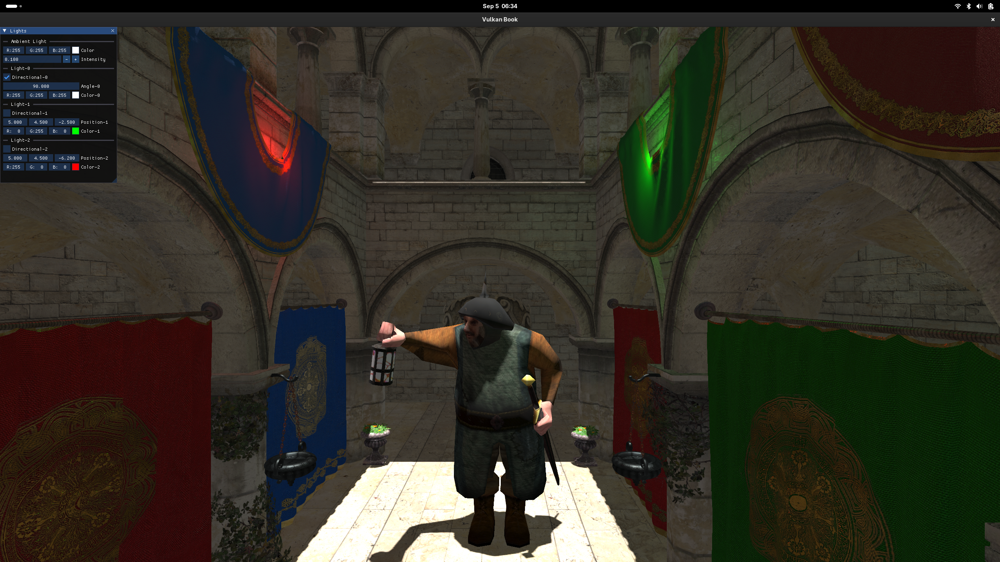

# Animations

In this chapter we will add support for skeletal animations using compute shaders to perform the required transformations to animate a
model. By doing so, we will handle static and animated models in the scene render stage exactly the same way. The compute shader will
perform the required transformations and will dump the results in a buffer that will be bound when rendenring the scene as in the case of
static models. By doing that way, we will not need to change a line of our current shaders, we will just be accessing buffers that have
vertex information with the same layout. Please keep in mind that, in order to keep this example as simple as possible, we will simplify
the animation mechanism, for example, we will not be interpolating between animation key frames and we will not control animation duration.

You can find the complete source code for this chapter [here](../../booksamples/chapter-17).

## Skeletal animation introduction

In skeletal animation the way a model is transformed to play an animation is defined by its underlying skeleton. A skeleton is nothing more
than a hierarchy of special points called joints. These joints are organized in a tree-like structure, a joint can have a parent and several
child joints. In addition to that, the final position of each joint is affected by the position of their parents. For instance, think of a
wrist: the position of a wrist is modified if a character moves the elbow and also if it moves the shoulder.

Joints do not need to represent a physical bone or articulation: they are artifacts that allow the creatives to model an animation (we may
use sometimes the terms bone and joint to refer to the same thing). The models still have vertices that define the different positions,
but, in skeletal animation, vertices are drawn based on the position of the joints they are related to and modulated by a set of weights.
If we draw a model using just the vertices, without taking into consideration the joints, we would get a 3D model in what is called the
bind pose. Each animation is divided into key frames which basically describes the transformations that should be applied to each joint. By
changing those transformations, changing those key frames, along time, we are able to animate the model. Those transformations are based on
4x4 matrices which model the displacement and rotation of each joint according to the hierarchy (basically each joint must accumulate the
transformations defined by its parents).

If you are reading this, you might probably already know the fundamentals of skeletal animations. The purpose of this chapter is not to
explain this in detail but to show an example on how this can be implemented using Vulkan with compute shaders. If you need all the details
of skeletal animations you can check this [excellent tutorial](http://ogldev.atspace.co.uk/www/tutorial38/tutorial38.html).

## Processing the models

We need to modify the code that loads 3D models to support animations. The first step is to modify the `ModelData` struct to store the data
required to animate models:

**File: src/eng/modelData.zig**
```zig
pub const ModelData = struct {
    ...
    animations: std.ArrayListUnmanaged(AnimationData),
    animMeshes: std.ArrayListUnmanaged(AnimMeshData),

    pub fn cleanup(self: *const ModelData, allocator: std.mem.Allocator) void {
        ...
        for (self.animations.items) |*animData| {
            allocator.free(animData.name);
        }
    }
};
```

The new `animMeshes` attribute is the equivalent of the `meshes` one but for animated data. That list will contain an entry for each mesh
storing the relevant data for animated models, not th evertices but data structure that will allow us to animate a specific mesh. In this
case, that data is grouped under the `AnimMeshData` struct and contains two arrays that will host the weights and associated bones (joints)
that will modulate the transformations applied to the joints related to each vertex (related by their identifier in the hierarchy). That
data is common to all the animations supported by the model, since it is related to the model structure itself, it models its skeleton.
The `animations` attribute holds the list of animations defined for a model. An animation is described by the `AnimationData` struct and
consists on a name the duration of the animation (in milliseconds) and the data of the key frames that compose the animation. Key frame data
is defined by the `AnimatedFrame` record which contains the transformation matrices for each of the model joints for that specific frame.
Therefore, in order to load animated models we just need to get the additional structural data for mesh (weights and the joints they apply
to) and the transformation matrices for each of those joints per animation key frame.

Let's define the new structs. We will start with `AnimMeshData` one:

**File: src/eng/modelData.zig**
```zig
pub const AnimMeshData = struct {
    weights: []f32,
    boneIds: []i32,
};
```

As you can see is just contains an array of floats for the weights associated to a bone (or joint) and and array of identifiers for these
bones / joints. The `Animation` struct is defined like this:

**File: src/eng/modelData.zig**
```zig
pub const AnimationData = struct {
    name: []const u8,
    frameMillis: f32,
    frames: []AnimatedFrame,
};
```

It is just  defines a name, the milliseconds that each frame should last and a list of frame data modeled by the `AnimatedFrame` struct:

**File: src/eng/modelData.zig**
```zig
pub const AnimatedFrame = struct {
    jointMatrices: []?[16]f32,
};
```

A frame is basically a list of transformation matrices associated to each joint / bone. These matrices will model how each of these joints
will be modified (translated, rotated and scaled) according to the specific frame. Each of these joint / bones will affect the associated
vertices through a weight.


Finally, we need to update the `loadModels` function to duplicate animation data string name:

**File: src/eng/modelData.zig**
```zig
pub fn loadModel(allocator: std.mem.Allocator, io: std.Io, path: []const u8) !ModelData {
    ...
    for (modelData.animations.items) |*animData| {
        animData.name = try allocator.dupe(u8, animData.name);
    }
    ...
}
```

Let's review now the changes in the model generation code:

**File: src/eng/modelGen.zig**
```zig
...
const zm = @import("zmath");
...
const MAX_WEIGHTS = 4;
...
pub fn main(init: std.process.Init) !void {
    ...
    const flags = zassimp.aiProcess_Triangulate | zassimp.aiProcess_GenSmoothNormals | zassimp.aiProcess_CalcTangentSpace |
        zassimp.aiProcess_LimitBoneWeights;
    ...
}
```
We have added a new flag `aiProcess_LimitBoneWeights` that, for animated models, limits the number of bones simultaneously affecting a
single vertex to a maximum value (the default maximum values is `4`). Each bone / joint will have different impact on the animation based
on weights. After that, we construct a structure of nodes. That will be the tree like skeleton structure (the bones hierarchy) which
contains transformation matrices for each of the joint / bones and will allow us to calculate the animation

These are the changes in the `main` function prior to start dumping the materials file:

**File: src/eng/modelGen.zig**
```zig
fn processBones(
    allocator: std.mem.Allocator,
    mesh: *const zassimp.aiMesh,
    boneList: *std.ArrayListUnmanaged(Bone),
) !eng.mdata.AnimMeshData {
    const numVertices = mesh.mNumVertices;

    // Map: vertex_index -> list of VertexWeight
    var weightSet = std.AutoHashMap(u32, std.ArrayListUnmanaged(VertexWeight)).init(allocator);
    defer {
        var it = weightSet.valueIterator();
        while (it.next()) |list| list.deinit(allocator);
        weightSet.deinit();
    }

    const numBones = mesh.mNumBones;
    if (mesh.mBones) |bonesPtr| {
        const aiBones = bonesPtr[0..numBones];
        for (aiBones) |aiBonePtr| {
            const aiBone = aiBonePtr.*;
            const boneId = boneList.items.len;
            const boneName = try allocator.dupe(u8, aiBone.mName.data[0..aiBone.mName.length]);
            const offsetMatrix = zm.matToArr(toMatrix(aiBone.mOffsetMatrix));

            try boneList.append(allocator, .{
                .id = boneId,
                .name = boneName,
                .offsetMatrix = offsetMatrix,
            });

            const numWeights = aiBone.mNumWeights;
            const aiWeights = aiBone.mWeights[0..numWeights];
            for (aiWeights) |aiWeight| {
                const gop = try weightSet.getOrPut(aiWeight.mVertexId);
                if (!gop.found_existing) {
                    gop.value_ptr.* = .empty;
                }
                try gop.value_ptr.append(allocator, .{
                    .boneId = boneId,
                    .vertexId = aiWeight.mVertexId,
                    .weight = aiWeight.mWeight,
                });
            }
        }
    }

    const totalFloats = numVertices * MAX_WEIGHTS;
    var weights = try allocator.alloc(f32, totalFloats);
    var boneIds = try allocator.alloc(i32, totalFloats);
    @memset(weights, 0.0);
    @memset(boneIds, 0);

    for (0..numVertices) |i| {
        const vertexWeightList = weightSet.get(@intCast(i));
        const size = if (vertexWeightList) |vl| vl.items.len else 0;

        for (0..MAX_WEIGHTS) |j| {
            const offset = i * MAX_WEIGHTS + j;
            if (j < size) {
                const vw = vertexWeightList.?.items[j];
                weights[offset] = vw.weight;
                boneIds[offset] = @intCast(vw.boneId);
            } else {
                weights[offset] = 0.0;
                boneIds[offset] = 0;
            }
        }
    }

    return eng.mdata.AnimMeshData{
        .weights = weights,
        .boneIds = boneIds,
    };
}
```
In that `processBones` functions, we first construct a list of bones. Each bone will have an identifier which will be used later on to
relate them to the wights to be applied for each vertex. That information is stored in the `AnimMeshData` struct which stores
for each of the vertices of a mesh the weights that should be applied to each bone it relates to. The `Bone` and `VertexWeight` structures
are defined like this:

**File: src/eng/modelGen.zig**
```zig
...
pub const Bone = struct {
    id: usize,
    name: []const u8,
    offsetMatrix: [16]f32,
};
...
pub const VertexWeight = struct {
    boneId: usize,
    vertexId: u32,
    weight: f32,
};
...
```

The `buildNodesTree` function is quite simple, It just traverses the nodes hierarchy starting from the root node constructing a tree of
nodes:

**File: src/eng/modelGen.zig**
```zig
fn buildNodesTree(
    allocator: std.mem.Allocator,
    aiNode: *const zassimp.aiNode,
    parent: ?*const NodeData,
) !NodeData {
    _ = parent;

    const name = try allocator.dupe(u8, aiNode.mName.data[0..aiNode.mName.length]);
    const transformation = toMatrix(aiNode.mTransformation);

    const numMeshes = aiNode.mNumMeshes;
    var meshes: []u32 = &.{};
    if (numMeshes > 0 and aiNode.mMeshes != null) {
        meshes = try allocator.alloc(u32, numMeshes);
        const srcMeshes = aiNode.mMeshes[0..numMeshes];
        for (srcMeshes, 0..) |meshIdx, i| {
            meshes[i] = meshIdx;
        }
    }

    const numChildren = aiNode.mNumChildren;
    var children: []NodeData = &.{};
    if (numChildren > 0 and aiNode.mChildren != null) {
        children = try allocator.alloc(NodeData, numChildren);
        const srcChildren = aiNode.mChildren[0..numChildren];
        for (srcChildren, 0..) |childPtr, i| {
            if (childPtr) |child| {
                children[i] = try buildNodesTree(allocator, child, null);
            }
        }
    }

    return NodeData{
        .name = name,
        .transformation = @bitCast(transformation),
        .children = children,
        .meshes = meshes,
    };
}
```

The `NodeData` struct is defined like this:

**File: src/eng/modelGen.zig**
```zig
pub const NodeData = struct {
    name: []const u8,
    transformation: [16]f32,
    children: []NodeData,
    meshes: []u32,
};
```

It is a way to model a tree of `NodeData` instances. Each node is defined by the its name, its transformation, the parent and child nodes.

Let’s review the `processAnimations` function, which is defined like this:

**File: src/eng/modelGen.zig**
```zig
fn processAnimations(
    allocator: std.mem.Allocator,
    scene: *const zassimp.aiScene,
    boneList: *const std.ArrayListUnmanaged(Bone),
    rootNode: *const NodeData,
    globalInverseTransform: zm.Mat,
    outAnimations: *std.ArrayListUnmanaged(eng.mdata.AnimationData),
) !void {
    const numAnimations = scene.mNumAnimations;
    if (scene.mAnimations) |animationsPtr| {
        const aiAnimations = animationsPtr[0..numAnimations];

        for (aiAnimations) |aiAnimPtr| {
            if (aiAnimPtr) |aiAnim| {
                const aiAnimation: *const zassimp.aiAnimation = @ptrCast(aiAnim);
                const maxFrames = calcAnimationMaxFrames(aiAnimation);
                if (maxFrames == 0) continue;
                const name = try allocator.dupe(u8, aiAnimation.mName.data[0..aiAnimation.mName.length]);

                const frameMillis: f32 = if (aiAnimation.mTicksPerSecond > 0.0)
                    @floatCast(aiAnimation.mDuration / aiAnimation.mTicksPerSecond)
                else
                    0.0;

                var frames = try allocator.alloc(eng.mdata.AnimatedFrame, maxFrames);

                for (0..maxFrames) |frameIdx| {
                    const jointMatrices = try allocator.alloc(?[16]f32, boneList.items.len);
                    // Fill with identity
                    const identity = zm.identity();
                    const identityArr = zm.matToArr(identity);
                    for (jointMatrices) |*jm| {
                        jm.* = identityArr;
                    }

                    var animatedFrame = eng.mdata.AnimatedFrame{
                        .jointMatrices = jointMatrices,
                    };

                    buildFrameMatrices(
                        aiAnimation,
                        boneList,
                        &animatedFrame,
                        frameIdx,
                        rootNode,
                        zm.identity(),
                        globalInverseTransform,
                    );

                    frames[frameIdx] = animatedFrame;
                }

                try outAnimations.append(allocator, .{
                    .name = name,
                    .frameMillis = frameMillis,
                    .frames = frames,
                });
            }
        }
    }
}
```

This function returns a list of `AnimationData` instances (Please note that a model can have more than one animation). For each of those
animations we construct a list of animation frames (`AnimatedFrame` instances), which contain essentially a list of the transformation
matrices to be applied to each of the bones that compose the model. For each of the animations, we calculate the maximum number of frames
by calling the method `function`, which is defined like this: 

**File: src/eng/modelGen.zig**
```zig
fn calcAnimationMaxFrames(aiAnimation: *const zassimp.aiAnimation) usize {
    var maxFrames: usize = 0;
    const numChannels = aiAnimation.mNumChannels;
    if (aiAnimation.mChannels) |channelsPtr| {
        const channels = channelsPtr[0..numChannels];
        for (channels) |channelPtr| {
            if (channelPtr) |cp| {
                const channel: *const zassimp.aiNodeAnim = @ptrCast(cp);
                if (channel.mNumPositionKeys > maxFrames) maxFrames = channel.mNumPositionKeys;
                if (channel.mNumRotationKeys > maxFrames) maxFrames = channel.mNumRotationKeys;
                if (channel.mNumScalingKeys > maxFrames) maxFrames = channel.mNumScalingKeys;
            }
        }
    }
    return maxFrames;
}
```

Each `AINodeAnim` instance defines some transformations to be applied to a node in the model for a specific frame. These transformations,
for a specific node, are defined in the `AINodeAnim` instance. These transformations are defined in the form of position translations,
rotations and scaling values. The trick here is that, for example, for a specific node, translation values can stop at a specific frame,
but rotations and scaling values can continue for the next frames. In this case, we will have less translation values than rotation or
scaling ones. Therefore, a good approximation, to calculate the maximum number of frames is to use the maximum value. The problem gets
more complex, because this is defines per node. A node can define just some transformations for the first frames and do not apply more
modifications for the rest. In this case, we should use always the last defined values. Therefore, we get the maximum number for all the
animations associated to the nodes.

Going back to the `processAnimations` function, with that information, we are ready to iterate over the different frames and build the
transformation matrices for the bones by calling the `buildFrameMatrices` function. For each frame we start with the root node, and will
apply the transformations recursively from top to down of the nodes hierarchy. The `buildFrameMatrices` function is defined like this:

**File: src/eng/modelGen.zig**
```zig
fn buildFrameMatrices(
    aiAnimation: *const zassimp.aiAnimation,
    boneList: *const std.ArrayListUnmanaged(Bone),
    animatedFrame: *eng.mdata.AnimatedFrame,
    frameIdx: usize,
    node: *const NodeData,
    nodeParentTransform: zm.Mat,
    globalInverseTransform: zm.Mat,
) void {
    var channel: ?*const zassimp.aiNodeAnim = null;
    const numChannels = aiAnimation.mNumChannels;
    if (aiAnimation.mChannels) |channelsPtr| {
        const channels = channelsPtr[0..numChannels];
        for (channels) |channelPtr| {
            if (channelPtr) |cp| {
                const ch: *const zassimp.aiNodeAnim = @ptrCast(cp);
                if (std.mem.eql(u8, ch.mNodeName.data[0..ch.mNodeName.length], node.name)) {
                    channel = ch;
                    break;
                }
            }
        }
    }

    var nodeTransform = zm.transpose(zm.matFromArr(node.transformation));
    if (channel) |ch| {
        const pos = calculatePosition(ch, frameIdx);
        const rot = calculateRotation(ch, frameIdx);
        const scl = calculateScaling(ch, frameIdx);

        const translation = zm.translation(pos[0], pos[1], pos[2]);
        const rotation = zm.quatToMat(.{ rot[0], rot[1], rot[2], rot[3] });
        const scaling = zm.scaling(scl[0], scl[1], scl[2]);
        nodeTransform = zm.mul(zm.mul(scaling, rotation), translation);
    }

    const nodeGlobalTransform = zm.mul(nodeTransform, nodeParentTransform);

    for (boneList.items, 0..) |bone, boneId| {
        if (std.mem.eql(u8, bone.name, node.name)) {
            if (boneId < animatedFrame.jointMatrices.len) {
                const offsetMat = zm.transpose(zm.matFromArr(bone.offsetMatrix));
                const mat1 = zm.mul(nodeGlobalTransform, globalInverseTransform);
                const mat2 = zm.mul(offsetMat, mat1);
                animatedFrame.jointMatrices[boneId] = @bitCast(mat2);
            }
        }
    }

    for (node.children) |*child| {
        buildFrameMatrices(
            aiAnimation,
            boneList,
            animatedFrame,
            frameIdx,
            child,
            nodeGlobalTransform,
            globalInverseTransform,
        );
    }
}
```

We get the transformation associated to the node. Then we check if this node has an animation node associated to it. If so, we need to get
the proper translation, rotation and scaling transformations that apply to the frame that we are handling. With that information, we get
the bones associated to that node and update the transformation matrix for each of those bones, for that specific frame by multiplying:

* The model inverse global transformation matrix (the inverse of the root node transformation matrix).
* The transformation matrix for the node.
* The bone offset matrix.

The functions use dto get the translation, rotation and scaling are define like this:

**File: src/eng/modelGen.zig**
```zig
fn calculatePosition(channel: *const zassimp.aiNodeAnim, frameIdx: usize) [3]f32 {
    if (channel.mNumPositionKeys == 0) return .{ 0.0, 0.0, 0.0 };
    const keys = channel.mPositionKeys[0..channel.mNumPositionKeys];
    const idx = if (frameIdx >= keys.len) keys.len - 1 else frameIdx;
    const val = keys[idx].mValue;
    return .{ val.x, val.y, val.z };
}

fn calculateRotation(channel: *const zassimp.aiNodeAnim, frameIdx: usize) [4]f32 {
    if (channel.mNumRotationKeys == 0) return .{ 0.0, 0.0, 0.0, 1.0 };
    const keys = channel.mRotationKeys[0..channel.mNumRotationKeys];
    const idx = if (frameIdx >= keys.len) keys.len - 1 else frameIdx;
    const val = keys[idx].mValue;
    return .{ val.x, val.y, val.z, val.w };
}

fn calculateScaling(channel: *const zassimp.aiNodeAnim, frameIdx: usize) [3]f32 {
    if (channel.mNumScalingKeys == 0) return .{ 1.0, 1.0, 1.0 };
    const keys = channel.mScalingKeys[0..channel.mNumScalingKeys];
    const idx = if (frameIdx >= keys.len) keys.len - 1 else frameIdx;
    const val = keys[idx].mValue;
    return .{ val.x, val.y, val.z };
}
```

The `aiNodeAnim` instance defines a set of keys that contain translation, rotation and scaling information. These keys are referred to
specific instant of times. We assume that information is ordered in time, and construct a list of matrices that contain the transformation
to be applied for each frame.

Finally, the `toMatrix` function just copies an Assimp matrix to a `zm.Mat`:


**File: src/eng/modelGen.zig**
```zig
fn toMatrix(m: zassimp.aiMatrix4x4) zm.Mat {
    return zm.matFromArr(.{
        m.a1, m.a2, m.a3, m.a4,
        m.b1, m.b2, m.b3, m.b4,
        m.c1, m.c2, m.c3, m.c4,
        m.d1, m.d2, m.d3, m.d4,
    });
}
```

## Loading the models

We will need to add some code to the `Entity` struct to model the animation assigned to entities (if any). We will create a new struct
named `EntityAnimation` which will host the associated animation index (freom the model), the current frame, a flag to cointrol if it's
been started or not and the maximum number of frames. Entities will have an optional value of that time and some functions to change the
animation or progress to the next frame:

**File: src/eng/entity.zig**
```zig
pub const EntityAnimation = struct {
    animationIdx: usize,
    currentFrame: usize,
    maxFrames: usize,
    started: bool,
};

pub const Entity = struct {
    animation: ?EntityAnimation = null,
    ...
    pub fn nextFrame(self: *Entity) void {
        if (self.animation) |*anim| {
            if (anim.started) {
                anim.currentFrame = (anim.currentFrame + 1) % anim.maxFrames;
            }
        }
    }

    pub fn setAnimation(self: *Entity, animationIdx: usize, maxFrames: usize, started: bool) void {
        self.animation = .{
            .animationIdx = animationIdx,
            .currentFrame = 0,
            .maxFrames = maxFrames,
            .started = started,
        };
    }
    ...
};
```

All that information class needs to be handled in the `VulkanModel` struct so it is loaded into the GPU. The changes in this struct are
defined like this:

**File: src/eng/modelsCache.zig**
```zig
pub const VulkanModel = struct {
    ...
    animations: std.ArrayList(VulkanAnimation),

    pub fn cleanup(self: *VulkanModel, allocator: std.mem.Allocator, vkCtx: *const vk.ctx.VkCtx) void {
        ...
        for (self.animations.items) |*anim| {
            anim.cleanup(allocator, vkCtx);
        }
        self.animations.deinit(allocator);
    }

    pub fn hasAnimations(self: *const VulkanModel) bool {
        return self.animations.items.len > 0;
    }
};
```

The `VulkanMesh` struct needs also to be defined in order to store a buffer which will contain the weights:

**File: src/eng/modelsCache.zig**
```zig
pub const VulkanMesh = struct {
    ...
    buffWeights: ?vk.buf.VkBuffer,
    ...
    pub fn cleanup(self: *const VulkanMesh, allocator: std.mem.Allocator, vkCtx: *const vk.ctx.VkCtx) void {
        ...
        if (self.buffWeights) |buffWeights| {
            buffWeights.cleanup(vkCtx);
        }
        ...
    }
};
```

We need to create a new struct named `VulkanAnimation` which will hold the matrices associated to the bones / joints for ach of the
animation frames:

**File: src/eng/modelsCache.zig**
```zig
pub const VulkanAnimation = struct {
    id: []const u8,
    buffers: std.ArrayList(vk.buf.VkBuffer),

    pub fn cleanup(self: *VulkanAnimation, allocator: std.mem.Allocator, vkCtx: *const vk.ctx.VkCtx) void {
        allocator.free(self.id);
        for (self.buffers.items) |buffer| {
            buffer.cleanup(vkCtx);
        }
        self.buffers.deinit(allocator);
    }
};
```

After all those changes we can modify the `ModelsCache` struct. The starting point will be the `init` function where we create the
different buffers per animations:

**File: src/eng/modelsCache.zig**
```zig
pub const ModelsCache = struct {
...
    pub fn init(
        self: *ModelsCache,
        allocator: std.mem.Allocator,
        io: std.Io,
        vkCtx: *const vk.ctx.VkCtx,
        cmdPool: *vk.cmd.VkCmdPool,
        vkQueue: vk.queue.VkQueue,
        initData: *const eng.engine.InitData,
    ) !void {
        ...
        for (initData.models) |*modelData| {
            ...
            var vulkanAnimations = try std.ArrayList(VulkanAnimation).initCapacity(allocator, modelData.animations.items.len);
            for (modelData.animations.items) |animData| {
                var buffers = try std.ArrayList(vk.buf.VkBuffer).initCapacity(allocator, animData.frames.len);
                for (animData.frames) |frame| {
                    try buffers.append(allocator, try createJointMatricesBuffers(vkCtx, allocator, cmdHandle, &srcBuffers, frame));
                }
                try vulkanAnimations.append(allocator, .{
                    .id = try allocator.dupe(u8, animData.name),
                    .buffers = buffers,
                });
            }

            var vulkanMeshes = try std.ArrayList(VulkanMesh).initCapacity(allocator, modelData.meshes.items.len);
            var meshCount: usize = 0;
            for (modelData.meshes.items) |meshData| {
                ...
                const dstVtxBuffer = try vk.buf.VkBuffer.create(
                    vkCtx,
                    verticesSize,
                    vulkan.BufferUsageFlags{ .vertex_buffer_bit = true, .storage_buffer_bit = true, .transfer_dst_bit = true },
                    @intFromEnum(vk.vma.VmaFlags.None),
                    vk.vma.VmaUsage.VmaUsageAuto,
                    vk.vma.VmaMemoryFlags.None,
                );
                ...
                var buffWeights: ?vk.buf.VkBuffer = null;
                if (modelData.animMeshes.items.len > 0) {
                    buffWeights = try createWeightsBuffers(vkCtx, allocator, cmdHandle, &srcBuffers, modelData.animMeshes.items[meshCount]);
                }

                const vulkanMesh = VulkanMesh{
                    ...
                    .buffWeights = buffWeights,
                    ...
                };
                ...
                meshCount += 1;
            }

            const vulkanModel = VulkanModel{
                .id = try allocator.dupe(u8, modelData.id),
                .meshes = vulkanMeshes,
                .animations = vulkanAnimations,
            };
            ...
        }
        ...
    }
...
};
```

We need to update the `dstVtxBuffer` creation since we will be accessing the contents of the vertices buffer in the compute shader through
storage buffers (this is why we add the `storage_buffer_bit`). The `createWeightsBuffers` function is defined like this:

**File: src/eng/modelsCache.zig**
```zig
pub const ModelsCache = struct {
...
    fn createWeightsBuffers(
        vkCtx: *const vk.ctx.VkCtx,
        allocator: std.mem.Allocator,
        cmdHandle: vulkan.CommandBuffer,
        srcBuffers: *std.ArrayList(vk.buf.VkBuffer),
        animMeshData: eng.mdata.AnimMeshData,
    ) !vk.buf.VkBuffer {
        const weights = animMeshData.weights;
        const boneIds = animMeshData.boneIds;
        const bufferSize = weights.len * @sizeOf(f32) + boneIds.len * @sizeOf(i32);

        const srcWeightsBuffer = try vk.buf.VkBuffer.create(
            vkCtx,
            bufferSize,
            vulkan.BufferUsageFlags{ .transfer_src_bit = true },
            @intFromEnum(vk.vma.VmaFlags.VmaAllocationCreateHostAccessSequentialWriteBit),
            vk.vma.VmaUsage.VmaUsageAuto,
            vk.vma.VmaMemoryFlags.MemoryPropertyHostVisibleBitAndCoherent,
        );
        try srcBuffers.append(allocator, srcWeightsBuffer);

        const dstWeightsBuffer = try vk.buf.VkBuffer.create(
            vkCtx,
            bufferSize,
            vulkan.BufferUsageFlags{ .vertex_buffer_bit = true, .storage_buffer_bit = true, .transfer_dst_bit = true },
            @intFromEnum(vk.vma.VmaFlags.None),
            vk.vma.VmaUsage.VmaUsageAuto,
            vk.vma.VmaMemoryFlags.None,
        );

        const dataWeights = try srcWeightsBuffer.map(vkCtx);
        const gpuWeights: [*]u8 = @ptrCast(@alignCast(dataWeights));

        const rows = weights.len / 4;
        var data = try allocator.alloc(f32, weights.len + boneIds.len);
        defer allocator.free(data);
        var dstPos: usize = 0;
        for (0..rows) |row| {
            const srcPos = row * 4;
            data[dstPos] = weights[srcPos];
            data[dstPos + 1] = weights[srcPos + 1];
            data[dstPos + 2] = weights[srcPos + 2];
            data[dstPos + 3] = weights[srcPos + 3];
            data[dstPos + 4] = @floatFromInt(boneIds[srcPos]);
            data[dstPos + 5] = @floatFromInt(boneIds[srcPos + 1]);
            data[dstPos + 6] = @floatFromInt(boneIds[srcPos + 2]);
            data[dstPos + 7] = @floatFromInt(boneIds[srcPos + 3]);
            dstPos += 8;
        }
        @memcpy(gpuWeights[0..bufferSize], std.mem.sliceAsBytes(data));
        srcWeightsBuffer.unMap(vkCtx);

        recordTransfer(vkCtx, cmdHandle, &srcWeightsBuffer, &dstWeightsBuffer);

        return dstWeightsBuffer;
    }
...
};
```

It uploads per-vertex skinning data (bone weights and bone indices) to a GPU buffer for a single animated mesh. The
`createJointMatricesBuffers` function is defined like this:

**File: src/eng/modelsCache.zig**
```zig
pub const ModelsCache = struct {
...
    fn createJointMatricesBuffers(
        vkCtx: *const vk.ctx.VkCtx,
        allocator: std.mem.Allocator,
        cmdHandle: vulkan.CommandBuffer,
        srcBuffers: *std.ArrayList(vk.buf.VkBuffer),
        animatedFrame: eng.mdata.AnimatedFrame,
    ) !vk.buf.VkBuffer {
        const numMatrices = animatedFrame.jointMatrices.len;
        const bufferSize = numMatrices * @sizeOf([16]f32);

        const srcJointBuffer = try vk.buf.VkBuffer.create(
            vkCtx,
            bufferSize,
            vulkan.BufferUsageFlags{ .transfer_src_bit = true },
            @intFromEnum(vk.vma.VmaFlags.VmaAllocationCreateHostAccessSequentialWriteBit),
            vk.vma.VmaUsage.VmaUsageAuto,
            vk.vma.VmaMemoryFlags.MemoryPropertyHostVisibleBitAndCoherent,
        );
        try srcBuffers.append(allocator, srcJointBuffer);

        const dstJointBuffer = try vk.buf.VkBuffer.create(
            vkCtx,
            bufferSize,
            vulkan.BufferUsageFlags{ .storage_buffer_bit = true, .transfer_dst_bit = true },
            @intFromEnum(vk.vma.VmaFlags.None),
            vk.vma.VmaUsage.VmaUsageAuto,
            vk.vma.VmaMemoryFlags.None,
        );

        const dataJoints = try srcJointBuffer.map(vkCtx);
        const gpuJoints: [*]u8 = @ptrCast(@alignCast(dataJoints));

        const identity = [16]f32{
            1, 0, 0, 0,
            0, 1, 0, 0,
            0, 0, 1, 0,
            0, 0, 0, 1,
        };
        for (animatedFrame.jointMatrices, 0..) |maybeMatrix, i| {
            const matrix = maybeMatrix orelse identity;
            @memcpy(gpuJoints[i * 64 .. i * 64 + 64], std.mem.sliceAsBytes(&matrix));
        }
        srcJointBuffer.unMap(vkCtx);

        recordTransfer(vkCtx, cmdHandle, &srcJointBuffer, &dstJointBuffer);

        return dstJointBuffer;
    }
...
};
```

It uploads the joint (bone) transformation matrices for a single animation frame to the GPU. In contrast with createWeightsBuffers,
weights are static per vertex, so they're uploaded once. Joint matrices change per frame, so one buffer is created per animated frame.

Each animated entity will have vertices buffer per each mesh of the associated animated model. In this way, we can calculate the
transformations associated to the current animation for each entity and store the results in a dedicated buffer associated to the mesh
and entity. If we do it this way, we can render animated entities the same way we just render non animated ones. For static meshes we can
share the mesh vertices buffer between all the entities, but for animated ones we will have a dedicated one per entity and mesh. We will
create a new struct named `AnimationsCache` that will create those buffers for all the animated entities:

**File: src/eng/animsCache.zig**
```zig
const eng = @import("mod.zig");
const std = @import("std");
const vk = @import("vk");

pub const AnimsCache = struct {
    entitiesAnimBuffers: std.StringArrayHashMapUnmanaged(std.StringArrayHashMapUnmanaged(vk.buf.VkBuffer)),

    pub fn cleanup(self: *AnimsCache, allocator: std.mem.Allocator, vkCtx: *const vk.ctx.VkCtx) void {
        var outerIt = self.entitiesAnimBuffers.iterator();
        while (outerIt.next()) |entry| {
            allocator.free(entry.key_ptr.*);
            var innerIt = entry.value_ptr.iterator();
            while (innerIt.next()) |innerEntry| {
                innerEntry.value_ptr.cleanup(vkCtx);
            }
            entry.value_ptr.deinit(allocator);
        }
        self.entitiesAnimBuffers.deinit(allocator);
    }

    pub fn create() AnimsCache {
        const entitiesAnimBuffers: std.StringArrayHashMapUnmanaged(std.StringArrayHashMapUnmanaged(vk.buf.VkBuffer)) = .empty;
        return .{
            .entitiesAnimBuffers = entitiesAnimBuffers,
        };
    }

    pub fn getBuffer(self: *const AnimsCache, entityId: []const u8, meshId: []const u8) ?*const vk.buf.VkBuffer {
        const meshMap = self.entitiesAnimBuffers.getPtr(entityId) orelse return null;
        return meshMap.getPtr(meshId);
    }

    pub fn init(
        self: *AnimsCache,
        allocator: std.mem.Allocator,
        vkCtx: *const vk.ctx.VkCtx,
        engCtx: *const eng.engine.EngCtx,
        modelsCache: *const eng.mcach.ModelsCache,
    ) !void {
        var iter = engCtx.scene.entitiesMap.valueIterator();
        while (iter.next()) |entityRef| {
            const entity = entityRef.*;
            const vulkanModel = modelsCache.modelsMap.get(entity.modelId);
            if (!vulkanModel.?.hasAnimations()) {
                continue;
            }

            var bufferMap: std.StringArrayHashMapUnmanaged(vk.buf.VkBuffer) = .empty;

            for (vulkanModel.?.meshes.items) |vulkanMesh| {
                const animBuffer = try vk.buf.VkBuffer.create(
                    vkCtx,
                    vulkanMesh.buffVtx.size,
                    .{ .vertex_buffer_bit = true, .storage_buffer_bit = true },
                    @intFromEnum(vk.vma.VmaFlags.None),
                    vk.vma.VmaUsage.VmaUsageAuto,
                    vk.vma.VmaMemoryFlags.None,
                );
                try bufferMap.put(allocator, vulkanMesh.id, animBuffer);
            }

            try self.entitiesAnimBuffers.put(allocator, try allocator.dupe(u8, entity.id), bufferMap);
        }
    }
};
```

This struct holds per-entity GPU buffers that receive the output of GPU skinning, so that each animated entity can render with its own
current pose. Data is structured in a nested map entityId -> meshId -> VkBuffer, with a `getBuffer` using the entity and mesh identifiers
to look one buffer up. The `init` functionswalks all scene entities. For any animeted entity, it creates one buffer per meshkeyed by entity
and mesh id. We will use this cache when rendering animated models to access the proper buffer to bind.

We need to include this new file in the `src/eng/mod.zig`:

```zig
pub const acach = @import("animsCache.zig");
...
```

## Compute Shader

Prior to jumping to the code, it is necessary to briefly describe compute shaders. Compute shaders are a bit different than vertex or
fragment shaders. Vertex and fragment shaders have a well defined inputs and outputs. For example, when we create a graphics pipeline, we
define the structure of the input data for the vertex shader vertex shader. In addition to that, vertex shaders get invoked,
"automatically", as many times as required to consume that input. In our examples, up to this point, vertex input contains vertex position,
texture coordinates and the normals data. Compute shaders operate differently, they work over buffers as a whole. It is up to us to decide
how it will execute and how they will operate over the data they will require to perform their computation and where the results should be
stored. Compute shaders access data (for reading and writing) through storage buffers. In our case, we will store binding pose information
as read only storage buffers and will store the transformed positions in a read / write storage buffer. That output buffer will later be
read in the geometry phase as a regular vertex buffer.

As mentioned above, a key topic of compute shaders is how many times they should be invoked and how the work load is distributed. Compute
shaders define the concept of work groups, which are a collection of of shader invocations that can be executed, potentially, in parallel.
Work groups are three dimensional, so they will be defined by the triplet `(Wx, Wy, Wz)`, where each of those components must be equal to
or greater than `1`. A compute shader will execute in total `Wx*Wy*Wz` work groups. Work groups have also a size, named local size.
Therefore, we can define local size as another triplet `(Lx, Ly, Lz)`. The total number of times a compute shader will be invoked will be
the product `Wx*Lx*Wy*Ly*Wz*Lz`. The reason behind specifying these using three dimension parameters is because some data is handled in a
more convenient way using 2D or 3D dimensions. You can think for example in a image transformation computation, we would be probably using
the data of an image pixel and their neighbor pixels. We could organize the work using 2D computation parameters. In addition to that, work
done inside a work group, can share same variables and resources, which may be required when processing 2D or 3D data. Inside the computer
shader we will have access to pre-built variables that will identify the invocation we are in so we can properly access the data slice that
we want to work with according to our needs.  

In order to support the execution of commands that will go through the compute pipeline, we need first to define a new struct named
`VkCompPipeline` to support the creation of that type of pipelines. Compute pipelines are much simpler than graphics pipelines. Graphics
pipelines have a set of fixed and programmable stages while the compute pipeline has a single programmable compute shader stage. So let's
go with it. Let's start with the struct that will control the `VkCompPipeline` creation:

**File: src/eng/vk/vkCompPipeline.zig**
```zig
const std = @import("std");
const vulkan = @import("vulkan");
const vk = @import("mod.zig");

pub const VkCompPipelineCreateInfo = struct {
    descSetLayouts: ?[]const vulkan.DescriptorSetLayout,
    moduleInfo: vk.pipe.ShaderModuleInfo,
    pushConstants: ?[]const vulkan.PushConstantRange,
};
```

A compute pipeline may require descriptor set lauots, a single shader module and some push contants. The `VkCompPipeline` struct is defined
like this:

**File: src/eng/vk/vkCompPipeline.zig**
```zig
...
pub const VkCompPipeline = struct {
    pipeline: vulkan.Pipeline,
    pipelineLayout: vulkan.PipelineLayout,

    pub fn create(vkCtx: *const vk.ctx.VkCtx, createInfo: *const VkCompPipelineCreateInfo) !VkCompPipeline {
        const pssci = vulkan.PipelineShaderStageCreateInfo{
            .stage = createInfo.moduleInfo.stage,
            .module = createInfo.moduleInfo.module,
            .p_name = "main",
            .p_specialization_info = createInfo.moduleInfo.specInfo,
        };

        const pipelineLayout = try vkCtx.vkDevice.deviceProxy.createPipelineLayout(&.{
            .flags = .{},
            .set_layout_count = if (createInfo.descSetLayouts) |ds| @as(u32, @intCast(ds.len)) else 0,
            .p_set_layouts = if (createInfo.descSetLayouts) |ds| ds.ptr else null,
            .push_constant_range_count = if (createInfo.pushConstants) |pc| @as(u32, @intCast(pc.len)) else 0,
            .p_push_constant_ranges = if (createInfo.pushConstants) |pcs| pcs.ptr else null,
        }, null);

        const pci = vulkan.ComputePipelineCreateInfo{
            .flags = .{},
            .stage = pssci,
            .layout = pipelineLayout,
            .base_pipeline_handle = .null_handle,
            .base_pipeline_index = -1,
        };

        var pipeline: vulkan.Pipeline = undefined;
        _ = try vkCtx.vkDevice.deviceProxy.createComputePipelines(
            .null_handle,
            @ptrCast(&pci),
            null,
            @ptrCast(&pipeline),
        );

        return .{ .pipeline = pipeline, .pipelineLayout = pipelineLayout };
    }

    pub fn cleanup(self: *VkCompPipeline, vkCtx: *const vk.ctx.VkCtx) void {
        vkCtx.vkDevice.deviceProxy.destroyPipeline(self.pipeline, null);
        vkCtx.vkDevice.deviceProxy.destroyPipelineLayout(self.pipelineLayout, null);
    }
};
```

In the `create` function, we first initialize the `PipelineShaderStageCreateInfo` structure with the compute shader information. In this
specific case, we receive a single `ShaderModuleInfo` instance (we will use just one computer shader). As in other types of shaders, compute
shaders can use specialization constants, so we need to add support for them if shader requires them.

We need to include the `vkCompPipeline.zig` file in the `src/eng/vk/mod.zig`:

```zig
...
pub const cpipe = @import("vkCompPipeline.zig");
...
```

The next step is to psupport the creation of queues that belong to a family that allow the submission of compute commands. In order to do
that, we will need to update the `QueuesInfo` and `VkPhysDevice` structs:

**File: src/eng/vk/vkPhysDevice.zig**
```zig
const QueuesInfo = struct {
    compute_family: u32,
    ...
};

pub const VkPhysDevice = struct {
    ...
    fn hasRequiredQueues(
        instance: vulkan.InstanceProxy,
        pdev: vulkan.PhysicalDevice,
        vkSurface: vk.surf.VkSurface,
        allocator: std.mem.Allocator,
    ) !?QueuesInfo {
        ...
        var compute_family: ?u32 = null;
        ...
        for (families, 0..) |properties, i| {
            ...
            if (compute_family == null and properties.queue_count > 0 and properties.queue_flags.compute_bit) {
                compute_family = family;
            }
        }

        if (graphics_family != null and present_family != null and compute_family != null) {
            return QueuesInfo{
                .compute_family = compute_family.?,
                .graphics_family = graphics_family.?,
                .present_family = present_family.?,
            };
        }

        return null;
    }    
    ...
};
```

We have now all the pieces required to perform the animation using a compute shader, so we will create a new struct, named `RenderAnim`
to put them into play. We will need to add the `src/eng/renderAnim.zig` path in to the `src/eng/mod.zig` file.


```zig
...
pub const ranm = @import("renderAnim.zig");
...
```

The structure is similar to the equivalent ones for the scene or lighting stages. It starts like this:

**File: src/eng/renderAnim.zig**
```zig
const com = @import("com");
const eng = @import("mod.zig");
const std = @import("std");
const vk = @import("vk");
const vulkan = @import("vulkan");

const LOCAL_SIZE_X: u32 = 32;

pub const RenderAnim = struct {
    cmdPool: vk.cmd.VkCmdPool,
    cmdBuff: vk.cmd.VkCmdBuff,
    descLayout: vk.desc.VkDescSetLayout,
    grpSizeMap: std.StringHashMap(u32),
    vkPipeline: vk.cpipe.VkCompPipeline,
    queue: vk.queue.VkQueue,
    fence: vk.sync.VkFence,

    pub fn cleanup(self: *RenderAnim, vkCtx: *const vk.ctx.VkCtx) void {
        self.fence.cleanup(vkCtx);
        self.descLayout.cleanup(vkCtx);
        self.vkPipeline.cleanup(vkCtx);
        self.cmdPool.cleanup(vkCtx);
        self.grpSizeMap.deinit();
    }

    pub fn create(allocator: std.mem.Allocator, io: std.Io, vkCtx: *const vk.ctx.VkCtx) !RenderAnim {
        var cmdPool = try vk.cmd.VkCmdPool.create(vkCtx, vkCtx.vkPhysDevice.queuesInfo.compute_family, false);
        const cmdBuff = try vk.cmd.VkCmdBuff.create(vkCtx, &cmdPool, true);
        const queue = vk.queue.VkQueue.create(vkCtx, vkCtx.vkPhysDevice.queuesInfo.compute_family);
        const fence = try vk.sync.VkFence.create(vkCtx);

        const descLayout = try vk.desc.VkDescSetLayout.create(
            allocator,
            vkCtx,
            &[_]vk.desc.LayoutInfo{.{
                .binding = 0,
                .descCount = 1,
                .descType = vulkan.DescriptorType.storage_buffer,
                .stageFlags = vulkan.ShaderStageFlags{ .compute_bit = true },
            }},
        );
        const layout = descLayout.descSetLayout;
        const descSetLayouts = [_]vulkan.DescriptorSetLayout{ layout, layout, layout, layout };

        // Shader modules
        var arena = std.heap.ArenaAllocator.init(std.heap.page_allocator);
        defer arena.deinit();
        const compCode align(@alignOf(u32)) = try com.utils.loadFile(arena.allocator(), io, "res/shaders/anim_comp.glsl.spv");
        const comp = try vkCtx.vkDevice.deviceProxy.createShaderModule(&.{
            .code_size = compCode.len,
            .p_code = @ptrCast(@alignCast(compCode)),
        }, null);
        defer vkCtx.vkDevice.deviceProxy.destroyShaderModule(comp, null);

        const moduleInfo = vk.pipe.ShaderModuleInfo{ .module = comp, .stage = .{ .compute_bit = true } };

        const vkPipelineCreateInfo = vk.cpipe.VkCompPipelineCreateInfo{
            .descSetLayouts = descSetLayouts[0..],
            .moduleInfo = moduleInfo,
            .pushConstants = null,
        };
        const vkPipeline = try vk.cpipe.VkCompPipeline.create(vkCtx, &vkPipelineCreateInfo);

        const grpSizeMap = std.StringHashMap(u32).init(allocator);
        return .{
            .cmdPool = cmdPool,
            .cmdBuff = cmdBuff,
            .descLayout = descLayout,
            .grpSizeMap = grpSizeMap,
            .vkPipeline = vkPipeline,
            .queue = queue,
            .fence = fence,
        };
    }
    ...
};
```

We will create an instance of a computation queue, create the layout of the descriptor sets that we will use in the compute shader, the
shader module an create the compute pipeline. We will also create a command buffer to submit computation tasks.

We now will create a new method fuinction that should be called when new models are loaded. That method, named `init`, is defined like this:

**File: src/eng/renderAnim.zig**
```zig
pub const RenderAnim = struct {
    ...
    pub fn init(
        self: *RenderAnim,
        allocator: std.mem.Allocator,
        vkCtx: *vk.ctx.VkCtx,
        engCtx: *const eng.engine.EngCtx,
        modelsCache: *const eng.mcach.ModelsCache,
        animsCache: *const eng.acach.AnimsCache,
    ) !void {
        const layoutInfo = self.descLayout.layoutInfos[0];

        var modelsIt = modelsCache.modelsMap.valueIterator();
        while (modelsIt.next()) |vulkanModel| {
            if (!vulkanModel.hasAnimations()) {
                continue;
            }
            const modelId = vulkanModel.id;
            for (vulkanModel.animations.items, 0..) |animation, animationIdx| {
                for (animation.buffers.items, 0..) |jointsMatricesBuffer, buffPos| {
                    const id = try std.fmt.allocPrint(allocator, "{s}_{d}_{d}", .{ modelId, animationIdx, buffPos });
                    defer allocator.free(id);
                    const descSet = try vkCtx.vkDescAllocator.addDescSet(
                        allocator,
                        vkCtx.vkPhysDevice,
                        vkCtx.vkDevice,
                        id,
                        self.descLayout,
                    );
                    descSet.setBuffer(vkCtx.vkDevice, jointsMatricesBuffer, layoutInfo.binding, layoutInfo.descType);
                }
            }

            for (vulkanModel.meshes.items) |*mesh| {
                const vertexSize: f32 = 14.0 * 4.0;
                const groupSize: u32 = @intFromFloat(@ceil(@as(f32, @floatFromInt(mesh.buffVtx.size)) / vertexSize / LOCAL_SIZE_X));
                const vtxId = try std.fmt.allocPrint(allocator, "{s}_VTX", .{mesh.id});
                defer allocator.free(vtxId);
                const vtxDescSet = try vkCtx.vkDescAllocator.addDescSet(allocator, vkCtx.vkPhysDevice, vkCtx.vkDevice, vtxId, self.descLayout);
                vtxDescSet.setBuffer(vkCtx.vkDevice, mesh.buffVtx, layoutInfo.binding, layoutInfo.descType);
                try self.grpSizeMap.put(mesh.id, groupSize);

                if (mesh.buffWeights) |weightsBuffer| {
                    const wId = try std.fmt.allocPrint(allocator, "{s}_W", .{mesh.id});
                    defer allocator.free(wId);
                    const weightsDescSet = try vkCtx.vkDescAllocator.addDescSet(allocator, vkCtx.vkPhysDevice, vkCtx.vkDevice, wId, self.descLayout);
                    weightsDescSet.setBuffer(vkCtx.vkDevice, weightsBuffer, layoutInfo.binding, layoutInfo.descType);
                }
            }
        }

        var entIt = engCtx.scene.entitiesMap.valueIterator();
        while (entIt.next()) |entityRef| {
            const entity = entityRef.*;
            const vulkanModel = modelsCache.modelsMap.get(entity.modelId);
            if (vulkanModel) |vm| {
                if (!vm.hasAnimations()) continue;
                for (vm.meshes.items) |mesh| {
                    const animBuffer = animsCache.getBuffer(entity.id, mesh.id) orelse continue;
                    const id = try std.fmt.allocPrint(allocator, "{s}_{s}_ENT", .{ entity.id, mesh.id });
                    defer allocator.free(id);
                    const descSet = try vkCtx.vkDescAllocator.addDescSet(allocator, vkCtx.vkPhysDevice, vkCtx.vkDevice, id, self.descLayout);
                    descSet.setBuffer(vkCtx.vkDevice, animBuffer.*, layoutInfo.binding, layoutInfo.descType);
                }
            }
        }
    }
    ...
};
```

In this function, we first discard the models that do not contain animations. For each of the models that contain animations, we create a
descriptor set that will hold an array of matrices with the transformation matrices associated to the joints of the model. Those matrices
change for each animation frame, so for a model, we will have as many arrays (and therefore as many descriptors) as animation frames the
model has. For each mesh of the model we will need at least, two storage buffers, the first one will hold the data for the bind position
(vertices). The second storage buffer will contain the weights associated to each vertex (a vertex will have 4 weights that will modulate
the bind position using the joint transformation matrices. Each of those weights will be associated to a joint index). Therefore we need to
create two storage descriptor sets per mesh. Finally, we store the joint matrices descriptor sets and the storage descriptor sets in a map
using the model identifier as the key. This will be used later on when rendering. 
As it has been mentioned several times before, while animating, we need to dump the results of the animation to a buffer. That data needs to
be unique per entity associated to an animation model (the entities may start animations at different stages or at a different pace).
We need to create descriptor sets for each of these buffers in the final part of the function.

It is turn now to present the `render` function which will be responsible of recording the dispatching commands that will be executed
through the compute shader pipeline to calculate the animations. 

**File: src/eng/renderAnim.zig**
```zig
pub const RenderAnim = struct {
    pub fn render(
        self: *RenderAnim,
        vkCtx: *const vk.ctx.VkCtx,
        engCtx: *const eng.engine.EngCtx,
        modelsCache: *const eng.mcach.ModelsCache,
    ) !void {
        try self.fence.wait(vkCtx);
        try self.fence.reset(vkCtx);

        try self.cmdPool.reset(vkCtx);
        try self.cmdBuff.begin(vkCtx);

        const cmdHandle = self.cmdBuff.cmdBuffProxy.handle;
        const device = vkCtx.vkDevice.deviceProxy;
        const descAllocator = &vkCtx.vkDescAllocator;

        const memBarrier = [_]vulkan.MemoryBarrier2{.{
            .src_stage_mask = .{ .vertex_input_bit = true },
            .dst_stage_mask = .{ .compute_shader_bit = true },
            .src_access_mask = .{},
            .dst_access_mask = .{ .shader_write_bit = true },
        }};
        const depInfo = vulkan.DependencyInfo{
            .memory_barrier_count = memBarrier.len,
            .p_memory_barriers = &memBarrier,
        };
        device.cmdPipelineBarrier2(cmdHandle, &depInfo);

        device.cmdBindPipeline(cmdHandle, vulkan.PipelineBindPoint.compute, self.vkPipeline.pipeline);

        var iter = engCtx.scene.entitiesMap.valueIterator();

        while (iter.next()) |entityRef| {
            const entity = entityRef.*;
            const vulkanModel = modelsCache.modelsMap.get(entity.modelId) orelse {
                std.log.warn("Could not find model {s}", .{entity.modelId});
                continue;
            };
            const entityAnim = entity.animation orelse continue;
            if (!vulkanModel.hasAnimations()) continue;

            const animIdx = entityAnim.animationIdx;
            for (vulkanModel.meshes.items) |mesh| {
                var groupCountX: u32 = 1;
                if (self.grpSizeMap.get(mesh.id)) |value| {
                    groupCountX = value;
                } else {
                    std.log.warn("Group not found for {s}", .{mesh.id});
                }

                const vtxId = try std.fmt.allocPrint(engCtx.allocator, "{s}_VTX", .{mesh.id});
                defer engCtx.allocator.free(vtxId);
                const vtxDesc = descAllocator.getDescSet(vtxId) orelse continue;

                const wId = try std.fmt.allocPrint(engCtx.allocator, "{s}_W", .{mesh.id});
                defer engCtx.allocator.free(wId);
                const wDesc = descAllocator.getDescSet(wId) orelse continue;

                const entId = try std.fmt.allocPrint(engCtx.allocator, "{s}_{s}_ENT", .{ entity.id, mesh.id });
                defer engCtx.allocator.free(entId);
                const entDesc = descAllocator.getDescSet(entId) orelse continue;

                const jointsId = try std.fmt.allocPrint(engCtx.allocator, "{s}_{d}_{d}", .{ entity.modelId, animIdx, entityAnim.currentFrame });
                defer engCtx.allocator.free(jointsId);
                const jointsDesc = descAllocator.getDescSet(jointsId) orelse continue;

                const descSets = [_]vulkan.DescriptorSet{
                    vtxDesc.descSet,
                    wDesc.descSet,
                    entDesc.descSet,
                    jointsDesc.descSet,
                };
                device.cmdBindDescriptorSets(
                    cmdHandle,
                    vulkan.PipelineBindPoint.compute,
                    self.vkPipeline.pipelineLayout,
                    0,
                    &descSets,
                    null,
                );

                device.cmdDispatch(cmdHandle, groupCountX, 1, 1);
            }
        }
        try self.cmdBuff.end(vkCtx);

        const cmdBufferSubmitInfo = [_]vulkan.CommandBufferSubmitInfo{.{
            .device_mask = 0,
            .command_buffer = self.cmdBuff.cmdBuffProxy.handle,
        }};
        const emptySemphs = [_]vulkan.SemaphoreSubmitInfo{};
        try self.queue.submit(vkCtx, &cmdBufferSubmitInfo, &emptySemphs, &emptySemphs, self.fence);
    }
    ...
};
```

The code is similar to the recording methods in the scene, shadow and lighting phases. We first wait for the fence to prevent using the
command while in use. Once we start the recording we first submit the global memory barrier, waiting for the vertex stage to complete
before starting commands that will go through the compute stage. After that, we iterate over the models and their meshes, setting the
appropriate descriptor sets that will hold the binding pose data and the weights list. For each associated entity we set up the descriptor
linked to the storage buffer that will hold the results, and the joint matrices list associated to the specific frame used to render the
entity. Finally we call the `vkCmdDispatch` function to dispatch the compute shader execution.

We need to synchronize the computer shader phase with the geometry phase. In the compute phase, we update the buffers that will be rendered
in the second phase, so we need to avoid them to overlap. One important issue to consider is that the queue used to submit compute dispatch
commands might be different from the queue used for graphics commands. Therefore, we cannot simply use execution barriers for
synchronization. Execution barriers can only be used to perform in-queue synchronization. In addition to that, we need also to ensure that
the memory written during the compute phase is visible in the vertex shader at the geometry phase. In order to achieve that, we will use a
global memory barrier.

Barriers are a way to split commands execution into two parts, the first part controls what is needed to be executed before the barrier
and the second one what gets executed after the barrier. Memory barriers are submitted, as in the case of image barriers, using the
`cmdPipelineBarrier2` function. 

The function ` vkCmdPipelineBarrier` function requires to specify, essentially, two parameters:
- `srcStageMask`: This refers to the pipeline stage that we are waiting to complete.
- `dstStageMask`: This refers to the pipeline stage which should not start after all the work affected by the conditions specified for the
first part of the barrier is completed.

Memory barriers are defined by two parameters, `srcAccessMask` and `dstAccessMask`, which in combination with the parameters described
above, provoke the following to be executed in order:
- All the commands submitted prior to the barrier must complete the stage specified by `srcStageMask`.
- All memory writes performed in combination of `srcStageMask` and `srcAccessMask` must be available (the data is written into the memory).
- The memory is visible (the caches are invalidated so they can pull the modified data) to any combination of ` dstStageMask` and
` dstAccessMask`.
- All the commands submitted after the barrier, which were blocked in the `dstStageMask` can now execute.

The next step is to write the compute shader which performs the calculations. The computer shader (`anim_comp.glsl`) starts like this:

**File: res/shaders/anim_comp.glsl**
```glsl
#version 450

layout (std430, set=0, binding=0) readonly buffer srcBuf {
    float data[];
} srcVector;

layout (std430, set=1, binding=0) readonly buffer weightsBuf {
    float data[];
} weightsVector;

layout (std430, set=2, binding=0) buffer dstBuf {
    float data[];
} dstVector;

layout (std430, set=3, binding=0) readonly buffer jointBuf {
    mat4 data[];
} jointMatrices;

layout (local_size_x=32, local_size_y=1, local_size_z=1) in;
...
```

The `srcVector` is the storage buffer that contains binding pose data (positions, texture coordinates, normals, bitangents and tangents).
It is a readonly buffer since we will not writing to it. The `weightsVector` is also a readonly buffer that contains the weights associated
to each vertex. The `dstVector` is the storage buffer that will hold our results, it will contain the positions, texture coordinates,
normals, bitangents and tangents transformed according to the animation. Finally, the `jointMatrices` storage buffer, holds the list of
transformation matrices applicable to each joint for a specific frame. Going back to the shaders, the `main` function starts like this:

**File: res/shaders/anim_comp.glsl**
```glsl
void main()
{
    int baseIdxWeightsBuf  = int(gl_GlobalInvocationID.x) * 8;
    vec4 weights = vec4(weightsVector.data[baseIdxWeightsBuf], weightsVector.data[baseIdxWeightsBuf + 1], weightsVector.data[baseIdxWeightsBuf + 2], weightsVector.data[baseIdxWeightsBuf + 3]);
    ivec4 joints = ivec4(weightsVector.data[baseIdxWeightsBuf + 4], weightsVector.data[baseIdxWeightsBuf + 5], weightsVector.data[baseIdxWeightsBuf + 6], weightsVector.data[baseIdxWeightsBuf + 7]);

    ...
}
```

The `main` function may seem too verbose, but it is not so complex indeed. First, we use the built-in variable `gl_GlobalInvocationID` to
get invocation number that we are in (the shader will be invoked as many times as vertices has the mesh to be animated). We will use that
value to select the appropriate data from the storage buffer. The weights storage buffer will have 4 floats per vertex which will contain
the weight factors that apply to a vertex and 4 integers that will point to the joint index that the weight factor should be applied.
Therefore, the weights buffer can be divided in slots of 8 floats (assuming an integer occupies the same size as a float). We get the
weights factors and the joint indices into 4D vectors.

Now we will examine how the vertex positions are transformed:

**File: res/shaders/anim_comp.glsl**
```glsl
void main()
{
    ...
    int baseIdxSrcBuf = int(gl_GlobalInvocationID.x) * 11;
    vec4 position = vec4(srcVector.data[baseIdxSrcBuf], srcVector.data[baseIdxSrcBuf + 1], srcVector.data[baseIdxSrcBuf + 2], 1);
    position =
    weights.x * jointMatrices.data[joints.x] * position +
    weights.y * jointMatrices.data[joints.y] * position +
    weights.z * jointMatrices.data[joints.z] * position +
    weights.w * jointMatrices.data[joints.w] * position;
    dstVector.data[baseIdxSrcBuf] = position.x / position.w;
    dstVector.data[baseIdxSrcBuf + 1] = position.y / position.w;
    dstVector.data[baseIdxSrcBuf + 2] = position.z / position.w;
    ...
}
```

After that, we get the vertex positions form the storage buffer that contains the vertex data for the bind position. That buffer can be
split into slices of 14 floats: 3 floats for vertex positions, 3 for normal coordinates, 3 for tangent coordinates, 3 for bitangent
coordinates and 2 for texture coordinates. Once we get the vertex position, we modify those coordinates by applying a modulation factor
which is derived from multiplying the weight factor by the joint transformation matrix of the associated matrix. 

The same process is applied to the normal, tangent and bitangent. We just copy the texture coordinates, there is no need to transform that.

**File: res/shaders/anim_comp.glsl**
```glsl
void main()
{
    ...
    baseIdxSrcBuf += 3;
    vec2 textCoords = vec2(srcVector.data[baseIdxSrcBuf], srcVector.data[baseIdxSrcBuf + 1]);
    dstVector.data[baseIdxSrcBuf] = textCoords.x;
    dstVector.data[baseIdxSrcBuf + 1] = textCoords.y;

    mat3 matJoint1 = mat3(transpose(inverse(jointMatrices.data[joints.x])));
    mat3 matJoint2 = mat3(transpose(inverse(jointMatrices.data[joints.y])));
    mat3 matJoint3 = mat3(transpose(inverse(jointMatrices.data[joints.z])));
    mat3 matJoint4 = mat3(transpose(inverse(jointMatrices.data[joints.w])));
    baseIdxSrcBuf += 2;
    vec3 normal = vec3(srcVector.data[baseIdxSrcBuf], srcVector.data[baseIdxSrcBuf + 1], srcVector.data[baseIdxSrcBuf + 2]);
    normal =
    weights.x * matJoint1 * normal +
    weights.y * matJoint2 * normal +
    weights.z * matJoint3 * normal +
    weights.w * matJoint4 * normal;
    normal = normalize(normal);
    dstVector.data[baseIdxSrcBuf] = normal.x;
    dstVector.data[baseIdxSrcBuf + 1] = normal.y;
    dstVector.data[baseIdxSrcBuf + 2] = normal.z;

    baseIdxSrcBuf += 3;
    vec3 tangent = vec3(srcVector.data[baseIdxSrcBuf], srcVector.data[baseIdxSrcBuf + 1], srcVector.data[baseIdxSrcBuf + 2]);
    tangent =
    weights.x * matJoint1 * tangent +
    weights.y * matJoint2 * tangent +
    weights.z * matJoint3 * tangent +
    weights.w * matJoint4 * tangent;
    tangent = normalize(tangent);
    dstVector.data[baseIdxSrcBuf] = tangent.x;
    dstVector.data[baseIdxSrcBuf + 1] = tangent.y;
    dstVector.data[baseIdxSrcBuf + 2] = tangent.z;

    baseIdxSrcBuf += 3;
    vec3 bitangent = vec3(srcVector.data[baseIdxSrcBuf], srcVector.data[baseIdxSrcBuf + 1], srcVector.data[baseIdxSrcBuf + 2]);
    bitangent =
    weights.x * matJoint1 * bitangent +
    weights.y * matJoint2 * bitangent +
    weights.z * matJoint3 * bitangent +
    weights.w * matJoint4 * bitangent;
    bitangent = normalize(bitangent);
    dstVector.data[baseIdxSrcBuf] = bitangent.x;
    dstVector.data[baseIdxSrcBuf + 1] = bitangent.y;
    dstVector.data[baseIdxSrcBuf + 2] = bitangent.z;    
}
```

## Updates on scene rendering

Let us review now the changes in the scene render stage. In the `render` function we will need to access the proper buffers for animated
entities. Remember that each animated entity will have dedicated buffers per mesh where the model vertices will be transformed:

**File: src/eng/renderScn.zig**
```zig
pub const RenderScn = struct {
    ...
    pub fn render(
        self: *RenderScn,
        vkCtx: *const vk.ctx.VkCtx,
        engCtx: *const eng.engine.EngCtx,
        vkCmd: vk.cmd.VkCmdBuff,
        modelsCache: *const eng.mcach.ModelsCache,
        materialsCache: *const eng.mcach.MaterialsCache,
        animsCache: *const eng.acach.AnimsCache,
        frameIdx: u8,
    ) !void {
        ...
        self.renderEntities(vkCtx, engCtx, modelsCache, materialsCache, animsCache, cmdHandle, false);
        self.renderEntities(vkCtx, engCtx, modelsCache, materialsCache, animsCache, cmdHandle, true);
        ...
    }    

    fn renderEntities(
        self: *RenderScn,
        vkCtx: *const vk.ctx.VkCtx,
        engCtx: *const eng.engine.EngCtx,
        modelsCache: *const eng.mcach.ModelsCache,
        materialsCache: *const eng.mcach.MaterialsCache,
        animsCache: *const eng.acach.AnimsCache,
        cmdHandle: vulkan.CommandBuffer,
        transparent: bool,
    ) void {
        ...
        while (iter.next()) |entityRef| {
            ...
                for (vm.meshes.items) |mesh| {
                    ...            
                    const vtxBuffer: *const vk.buf.VkBuffer = if (vm.hasAnimations())
                        (animsCache.getBuffer(entity.id, mesh.id) orelse &mesh.buffVtx)
                    else
                        &mesh.buffVtx;
                    device.cmdBindVertexBuffers(cmdHandle, 0, @ptrCast(&vtxBuffer.buffer), &offset);
                    ...
                }
            ...
        }
        ...
    }
    ...
};
``` 

We just need to check if the entity is related to a model that has animations or not. If so, instead of using the data associated to the
meshes of the model, we use the buffer associated to the animation for that entity.

## Updates on shadow rendering

We need also to update the code that renders shadow cascades. The changes are quite similar than in the geometry phase, we just need to
select the buffer that holds the vertices transformed according to the data of a specific key frame in the `RenderShadow` struct.

**File: src/eng/renderShadow.zig**
```zig
pub const RenderShadow = struct {
    ...
    pub fn render(
        self: *RenderShadow,
        vkCtx: *const vk.ctx.VkCtx,
        engCtx: *eng.engine.EngCtx,
        vkCmd: vk.cmd.VkCmdBuff,
        modelsCache: *const eng.mcach.ModelsCache,
        materialsCache: *const eng.mcach.MaterialsCache,
        animsCache: *const eng.acach.AnimsCache,
    ) !void {
        ...
        self.renderEntities(vkCtx, engCtx, modelsCache, materialsCache, animsCache, cmdHandle);
        ...
    }

    fn renderEntities(
        self: *RenderShadow,
        vkCtx: *const vk.ctx.VkCtx,
        engCtx: *const eng.engine.EngCtx,
        modelsCache: *const eng.mcach.ModelsCache,
        materialsCache: *const eng.mcach.MaterialsCache,
        animsCache: *const eng.acach.AnimsCache,
        cmdHandle: vulkan.CommandBuffer,
    ) void {
        ...
        while (iter.next()) |entityRef| {
            ...
                for (vm.meshes.items) |mesh| {
                    ...
                    const vtxBuffer: *const vk.buf.VkBuffer = if (vm.hasAnimations())
                        (animsCache.getBuffer(entity.id, mesh.id) orelse &mesh.buffVtx)
                    else
                        &mesh.buffVtx;
                    device.cmdBindVertexBuffers(cmdHandle, 0, @ptrCast(&vtxBuffer.buffer), &offset);
                    ...
                }
            ...
        }
    }
    ...
};
```

As in the scene render stage, the shaders do not need to be changed.

## Final updates

We have almost finished with the changes required in the code base to use animations. The next step is to modify the `Render` struct to use
the `RenderAnim` and the `AnimsCache` structs.


**File: src/eng/render.zig**
```zig
pub const Render = struct {
    ...
    animsCache: eng.acach.AnimsCache,
    ...
    renderAnim: eng.ranm.RenderAnim,
    ...
    pub fn cleanup(self: *Render, allocator: std.mem.Allocator) !void {
        ...
        self.renderAnim.cleanup(&self.vkCtx);
        ...
        self.animsCache.cleanup(allocator, &self.vkCtx);
        ...
    }
    ...
    pub fn create(allocator: std.mem.Allocator, io: std.Io, constants: com.common.Constants, window: sdl3.video.Window) !Render {
        ...
        const renderAnim = try eng.ranm.RenderAnim.create(allocator, io, &vkCtx);
        ...
        const animsCache = eng.acach.AnimsCache.create();

        return .{
            ...
            .animsCache = animsCache,
            ...
            .renderAnim = renderAnim,
            ...
        };
    }

    pub fn init(self: *Render, engCtx: *eng.engine.EngCtx, initData: *const eng.engine.InitData) !void {
        ...
        try self.animsCache.init(allocator, &self.vkCtx, engCtx, &self.modelsCache);
        ...
        try self.renderAnim.init(allocator, &self.vkCtx, engCtx, &self.modelsCache, &self.animsCache);
        ...
    }    

    pub fn render(self: *Render, engCtx: *eng.engine.EngCtx) !void {
        ...
        try self.renderAnim.render(
            &self.vkCtx,
            engCtx,
            &self.modelsCache,
        );

        const res = try self.vkCtx.vkSwapChain.acquire(self.vkCtx.vkDevice, self.semsPresComplete[self.currentFrame]);
        ...
        try self.renderScn.render(
            &self.vkCtx,
            engCtx,
            vkCmdBuff,
            &self.modelsCache,
            &self.materialsCache,
            &self.animsCache,
            self.currentFrame,
        );
        try self.renderShadow.render(
            &self.vkCtx,
            engCtx,
            vkCmdBuff,
            &self.modelsCache,
            &self.materialsCache,
            &self.animsCache,
        );
        ...
    }
    ... 
};
```

The last step is to load an animated model in the `main` function. We just need to load a new animated model and associate it to an entity.
We will update the animation frame in each invocation of the `function` method. We will also set space bar to start / resume the animation

**File: src/main.zig**
```zig
const Game = struct {
    ...
    const BOB_ENTITY_ID: []const u8 = "BobEntity";
    ...
    bobEntity: ?*eng.ent.Entity = null,
    ...
    pub fn init(self: *Game, engCtx: *eng.engine.EngCtx, arenaAlloc: std.mem.Allocator) !eng.engine.InitData {
        ...
        const bobModel = try eng.mdata.loadModel(arenaAlloc, engCtx.io, "res/models/bob/boblamp.json");
        models[1] = bobModel;

        const bobEntity = try eng.ent.Entity.create(engCtx.allocator, BOB_ENTITY_ID, bobModel.id);
        self.bobEntity = bobEntity;
        const maxFrames = bobModel.animations.items[0].frames.len;
        bobEntity.setPos(0.0, 0.0, 0.0);
        bobEntity.setAnimation(0, maxFrames, true);
        bobEntity.setPos(6.0, 0.0, -4.0);
        bobEntity.scale = 0.05;
        const standUp = zm.quatFromAxisAngle(zm.Vec{ 1.0, 0.0, 0.0, 0.0 }, std.math.degreesToRadians(90.0));
        const faceCamera = zm.quatFromAxisAngle(zm.Vec{ 0.0, 1.0, 0.0, 0.0 }, std.math.degreesToRadians(-90.0));
        bobEntity.rotation = zm.qmul(standUp, faceCamera);
        bobEntity.update();
        try engCtx.scene.addEntity(bobEntity);
        ...
        const bobMaterials = try eng.mdata.loadMaterials(arenaAlloc, engCtx.io, "res/models/bob/boblamp-mat.json");
        try materials.appendSlice(arenaAlloc, bobMaterials.items);
        ...
    }
    ...
    pub fn input(self: *Game, engCtx: *eng.engine.EngCtx, deltaSec: f32) void {
        ...
        if (engCtx.wnd.isKeyPressed(sdl3.Scancode.space)) {
            self.bobEntity.?.animation.?.started = !self.bobEntity.?.animation.?.started;
        }
        ...
    }

    pub fn update(self: *Game, engCtx: *eng.engine.EngCtx, deltaSec: f32) void {
        _ = engCtx;
        _ = deltaSec;
        if (self.bobEntity) |bobEntity| {
            bobEntity.nextFrame();
        }
    }
};
```

We are now done with the changes, you should now be able to see the scene with shadows applied, as in the following screenshot:



[Back to Table of Contents](../README.md)

[Previous chapter](../chapter-16/chapter-16.md) | [Next chapter](../chapter-18/chapter-18.md)